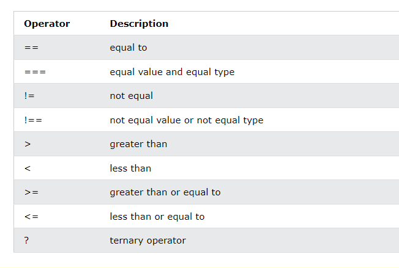
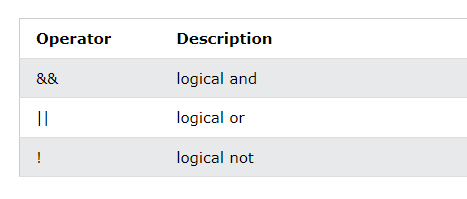
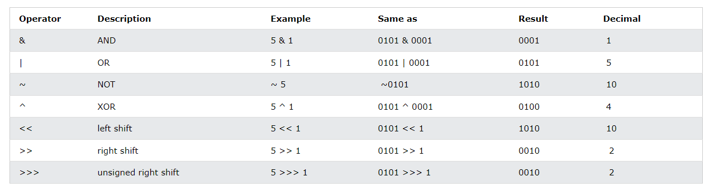
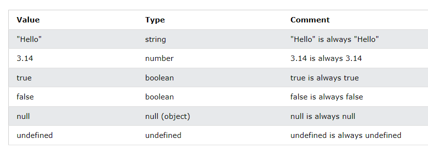
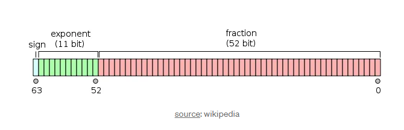

# Learn JavaScript in 30 Chapters

### After completing this course, we'll build [5 Projects]() in JavaScript in-sha-Allah.

After completing the 30-chapters module, jump in the [Projects Section](#).

|                                       **Chapter No.**                                       |                                                                               **Topics**                                                                               | **Video Explanation** |
| :-----------------------------------------------------------------------------------------: | :--------------------------------------------------------------------------------------------------------------------------------------------------------------------: | :-------------------: |
|                        [00](#chapter-00-how-the-course-is-designed)                         |                                                  [How The Course is Designed](#chapter-00-how-the-course-is-designed)                                                  |       Watch Now       |
|    [01](#chapter-01-what-is-javascript-key-features-of-javascript-history-and-versions)     |         [What is JavaScript, Key Features of JavaScript, History and Versions](#chapter-01-what-is-javascript-key-features-of-javascript-history-and-versions)         |       Watch Now       |
|  [02](#chapter-02-js-with-html-js-output-installing-node-variable-data-types-and-function)  |   [JS with HTML, JS Output, Installing Node, Variable, Data Types and Function](#chapter-02-js-with-html-js-output-installing-node-variable-data-types-and-function)   |       Watch Now       |
|             [03](#chapter-03-js-operators-arithmetic-data-types--js-functions)              |                          [JS Operators, Arithmetic, Data Types & Js Functions](#chapter-03-js-operators-arithmetic-data-types--js-functions)                           |       Watch Now       |
|                             [04](#chapter-04-javascript-object)                             |                                                        [JavaScript Object](#chapter-04-javascript-object) []()                                                         |     [Watch Now]()     |
|                             [05](#chapter-05-javascript-string)                             |                                                           [JavaScript String](#chapter-05-javascript-string)                                                           |     [Watch Now]()     |
| [06](#chapter-06-javascript-numbers-bigint-number-methods-number-methods-number-properties) | [JavaScript Numbers, Bigint, Number Methods, Number Methods, Number Properties](#chapter-06-javascript-numbers-bigint-number-methods-number-methods-number-properties) |     [Watch Now]()     |
|                                             [07](#chapter-07-javascript-array)                                              |       [JavaScript Array](#chapter-07-javascript-array)                                                                                                                                                                 |     [Watch Now]()                  |
|                                             08                                              |                                                                                                                                                                        |                       |
|                                             09                                              |                                                                                                                                                                        |                       |
|                                             10                                              |                                                                                                                                                                        |                       |
|                                             11                                              |                                                                                                                                                                        |                       |
|                                             12                                              |                                                                                                                                                                        |                       |
|                                             13                                              |                                                                                                                                                                        |                       |
|                                             14                                              |                                                                                                                                                                        |                       |
|                                             15                                              |                                                                                                                                                                        |                       |
|                                             16                                              |                                                                                                                                                                        |                       |
|                                             17                                              |                                                                                                                                                                        |                       |
|                                             18                                              |                                                                                                                                                                        |                       |
|                                             19                                              |                                                                                                                                                                        |                       |
|                                             20                                              |                                                                                                                                                                        |                       |
|                                             21                                              |                                                                                                                                                                        |                       |
|                                             22                                              |                                                                                                                                                                        |                       |
|                                             23                                              |                                                                                                                                                                        |                       |
|                                             24                                              |                                                                                                                                                                        |                       |
|                                             25                                              |                                                                                                                                                                        |                       |
|                                             26                                              |                                                                                                                                                                        |                       |
|                                             27                                              |                                                                                                                                                                        |                       |
|                                             28                                              |                                                                                                                                                                        |                       |
|                                             29                                              |                                                                                                                                                                        |                       |
|                                             30                                              |                                                                                                                                                                        |                       |

# 5 JavaScript Projects

| **Project No.** | **Project Name** | **Video Explanation** | **Live Demo** |
| :-------------: | :--------------: | :-------------------: | :-----------: |
|       01        |                  |       Watch Now       |   Live Link   |
|       02        |                  |                       |               |
|       03        |                  |                       |               |
|       04        |                  |                       |               |
|       05        |                  |                       |               |

# Chapter-00: How The Course is Designed

- [কোর্সটি কাদের জন্য?](#কোর্সটি-কাদের-জন্য)
- [Prerequisite](#prerequisite)
- [কোর্সটি যেভাবে সাজানো হয়েছে](#কোর্সটি-যেভাবে-সাজানো-হয়েছেঃ)

### কোর্সটি কাদের জন্য?

- এই কোর্সটিতে যেকেউ অংশগ্রহণ করতে পারবে। শিখার জন্য মনের ইচ্ছাটাই আসল!
- Course টি মূলত Beginner-friendly. যারা Web Programming এ নতুন তাদেরকে উদ্দেশ্য করেই Course টি সাজানো।

### Prerequisite

- HTML ও CSS

### কোর্সটি যেভাবে সাজানো হয়েছেঃ

- এই পুরো Article কে একটা বই মনে করতে পারো। কোর্সটি 30 টি Chapter এ ভাগ করা হয়েছে। প্রতিটি Chapter এ JavaScript এর বিভিন্ন Topics নিয়ে আলোচনা করা হয়েছে।
- প্রতিটা Chapter এর Module সাজানো হয়েছে ক্রমানুসারে । উদাহরণস্বরূপ, Chapter-05 এর টপিকসগুলো শিখতে হলে অবশ্যই তোমাকে Chapter-04 শেষ করে আসতে হবে। একইভাবে Chapter-04 শিখতে হলে তোমাকে Chapter-03 শেষ করে আসতে হবে ।
- প্রতিটা Chapter এর Topics এর Written Explanation/Article এর সাথে সাথে Video Explanation-ও দেয়া আছে। যাতে শিক্ষার্থীরা খুব সহজেই টপিকসগুলো আত্মস্থ করতে পারে।

# Chapter-01: What is JavaScript, Key Features of JavaScript, History and Versions

- [What is JavaScript](#what-is-javascript)
- [Single Threaded vs Multi-Threaded](#single-threaded-vs-multi-threaded)
- [Features of JavaScript](#features-of-javascript)
- [History of JavaScript](#history-of-javascript)
- [Versions of JavaScript](#versions-of-javascript)

## What is JavaScript?

- JavaScript is a **lightweight**, **cross-platform**, **single-threaded**, and **interpreted compiled** programming language.
- এটি ওয়েব ডেভেলপমেন্টের ক্ষেত্রে ব্যাপকভাবে ব্যবহৃত হয়। এটি Front-end এবং Back-end দুই ক্ষেত্রেই ব্যবহার করা যায়।
- JavaScript হলো 3টি Programming Lanuages(HTML, CSS, JavaScript) এর মধ্যে একটি যা সকল ওয়েব ডেভেলপারদের অবশ্যই শিখতে হয়।

## Single Threaded vs Multi-Threaded

### Single Thread কি?

- **What is Thread:** কম্পিউটিং এর প্রেক্ষিতে, একটি থ্রেড হলো প্রসেসিং এর সবচেয়ে ছোট একক যা অপারেটিং সিস্টেম দ্বারা নির্ধারিত এবং সম্পাদিত হতে পারে।
- একটি Single-threaded lanuage তার সমস্ত কোড চালানোর জন্য একটি Thread (smallest unit of processing) ব্যবহার করে। এর মানে হল যে এটি একবারে শুধুমাত্র একটি অপারেশন করতে পারে। আর এই কারনেই JavaScript কে Single Threaded Language বলে।

#### Single Thread এর Concept

- Single Threaded Lanuage যেমন JavaScript, একটি Stack (LIFO) মেইনটেইন করে কোড রান করানোর জন্য। যেমন, কোন একটি JavaScript কোডে যদি একাধিক Functions থাকে, তাহলে Thread সবগুলো Function কে Stack এ ঢুকিয়ে ফেলে। যাকে শেষে ঢুকিয়েছিল, তার কাজ আগে শেষ করে, অতঃপর তাকে Stack থেকে বের করে দেয় এবং পরের Function এর কাজ শুরু করে।
- যদি কোন Function Run হতে অনেক বেশি সময় নিয়ে ফেলে, তাহলে এই Function এর কারনে নিচের কোড এর কাজ থেমে থাকে, অর্থাৎ Block হয়ে যায়। এই কারণেই জাভাস্ক্রিপ্ট Main Thread ব্লক না করেই long-running operations করতে **asynchronous mechanisms** (যেমন callbacks, promises, and async/await) ব্যবহার করে।

- **Event Loop:** Asynchronous operations পরিচালনা করতে, জাভাস্ক্রিপ্ট ইভেন্ট লুপের উপর নির্ভর করে। যখন একটি অ্যাসিঙ্ক্রোনাস অপারেশন (যেমন একটি setTimeout বা একটি HTTP Request) শুরু করা হয়, তখন এটি ব্রাউজার বা Runtime Environment এ (যেমন Node.js) Handle করা হয়, যা পৃথকভাবে অপারেশন পরিচালনা করে। অপারেশন সম্পূর্ণ হলে, এটি একটি কলব্যাক Queue তে স্থাপন করা হয়, যা **Call Stack** খালি হয়ে গেলে ইভেন্ট লুপ এর কাজ শুরু করে, অর্থাৎ ঐ Queue এর কাজ একটা একটা করে করতে থাকে।

Example:

```js
console.log("Start");

setTimeout(() => {
  console.log("Timeout finished");
}, 1000);

console.log("End");
```

Explanation:

- "Start" is logged first.
- The setTimeout function is called, which schedules "Timeout finished" to be logged after 1 second, but doesn't block the thread.
- "End" is logged immediately after "Start".
- After 1 second, the callback from setTimeout is executed, logging "Timeout finished".

#### Multi Thread কি?

## Features of JavaScript

- **Client-side Scripting:** জাভাস্ক্রিপ্ট প্রাথমিকভাবে ওয়েব অ্যাপ্লিকেশনের ক্লায়েন্ট সাইডে ব্যবহৃত হয়, যার অর্থ এটি ব্যবহারকারীর ওয়েব ব্রাউজারে চলে।
- **Dynamic Web Pages:**
- **Versatile:** জাভাস্ক্রিপ্ট একটি বহুমুখী ভাষা যা শুধুমাত্র ওয়েব ডেভেলপমেন্টের জন্যই নয় বরং সার্ভার-সাইড ডেভেলপমেন্ট (Node.js), মোবাইল অ্যাপ ডেভেলপমেন্ট (React Native, NativeScript), ডেস্কটপ অ্যাপ্লিকেশন ডেভেলপমেন্ট (ইলেক্ট্রন) এবং এমনকি ইন্টারনেট অফ থিংসের জন্যও ব্যবহার করা যেতে পারে।
- **Object Oriented:** জাভাস্ক্রিপ্ট একটি অবজেক্ট-ওরিয়েন্টেড ভাষা, যার মানে এটি ডেটা এবং Functionality উপস্থাপন করতে অবজেক্ট ব্যবহার করে। এটি Object inheritance এবং প্রোটোটাইপ-ভিত্তিক প্রোগ্রামিংকেও সাপোর্ট করে।
- **Asynchronous Programming:** জাভাস্ক্রিপ্ট callback, promises এবং async/await এর মতো বৈশিষ্ট্যগুলির মাধ্যমে অ্যাসিঙ্ক্রোনাস প্রোগ্রামিংকে সাপোর্ট করে, যা ব্যবহারকারীর ইন্টারফেস ব্লক না করে সার্ভার থেকে ডেটা আনার মতো কাজগুলি পরিচালনা করার জন্য অত্যন্ত গুরুত্বপূর্ণ ভূমিকা পালন করে।

## History of JavaScript

## Versions of JavaScript

<h3 align="right">
    <b><a href="#learn-javascript-in-30-chapters">↥ Go to Top</a></b>
</h3>

# Chapter-02: JS with HTML, JS Output, Installing Node, Variable, Data Types and Function

- [HTML Document এ কোথায় JavaScript কোড লিখতে হয়?](#html-document-এ-কোথায়-javascript-কোড-লিখতে-হয়)
- [JavaScript Can Change The Content of HTML Element](#javascript-can-change-the-content-of-html-element)
- [JavaScript Can Change The Value of An Attribute](#javascript-can-change-the-value-of-an-attribute)

- [JavaScript Can Change The CSS Style](#javascript-can-change-the-css-style)
- [JavaScript Variables](#javascript-variables)
- [What is Node ](#what-is-node)
- [Difference Between Var, Let and Const](#difference-between-var-let-and-const)
- [JavaScript Data Types](#javascript-data-types)

## HTML Document এ কোথায় JavaScript কোড লিখতে হয়?

৩ জায়গায় লিখা যায়ঃ

- Body এর মধ্যে।
- Head এর মধ্যে।
- আলাদা ফাইলে। যেমনঃ `script.js`

## JavaScript Can Change The Content of HTML Element

- `getElementById` বা `getElementByClass` methods ব্যবহার করে আমরা HTML Element ধরে তার Content পরিবর্তন করে দিতে পারি। তার জন্য আমাদের `innerHTML` property ব্যবহার করতে হয়। যেমনঃ

```js
document.getElementById("codejogot").innerHTML = "Hello JavaScript";
```

## JavaScript Can Change The Value of An Attribute

- `getElementById` বা `getElementByClass` এর পরে Attribute এর নাম লিখে আমরা চাইলে Attribute এর Value পরিবর্তন করতে পারি। যেমনঃ

```js
<button onclick="document.getElementById('myImage').src='pic_bulbon.gif'">
  Change the photo
</button>
```

## JavaScript Can Change The CSS Style

যেমনঃ

```js
document.getElementById("demo").style.fontSize = "35px";
```

## JavaScript Variables

- Variable হলো Data Store করার জন্য Container.
- ৪ ভাবে JavaScript Variable Declare করা যায়ঃ
  - Automatically
  - `let` keyword
  - `var` keyword
  - `const` keyword

Example of Automatic Declaration:

```js
x = 5;
y = 6;
z = x + y;
```

Note: Variable Declare করা Good Practice.

```js
var x = 5;
var y = 6;
var z = x + y;
```

## What is Node

- Node হল একটি **open-source**, **cross-platform**, JavaScript **runtime environment** যা ওয়েব ব্রাউজারের বাইরে জাভাস্ক্রিপ্ট কোড Run করে। আমরা জানি JavaScript Code কেবল Web Browser এই রান করতে পারে। আমরা যাতে Web Browser এর বাইরেও জাভাস্ক্রিপ্ট কোড Run করতে পারি সেজন্যই মূলত Node এর আগমন।
- Node হলো Google Chrome এর V8 Engine দ্বারা তৈরি।
- Node.js এর মাধ্যমে ডেভেলপাররা জাভাস্ক্রিপ্ট ব্যবহার করে সার্ভার-সাইড স্ক্রিপ্ট লিখতে পারে।

## Features of Node

- **Asynchronous and Event-Driven**

  - **Non-blocking I/O:** Node.js uses non-blocking, event-driven architecture, making it efficient and suitable for real-time applications. Non-blocking I/O means that Node.js can handle many operations simultaneously without waiting for any single operation to complete.
  - **Event Loop:** Node.js operates on a single-threaded event loop, allowing it to handle multiple connections concurrently. This is particularly useful for I/O-heavy operations.

- **Single Programming Language**
  - With Node.js, developers can use JavaScript for both client-side and server-side programming. This unification of language reduces the learning curve and allows for code reuse across the stack.
- **Package Management with npm**
  - Node.js comes with npm (Node Package Manager), a package manager that provides access to a large ecosystem of reusable libraries and tools. npm makes it easy to manage dependencies and share code with other developers.
- **Scalability**
  - Node.js is designed to build scalable network applications. Its non-blocking I/O and event-driven architecture allow it to handle many concurrent connections with minimal overhead.
- **Performance**
  - Built on the V8 JavaScript engine, Node.js provides high performance and fast execution of JavaScript code. V8 compiles JavaScript into native machine code, optimizing it for speed.

## Use Cases for Node.js

- **Web Servers:** Node.js is commonly used to build web servers that can handle HTTP requests. It is especially suitable for building RESTful APIs and real-time web applications.
- **Real-Time Applications:** Applications that require real-time communication, such as chat applications, gaming servers, and collaborative tools, benefit from Node.js's event-driven architecture.
- **Single Page Applications (SPAs):** Node.js is often used in conjunction with front-end frameworks (like Angular, React, or Vue.js) to build SPAs, where the application logic is handled on the client-side and the server provides the necessary data via APIs.
- **Command-Line Tools:** Node.js can be used to create command-line tools and scripts that automate tasks, manage systems, and process data.
- **Microservices:** Node.js is well-suited for building microservices architectures due to its lightweight nature and efficient handling of concurrent requests.

Example: Building a Simple Web Server with Node.js

```js
// Load the http module to create an HTTP server.
const http = require("http");

// Configure the HTTP server to respond with "Hello, World!" to all requests.
const server = http.createServer((req, res) => {
  // Set the response HTTP header with HTTP status and Content type
  res.writeHead(200, { "Content-Type": "text/plain" });
  // Send the response body "Hello, World!"
  res.end("Hello, World!\n");
});

// Listen on port 3000 and IP address 127.0.0.1
server.listen(3000, "127.0.0.1", () => {
  console.log("Server running at http://127.0.0.1:3000/");
});
```

## Difference Between Var, Let and Const

| **Criteria**       | **Var**                                     | **Let**                                                                                      | **Const**                                         |
| ------------------ | ------------------------------------------- | -------------------------------------------------------------------------------------------- | ------------------------------------------------- |
| **Scope**          | Function-scoped                             | Block-scoped                                                                                 | Block-scoped                                      |
| **Re-declaration** | Re-declare করা যায় এবং Value Update করা যায় | Re-declare করা যায় না কিন্তু Value Update করা যায়। Let অনেকটা C++ এর Variable এর মতো কাজ করে | Re-declare করাও যায় না, Value-ও Update করা যায় না |

|

## JavaScript Data Types

- JavaScript এ ৮ ধরনের Data Type আছেঃ
  - String
  - Number
  - Bigint
  - Boolean
  - Undefined
  - Null
  - Symbol
  - Object

Examples:

```js
// Numbers:
let length = 16;
let weight = 7.5;

// Strings:
let color = "Yellow";
let lastName = "Johnson";

// Booleans
let x = true;
let y = false;

// Object:
const person = { firstName: "John", lastName: "Doe" };

// Array object:
const cars = ["Saab", "Volvo", "BMW"];

// Date object:
const date = new Date("2022-03-25");
```

- JavaScript evaluates expressions from left to right. Different sequences can produce different results:

```js
let x = 16 + 4 + "CodeJogot";
```

Output: 20CodeJogot

```js
let x = "Volvo" + 16 + 4;
```

Output: Volvo164

## JavaScript Types are Dynamic

- JavaScript has dynamic types. This means that the same variable can be used to hold different data types.

```js
let x; // Now x is undefined
x = 5; // Now x is a Number
x = "John"; // Now x is a String
```

<h3 align="right">
    <b><a href="#learn-javascript-in-30-chapters">↥ Go to Top</a></b>
</h3>

# Chapter-03: JS Operators, Arithmetic, Data Types & Js Functions

- [JS Operators](#js-operators)
- [Types of JavaScript Operators](#types-of-javascript-operators)
- [Assignment Operator](#assignment-operator)
- [Comparison Operators](#comparison-operators)
- [JavaScript String Addition](#javascript-string-addition)
- [Adding Strings and Numbers](#adding-strings-and-numbers)

## JS Operators

- জাভাস্ক্রিপ্ট অপারেটরগুলি বিভিন্ন ধরণের Mathematical এবং Logical Computatioin করতে ব্যবহৃত হয়।

### JavaScript Assignment Operator

- Assignment Operator (=) একটি ভেরিয়েবলের জন্য একটি মান নির্ধারণ করে।

Example:

```js
// Assign the value 5 to x
let x = 5;
// Assign the value 2 to y
let y = 2;
// Assign the value x + y to z:
let z = x + y;
```

### JavaScript Addition Operator

- Addition Operator দিয়ে Number যোগ করা হয়।

Example:

```js
let x = 5;
let y = 2;
let z = x + y;
```

### JavaScript Multiplication Operator

- Multiplication Operator দিয়ে Numbers গুন করা হয়।

Example:

```js
let x = 5;
let y = 2;
let z = x * y;
```

## Types of JavaScript Operators

1. Arithmetic Operators
2. Assignment Operators
3. Comparison Operators
4. Logical Operators
5. String Operators
6. Conditional (Ternary) Operator
7. Bitwise Operator
8. Type Operator

### Arithmetic Operator

Example:

```js
let a = 3;
let x = (100 + 50) * a;
```

## Assignment Operator

Example:

```js
let x = 10;
x += 5;
```

## Comparison Operators


Credit: W3 School

## JavaScript String Addition

```js
let text1 = "John";
let text2 = "Doe";
let text3 = text1 + " " + text2;
```

## Adding Strings and Numbers

```js
let x = 5 + 5;
let y = "5" + 5;
let z = "Hello" + 5;
```

Output:
10
55
Hello5

## JavaScript Logical Operators



## JavaScript Bitwise Operators

- Bit operators work on 32 bits numbers.
- Any numeric operand in the operation is converted into a 32 bit number. The result is converted back to a JavaScript number.


Image Credit: W3 School

## JavaScript Functions

- JavaScript Function তৈরি করতে গেলে প্রথমে function keyword লিখতে হবে, এরপর Function এর একটা নাম দিতে হবে এবং সবশেষে ()
- Syntax:

```js
function name(parameter1, parameter2, parameter3) {
  // code to be executed
}
```

## JavaScript Function যেভাবে Call করা হয়

- When an event occurs (when a user clicks a button)
- When it is invoked (called) from JavaScript code
- Automatically (self invoked)

## Function Return Mechanism

```js
// Function is called, the return value will end up in x
let x = myFunction(4, 3);

function myFunction(a, b) {
  // Function returns the product of a and b
  return a * b;
}
```

## কেন আমরা Function ব্যবহার করি?

- একই কাজ বার বার করাকে Avoid করার জন্য।

## How to Handle Standard Input and Output in VS Code for JavaScript

Example:

```js
const readline = require("readline");

// Create an interface for reading input and output
const rl = readline.createInterface({
  input: process.stdin,
  output: process.stdout,
});

// Prompt the user for input
rl.question("Enter numbers separated by spaces: ", (input) => {
  // Process the input
  const numbers = input.split(" ").map(Number);

  // For example, using the countEvenNumbers function from earlier
  function countEvenNumbers(arr) {
    let count = 0;
    for (let i = 0; i < arr.length; i++) {
      if (arr[i] % 2 === 0) {
        count++;
      }
    }
    return count;
  }

  const evenCount = countEvenNumbers(numbers);
  console.log(`Number of even numbers: ${evenCount}`);

  // Close the input interface
  rl.close();
});
```

In Console Write:

```js
node main.js
```

Input:

```js
Enter numbers separated by spaces: 1 2 3 4 5
```

Output:

```js
Number of even numbers: 2
```

## Solving Some Easy Problems

Problem-01: Write a JavaScript function to find the sum of two numbers.

Problem-02: Write a JavaScript function to find the product of two numbers.

Problem-03: Write a JavaScript function to find the difference of two numbers.

Problem-04: Write a JavaScript function to find the remainder.

Problem-05: Write a JavaScript function to check if a number is positive, negative or zero.

Problem-06: Write a JavaScript function to check if a number is odd or even.

Problem-07: Write a JavaScript function to calculate the square of a number.

Problem-08: Write a JavaScript function to concatenate two strings.

Problem-09: Write a JavaScript function to find the biggest number among 3 numbers.

Problem-10: Write a JavaScript function which returns the number of even numbers in an array.

<h3 align="right">
    <b><a href="#learn-javascript-in-30-chapters">↥ Go to Top</a></b>
</h3>

# Chapter-04: JavaScript Object

- [What is Object](#what-is-object)
- [JavaScript Primitives](#javascript-primitives)
- [Immutable](#immutable)
- [JavaScript Objects are Mutable](#javascript-objects-are-mutable)
- [JavaScript Object Properties](#javascript-object-properties)
- [Nested Object](#nested-object)
- [Looping through an object in JavaScript](#looping-through-an-object-in-javascript)

## What is Object

- অবজেক্ট, জাভাস্ক্রিপ্টে, সবচেয়ে গুরুত্বপূর্ণ ডেটা টাইপ এবং আধুনিক জাভাস্ক্রিপ্টের জন্য বিল্ডিং ব্লক তৈরি করে। এই অবজেক্টগুলি জাভাস্ক্রিপ্টের Primitive Data Type(Number, String, Boolean, null, undefined, and symbol) থেকে বেশ ভিন্ন এই অর্থে যে এই Primitive Data Type কেবল একটি Value Store করতে পারে। যেখানে Object একাধিক Value Store করতে পারে। উদাহরনঃ

```js
// Create an Object
const student = {
  firstName: "Abdur",
  lastName: "Rahman",
  batch: 5,
  id: "WDB05027",
  marks: 97,
};
```

- In JavaScript, objects are collections of data and functions. This data is stored in the form of **key-value** pairs.
- Keys that store data values are called properties.
- Keys that store functions are called methods.
- It is a common practice to declare objects with the **const** keyword.
- Dot(.) দিয়ে Object এর **Property/Methods** এর Value কে Access করা যায়। যেমনঃ

```js
console.log(student.firstName);
```

- Bracket([]) দিয়েও Object এর **Property/Methods** এর Value কে Access করা যায়। যেমনঃ

```js
console.log(student["firstName"]);
```

- Object এ Property হিসেবে Function-ও ব্যবহার করা যায়। যেমনঃ

```js
// Create an Object
const student = {
  firstName: "Abdur",
  lastName: "Rahman",
  batch: 5,
  id: "WDB05027",
  marks: 97,
  isPassed: function () {
    if (this.marks >= 33) {
      return `${firstName} ${lastName} is passed with ${marks} marks`;
    } else return `${firstName} ${lastName} is failed with ${marks} marks`;
  },
};
//calling function from object
let output = student.isPassed();
```

- এই উদাহরনে _this_ keyword student object কে রেফার করছে।
- জাভাস্ক্রিপ্টে একটি অবজেক্ট একটি রেফারেন্স ডেটা টাইপ হিসাবে বিবেচিত হয়। এর মানে হল যে আপনি যখন একটি অবজেক্ট তৈরি করেন এবং এটিকে একটি ভেরিয়েবলে অ্যাসাইন করেন, তখন ভেরিয়েবলটি আসলে অবজেক্টটিকে ধরে রাখে না। Instead, it holds a reference (or pointer) to the location in memory where the object is stored. Memory এর Location Point করে বলে একে Pointer বলে।

উদাহরনঃ

```js
let x = { name: "Alice" };
```

Here, **x** is a variable that holds a reference (or pointer or memory address) to the memory location where the object { name: "Alice" } is stored.

- <span style="color: blue">In JavaScript, Objects are King. If you Understand Objects, you Understand JavaScript.<span>
- In JavaScript, **Properties** can be primitive values, functions, or even other objects.

- জাভাস্ক্রিপ্টে, প্রায় "সবকিছুই" একটি Object.
  - Objects are objects
  - Arrays are objects
  - Functions are objects
  - Dates are objects
  - Maths are objects
  - Sets are objects
  - All JavaScript values, except primitives, are objects.

## JavaScript Primitives

- A primitive value is a value that has no properties or methods. Example:

```js
let greeting = "Hello";
```

এখানে "Hello" হলো Primitive Value এবং greeting হলো Primitive Data Type.

- যেসব Data Type এ কেবল Primitive Value থাকে, তাকে Primitive Data Type বলে। যেমনঃ
  - string
  - number
  - boolean
  - null
  - undefined
  - symbol
  - bigint

## Immutable

- Primitive values are immutable অর্থাৎ Primitive Value কে পরিবর্তন করা যায় না। যেমনঃ

```js
let x = 100;
```

এখানে আপনি x এর Value পরিবর্তন করতে পারবেন, কিন্তু 100 কে পরিবর্তন করতে পারবেন না। 100 Always 100 ই থাকবে।



## JavaScript Objects are Mutable

- Objects are mutable: They are addressed by reference, not by value.
- যদি **student** একটি Object হয়, এবং `let x = student` লিখা হয়, তাহলে object x is **not a copy** of **student**. The object **x** is **student**. Object x এবং object student একই Memory Share করে। তাই যদি কোন কারনে Object x পরিবর্তন করা হয়, তাহলে Object student-ও পরিবর্তন হয়ে যাবে।

```js
/Create an Object
const student = {
  firstName:"John",
  lastName:"Doe",
  id:20
}

// Create a copy
const x = student;

// Change id in both
x.age = 10;
```

## JavaScript Object Properties

- Properties can be changed, added, deleted, and some are read only.

### Adding New Properties

```js
// Define the student object
const student = {
  // Properties
  firstName: "Abdur",
  lastName: "Rahim",
  age: 21,
  major: "Computer Science",

  // Method
  getFullName: function () {
    return `${this.firstName} ${this.lastName}`;
  },
};

// Add a new property
student.email = "abdurrahim@gmail.com";
```

### Deleting Properties

```js
delete student.major;
or;
delete student["major"];
```

## Nested Object

```js
// Define the student object with nested objects
const student = {
  // Properties
  firstName: "John",
  lastName: "Doe",
  age: 21,
  major: "Computer Science",

  // Nested object for contact information
  contactInfo: {
    email: "john.doe@example.com",
    phone: "123-456-7890",
  },

  // Nested object for address
  address: {
    street: "123 Main St",
    city: "Anytown",
    state: "Anystate",
    zip: "12345",
  },

  // Method
  getFullName: function () {
    return `${this.firstName} ${this.lastName}`;
  },

  // Method to get full address
  getFullAddress: function () {
    return `${this.address.street}, ${this.address.city}, ${this.address.state} ${this.address.zip}`;
  },
};

// Example usage of the object and its methods
console.log(student.getFullName()); // Output: John Doe
console.log(student.getFullAddress()); // Output: 123 Main St, Anytown, Anystate 12345
console.log(student.contactInfo.email); // Output: john.doe@example.com
console.log(student.contactInfo.phone); // Output: 123-456-7890
```

## Looping through an object in JavaScript

- Requirement এর উপর ভিত্তি করে JavaScript এ চারভাবে Object এ Loop করা যায়।

### 1. Looping through an object with for...in

```js
const student = {
  firstName: "John",
  lastName: "Doe",
  age: 21,
  major: "Computer Science",
  contactInfo: {
    email: "john.doe@example.com",
    phone: "123-456-7890",
  },
  address: {
    street: "123 Main St",
    city: "Anytown",
    state: "Anystate",
    zip: "12345",
  },
};

for (let key in student) {
  if (student.hasOwnProperty(key)) {
    console.log(`${key}: ${student[key]}`);
  }
}
```

Output:

```js
firstName: John
lastName: Doe
age: 21
major: Computer Science
contactInfo: [object Object]
address: [object Object]

```

### 2. Looping through an object with forEach

```js
const student = {
  firstName: "John",
  lastName: "Doe",
  age: 21,
  major: "Computer Science",
  contactInfo: {
    email: "john.doe@example.com",
    phone: "123-456-7890",
  },
  address: {
    street: "123 Main St",
    city: "Anytown",
    state: "Anystate",
    zip: "12345",
  },
};

Object.keys(student).forEach((key) => {
  console.log(`${key}: ${student[key]}`);
});
```

Output:

```js
firstName: John
lastName: Doe
age: 21
major: Computer Science
contactInfo: [object Object]
address: [object Object]

```

### 3. Looping through an object Using `Object.entries()` with `for...of`

```js
const student = {
  firstName: "John",
  lastName: "Doe",
  age: 21,
  major: "Computer Science",
  contactInfo: {
    email: "john.doe@example.com",
    phone: "123-456-7890",
  },
  address: {
    street: "123 Main St",
    city: "Anytown",
    state: "Anystate",
    zip: "12345",
  },
};

for (let [key, value] of Object.entries(student)) {
  console.log(`${key}: ${value}`);
}
```

Output:

```js
firstName: John
lastName: Doe
age: 21
major: Computer Science
contactInfo: [object Object]
address: [object Object]

```

### 4. Looping through an object Using `Object.values()` with `forEach()`

- `Object.values()` creates an array from the property values:

```js
const student = {
  firstName: "John",
  lastName: "Doe",
  age: 21,
  major: "Computer Science",
  contactInfo: {
    email: "john.doe@example.com",
    phone: "123-456-7890",
  },
  address: {
    street: "123 Main St",
    city: "Anytown",
    state: "Anystate",
    zip: "12345",
  },
};

Object.values(student).forEach((value) => {
  console.log(value);
});
```

Output:

```js
John
Doe
21
Computer Science
[object Object]
[object Object]

```

## What is JSON

- JSON (JavaScript Object Notation) হল একটি লাইটওয়েট **Data Interchange Format** যা মানুষের পক্ষে পড়তে এবং লিখতে সহজ এবং মেশিন সহজে এটিকে Parse করতে পারে।
- JSON একটি Lanuage-independant Format.
- JSON এর key হলো একটি String এবং Value হলো যেকোনো Valid Data Type (String, Array, Number, Boolen etc)
- ওয়েব অ্যাপ্লিকেশনে সার্ভার এবং ক্লায়েন্টের মধ্যে ডেটা প্রেরণের জন্য JSON ব্যাপকভাবে ব্যবহৃত হয়।

Example of JSON:

```json
{
  "firstName": "John",
  "lastName": "Doe",
  "age": 21,
  "major": "Computer Science",
  "contactInfo": {
    "email": "john.doe@example.com",
    "phone": "123-456-7890"
  },
  "address": {
    "street": "123 Main St",
    "city": "Anytown",
    "state": "Anystate",
    "zip": "12345"
  },
  "courses": ["CS101", "CS102", "CS103"],
  "graduated": false
}
```

### JSON এর ব্যবহার

- **Web APIs:** JSON হল ওয়েব API-এর জন্য সবচেয়ে সাধারণ ফর্ম্যাট। সার্ভার এবং ক্লায়েন্টের মধ্যে ডেটা আদান-প্রদানের একটি সহজ উপায়।
- **Configuration Files:** Many applications use JSON for configuration files due to its readability and ease of use.
- **Data Storage:** Some databases, such as MongoDB, store data in JSON-like formats.

### Converting Object to JSON String

- JavaScript এ, Object থেকে JSON এ Convert করার জন্য `JSON.stringify()` এবং JSON থেকে Object করার জন্য `JSON.parse()` ব্যবহার করা হয়।

```js
// Define a JavaScript object
const student = {
  firstName: "John",
  lastName: "Doe",
  age: 21,
  major: "Computer Science",
  contactInfo: {
    email: "john.doe@example.com",
    phone: "123-456-7890",
  },
  address: {
    street: "123 Main St",
    city: "Anytown",
    state: "Anystate",
    zip: "12345",
  },
};

// Convert the JavaScript object to a JSON string
const jsonString = JSON.stringify(student);

// Output the JSON string
console.log(jsonString);
```

Output:

```json
{
  "firstName": "John",
  "lastName": "Doe",
  "age": 21,
  "major": "Computer Science",
  "contactInfo": { "email": "john.doe@example.com", "phone": "123-456-7890" },
  "address": {
    "street": "123 Main St",
    "city": "Anytown",
    "state": "Anystate",
    "zip": "12345"
  }
}
```

More Readable:

- To make the JSON string more readable, you can pass additional arguments to JSON.stringify() to include indentation.

```js
// Convert the JavaScript object to a pretty-printed JSON string
const prettyJsonString = JSON.stringify(student, null, 2);

// Output the pretty-printed JSON string
console.log(prettyJsonString);
```

Output:

```json
{
  "firstName": "John",
  "lastName": "Doe",
  "age": 21,
  "major": "Computer Science",
  "contactInfo": {
    "email": "john.doe@example.com",
    "phone": "123-456-7890"
  },
  "address": {
    "street": "123 Main St",
    "city": "Anytown",
    "state": "Anystate",
    "zip": "12345"
  }
}
```

- The third argument `(2)` specifies the number of spaces to use as white space for indentation, making the JSON string more readable.

## JavaScript Constructor Functions

- অনেক সময় একই Type এর একাধিক Object আমাদের তৈরি করা লাগতে পারে। যেমনঃ

Batch-05 এর Al Amin Student এর জন্য আমরা একটা Object তৈরি করতে পারি।

```js
let student = {
  // Properties
  firstName: "Al",
  lastName: "Amin",
  id: "WD05020",
  batch: 5,

  // Method
  getDetails: function () {
    return `Name: ${this.firstName} ${this.lastName}, ID: ${this.id}, Batch: ${this.batch}`;
  },
};
console.log(student.getDetails());
```

আবার Batch-05 এর Sujon Rana এর জন্য আমরা একটা Object তৈরি করতে পারি।

```js
let student = {
  // Properties
  firstName: "Sujon",
  lastName: "Rana",
  id: "WD05025",
  batch: 5,

  // Method
  getDetails: function () {
    return `Name: ${this.firstName} ${this.lastName}, ID: ${this.id}, Batch: ${this.batch}`;
  },
};
console.log(student.getDetails());
```

- আপনাদের মনে আছে কি, আমাদের যদি একই Type এর অনেকগুলো Variable Declare করার প্রয়োজন হয়, তাহলে আমরা Array তৈরি করি। একইভাবে একই Type এর Object যদি আমাদের প্রয়োজন হয়, তাহলে আমরা **Costructor Function** তৈরি করতে পারি। এই Function আসলে Object তৈরির Machine এর মতো কাজ করে, যার মাধ্যমে একই Type এর Object যত খুশি তত তৈরি করা যায়।

```js
// Define the constructor function
function Student(firstName, lastName, id, batch) {
  // Properties
  this.firstName = firstName;
  this.lastName = lastName;
  this.id = id;
  this.batch = batch;

  // Method
  this.getDetails = function () {
    return `Name: ${this.firstName} ${this.lastName}, ID: ${this.id}, Batch: ${this.batch}`;
  };
}

// Create student objects using the constructor function
let alamin = new Student("Al", "Amin", "WD05020", 5);
let sujon = new Student("Sujon", "Rana", "WD05025", 5);

// Using the method
console.log(alamin.getDetails()); // Output: Name: Al Amin, ID: WD05020, Batch: 5
console.log(sujon.getDetails()); // Output: Name: Sujon Rana, ID: WD05025, Batch: 5
```

- Constructor Function এর নাম Capital Letter এ লিখতে হয়। JavaScript এ অন্যান্য Function লিখার ক্ষেত্রে Camel Case এবং Constructor Function লিখার ক্ষেত্রে Capital Letter এ লিখতে হয়। যাতে যে কেউ কোড দেখলেই বুঝতে পারে এটা Constructor Function.
- আমরা চাইলে Normal Object এর Property যেভাবে অ্যাড করি, এখানেও সেইভাবে New Property অ্যাড করা যায়। যেমনঃ

```js
alamin.score = 100;
```

### Built-in JavaScript Constructors

```js
new Object(); // A new Object object
new Array(); // A new Array object
new Map(); // A new Map object
new Set(); // A new Set object
new Date(); // A new Date object
new RegExp(); // A new RegExp object
new Function(); // A new Function object
```

- The `Math()` object is not in the list. `Math` is a global object. The `new` keyword cannot be used on `Math`.

## JavaScript Event

- HTML Elements এর মাধ্যমে কোন ঘটনা ঘটাকেই **Event** বলে। যখন HTML Page এ JavaScript ব্যবহার করা হয়, তখন JavaScript এই ইভেন্টগুলিতে "React" বা "Listen" করতে পারে। অর্থাৎ Event হয় HTML এ, আর JavaScript সেই Event Listen করে বা React করে। যেমনঃ Button এ ক্লিক করা একটা Event, Mouse Hover করা ইত্যাদি।

### Common JavaScript Events

| Event Type               | Event       | Description                                                                                          |
| ------------------------ | ----------- | ---------------------------------------------------------------------------------------------------- |
| **Mouse Events**         | click       | Fires when a mouse button is clicked on an element.                                                  |
|                          | dblclick    | Fires when a mouse button is double-clicked on an element.                                           |
|                          | mouseover   | Fires when the mouse pointer is moved onto an element.                                               |
|                          | mouseout    | Fires when the mouse pointer is moved out of an element.                                             |
|                          | mousemove   | Fires when the mouse pointer is moved within an element.                                             |
|                          | mousedown   | Fires when a mouse button is pressed on an element.                                                  |
|                          | mouseup     | Fires when a mouse button is released over an element.                                               |
| **Keyboard Events**      | keydown     | Fires when a key is pressed.                                                                         |
|                          | keyup       | Fires when a key is released.                                                                        |
|                          | keypress    | Fires when a key is pressed and released.                                                            |
| **Form Events**          | submit      | Fires when a form is submitted.                                                                      |
|                          | change      | Fires when an element's value changes.                                                               |
|                          | focus       | Fires when an element receives focus.                                                                |
|                          | blur        | Fires when an element loses focus.                                                                   |
|                          | input       | Fires when the value of an input element changes.                                                    |
| **Window Events**        | load        | Fires when the whole page has loaded, including all dependent resources like stylesheets and images. |
|                          | resize      | Fires when the browser window is resized.                                                            |
|                          | scroll      | Fires when the document view is scrolled.                                                            |
|                          | unload      | Fires when the user navigates away from the page.                                                    |
| **Touch Events**         | touchstart  | Fires when a touch point is placed on the touch surface.                                             |
|                          | touchmove   | Fires when a touch point is moved along the touch surface.                                           |
|                          | touchend    | Fires when a touch point is removed from the touch surface.                                          |
|                          | touchcancel | Fires when a touch point is interrupted.                                                             |
| **Drag and Drop Events** | drag        | Fires when an element is being dragged.                                                              |
|                          | dragstart   | Fires when the user starts dragging an element.                                                      |
|                          | dragend     | Fires when the user has finished dragging the element.                                               |
|                          | dragenter   | Fires when the dragged element enters a drop target.                                                 |
|                          | dragover    | Fires when the dragged element is over a drop target.                                                |
|                          | dragleave   | Fires when the dragged element leaves a drop target.                                                 |
|                          | drop        | Fires when the dragged element is dropped on a drop target.                                          |
| **Clipboard Events**     | copy        | Fires when content is copied to the clipboard.                                                       |
|                          | cut         | Fires when content is cut from the document and added to the clipboard.                              |
|                          | paste       | Fires when content is pasted from the clipboard into the document.                                   |

[Download the PDF](./chapter-04/resources/JavaScript_Events.pdf)

- Event Syntax:

```js
<button onclick="takeAction()">Click me</button>
```

Example:

```js
<!DOCTYPE html>
<html>
<head>
    <title>JavaScript Event Example</title>
    <script>
        // JavaScript function to change the text
        function changeText() {
            document.getElementById("myParagraph").innerHTML = "Text has been changed!";
        }
    </script>
</head>
<body>

<h2>JavaScript Event Example</h2>

<!-- Button with an onclick event to call the changeText function -->
<button onclick="changeText()">Click me</button>

<!-- Paragraph with an id to target with JavaScript -->
<p id="myParagraph">This is the original text.</p>

</body>
</html>

```

- A JavaScript Counter Demonstrating Events:

```html
<!DOCTYPE html>
<html>
  <head>
    <title>JavaScript Counter Example</title>
    <script>
      // Initialize the counter variable
      let counter = 0;

      // Function to increase the counter
      function increaseCounter() {
        counter++;
        displayCounter();
      }

      // Function to decrease the counter
      function decreaseCounter() {
        counter--;
        displayCounter();
      }

      // Function to display the counter value
      function displayCounter() {
        document.getElementById("counterDisplay").innerHTML = counter;
      }
    </script>
  </head>
  <body>
    <h2>JavaScript Counter Example</h2>

    <!-- Button to increase the counter -->
    <button onclick="increaseCounter()">Increase</button>

    <!-- Button to decrease the counter -->
    <button onclick="decreaseCounter()">Decrease</button>

    <!-- Paragraph to display the counter value -->
    <p>Counter: <span id="counterDisplay">0</span></p>
  </body>
</html>
```

### Explanation:

1. **HTML Structure**:

   - Two `<button>` elements, one for increasing the counter and one for decreasing the counter.
   - A `<p>` element with a `<span>` inside it to display the counter value. The `<span>` has an id of `counterDisplay` to target it with JavaScript.

2. **JavaScript Functions**:
   - A `counter` variable is initialized to `0`.
   - `increaseCounter` and `decreaseCounter` functions are defined to modify the `counter` variable and update the display by calling `displayCounter`.
   - The `displayCounter` function updates the inner HTML of the `<span>` element with the current value of the `counter`.

When you click the "Increase" button, the `increaseCounter` function is called, which increments the counter and updates the display. Similarly, when you click the "Decrease" button, the `decreaseCounter` function is called, which decrements the counter and updates the display.

- নিজের Element এর Content Change করতে চাইলে তাকে id দিয়ে আলাদা করে ধরার কোন দরকার নেই। এর বদলে `this.innerHTML` ব্যবহার করা যেতে পারে।

```html
<button onclick="this.innerHTML = Date()">The time is?</button>
```

# Chapter-05: JavaScript String

- [String](#string)
- [String Methods](#string-methods)

## String

- Single এবং Double Quotation এর মধ্যে যা থাকে তাকেই String বলে। Single/Double Quotation এর মধ্যে প্রতিটা Character এর ASCII Value আছে। ASCII = American Standard Code for Information Interchange.
- String Empty হতে পারে।

### Escape Characters

- JavaScript strings support various escape characters that allow you to include special characters within a string. Here are some common escape characters used in JavaScript:

| Escape Character | Description                              | Example                                           | Output                                           |
| ---------------- | ---------------------------------------- | ------------------------------------------------- | ------------------------------------------------ |
| `\'`             | Single quote                             | `'It\'s a pen'`                                   | `It's a pen`                                     |
| `\"`             | Double quote                             | `"He said, \"Hi\""`                               | `He said, "Hi"`                                  |
| `\\`             | Backslash                                | `"This is a backslash: \\ "`                      | `This is a backslash: \ `                        |
| `\n`             | New line                                 | `"Line 1\nLine 2"`                                | `Line 1`<br>`Line 2`                             |
| `\r`             | Carriage return                          | `"Hello\rWorld"`                                  | `World`                                          |
| `\t`             | Tab                                      | `"Hello\tWorld"`                                  | `Hello   World`                                  |
| `\b`             | Backspace                                | `"ABC\bDEF"`                                      | `ABDEF`                                          |
| `\f`             | Form feed                                | `"Hello\fWorld"`                                  | `Hello`<form feed>`World`                        |
| Example          | Demonstrating multiple escape characters | `"She said, \"Hello!\"\nThis is a backslash: \\"` | `She said, "Hello!"`<br>`This is a backslash: \` |

- The backslash escape character `(\)` turns special characters into string characters.

## String Methods

- JavaScript এ সমস্ত String Methods Original String কে পরিবর্তন না করে নতুন String তৈরি করে।

### String Methods At A Glance

| Method          | Description                                                      | Example Code                                                      | Output               |
| --------------- | ---------------------------------------------------------------- | ----------------------------------------------------------------- | -------------------- |
| `charAt()`      | Returns the character at a specified index in a string           | `let str = "Hello"; str.charAt(1);`                               | `e`                  |
| `concat()`      | Joins two or more strings and returns a new string               | `let str1 = "Hello"; let str2 = "World"; str1.concat(" ", str2);` | `Hello World`        |
| `includes()`    | Checks if a string contains a specified substring                | `let str = "Hello World"; str.includes("World");`                 | `true`               |
| `indexOf()`     | Returns the index of the first occurrence of a specified value   | `let str = "Hello World"; str.indexOf("World");`                  | `6`                  |
| `slice()`       | Extracts a part of a string and returns a new string             | `let str = "Hello World"; str.slice(0, 5);`                       | `Hello`              |
| `split()`       | Splits a string into an array of substrings                      | `let str = "Hello World"; str.split(" ");`                        | `["Hello", "World"]` |
| `toLowerCase()` | Converts a string to lowercase                                   | `let str = "Hello World"; str.toLowerCase();`                     | `hello world`        |
| `toUpperCase()` | Converts a string to uppercase                                   | `let str = "Hello World"; str.toUpperCase();`                     | `HELLO WORLD`        |
| `trim()`        | Removes whitespace from both ends of a string                    | `let str = "  Hello World  "; str.trim();`                        | `Hello World`        |
| `replace()`     | Replaces a specified value with another value in a string        | `let str = "Hello World"; str.replace("World", "JavaScript");`    | `Hello JavaScript`   |
| `substring()`   | Extracts characters from a string, between two specified indices | `let str = "Hello World"; str.substring(0, 5);`                   | `Hello`              |
| `startsWith()`  | Checks if a string starts with a specified value                 | `let str = "Hello World"; str.startsWith("Hello");`               | `true`               |
| `endsWith()`    | Checks if a string ends with a specified value                   | `let str = "Hello World"; str.endsWith("World");`                 | `true`               |

## Extracting String Characters

- চার উপায়ে String এর Characters কে Extract করা যায়। যেমনঃ
  - `at(position)` ব্যবহার করে।
  - `charAt(position)` ব্যবহার করে।
  - `charCodeAt(position)` ব্যবহার করে।
  - Array এর মতো `[]` ব্যবহার করে।

| Method         | Description                                                                                  | Example Code                            | Output |
| -------------- | -------------------------------------------------------------------------------------------- | --------------------------------------- | ------ |
| `at()`         | Returns the character at a specified index. Supports negative indices to count from the end. | `let str = "Hello"; str.at(1);`         | `e`    |
|                |                                                                                              | `let str = "Hello"; str.at(-1);`        | `o`    |
| `charAt()`     | Returns the character at a specified index. It doesn't support negative index.               | `let str = "Hello"; str.charAt(1);`     | `e`    |
| `charCodeAt()` | Returns the Unicode value of the character at a specified index.                             | `let str = "Hello"; str.charCodeAt(1);` | `101`  |

## Extracting String Parts

- `slice(start, end)`
- `substring(start, end)`
- `substr(start, length)`

## Slice Method

The `slice()` method in JavaScript is used to extract a portion of an array into a new array. This method does not alter the original array but instead returns a new array containing the selected elements.

### Syntax

```javascript
array.slice(start, end);
```

- `start`: Optional. The starting index at which to begin extraction. If negative, it indicates an offset from the end of the array. Default is `0`.
- `end`: Optional. The ending index before which to end extraction (the element at this index is not included). If negative, it indicates an offset from the end of the array. If omitted, it extracts through the end of the array.

### Examples

1. **Basic Usage**

```javascript
let fruits = ["Banana", "Orange", "Lemon", "Apple", "Mango"];
let citrus = fruits.slice(1, 3);
console.log(citrus); // Output: ["Orange", "Lemon"]
```

2. **Using Negative Indices**

```javascript
let fruits = ["Banana", "Orange", "Lemon", "Apple", "Mango"];
let lastTwo = fruits.slice(-2);
console.log(lastTwo); // Output: ["Apple", "Mango"]
```

3. **Omitting the `end` Parameter**

```javascript
let fruits = ["Banana", "Orange", "Lemon", "Apple", "Mango"];
let fromSecond = fruits.slice(1);
console.log(fromSecond); // Output: ["Orange", "Lemon", "Apple", "Mango"]
```

### Notes

- The original array remains unchanged.
- If `start` is greater than the length of the array, an empty array is returned.
- If `end` is greater than the length of the array, the slice extracts through the end of the array.

## Substring Method

- The `substring` method in JavaScript is used to extract a portion of a string and returns it as a new string, without modifying the original string. Here’s a simple explanation of how it works:
- substring() is similar to slice().
- The difference is that start and end values less than 0 are treated as 0 in substring().

### Syntax

```javascript
string.substring(indexStart, indexEnd);
```

- `indexStart` (required): The index of the first character to include in the returned substring.
- `indexEnd` (optional): The index of the first character to exclude from the returned substring. If omitted, `substring` extracts characters to the end of the string.

### Key Points

1. **Zero-based Indexing**: The indices are zero-based, meaning the first character of the string is at index 0.
2. **Index Order**: If `indexStart` is greater than `indexEnd`, `substring` will swap the two arguments.
3. **Negative Indices**: If either `indexStart` or `indexEnd` is less than 0, it is treated as 0.
4. **Out of Range**: If any of the indices are greater than the string's length, they are treated as equal to the string's length.

### Examples

1. **Basic Usage**

   ```javascript
   let str = "Hello, world!";
   let result = str.substring(0, 5);
   console.log(result); // Outputs: "Hello"
   ```

2. **Omitting `indexEnd`**

   ```javascript
   let str = "Hello, world!";
   let result = str.substring(7);
   console.log(result); // Outputs: "world!"
   ```

3. **Swapping Indices**

   ```javascript
   let str = "Hello, world!";
   let result = str.substring(7, 0);
   console.log(result); // Outputs: "Hello, "
   ```

4. **Negative Index**

   ```javascript
   let str = "Hello, world!";
   let result = str.substring(-5, 5);
   console.log(result); // Outputs: "Hello"
   ```

5. **Index Out of Range**
   ```javascript
   let str = "Hello, world!";
   let result = str.substring(7, 20);
   console.log(result); // Outputs: "world!"
   ```

## Substr Method

- substr() is similar to slice().
- The difference is that the second parameter specifies the **length** of the extracted part.

```js
let str = "Hello, world!";
let result = str.substr(7, 5);
console.log(result); // Outputs: "world"
```

## Converting Uppercase and Lowercase

### `toUpperCase` Method

The `toUpperCase` method converts all the characters in a string to uppercase.

**Syntax**

```javascript
string.toUpperCase();
```

**Example**

```javascript
let str = "Hello, world!";
let upperStr = str.toUpperCase();
console.log(upperStr); // Outputs: "HELLO, WORLD!"
```

### `toLowerCase` Method

The `toLowerCase` method converts all the characters in a string to lowercase.

**Syntax**

```javascript
string.toLowerCase();
```

**Example**

```javascript
let str = "Hello, World!";
let lowerStr = str.toLowerCase();
console.log(lowerStr); // Outputs: "hello, world!"
```

## Concat Method

- The `concat` method in JavaScript is used to merge two or more strings into one. This method does not change the existing strings but returns a new string containing the combined text of the strings provided as arguments.

### Syntax

```javascript
string1.concat(string2, string3, ..., stringN)
```

- `string1, string2, ..., stringN`: The strings to be concatenated with the original string.

### Key Points

1. **Non-Mutating**: The `concat` method does not alter the original strings. It returns a new string.
2. **Multiple Arguments**: You can pass multiple strings as arguments to concatenate them all at once.
3. **Alternate Method**: The `+` operator can also be used to concatenate strings.

### Examples

1. **Basic Usage**

   ```javascript
   let str1 = "Hello, ";
   let str2 = "world!";
   let result = str1.concat(str2);
   console.log(result); // Outputs: "Hello, world!"
   ```

2. **Concatenating Multiple Strings**

   ```javascript
   let str1 = "Hello";
   let str2 = ", ";
   let str3 = "world";
   let str4 = "!";
   let result = str1.concat(str2, str3, str4);
   console.log(result); // Outputs: "Hello, world!"
   ```

3. **Using `concat` with an Empty String**

   ```javascript
   let str1 = "Hello, ";
   let str2 = "";
   let str3 = "world!";
   let result = str1.concat(str2, str3);
   console.log(result); // Outputs: "Hello, world!"
   ```

4. **Alternative Using the `+` Operator**
   ```javascript
   let str1 = "Hello, ";
   let str2 = "world!";
   let result = str1 + str2;
   console.log(result); // Outputs: "Hello, world!"
   ```

The `concat` method is a straightforward way to combine strings, and while the `+` operator is often used for its simplicity, `concat` can be particularly useful when concatenating multiple strings in a single method call.

## Trim Method

- The `trim` method in JavaScript is used to remove whitespace from both ends of a string. It does not change the original string but returns a new string with the leading and trailing whitespace removed.

### Syntax

```javascript
string.trim();
```

### Key Points

1. **Whitespace Removal**: It removes spaces, tabs, and other whitespace characters from the beginning and end of the string.
2. **Non-Mutating**: The `trim` method does not alter the original string but returns a new string with the whitespace removed.

### Examples

1. **Basic Usage**

   ```javascript
   let str = "   Hello, world!   ";
   let trimmedStr = str.trim();
   console.log(trimmedStr); // Outputs: "Hello, world!"
   ```

2. **No Whitespace to Remove**

   ```javascript
   let str = "Hello, world!";
   let trimmedStr = str.trim();
   console.log(trimmedStr); // Outputs: "Hello, world!"
   ```

3. **String with Only Whitespace**

   ```javascript
   let str = "   ";
   let trimmedStr = str.trim();
   console.log(trimmedStr); // Outputs: ""
   ```

4. **Whitespace in the Middle of the String**
   ```javascript
   let str = "   Hello,   world!   ";
   let trimmedStr = str.trim();
   console.log(trimmedStr); // Outputs: "Hello,   world!"
   ```

The `trim` method is particularly useful for cleaning up user input or processing strings where whitespace at the ends might cause issues.

## padStart and padEnd Method

The `padStart` and `padEnd` methods in JavaScript are used to pad the current string with another string until the resulting string reaches the given length. The padding is applied from the start or end of the string respectively.

### `padStart` Method

The `padStart` method pads the current string from the start with another string until the resulting string reaches the specified length.

**Syntax**

```javascript
string.padStart(targetLength, padString);
```

- `targetLength` (required): The length of the resulting string once the current string has been padded. If this length is less than the length of the original string, no padding is added.
- `padString` (optional): The string to pad the current string with. If this string is too long, it is truncated. The default value is a space character (" ").

**Example**

```javascript
let str = "5";
let paddedStr = str.padStart(3, "0");
console.log(paddedStr); // Outputs: "005"
```

### `padEnd` Method

The `padEnd` method pads the current string from the end with another string until the resulting string reaches the specified length.

**Syntax**

```javascript
string.padEnd(targetLength, padString);
```

- `targetLength` (required): The length of the resulting string once the current string has been padded. If this length is less than the length of the original string, no padding is added.
- `padString` (optional): The string to pad the current string with. If this string is too long, it is truncated. The default value is a space character (" ").

**Example**

```javascript
let str = "5";
let paddedStr = str.padEnd(3, "0");
console.log(paddedStr); // Outputs: "500"
```

### Additional Examples

1. **Using `padStart` with Default Padding**

   ```javascript
   let str = "42";
   let paddedStr = str.padStart(5);
   console.log(paddedStr); // Outputs: "   42"
   ```

2. **Using `padEnd` with Default Padding**

   ```javascript
   let str = "42";
   let paddedStr = str.padEnd(5);
   console.log(paddedStr); // Outputs: "42   "
   ```

3. **Padding with a Custom String**

   ```javascript
   let str = "123";
   let paddedStrStart = str.padStart(6, "abc");
   console.log(paddedStrStart); // Outputs: "abc123"

   let paddedStrEnd = str.padEnd(6, "abc");
   console.log(paddedStrEnd); // Outputs: "123abc"
   ```

4. **Padding with a Truncated Pad String**
   ```javascript
   let str = "123";
   let paddedStr = str.padStart(10, "abcdef");
   console.log(paddedStr); // Outputs: "abcdefa123"
   ```

## repeat Method

The `repeat` method in JavaScript is used to construct and return a new string which contains the specified number of copies of the string on which it was called, concatenated together.

### Syntax

```javascript
string.repeat(count);
```

- `count` (required): An integer between 0 and positive infinity, indicating the number of times to repeat the string. If this count is negative or infinity, a `RangeError` is thrown.

### Examples

1. **Basic Usage**

   ```javascript
   let str = "abc";
   let repeatedStr = str.repeat(3);
   console.log(repeatedStr); // Outputs: "abcabcabc"
   ```

2. **Zero Count**

   ```javascript
   let str = "abc";
   let repeatedStr = str.repeat(0);
   console.log(repeatedStr); // Outputs: ""
   ```

3. **Floating Point Count**

   ```javascript
   let str = "abc";
   let repeatedStr = str.repeat(2.5);
   console.log(repeatedStr); // Outputs: "abcabc" (count is converted to an integer)
   ```

4. **RangeError for Negative Count**

   ```javascript
   let str = "abc";
   try {
     let repeatedStr = str.repeat(-1);
   } catch (e) {
     console.log(e); // Outputs: RangeError: Invalid count value
   }
   ```

5. **Using Repeat for Padding**

   ```javascript
   let str = "abc";
   let paddedStr = str + " ".repeat(5) + "def";
   console.log(paddedStr); // Outputs: "abc     def"
   ```

6. **Combining Repeat with Other Methods**
   ```javascript
   let str = "abc";
   let repeatedUpperStr = str.repeat(2).toUpperCase();
   console.log(repeatedUpperStr); // Outputs: "ABCABC"
   ```

The `repeat` method is useful for generating repeated sequences of a string, such as for creating padding, repeating patterns, or generating test data.

## replace Method

The `replace` method in JavaScript is used to return a new string with some or all matches of a pattern replaced by a replacement. The pattern can be a string or a regular expression, and the replacement can be a string or a function to generate the string.

### Syntax

```javascript
string.replace(pattern, replacement);
```

- `pattern` (required): The substring or regular expression to be replaced.
- `replacement` (required): The string or function that replaces the matched substrings.

### Key Points

1. **First Match Only**: If `pattern` is a string, only the first occurrence will be replaced.
2. **Global Replacement**: To replace all occurrences, use a regular expression with the `g` (global) flag.
3. **Replacement String**: Can include special replacement patterns like `$&` (the matched substring), `$` (the preceding portion), `$'` (the following portion), and more.
4. **Replacement Function**: Can be used for more complex replacements, where the function's return value replaces the matched substring.

### Examples

1. **Basic Usage**

   ```javascript
   let str = "Hello, world!";
   let newStr = str.replace("world", "there");
   console.log(newStr); // Outputs: "Hello, there!"
   ```

2. **Global Replacement with Regular Expression**

   ```javascript
   let str = "Hello, world! Hello, everyone!";
   let newStr = str.replace(/Hello/g, "Hi");
   console.log(newStr); // Outputs: "Hi, world! Hi, everyone!"
   ```

3. **Using Special Replacement Patterns**

   ```javascript
   let str = "abc123";
   let newStr = str.replace(/(\d+)/, "Number: $1");
   console.log(newStr); // Outputs: "abcNumber: 123"
   ```

4. **Replacement Function**

   ```javascript
   let str = "The quick brown fox jumps over the lazy dog.";
   let newStr = str.replace(/\b\w+\b/g, function (match) {
     return match.toUpperCase();
   });
   console.log(newStr); // Outputs: "THE QUICK BROWN FOX JUMPS OVER THE LAZY DOG."
   ```

5. **Replacing with Empty String**

   ```javascript
   let str = "Hello, world!";
   let newStr = str.replace("world", "");
   console.log(newStr); // Outputs: "Hello, !"
   ```

6. **Replacing Multiple Patterns**
   ```javascript
   let str = "Twas the night before Christmas.";
   let newStr = str.replace(/night|Christmas/g, function (match) {
     if (match === "night") return "day";
     if (match === "Christmas") return "New Year";
   });
   console.log(newStr); // Outputs: "Twas the day before New Year."
   ```

The `replace` method is powerful for string manipulation, offering flexibility to replace substrings or patterns with static replacements or dynamically generated content.

## replaceAll Method

The `replaceAll` method in JavaScript is used to replace all occurrences of a specified substring or regular expression within a string with a new substring. It is a more convenient and readable way to perform a global replacement compared to using `replace` with a regular expression and the global flag (`/g`).

### Syntax

```javascript
string.replaceAll(pattern, replacement);
```

- `pattern` (required): The substring or regular expression to be replaced.
- `replacement` (required): The string or function that replaces the matched substrings.

### Key Points

1. **Global Replacement**: `replaceAll` automatically replaces all occurrences of the pattern, similar to using `replace` with the global flag.
2. **String and RegExp Patterns**: The `pattern` can be a string or a regular expression with the global flag.
3. **Replacement String or Function**: The `replacement` can be a string or a function that returns the replacement string.

### Examples

1. **Basic Usage with a String Pattern**

   ```javascript
   let str = "Hello, world! Hello, everyone!";
   let newStr = str.replaceAll("Hello", "Hi");
   console.log(newStr); // Outputs: "Hi, world! Hi, everyone!"
   ```

2. **Using a Regular Expression Pattern**

   ```javascript
   let str = "Hello, world! Hello, everyone!";
   let newStr = str.replaceAll(/Hello/g, "Hi");
   console.log(newStr); // Outputs: "Hi, world! Hi, everyone!"
   ```

3. **Replacing with Special Characters**

   ```javascript
   let str = "Hello, world! Hello, everyone!";
   let newStr = str.replaceAll("!", "?");
   console.log(newStr); // Outputs: "Hello, world? Hello, everyone?"
   ```

4. **Replacing with a Function**

   ```javascript
   let str = "The quick brown fox jumps over the lazy dog.";
   let newStr = str.replaceAll(/\b\w+\b/g, function (match) {
     return match.toUpperCase();
   });
   console.log(newStr); // Outputs: "THE QUICK BROWN FOX JUMPS OVER THE LAZY DOG."
   ```

5. **Replacing Multiple Different Patterns**

   ```javascript
   let str = "Apples are red. Apples are tasty.";
   let newStr = str.replaceAll("Apples", "Oranges").replaceAll("red", "orange");
   console.log(newStr); // Outputs: "Oranges are orange. Oranges are tasty."
   ```

6. **Replacing Using Special Replacement Patterns**
   ```javascript
   let str = "abc123abc456";
   let newStr = str.replaceAll(/abc/g, "XYZ");
   console.log(newStr); // Outputs: "XYZ123XYZ456"
   ```

## Converting a String to an Array

- If you want to work with a string as an array, you can convert it to an array.
- A string can be converted to an array with the `split()` method.
- If the separator is "", the returned array will be an array of single characters.
- If the separator is omitted, the returned array will contain the whole string in index [0].

```js
text.split(","); // Split on commas
text.split(" "); // Split on spaces
text.split("|"); // Split on pipe
text.split(""); //split by characters
```

## JavaScript String Search

## indexOf() Method and lastIndexOf() Method

The `indexOf` and `lastIndexOf` methods in JavaScript are used to find the index of a specified substring within a string. The `indexOf` method returns the first occurrence, while the `lastIndexOf` method returns the last occurrence.

### `indexOf` Method

The `indexOf` method returns the index of the first occurrence of a specified substring within the string. If the substring is not found, it returns `-1`.

**Syntax**

```javascript
string.indexOf(searchValue, fromIndex);
```

- `searchValue` (required): The substring to search for.
- `fromIndex` (optional): The index to start the search from. The default is `0`.

**Examples**

1. **Basic Usage**

   ```javascript
   let str = "Hello, world!";
   let index = str.indexOf("world");
   console.log(index); // Outputs: 7
   ```

2. **Not Found**

   ```javascript
   let str = "Hello, world!";
   let index = str.indexOf("planet");
   console.log(index); // Outputs: -1
   ```

3. **Starting Search from a Specific Index**
   ```javascript
   let str = "Hello, world! Hello again!";
   let index = str.indexOf("Hello", 10);
   console.log(index); // Outputs: 13
   ```

### `lastIndexOf` Method

The `lastIndexOf` method returns the index of the last occurrence of a specified substring within the string. If the substring is not found, it returns `-1`.

**Syntax**

```javascript
string.lastIndexOf(searchValue, fromIndex);
```

- `searchValue` (required): The substring to search for.
- `fromIndex` (optional): The index to start the search backward from. The default is `str.length - 1`.

**Examples**

1. **Basic Usage**

   ```javascript
   let str = "Hello, world! Hello again!";
   let index = str.lastIndexOf("Hello");
   console.log(index); // Outputs: 13
   ```

2. **Not Found**

   ```javascript
   let str = "Hello, world!";
   let index = str.lastIndexOf("planet");
   console.log(index); // Outputs: -1
   ```

3. **Starting Search Backward from a Specific Index**
   ```javascript
   let str = "Hello, world! Hello again!";
   let index = str.lastIndexOf("Hello", 12);
   console.log(index); // Outputs: 0
   ```

### Additional Examples

1. **Finding All Occurrences Using a Loop**

   ```javascript
   let str = "Hello, world! Hello again!";
   let searchValue = "Hello";
   let indices = [];
   let index = str.indexOf(searchValue);

   while (index !== -1) {
     indices.push(index);
     index = str.indexOf(searchValue, index + 1);
   }

   console.log(indices); // Outputs: [0, 13]
   ```

2. **Case-Sensitive Search**

   ```javascript
   let str = "Hello, World!";
   let index = str.indexOf("world");
   console.log(index); // Outputs: -1 (case-sensitive)
   ```

3. **Using `lastIndexOf` for Substring Search**
   ```javascript
   let str = "banana";
   let index = str.lastIndexOf("na");
   console.log(index); // Outputs: 4
   ```

## serach() Method

The `search` method in JavaScript is used to search a string for a specified value (pattern) and returns the index (position) of the first match. The search value can be a string or a regular expression. This method returns `-1` if no match is found.

### Syntax

```javascript
string.search(pattern);
```

- `pattern` (required): A string or a regular expression to search for.

### Key Points

1. **Search Value**: The `pattern` can be a string or a regular expression.
2. **Returns Index**: The method returns the index of the first match. If no match is found, it returns `-1`.
3. **Case-Sensitive**: The search is case-sensitive.

### Examples

1. **Basic Usage with a String Pattern**

   ```javascript
   let str = "Hello, world!";
   let index = str.search("world");
   console.log(index); // Outputs: 7
   ```

2. **No Match Found**

   ```javascript
   let str = "Hello, world!";
   let index = str.search("planet");
   console.log(index); // Outputs: -1
   ```

3. **Using a Regular Expression**

   ```javascript
   let str = "Hello, world!";
   let index = str.search(/world/);
   console.log(index); // Outputs: 7
   ```

4. **Case-Sensitive Search**

   ```javascript
   let str = "Hello, World!";
   let index = str.search(/world/i); // Using 'i' flag for case-insensitive search
   console.log(index); // Outputs: 7
   ```

5. **Finding a Digit Using Regular Expression**

   ```javascript
   let str = "Hello, world! 2024";
   let index = str.search(/\d/);
   console.log(index); // Outputs: 13
   ```

6. **Using Special Characters in Regular Expression**
   ```javascript
   let str = "Hello, world!";
   let index = str.search(/\W/); // Search for the first non-word character
   console.log(index); // Outputs: 5
   ```

### Additional Considerations

- **Regular Expressions**: When using regular expressions, you can take advantage of various flags and patterns for more complex searches.
- **Difference from `indexOf`**: Unlike `indexOf`, which only searches for a simple substring, `search` can use regular expressions, providing more flexibility in pattern matching.

## match() Method

The `match` method in JavaScript is used to retrieve the result of matching a string against a regular expression. It returns an array containing all the matches, or `null` if no match is found. This method can be very powerful when combined with regular expressions for pattern matching and extraction.

### Syntax

```javascript
string.match(regexp);
```

- `regexp` (required): A regular expression object to match against the string.

### Key Points

1. **Regular Expression**: The `regexp` parameter must be a regular expression.
2. **Return Value**: Returns an array with the matches, or `null` if no match is found.
3. **Global Flag**: If the regular expression includes the global (`g`) flag, the method returns an array of all matches. Otherwise, it returns an array with the first match and its capturing groups.

### Examples

1. **Basic Usage without Global Flag**

   ```javascript
   let str = "The quick brown fox jumps over the lazy dog.";
   let result = str.match(/quick/);
   console.log(result); // Outputs: ["quick"]
   ```

2. **No Match Found**

   ```javascript
   let str = "The quick brown fox jumps over the lazy dog.";
   let result = str.match(/cat/);
   console.log(result); // Outputs: null
   ```

3. **Using Global Flag**

   ```javascript
   let str = "The quick brown fox jumps over the lazy dog.";
   let result = str.match(/\w+/g);
   console.log(result); // Outputs: ["The", "quick", "brown", "fox", "jumps", "over", "the", "lazy", "dog"]
   ```

4. **Capturing Groups**

   ```javascript
   let str = "The quick brown fox jumps over the lazy dog.";
   let result = str.match(/(quick) (brown)/);
   console.log(result); // Outputs: ["quick brown", "quick", "brown"]
   ```

5. **Using Special Characters**

   ```javascript
   let str = "The quick brown fox jumps over the lazy dog.";
   let result = str.match(/[aeiou]/g);
   console.log(result); // Outputs: ["e", "u", "i", "o", "o", "u", "o", "e", "e", "a", "o"]
   ```

6. **Case-Insensitive Search**
   ```javascript
   let str = "The Quick Brown Fox Jumps Over The Lazy Dog.";
   let result = str.match(/the/gi);
   console.log(result); // Outputs: ["The", "The"]
   ```

### Additional Considerations

- **Global vs. Non-Global**: Without the global flag (`g`), the `match` method returns an array with the first match and its capturing groups. With the global flag, it returns an array of all matches without capturing groups.
- **Null Return**: If no matches are found, `match` returns `null`, so it's often a good practice to check the result before processing it.

The `match` method is a versatile tool for pattern matching in strings, allowing for both simple and complex searches with regular expressions.

## matchAll() Method

The `matchAll` method in JavaScript is used to retrieve all matches of a regular expression within a string, along with their capturing groups. This method returns an iterator of all the matches, allowing for comprehensive and detailed pattern matching.

### Syntax

```javascript
string.matchAll(regexp);
```

- `regexp` (required): A regular expression object. It must have the global (`g`) or sticky (`y`) flag set; otherwise, a `TypeError` is thrown.

### Key Points

1. **Global or Sticky Flag Required**: The regular expression must include the global (`g`) or sticky (`y`) flag.
2. **Return Value**: Returns an iterator of arrays containing the matches, capturing groups, and their indices.
3. **Iterator**: The method returns an iterator, which can be converted to an array using the spread operator (`...`) or `Array.from`.

### Examples

1. **Basic Usage with Global Flag**

   ```javascript
   let str = "The quick brown fox jumps over the lazy dog.";
   let regexp = /\b\w+\b/g;
   let matches = str.matchAll(regexp);

   for (let match of matches) {
     console.log(match);
   }
   // Outputs:
   // ["The", index: 0, input: "The quick brown fox jumps over the lazy dog.", groups: undefined]
   // ["quick", index: 4, input: "The quick brown fox jumps over the lazy dog.", groups: undefined]
   // ["brown", index: 10, input: "The quick brown fox jumps over the lazy dog.", groups: undefined]
   // ...
   ```

2. **Using the Spread Operator to Convert to Array**

   ```javascript
   let str = "The quick brown fox jumps over the lazy dog.";
   let regexp = /\b\w+\b/g;
   let matches = [...str.matchAll(regexp)];
   console.log(matches);
   // Outputs an array of all match objects
   ```

3. **Capturing Groups**

   ```javascript
   let str = "The quick brown fox jumps over the lazy dog.";
   let regexp = /(\w+)\s(\w+)/g;
   let matches = str.matchAll(regexp);

   for (let match of matches) {
     console.log(match);
   }
   // Outputs:
   // ["The quick", "The", "quick", index: 0, input: "The quick brown fox jumps over the lazy dog.", groups: undefined]
   // ["brown fox", "brown", "fox", index: 10, input: "The quick brown fox jumps over the lazy dog.", groups: undefined]
   // ...
   ```

4. **Converting Iterator to Array Using Array.from**
   ```javascript
   let str = "The quick brown fox jumps over the lazy dog.";
   let regexp = /\b\w+\b/g;
   let matches = Array.from(str.matchAll(regexp));
   console.log(matches);
   // Outputs an array of all match objects
   ```

### Additional Considerations

- **Iterator Nature**: Since `matchAll` returns an iterator, you can use it in a `for...of` loop, spread operator, or `Array.from` to process the matches.
- **Detailed Match Information**: Each match object includes detailed information such as the match itself, the index where it was found, the input string, and any capturing groups.

The `matchAll` method is a powerful tool for extracting multiple matches and their details from a string, making it ideal for comprehensive pattern matching with regular expressions.

## includes() Method

The `includes` method in JavaScript is used to determine whether one string contains another substring. It returns `true` if the substring is found within the string, and `false` otherwise.

### Syntax

```javascript
string.includes(searchString, position);
```

- `searchString` (required): The substring to search for within the string.
- `position` (optional): The position in the string at which to start searching. The default is `0`.

### Key Points

1. **Case-Sensitive**: The search is case-sensitive.
2. **Default Position**: If the `position` parameter is not specified, the search starts from the beginning of the string.

### Examples

1. **Basic Usage**

   ```javascript
   let str = "Hello, world!";
   let result = str.includes("world");
   console.log(result); // Outputs: true
   ```

2. **Case-Sensitivity**

   ```javascript
   let str = "Hello, world!";
   let result = str.includes("World");
   console.log(result); // Outputs: false
   ```

3. **Starting Search from a Specific Position**

   ```javascript
   let str = "Hello, world!";
   let result = str.includes("world", 8);
   console.log(result); // Outputs: false
   ```

4. **Using `includes` with a Long String**

   ```javascript
   let str = "The quick brown fox jumps over the lazy dog.";
   let result = str.includes("fox");
   console.log(result); // Outputs: true
   ```

5. **Checking for a Substring Not Present**
   ```javascript
   let str = "Hello, world!";
   let result = str.includes("planet");
   console.log(result); // Outputs: false
   ```

### Additional Considerations

- **Polyfill for Older Environments**: If you need to support environments that do not have `includes`, you can use a polyfill:

  ```javascript
  if (!String.prototype.includes) {
    String.prototype.includes = function (search, start) {
      "use strict";
      if (typeof start !== "number") {
        start = 0;
      }

      if (start + search.length > this.length) {
        return false;
      } else {
        return this.indexOf(search, start) !== -1;
      }
    };
  }
  ```

- **Case-Insensitive Search**: If you need a case-insensitive search, you can convert both strings to the same case (either lower or upper) before using `includes`:
  ```javascript
  let str = "Hello, world!";
  let result = str.toLowerCase().includes("world".toLowerCase());
  console.log(result); // Outputs: true
  ```

The `includes` method is a straightforward and effective way to check for the presence of a substring within a string, making it useful for various string manipulation tasks in JavaScript.

## startsWith() and endsWith() Methods

The `startsWith` and `endsWith` methods in JavaScript are used to check whether a string begins or ends with a specified substring. They both return `true` if the string matches the specified characters at the start or end, respectively, and `false` otherwise.

### `startsWith` Method

The `startsWith` method checks if a string starts with the specified substring.

**Syntax**

```javascript
string.startsWith(searchString, position);
```

- `searchString` (required): The substring to search for at the start of the string.
- `position` (optional): The position in the string to start the search. The default is `0`.

**Examples**

1. **Basic Usage**

   ```javascript
   let str = "Hello, world!";
   console.log(str.startsWith("Hello")); // Outputs: true
   ```

2. **Case-Sensitivity**

   ```javascript
   let str = "Hello, world!";
   console.log(str.startsWith("hello")); // Outputs: false
   ```

3. **Starting from a Specific Position**
   ```javascript
   let str = "Hello, world!";
   console.log(str.startsWith("world", 7)); // Outputs: true
   ```

### `endsWith` Method

The `endsWith` method checks if a string ends with the specified substring.

**Syntax**

```javascript
string.endsWith(searchString, length);
```

- `searchString` (required): The substring to search for at the end of the string.
- `length` (optional): The length of the string to consider. The default is the full length of the string.

**Examples**

1. **Basic Usage**

   ```javascript
   let str = "Hello, world!";
   console.log(str.endsWith("world!")); // Outputs: true
   ```

2. **Case-Sensitivity**

   ```javascript
   let str = "Hello, world!";
   console.log(str.endsWith("World!")); // Outputs: false
   ```

3. **Considering a Substring Length**
   ```javascript
   let str = "Hello, world!";
   console.log(str.endsWith("Hello", 5)); // Outputs: true
   ```

### Additional Considerations

1. **Polyfills for Older Environments**

   **`startsWith` Polyfill:**

   ```javascript
   if (!String.prototype.startsWith) {
     String.prototype.startsWith = function (searchString, position) {
       position = position || 0;
       return this.indexOf(searchString, position) === position;
     };
   }
   ```

   **`endsWith` Polyfill:**

   ```javascript
   if (!String.prototype.endsWith) {
     String.prototype.endsWith = function (searchString, this_len) {
       if (this_len === undefined || this_len > this.length) {
         this_len = this.length;
       }
       return (
         this.substring(this_len - searchString.length, this_len) ===
         searchString
       );
     };
   }
   ```

2. **Case-Insensitive Search**

   For a case-insensitive check, convert both the string and the search substring to the same case:

   ```javascript
   let str = "Hello, world!";
   console.log(str.toLowerCase().startsWith("hello".toLowerCase())); // Outputs: true
   console.log(str.toLowerCase().endsWith("world!".toLowerCase())); // Outputs: true
   ```

Both `startsWith` and `endsWith` methods are useful for string validation and manipulation, providing a straightforward way to check if a string begins or ends with a specified substring.

## JavaScript Template Strings

- এর অনেকগুলো নাম আছে, যেমনঃ
  - String Templates
  - Template Strings
  - Template Literals
- একটি String Define করার জন্য Template String Double Quotation("") বা Single Quotation('') এর পরিবর্তে Back-tics(``)ব্যবহার করে। যেমনঃ

```js
let text = `Hello World!`;
```

## Features of Template String

- **Quotes Inside Strings:** Template Strings allow both single and double quotes inside a string. যেমনঃ

```js
let text = `He's often called "Johnny"`;
```

- **Multiline Strings:** Template Strings allow multiline strings. যেমনঃ

```js
let text = `Bangladesh is
a beautiful
country`;
```

- **Interpolation:** Template String Interpolation Support করে। কোন একটা Variable তার Value দিয়ে Automatically Replace হয়ে যাওয়াকে String Interpolation বলে। Interpolation Syntax: `${expression}`, যেমনঃ

```js
let x = 10;
let y = 20;
let text = `He has got ${x + y} marks`;
```

- **HTML Template:**

```html
<body>
  <div id="app"></div>

  <script src="script.js"></script>
</body>
```

```js
// JavaScript function to create and return an HTML template
function createTemplate(title, content) {
  return `
    <div class="container">
      <h2>${title}</h2>
      <p>${content}</p>
    </div>
  `;
}

// JavaScript function to insert the template into the DOM
function insertTemplate(template) {
  const app = document.getElementById("app");
  app.innerHTML += template;
}

// Example usage
const title = "Dynamic HTML Template";
const content =
  "This is an example of creating an HTML template using JavaScript.";
const template = createTemplate(title, content);

insertTemplate(template);
```

## JavaScript Numbers

## Binary Search Algorithm

```js
function binarySearch(arr, value) {
  let low = 0;
  let high = arr.length - 1;

  while (low <= high) {
    let mid = Math.floor((low + high) / 2);
    if (arr[mid] === value) {
      return true;
    } else if (arr[mid] < value) {
      low = mid + 1;
    } else {
      high = mid - 1;
    }
  }
  return false;
}

// Example usage:
let arr = [1, 3, 5, 7, 9, 11, 13, 15];
arr.sort((a, b) => a - b); // Ensure the array is sorted
let value = 7;

if (binarySearch(arr, value)) {
  console.log("Found");
} else {
  console.log("Not Found");
}
```

How arr.sort((a, b) => a - b) line works:
The line `arr.sort((a, b) => a - b);` is used to sort the array `arr` in ascending order. Here's a detailed explanation:

1. **`arr.sort(...)`:** This is the JavaScript `Array.prototype.sort()` method, which sorts the elements of an array in place and returns the sorted array. By default, this method sorts elements as strings in ascending order. This can lead to unexpected results when sorting numbers. For example, without a comparison function, the array `[10, 2, 30, 4]` would be sorted as `[10, 2, 30, 4]`, not `[2, 4, 10, 30]`.

2. **Comparison function:** To correctly sort numbers, you need to provide a comparison function. The comparison function is passed two arguments (often referred to as `a` and `b`), which represent two elements in the array that are being compared.

3. **`(a, b) => a - b`:** This is an arrow function used as the comparison function for sorting. It works as follows:
   - If the result of `a - b` is negative, `a` is considered smaller than `b`, and `a` will be placed before `b` in the sorted array.
   - If the result of `a - b` is positive, `a` is considered larger than `b`, and `a` will be placed after `b` in the sorted array.
   - If the result of `a - b` is zero, `a` and `b` are considered equal, and their order relative to each other will not be changed.

By using this comparison function, the array elements are sorted numerically in ascending order. Here is a step-by-step example:

For the array `[10, 2, 30, 4]`:

- When comparing `10` and `2`, `10 - 2` is `8` (positive), so `2` comes before `10`.
- When comparing `2` and `30`, `2 - 30` is `-28` (negative), so `2` remains before `30`.
- When comparing `10` and `30`, `10 - 30` is `-20` (negative), so `10` remains before `30`.
- When comparing `4` and `2`, `4 - 2` is `2` (positive), so `2` remains before `4`.
- When comparing `4` and `10`, `4 - 10` is `-6` (negative), so `4` comes before `10`.
- When comparing `4` and `30`, `4 - 30` is `-26` (negative), so `4` comes before `30`.

The sorted array will be `[2, 4, 10, 30]`.

<h3 align="right">
    <b><a href="#learn-javascript-in-30-chapters">↥ Go to Top</a></b>
</h3>

# Chapter-06: JavaScript Numbers, Bigint, Number Methods, Number Methods, Number Properties

- [JavaScript Numbers](#javascript-numbers)

## JavaScript Numbers

- C, C++, Java ইত্যাদি Programming Language এ যেমন পূর্ণ সংখ্যা ও দশমিক সংখ্যার জন্য আলাদা আলাদা Keyword দিয়ে Declare করতে হয়, JavaScript এ এমন নেই। শুধু একটা Keyword দিয়েই পূর্ণ সংখ্যা ও দশমিক সংখ্যা Declare করা যায়। উদাহরণঃ

```cpp
int x = 57; // for integer value
float y = 12.92; // for floating point value
```

```js
let x = 57; // for integer value
let y = 12.92; // for floating point value
```

- অতিরিক্ত বড় বা অতিরিক্ত ছোট সংখ্যাগুলি scientific (exponent) notation দিয়ে লেখা যেতে পারে। যেমনঃ

```js
let x = 123e5; // 12300000
let y = 123e-5; // 0.00123
```

## JavaScript Numbers are Always 64-bit Floating Point Numbers

### What is 64-bit floating point?

- 64-bit floating point হলো একটা নাম্বারের binary representation. JavaScript এ এই 64-bit Number System কে ৩ ভাগে ভাগ করা হয়েছে। 1 bit for the sign, 11 bits for the exponent and 52 bits for the fraction.



- **Sign Bit:** Sign Bit দ্বারা নির্ধারণ হয় সংখ্যাটি Positive নাকি Negative. 0 থাকলে সংখ্যাটি Positive, 1 থাকলে সংখ্যাটি Negative.
- **Exponent:** পরের ১১ টি Bit.
- **Fraction/Mantissa:** পরের ৫২ টি Bit.

## NaN (Not a Number) in JavaScript

- `NaN` is a JavaScript reserved word indicating that a number is not a legal number.

### Introduction

`NaN` stands for "Not-a-Number". It is a property of the global object in JavaScript and indicates a value that is not a legal number. This value is unique in that it is not equal to itself.

In JavaScript, `NaN` is a property of the global object. The global object is a special object that always exists in the global scope.

### When NaN is Returned

`NaN` is typically returned in situations where a mathematical operation cannot be performed. Here are a few scenarios where `NaN` might be encountered:

1. **Arithmetic Operations**:

   ```javascript
   let result = 0 / 0; // NaN
   ```

2. **Invalid Number Conversion**:

   ```javascript
   let result = Number("hello"); // NaN
   ```

3. **Math Functions**:
   ```javascript
   let result = Math.sqrt(-1); // NaN
   ```

### Checking for NaN

Due to `NaN` being the only value in JavaScript that is not equal to itself, you cannot use the equality operator to check for `NaN`. Instead, you should use the `isNaN()` function or the `Number.isNaN()` method.

### `isNaN()` Function

The `isNaN()` function converts the value to a number before testing it, which can lead to some unexpected results:

```javascript
console.log(isNaN("hello")); // true (string "hello" is converted to NaN)
console.log(isNaN(123)); // false (123 is a number)
```

### `Number.isNaN()` Method

The `Number.isNaN()` method is more reliable because it does not convert the value before testing it:

```javascript
console.log(Number.isNaN("hello")); // false (string "hello" is not converted)
console.log(Number.isNaN(NaN)); // true
```

### Examples of NaN

Let's look at some examples to understand how `NaN` works in JavaScript:

### Example 1: Division by Zero

```javascript
let result = 0 / 0;
console.log(result); // NaN
```

### Example 2: Invalid Number Conversion

```javascript
let result = Number("hello");
console.log(result); // NaN
```

### Example 3: Mathematical Functions

```javascript
let result = Math.sqrt(-1);
console.log(result); // NaN
```

### Example 4: Checking for NaN

Using `isNaN()`:

```javascript
let value = "hello";
if (isNaN(value)) {
  console.log(value + " is NaN"); // hello is NaN
}
```

Using `Number.isNaN()`:

```javascript
let value = NaN;
if (Number.isNaN(value)) {
  console.log("Value is NaN"); // Value is NaN
}
```

## Infinity in JavaScript

- In JavaScript, `Infinity` is a property of the global object and represents a value that is larger than any other number. It is a special numeric value that behaves mathematically as infinity does. `Infinity` can be positive or negative.

### Positive Infinity

Positive `Infinity` is the value JavaScript returns when a number exceeds the upper limit of the floating-point numbers. You can get positive `Infinity` by dividing a positive number by zero or by performing calculations that result in a number too large to represent.

#### Examples of Positive Infinity

1. **Division by Zero**:

   ```javascript
   let result = 1 / 0;
   console.log(result); // Infinity
   ```

2. **Exponentiation**:
   ```javascript
   let result = Math.pow(10, 1000);
   console.log(result); // Infinity
   ```

#### Checking for Infinity

You can check if a value is `Infinity` by comparing it to `Infinity`:

```javascript
let value = 1 / 0;
if (value === Infinity) {
  console.log("Value is positive Infinity");
}
```

### Negative Infinity

Negative `Infinity` is the value JavaScript returns when a number exceeds the lower limit of the floating-point numbers in the negative direction. You can get negative `Infinity` by dividing a negative number by zero or by performing calculations that result in a number too large in the negative direction to represent.

#### Examples of Negative Infinity

1. **Division by Zero**:

   ```javascript
   let result = -1 / 0;
   console.log(result); // -Infinity
   ```

2. **Exponentiation**:
   ```javascript
   let result = Math.pow(-10, 1000);
   console.log(result); // -Infinity
   ```

#### Checking for Negative Infinity

You can check if a value is negative `Infinity` by comparing it to `-Infinity`:

```javascript
let value = -1 / 0;
if (value === -Infinity) {
  console.log("Value is negative Infinity");
}
```

### Mathematical Operations with Infinity

Infinity can be used in various mathematical operations:

- **Adding Infinity**:

  ```javascript
  let result = Infinity + 1;
  console.log(result); // Infinity
  ```

- **Subtracting Infinity**:

  ```javascript
  let result = Infinity - 1;
  console.log(result); // Infinity
  ```

- **Multiplying Infinity**:

  ```javascript
  let result = Infinity * 2;
  console.log(result); // Infinity
  ```

- **Dividing Infinity**:
  ```javascript
  let result = Infinity / 2;
  console.log(result); // Infinity
  ```

## Hexadecimal

- In JavaScript, hexadecimal numbers are prefixed with `0x` or `0X`. যেমনঃ

```js
let hexNumber = 0x1a; // 1A in hexadecimal is 26 in decimal
console.log(hexNumber); // Output: 26
```

- By default, JavaScript displays numbers as base 10 decimals. But you can use the **toString()** method to output numbers from **base 2 to base 36**. যেমনঃ

```js
let myNumber = 32;
console.log(myNumber.toString(32)); // Convert to base 32
console.log(myNumber.toString(16)); // Convert to base 16 (hexadecimal)
console.log(myNumber.toString(12)); // Convert to base 12
console.log(myNumber.toString(10)); // Convert to base 10 (decimal)
console.log(myNumber.toString(8)); // Convert to base 8 (octal)
console.log(myNumber.toString(2)); // Convert to base 2 (binary)
```

Output:

```js
10;
20;
28;
32;
40;
100000;
```

## Bigint in JavaScript

- **BigInt** is a built-in object in JavaScript that provides a way to represent whole numbers larger than the largest number JavaScript can reliably represent with the `Number` primitive, which is \(2^{53} - 1\) (Number.MAX_SAFE_INTEGER). BigInt can be used for arbitrarily large integers.

### Creating BigInt

You can create a BigInt by appending `n` to the end of an integer literal or by calling the `BigInt` function.

**Example:**

```javascript
// Using the 'n' suffix
let bigInt1 = 1234567890123456789012345678901234567890n;

// Using the BigInt function
let bigInt2 = BigInt("1234567890123456789012345678901234567890");

console.log(bigInt1); // Output: 1234567890123456789012345678901234567890n
console.log(bigInt2); // Output: 1234567890123456789012345678901234567890n
```

### Operations with BigInt

BigInts support the standard arithmetic operations such as addition, subtraction, multiplication, division, and exponentiation. However, you cannot mix BigInt with `Number` types directly. If you need to operate on both, you must convert them to the same type.

**Example:**

```javascript
let a = 100000000000000000000n;
let b = 200000000000000000000n;

// Addition
let sum = a + b;
console.log(sum); // Output: 300000000000000000000n

// Subtraction
let difference = b - a;
console.log(difference); // Output: 100000000000000000000n

// Multiplication
let product = a * b;
console.log(product); // Output: 20000000000000000000000000000000000000000n

// Division
let quotient = b / a;
console.log(quotient); // Output: 2n

// Exponentiation
let power = a ** 2n;
console.log(power); // Output: 10000000000000000000000000000000000000000n
```

### Mixing BigInt and Number

You cannot directly mix `BigInt` and `Number` types in arithmetic operations. You need to convert one type to the other.

**Example:**

```javascript
let bigIntValue = 100000000000000000000n;
let numberValue = 20;

// Convert Number to BigInt
let result1 = bigIntValue + BigInt(numberValue);
console.log(result1); // Output: 100000000000000000020n

// Convert BigInt to Number
let result2 = Number(bigIntValue) + numberValue;
console.log(result2); // Output: 100000000000000000020
```

### Comparisons

BigInts can be compared to other BigInts and Numbers using comparison operators.

**Example:**

```javascript
let bigIntValue = 100000000000000000000n;
let numberValue = 100000000000000000000;

console.log(bigIntValue > 50n); // Output: true
console.log(bigIntValue === BigInt(numberValue)); // Output: true
console.log(bigIntValue === numberValue); // Output: false
console.log(bigIntValue == numberValue); // Output: true (loose equality)
```

### Use Cases for BigInt

- **Cryptography**: Handling large integers is common in cryptographic algorithms.
- **Accurate Large Number Calculations**: Situations where you need precise calculations with very large numbers, such as financial calculations, astronomical calculations, etc.
- **Database IDs**: Some databases use very large integers for unique identifiers.

### JavaScript Number Methods

1. **`toString()`**: Converts a number to a string.

   ```javascript
   let num = 123;
   num.toString(); // "123"
   ```

2. **`toExponential()`**: Converts a number to an exponential notation string.

   ```javascript
   let num = 123;
   num.toExponential(2); // "1.23e+2"
   ```

3. **`toFixed()`**: Formats a number using fixed-point notation.

   ```javascript
   let num = 123.456;
   num.toFixed(2); // "123.46"
   ```

4. **`toPrecision()`**: Formats a number to a specified length.

   ```javascript
   let num = 123.456;
   num.toPrecision(4); // "123.5"
   ```

5. **`valueOf()`**: Returns the primitive value of a `Number` object.

   ```javascript
   let numObj = new Number(123);
   numObj.valueOf(); // 123
   ```

6. **`Number()`**: Converts an object to a number.

   ```javascript
   Number("123"); // 123
   ```

7. **`parseFloat()`**: Parses a string and returns a floating-point number.

   ```javascript
   parseFloat("123.45"); // 123.45
   ```

8. **`parseInt()`**: Parses a string and returns an integer of the specified radix.

   ```javascript
   parseInt("101", 2); // 5
   ```

9. **`isNaN()`**: Determines whether a value is `NaN`.

   ```javascript
   isNaN("hello"); // true
   ```

10. **`isFinite()`**: Determines whether a value is a finite number.
    ```javascript
    isFinite(123); // true
    ```

### JavaScript Number Properties

| Property                   | Description                                       | Example                                                      |
| -------------------------- | ------------------------------------------------- | ------------------------------------------------------------ |
| `Number.EPSILON`           | The smallest interval between two numbers.        | `console.log(Number.EPSILON);` // 2.220446049250313e-16      |
| `Number.MAX_SAFE_INTEGER`  | Maximum safe integer in JavaScript (2^53 - 1).    | `console.log(Number.MAX_SAFE_INTEGER);` // 9007199254740991  |
| `Number.MIN_SAFE_INTEGER`  | Minimum safe integer in JavaScript (-(2^53 - 1)). | `console.log(Number.MIN_SAFE_INTEGER);` // -9007199254740991 |
| `Number.MAX_VALUE`         | Largest positive representable number.            | `console.log(Number.MAX_VALUE);` // 1.7976931348623157e+308  |
| `Number.MIN_VALUE`         | Smallest positive representable number.           | `console.log(Number.MIN_VALUE);` // 5e-324                   |
| `Number.NaN`               | Represents Not-A-Number.                          | `console.log(Number.NaN);` // NaN                            |
| `Number.NEGATIVE_INFINITY` | Represents negative infinity.                     | `console.log(Number.NEGATIVE_INFINITY);` // -Infinity        |
| `Number.POSITIVE_INFINITY` | Represents positive infinity.                     | `console.log(Number.POSITIVE_INFINITY);` // Infinity         |

## Quiz

1. What will be the result after the following JavaScript code is executed?

```
let x = 10;
let y = 20;
let z = "30";
let result = x + y + z;
```

<details>
  <summary>Click here to see the answer</summary>
  
  ### 3030
</details>

2. What will be the result after the following JavaScript code is executed?

```
let x = "100";
let y = "10";
let z = x * y;
```

<details>
  <summary>Click here to see the answer</summary>
  
  ### 1000
</details>

3. What will be the result after the following JavaScript code is executed?

```
let x = "100";
let y = "10";
let z = x - y;
```

<details>
  <summary>Click here to see the answer</summary>
  
  ### 90
</details>

4. What will be the result after the following JavaScript code is executed?

```
let x = "100";
let y = "10";
let z = x + y;
```

<details>
  <summary>Click here to see the answer</summary>
  
  ### 10010
</details>

<h3 align="right">
    <b><a href="#learn-javascript-in-30-chapters">↥ Go to Top</a></b>
</h3>

# Chapter-07: JavaScript Array, Array Methods, Array Search, Array Sort, Array Iteration

- [How to Create Array in JavaScript](#how-to-create-array-in-javascript)
- [How To Access The Array Elements](#how-to-access-the-array-elements)
- [How To Convert An Array Into A String](#how-to-convert-an-array-into-a-string)
- [How to Convert a String Into An Array](#how-to-convert-a-string-into-an-array)
- [Difference Between Array and Object](#difference-between-array-and-object)
- [Array Elements Can Be Anything!](#array-elements-can-be-anything)
- [ForEach On Array](#foreach-on-array)
- [Adding Array Elements in JavaScript](#adding-array-elements-in-javascript)
- [JavaScript Does Not Support Associative Arrays](#javascript-does-not-support-associative-arrays)
- [When to Use Arrays and When to use Objects](#when-to-use-arrays-and-when-to-use-objects)

## How to Create Array in JavaScript

1. **Using Array Literals**

   ```javascript
   // Creating an array of numbers
   let numbers = [1, 2, 3, 4, 5];

   // Creating an array of strings
   let fruits = ["Apple", "Banana", "Cherry"];

   // Creating an array with mixed data types
   let mixed = [1, "Hello", true, null];
   ```

   **Use Case**: This is the most common and straightforward way to create arrays. It's best used when you know the elements in advance and want to create an array quickly.

2. **Using the Array Constructor**

   ```javascript
   // Creating an array with the Array constructor
   let numbers = new Array(1, 2, 3, 4, 5);

   // Creating an empty array with a specific length
   let emptyArray = new Array(5); // Creates an array with 5 undefined elements
   ```

   **Use Case**: Use the Array constructor when you need to create an array with a specified number of elements or when initializing arrays with a known set of elements. Be cautious with the single numeric argument as it sets the array length.

3. **Using Array.of()**

   ```javascript
   // Creating an array with Array.of()
   let numbers = Array.of(1, 2, 3, 4, 5);

   // Creating an array with mixed data types
   let mixed = Array.of(1, "Hello", true, null);
   ```

   **Use Case**: Use Array.of() when you need to create an array from a list of arguments. It's especially useful when you want to ensure a single numeric argument is treated as an array element rather than an array length.

4. **Using Array.from()**

   ```javascript
   // Creating an array from a string
   let stringArray = Array.from("Hello"); // ['H', 'e', 'l', 'l', 'o']

   // Creating an array from a Set
   let set = new Set([1, 2, 3]);
   let setArray = Array.from(set); // [1, 2, 3]

   // Creating an array from an array-like object
   let arrayLike = { length: 3, 0: "a", 1: "b", 2: "c" };
   let arrayFromObject = Array.from(arrayLike); // ['a', 'b', 'c']
   ```

   **Use Case**: Use Array.from() to create arrays from array-like objects (e.g., NodeLists, arguments objects) or iterables (e.g., strings, sets). It's also useful for transforming data structures into arrays.

5. **Using Spread Operator**

   ```javascript
   // Creating an array by spreading elements of another array
   let numbers = [1, 2, 3];
   let newNumbers = [...numbers, 4, 5]; // [1, 2, 3, 4, 5]

   // Creating an array by spreading elements of a string
   let stringArray = [..."Hello"]; // ['H', 'e', 'l', 'l', 'o']
   ```

   **Use Case**: Use the spread operator to easily create copies of arrays or to concatenate arrays. It's also helpful for converting iterable objects like strings into arrays.

6. **Using Array Methods (e.g., `push`)**

   ```javascript
   // Creating an array and adding elements with push
   let numbers = [];
   numbers.push(1);
   numbers.push(2);
   numbers.push(3);
   // numbers is now [1, 2, 3]
   ```

   **Use Case**: Use array methods like push() when you need to build an array dynamically by adding elements over time. This is particularly useful in loops or when processing data incrementally.

7. **Using Index Assignment**
   ```javascript
   const course = [];
   course[0] = "Web Development";
   course[1] = "Data Science";
   course[2] = "Machine Learning";
   course[3] = "Cyber Security";
   // course is now ["Web Development", "Data Science", "Machine Learning", "Cyber Security"]
   ```
   **Use Case**: Use index assignment when you need to populate an array at specific indices, especially when you might not be able to initialize all elements at once. This method is useful in scenarios where elements are added based on conditions or in non-sequential order.

## How To Access The Array Elements

Accessing elements in an array in JavaScript can be done in several ways. Here are the primary methods:

1. **Accessing by Index**

   ```javascript
   const fruits = ["Apple", "Banana", "Cherry"];

   // Accessing the first element
   let firstFruit = fruits[0]; // "Apple"

   // Accessing the second element
   let secondFruit = fruits[1]; // "Banana"

   // Accessing the third element
   let thirdFruit = fruits[2]; // "Cherry"
   ```

   **Use Case**: Use this method when you need to access specific elements in the array by their position. Indexing starts from 0.

2. **Using a Loop (e.g., for loop)**

   ```javascript
   const fruits = ["Apple", "Banana", "Cherry"];

   // Accessing elements using a for loop
   for (let i = 0; i < fruits.length; i++) {
     console.log(fruits[i]);
   }
   ```

   **Use Case**: Use loops to iterate over all elements in the array when you need to perform operations on each element.

3. **Using `for...of` Loop**

   ```javascript
   const fruits = ["Apple", "Banana", "Cherry"];

   // Accessing elements using for...of loop
   for (let fruit of fruits) {
     console.log(fruit);
   }
   ```

   **Use Case**: Use the `for...of` loop for a more readable syntax when you need to iterate over the elements of an array.

4. **Using Array Methods (e.g., `forEach`)**

   ```javascript
   const fruits = ["Apple", "Banana", "Cherry"];

   // Accessing elements using forEach method
   fruits.forEach(function (fruit, index) {
     console.log(index, fruit);
   });
   ```

   **Use Case**: Use the `forEach` method to iterate over the array elements with the ability to access the element and its index. This is useful for more complex operations involving each element.

5. **Destructuring Assignment**

   ```javascript
   const fruits = ["Apple", "Banana", "Cherry"];

   // Accessing elements using destructuring
   const [firstFruit, secondFruit, thirdFruit] = fruits;

   console.log(firstFruit); // "Apple"
   console.log(secondFruit); // "Banana"
   console.log(thirdFruit); // "Cherry"
   ```

   **Use Case**: Use destructuring for a concise way to extract multiple elements from an array and assign them to variables in a single statement.

## How To Convert An Array Into A String

- The JavaScript method `toString()` converts an array to a string of (comma separated) array values.

```js
const fruits = ["Banana", "Orange", "Apple", "Mango"];
console.log(fruits.toString());
```

## How to Convert a String Into An Array

1. **Using `split()` Method**

   ```javascript
   let str = "Hello,World,JavaScript";

   // Converting string to array using comma as a delimiter
   let arr = str.split(","); // ["Hello", "World", "JavaScript"]

   // Converting string to array using space as a delimiter
   let strWithSpaces = "Hello World JavaScript";
   let arrWithSpaces = strWithSpaces.split(" "); // ["Hello", "World", "JavaScript"]
   ```

   **Use Case**: Use `split()` when you want to split a string into an array based on a specific delimiter, such as commas, spaces, or other characters.

2. **Using `Array.from()`**

   ```javascript
   let str = "Hello";

   // Converting string to array of characters
   let arr = Array.from(str); // ["H", "e", "l", "l", "o"]
   ```

   **Use Case**: Use `Array.from()` when you want to convert a string into an array of individual characters.

3. **Using Spread Operator**

   ```javascript
   let str = "Hello";

   // Converting string to array of characters
   let arr = [...str]; // ["H", "e", "l", "l", "o"]
   ```

   **Use Case**: Use the spread operator for a concise and readable way to convert a string into an array of characters.

4. **Using `Object.assign()`**

   ```javascript
   let str = "Hello";

   // Converting string to array of characters
   let arr = Object.assign([], str); // ["H", "e", "l", "l", "o"]
   ```

   **Use Case**: Use `Object.assign()` for converting a string to an array of characters in a slightly unconventional way, though it's not as commonly used as the other methods.

## Difference Between Array and Object

Arrays and objects are both fundamental data structures in JavaScript, but they have different purposes and characteristics. Here are the key differences, along with examples:

### Arrays

- **Purpose**: Arrays are used to store ordered collections of items, typically of the same type, and are accessed by their numeric indices.
- **Characteristics**: Arrays maintain the order of elements and have built-in methods for common operations like adding, removing, and iterating over elements.

**Example of Array:**

```javascript
let fruits = ["Apple", "Banana", "Cherry"];

// Accessing elements by index
console.log(fruits[0]); // "Apple"
console.log(fruits[1]); // "Banana"

// Adding an element
fruits.push("Date");
console.log(fruits); // ["Apple", "Banana", "Cherry", "Date"]

// Removing an element
fruits.pop();
console.log(fruits); // ["Apple", "Banana", "Cherry"]

// Iterating over elements
fruits.forEach(function (fruit) {
  console.log(fruit);
});
// Output:
// Apple
// Banana
// Cherry
```

### Objects

- **Purpose**: Objects are used to store collections of key-value pairs. The keys (also called properties) are strings (or Symbols), and the values can be of any type.
- **Characteristics**: Objects do not maintain order, and each key must be unique within the object. Objects are better suited for storing related data and for representing more complex data structures.

**Example of Object:**

```javascript
let person = {
  name: "John",
  age: 30,
  job: "Developer",
};

// Accessing properties
console.log(person.name); // "John"
console.log(person["age"]); // 30

// Adding a new property
person.city = "New York";
console.log(person); // { name: "John", age: 30, job: "Developer", city: "New York" }

// Removing a property
delete person.job;
console.log(person); // { name: "John", age: 30, city: "New York" }

// Iterating over properties
for (let key in person) {
  console.log(key + ": " + person[key]);
}
// Output:
// name: John
// age: 30
// city: New York
```

### Key Differences

1. **Order**:

   - Arrays maintain the order of elements based on their indices.
   - Objects do not guarantee the order of their properties.

2. **Access**:

   - Arrays are accessed using numeric indices.
   - Objects are accessed using keys (which are usually strings).

3. **Use Case**:

   - Use arrays when the data is an ordered collection or list.
   - Use objects when you need to represent data as key-value pairs or to model more complex structures.

4. **Built-in Methods**:
   - Arrays have methods like `push()`, `pop()`, `shift()`, `unshift()`, `slice()`, `splice()`, `forEach()`, `map()`, `filter()`, etc.
   - Objects do not have these methods, but you can use methods like `Object.keys()`, `Object.values()`, `Object.entries()`, etc.

### Combined Example:

Sometimes you might use arrays and objects together to represent complex data structures.

**Example:**

```javascript
let students = [
  { name: "Alice", age: 20, grade: "A" },
  { name: "Bob", age: 22, grade: "B" },
  { name: "Charlie", age: 23, grade: "C" },
];

// Accessing an object in an array
console.log(students[0].name); // "Alice"

// Iterating over an array of objects
students.forEach(function (student) {
  console.log(
    student.name +
      " is " +
      student.age +
      " years old and has grade " +
      student.grade
  );
});
// Output:
// Alice is 20 years old and has grade A
// Bob is 22 years old and has grade B
// Charlie is 23 years old and has grade C
```

## Array Elements Can Be Anything!

- In JavaScript, arrays are a special type of object. This means that arrays can hold a mix of different types of values. 
- JavaScript arrays are flexible and powerful. They can hold any type of value, including numbers, strings, objects, functions, and even other arrays. This makes them very useful for a wide range of applications.

Let's break it down to make it easier to understand:

1. **Arrays Can Hold Different Types**: Unlike some other programming languages, JavaScript allows you to store different types of values in a single array. For example, you can have numbers, strings, objects, functions, and even other arrays in the same array.

2. **Example of Different Types in an Array**:
   ```javascript
   let myArray = [];
   myArray[0] = 42;                   // A number
   myArray[1] = "Hello, world!";      // A string
   myArray[2] = {name: "John"};       // An object
   myArray[3] = function() {          // A function
       console.log("I am a function!");
   };
   myArray[4] = [1, 2, 3];            // Another array
   ```

3. **Using Functions and Objects in Arrays**: 
   - **Function in an Array**: You can store a function in an array and call it later.
     ```javascript
     let myFunctionArray = [];
     myFunctionArray[0] = function() {
         console.log("Hello from the function!");
     };
     // Call the function stored in the array
     myFunctionArray[0](); // Outputs: Hello from the function!
     ```

   - **Object in an Array**: You can store an object in an array and access its properties.
     ```javascript
     let myObjectArray = [];
     myObjectArray[0] = {name: "Alice", age: 25};
     // Access properties of the object stored in the array
     console.log(myObjectArray[0].name); // Outputs: Alice
     ```

4. **Arrays Inside Arrays**: You can also store arrays inside other arrays, creating multi-dimensional arrays.
   ```javascript
   let myNestedArray = [];
   myNestedArray[0] = [1, 2, 3];
   myNestedArray[1] = ["a", "b", "c"];
   // Access elements of the nested array
   console.log(myNestedArray[0][1]); // Outputs: 2
   console.log(myNestedArray[1][2]); // Outputs: c
   ```

5. **Special Methods for Arrays**:
   - **`Date.now`**: You can store the current timestamp using `Date.now`.
     ```javascript
     let myArray = [];
     myArray[0] = Date.now;
     console.log(myArray[0]()); // Outputs the current timestamp
     ```

## ForEach On Array

- The `Array.forEach()` function in JavaScript is used to execute a provided function once for each array element. It is a convenient way to iterate over the elements of an array.

* **`Array.forEach()`** is used to execute a function on each element of an array.
* It can take three parameters: `currentValue`, `index`, and `array`.
* It does not create or return a new array; it returns `undefined`.
* It is useful for performing operations like logging, modifying existing arrays, or executing side effects.

If you need to transform an array and get a new array with the results, you should use methods like `Array.map()` instead.

Here's a simple guide to help you understand and use `forEach()`:

1. **Basic Syntax**:
   ```javascript
   array.forEach(function(currentValue, index, array) {
       // code to execute for each element
   });
   ```
   - `currentValue`: The current element being processed in the array.
   - `index` (optional): The index of the current element being processed.
   - `array` (optional): The array that `forEach()` is being applied to.

2. **Simple Example**:
   ```javascript
   let numbers = [1, 2, 3, 4, 5];

   numbers.forEach(function(number) {
       console.log(number);
   });
   // Outputs: 1, 2, 3, 4, 5 (each on a new line)
   ```

3. **Using the Index Parameter**:
   ```javascript
   let fruits = ["apple", "banana", "cherry"];

   fruits.forEach(function(fruit, index) {
       console.log(index + ": " + fruit);
   });
   // Outputs:
   // 0: apple
   // 1: banana
   // 2: cherry
   ```

4. **Using an Arrow Function**:
   Arrow functions can make the syntax more concise.
   ```javascript
   let letters = ["a", "b", "c"];

   letters.forEach((letter, index) => {
       console.log(`${index}: ${letter}`);
   });
   // Outputs:
   // 0: a
   // 1: b
   // 2: c
   ```

5. **Modifying Elements Inside `forEach`**:
   `forEach` does not return a new array, but you can modify the elements of the array directly.
   ```javascript
   let scores = [10, 20, 30];

   scores.forEach((score, index, arr) => {
       arr[index] = score + 5;
   });

   console.log(scores); // Outputs: [15, 25, 35]
   ```

6. **Practical Example - Logging Object Properties**:
   ```javascript
   let users = [
       {name: "Alice", age: 25},
       {name: "Bob", age: 30},
       {name: "Charlie", age: 35}
   ];

   users.forEach(user => {
       console.log(`Name: ${user.name}, Age: ${user.age}`);
   });
   // Outputs:
   // Name: Alice, Age: 25
   // Name: Bob, Age: 30
   // Name: Charlie, Age: 35
   ```

7. **Limitations**:
   - `forEach` cannot break out of the loop like a regular `for` loop or `for...of` loop. If you need to stop iterating based on a condition, consider using a `for` loop instead.
   - It does not return a new array; it returns `undefined`.

## Adding Array Elements in JavaScript

#### 1. Using `push()`

The `push()` method adds one or more elements to the end of an array and returns the new length of the array.

```javascript
let fruits = ["apple", "banana"];
fruits.push("cherry");

console.log(fruits); // Outputs: ["apple", "banana", "cherry"]
```

#### 2. Using `unshift()`

The `unshift()` method adds one or more elements to the beginning of an array and returns the new length of the array.

```javascript
let fruits = ["apple", "banana"];
fruits.unshift("mango");

console.log(fruits); // Outputs: ["mango", "apple", "banana"]
```

#### 3. Using `splice()`

The `splice()` method adds and/or removes elements from an array. To add elements, you specify the start index, the number of elements to remove (in this case, 0), and the elements to add.

```javascript
let fruits = ["apple", "banana"];
fruits.splice(1, 0, "orange", "cherry");

console.log(fruits); // Outputs: ["apple", "orange", "cherry", "banana"]
```

#### 4. Direct Assignment by Index

You can add elements by directly assigning a value to a specific index. If the index is beyond the current length of the array, JavaScript will automatically increase the array's size.

```javascript
let fruits = ["apple", "banana"];
fruits[5] = "grape";

console.log(fruits); // Outputs: ["apple", "banana", undefined, undefined, undefined, "grape"]
```

#### 5. Using the `concat()` Method

The `concat()` method creates a new array by merging existing arrays or adding new elements to an array.

```javascript
let fruits = ["apple", "banana"];
let moreFruits = fruits.concat("cherry", "mango");

console.log(moreFruits); // Outputs: ["apple", "banana", "cherry", "mango"]
```

#### 6. Using the Spread Operator

The spread operator (`...`) can be used to add elements to an array by creating a new array.

```javascript
let fruits = ["apple", "banana"];
let moreFruits = ["cherry", ...fruits, "mango"];

console.log(moreFruits); // Outputs: ["cherry", "apple", "banana", "mango"]
```

### Summary

* **`push()`**: Adds elements to the end of an array.
* **`unshift()`**: Adds elements to the beginning of an array.
* **`splice()`**: Adds elements at a specified index.
* **Direct Assignment by Index**: Adds elements at specific positions, expanding the array if necessary.
* **`concat()`**: Creates a new array by merging existing arrays or adding elements.
* **Spread Operator (`...`)**: Adds elements to an array by creating a new array.


## JavaScript Does Not Support Associative Arrays


#### What are Associative Arrays?

Arrays with named indexes are called associative arrays (or hashes).

#### Associative Arrays in JavaScript

Many programming languages support arrays with named indexes. However, JavaScript does not support associative arrays. In JavaScript, arrays always use numbered indexes. If you want to use named indexes, you should use objects instead.

#### Examples

1. **Numbered Indexes in Arrays**:
   ```javascript
   let fruits = ["apple", "banana", "cherry"];
   
   console.log(fruits[0]); // Outputs: apple
   console.log(fruits[1]); // Outputs: banana
   console.log(fruits[2]); // Outputs: cherry
   ```

2. **Using Objects for Named Indexes**:
   If you want to use named indexes, you should use an object.
   ```javascript
   let person = {
       firstName: "John",
       lastName: "Doe",
       age: 30
   };

   console.log(person["firstName"]); // Outputs: John
   console.log(person["lastName"]); // Outputs: Doe
   console.log(person["age"]); // Outputs: 30
   ```
## When to Use Arrays and When to use Objects

#### Arrays

**Use arrays when:**

- You need an ordered collection of items.
- The element names (indexes) are numbers.
- You want to perform array-specific operations like sorting, filtering, and mapping.

**Example of an Array:**
```javascript
let fruits = ["apple", "banana", "cherry"];

console.log(fruits[0]); // Outputs: apple
console.log(fruits[1]); // Outputs: banana
console.log(fruits[2]); // Outputs: cherry
```

**Array-Specific Operations:**
```javascript
let numbers = [1, 2, 3, 4, 5];

let doubled = numbers.map(number => number * 2);
console.log(doubled); // Outputs: [2, 4, 6, 8, 10]

let sorted = numbers.sort((a, b) => b - a);
console.log(sorted); // Outputs: [5, 4, 3, 2, 1]
```

#### Objects

**Use objects when:**

- You need a collection of key-value pairs.
- The keys are strings (text).
- You want to store and access data using descriptive keys.

**Example of an Object:**
```javascript
let person = {
    firstName: "John",
    lastName: "Doe",
    age: 30
};

console.log(person["firstName"]); // Outputs: John
console.log(person["lastName"]); // Outputs: Doe
console.log(person["age"]); // Outputs: 30
```

**Object-Specific Use Cases:**
- **Storing configuration settings:**
  ```javascript
  let config = {
      theme: "dark",
      language: "en",
      showSidebar: true
  };

  console.log(config.theme); // Outputs: dark
  ```
- **Representing real-world entities:**
  ```javascript
  let car = {
      make: "Toyota",
      model: "Corolla",
      year: 2020
  };

  console.log(car.model); // Outputs: Corolla
  ```

### Summary

- **Use Arrays**:
  - When you need an ordered list.
  - When element names are numbers.
  - For array-specific methods like `push`, `pop`, `map`, `filter`, and `sort`.

- **Use Objects**:
  - When you need key-value pairs.
  - When keys are strings.
  - To represent complex entities with properties and methods.

## 

<h3 align="right">
    <b><a href="#learn-javascript-in-30-chapters">↥ Go to Top</a></b>
</h3>


# Project-03: Simple Website Layout with Flexbox

### Difficulty: Easy (2/10)

### You Will Learn

### Project Description

### Project Screenshot

_Click the following image to view Project_
[]()

### Live Project Link

[Open in CodePen]()

### Video Explanation

Coming Soon...

### Project Source Codes

[Source Codes]()

[<h3 align="center">Back to Project Section</h3>](#20-html--css-projects)
