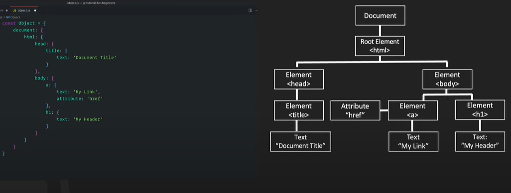
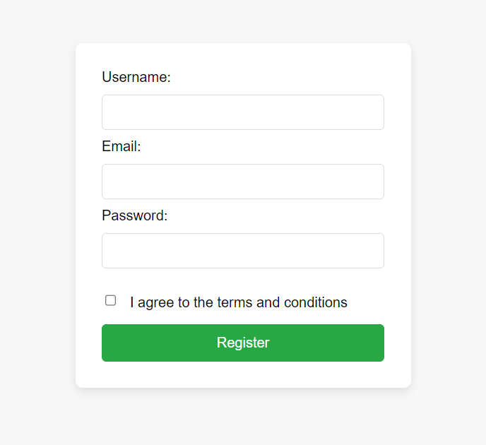
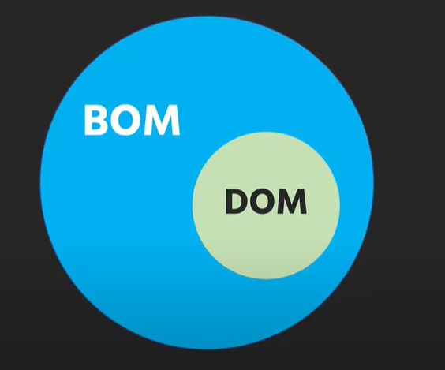
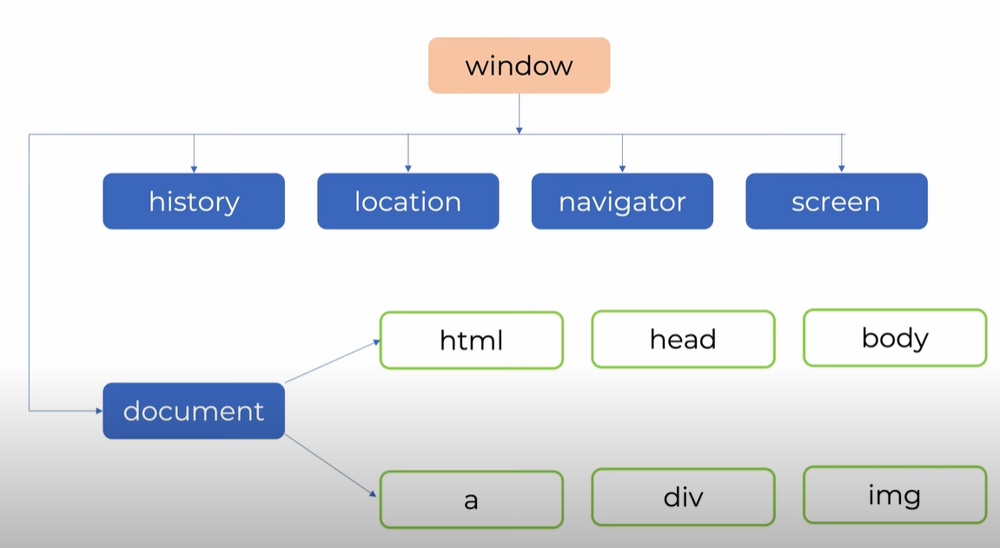

# Learn JavaScript in 30 Chapters

### After completing this course, we'll build [5 Projects]() in JavaScript in-sha-Allah.

After completing the 30-chapters module, jump in the [Projects Section](#).

|                                                               **Chapter No.**                                                                |                                                                                                                              **Topics**                                                                                                                              | **Video Explanation** |
| :------------------------------------------------------------------------------------------------------------------------------------------: | :------------------------------------------------------------------------------------------------------------------------------------------------------------------------------------------------------------------------------------------------------------------: | :-------------------: |
|                                                 [00](#chapter-00-how-the-course-is-designed)                                                 |                                                                                                 [How The Course is Designed](#chapter-00-how-the-course-is-designed)                                                                                                 |       Watch Now       |
|                             [01](#chapter-01-what-is-javascript-key-features-of-javascript-history-and-versions)                             |                                                        [What is JavaScript, Key Features of JavaScript, History and Versions](#chapter-01-what-is-javascript-key-features-of-javascript-history-and-versions)                                                        |       Watch Now       |
|                          [02](#chapter-02-js-with-html-js-output-installing-node-variable-data-types-and-function)                           |                                                  [JS with HTML, JS Output, Installing Node, Variable, Data Types and Function](#chapter-02-js-with-html-js-output-installing-node-variable-data-types-and-function)                                                  |       Watch Now       |
|                                                [02.1](#chapter-021-javascript-var-let--const)                                                |                                                                                                [JavaScript Var, Let & Const](#chapter-021-javascript-var-let--const)                                                                                                 |       Watch Now       |
|                                      [03](#chapter-03-js-operators-arithmetic-data-types--js-functions)                                      |                                                                         [JS Operators, Arithmetic, Data Types & Js Functions](#chapter-03-js-operators-arithmetic-data-types--js-functions)                                                                          |       Watch Now       |
|                                                     [04](#chapter-04-javascript-object)                                                      |                                                                                                       [JavaScript Object](#chapter-04-javascript-object) []()                                                                                                        |     [Watch Now]()     |
|                                                     [05](#chapter-05-javascript-string)                                                      |                                                                                                          [JavaScript String](#chapter-05-javascript-string)                                                                                                          |     [Watch Now]()     |
|                         [06](#chapter-06-javascript-numbers-bigint-number-methods-number-methods-number-properties)                          |                                                [JavaScript Numbers, Bigint, Number Methods, Number Methods, Number Properties](#chapter-06-javascript-numbers-bigint-number-methods-number-methods-number-properties)                                                |     [Watch Now]()     |
|                           [07](#chapter-07-javascript-array-array-methods-array-search-array-sort-array-iteration)                           |                                                                                [JavaScript Array](#chapter-07-javascript-array-array-methods-array-search-array-sort-array-iteration)                                                                                |     [Watch Now]()     |
|                                           [08](#chapter-08-javascript-date-object-and-math-object)                                           |                                                                                        [JavaScript Date and Math Object](#chapter-08-javascript-date-object-and-math-object)                                                                                         |                       |
|                                 [09](#chapter-09-javascript-iterables-sets-set-methods-map-and-map-methods)                                  |                                                                [JavaScript Iterables, Sets, Set Methods, Map and Map Methods](#chapter-09-javascript-iterables-sets-set-methods-map-and-map-methods)                                                                 |                       |
|                    [10](#chapter-10-javascript-type-conversion-destructuring-bitwise-operations-and-regular-expressions)                     |                                       [JavaScript Type Conversion, Destructuring, Bitwise Operations and Regular Expressions](#chapter-10-javascript-type-conversion-destructuring-bitwise-operations-and-regular-expressions)                                       |                       |
|                                [11](#chapter-11-javascript-errors-use-strict-this-keyword-and-arrow-function)                                |                                                              [JavaScript Errors, Use Strict, This Keyword and Arrow Function](#chapter-11-javascript-errors-use-strict-this-keyword-and-arrow-function)                                                              |                       |
|                                           [12](#chapter-12-javascript-classes-json-and-debugging)                                            |                                                                                     [JavaScript Classes, JSON and Debugging](#chapter-12-javascript-classes-json-and-debugging)                                                                                      |                       |
|                                                [13](#chapter-13-javascript-object-in-detail)                                                 |                                                                                                [JavaScript Object in Detail](#chapter-13-javascript-object-in-detail)                                                                                                |                       |
|                                               [14](#chapter-14-javascript-functions-in-detail)                                               |                                                                                             [JavaScript Functions in Detail](#chapter-14-javascript-functions-in-detail)                                                                                             |                       |
|                                                  [15](#chapter-15-asynchronous-javascript)                                                   |                                                                                                    [Asynchronous JavaScript](#chapter-15-asynchronous-javascript)                                                                                                    |                       |
|   [16](#chapter-16-dom-dom-methods-dom-documents-dom-elements-dom-events-dom-event-listener-dom-nodes-dom-collections-dom-nodelist-object)   | [DOM, DOM Methods, DOM Documents, DOM Elements, DOM Events, DOM Event Listener, DOM Nodes, DOM Collections, DOM NodeList Object](#chapter-16-dom-dom-methods-dom-documents-dom-elements-dom-events-dom-event-listener-dom-nodes-dom-collections-dom-nodelist-object) |                       |
| [17](#chapter-17-bom-window-object-screen-object-location-object-history-object-navigator-object-javascript-timing-event-javascript-cookies) |             [BOM, Window Object, History Object, Navigator Object, JavaScript Timing Event, JavaScript Cookies](#chapter-17-bom-window-object-screen-object-location-object-history-object-navigator-object-javascript-timing-event-javascript-cookies)              |                       |
|                        [18](#chapter-18-javascript-web-api-web-storage-api-web-workers-api-fetch-api-geolocation-api)                        |                                             [JavaScript Web API, Web Storage API, Web Workers API, Fetch API, Geolocation API](#chapter-18-javascript-web-api-web-storage-api-web-workers-api-fetch-api-geolocation-api)                                             |                       |
|                                                            [19](#chapter-19-ajax)                                                            |                                                                                                                       [AJAX](#chapter-19-ajax)                                                                                                                       |                       |
|                                                                      20                                                                      |                                                                                                                                                                                                                                                                      |                       |
|                                                                      21                                                                      |                                                                                                                                                                                                                                                                      |                       |
|                                                                      22                                                                      |                                                                                                                                                                                                                                                                      |                       |
|                                                                      23                                                                      |                                                                                                                                                                                                                                                                      |                       |
|                                                                      24                                                                      |                                                                                                                                                                                                                                                                      |                       |
|                                                                      25                                                                      |                                                                                                                                                                                                                                                                      |                       |
|                                                                      26                                                                      |                                                                                                                                                                                                                                                                      |                       |
|                                                                      27                                                                      |                                                                                                                                                                                                                                                                      |                       |
|                                                                      28                                                                      |                                                                                                                                                                                                                                                                      |                       |
|                                                                      29                                                                      |                                                                                                                                                                                                                                                                      |                       |
|                                                                      30                                                                      |                                                                                                                                                                                                                                                                      |                       |

# 5 JavaScript Projects

| **Project No.** | **Project Name** | **Video Explanation** | **Live Demo** |
| :-------------: | :--------------: | :-------------------: | :-----------: |
|       01        |                  |       Watch Now       |   Live Link   |
|       02        |                  |                       |               |
|       03        |                  |                       |               |
|       04        |                  |                       |               |
|       05        |                  |                       |               |

# Chapter-00: How The Course is Designed

- [কোর্সটি কাদের জন্য?](#কোর্সটি-কাদের-জন্য)
- [Prerequisite](#prerequisite)
- [কোর্সটি যেভাবে সাজানো হয়েছে](#কোর্সটি-যেভাবে-সাজানো-হয়েছেঃ)

### কোর্সটি কাদের জন্য?

- এই কোর্সটিতে যেকেউ অংশগ্রহণ করতে পারবে। শিখার জন্য মনের ইচ্ছাটাই আসল!
- Course টি মূলত Beginner-friendly. যারা Web Programming এ নতুন তাদেরকে উদ্দেশ্য করেই Course টি সাজানো।

### Prerequisite

- HTML ও CSS

### কোর্সটি যেভাবে সাজানো হয়েছেঃ

- এই পুরো Article কে একটা বই মনে করতে পারো। কোর্সটি 30 টি Chapter এ ভাগ করা হয়েছে। প্রতিটি Chapter এ JavaScript এর বিভিন্ন Topics নিয়ে আলোচনা করা হয়েছে।
- প্রতিটা Chapter এর Module সাজানো হয়েছে ক্রমানুসারে । উদাহরণস্বরূপ, Chapter-05 এর টপিকসগুলো শিখতে হলে অবশ্যই তোমাকে Chapter-04 শেষ করে আসতে হবে। একইভাবে Chapter-04 শিখতে হলে তোমাকে Chapter-03 শেষ করে আসতে হবে ।
- প্রতিটা Chapter এর Topics এর Written Explanation/Article এর সাথে সাথে Video Explanation-ও দেয়া আছে। যাতে শিক্ষার্থীরা খুব সহজেই টপিকসগুলো আত্মস্থ করতে পারে।

# Chapter-01: What is JavaScript, Key Features of JavaScript, History and Versions

## Table of Contents

1. [🧐 What is JavaScript?](#-what-is-javascript)
2. [📜 History of JavaScript](#-history-of-javascript)
3. [✨ Features of JavaScript](#-features-of-javascript)
4. [🛠️ Uses of JavaScript](#-uses-of-javascript)
5. [📝 JavaScript Example](#-javascript-example)
6. [🚀 Single Threaded vs Multi-Threaded Language](#-single-threaded-vs-multi-threaded-language)
7. [🔚 Conclusion](#-conclusion)

**JavaScript** হচ্ছে একটি বহুল ব্যবহৃত প্রোগ্রামিং ভাষা যা সাধারণত web পেজে dynamic কন্টেন্ট যোগ করার জন্য ব্যবহৃত হয়। এটি client-side এবং server-side দুই ক্ষেত্রেই ব্যবহৃত হয়। JavaScript কে সংক্ষেপে **JS** বলা হয়। এটি **HTML** এবং **CSS** এর সাথে মিলে web পেজকে আরও ইন্টারেক্টিভ এবং আকর্ষণীয় করে তোলে।

## 🧐 What is JavaScript?

JavaScript হচ্ছে একটি **high-level**, **interpreted** প্রোগ্রামিং ভাষা যা **ECMAScript** স্ট্যান্ডার্ড অনুসারে কাজ করে। JavaScript কে সাধারণত web ডেভেলপমেন্টে ব্যবহার করা হয় dynamic কন্টেন্ট, যেমন ইন্টারেক্টিভ ফর্ম, অ্যানিমেশন, এবং আরও অনেক কিছু যোগ করার জন্য। এটি **HTML** এবং **CSS** এর সাথে মিলে web পেজের ইন্টারঅ্যাকশন বাড়ায়।

## 📜 History of JavaScript

JavaScript এর জন্ম হয়েছিল ১৯৯৫ সালে **Netscape** কোম্পানিতে। শুরুতে এর নাম ছিল **Mocha**, পরে নামকরণ করা হয় **LiveScript**, এবং শেষে রাখা হয় **JavaScript**। এর মূল উদ্দেশ্য ছিল web browser এ ইন্টারেক্টিভ ফিচার যোগ করা। বর্তমানে JavaScript অনেক বেশি উন্নত হয়েছে এবং এটি web ডেভেলপমেন্টের পাশাপাশি server-side প্রোগ্রামিং, mobile app ডেভেলপমেন্ট, এবং আরও অনেক ক্ষেত্রে ব্যবহৃত হয়।

## ✨ Features of JavaScript

JavaScript এর কিছু গুরুত্বপূর্ণ ফিচার নিচে দেওয়া হলোঃ

1. **Lightweight and Interpreted**: JavaScript খুবই lightweight এবং browser এর মাধ্যমে সরাসরি interpret হয়। অর্থাৎ, এটি রান করার জন্য আলাদা করে compile করার প্রয়োজন হয় না।

2. **Cross-platform Compatibility**: JavaScript সকল আধুনিক browser এ সমর্থিত এবং এটি বিভিন্ন প্ল্যাটফর্মে কাজ করতে পারে।

3. **Dynamic Typing**: JavaScript এ ভেরিয়েবলের ডেটা টাইপ পরিবর্তনযোগ্য এবং এটি dynamic ভাবে কাজ করে।

4. **Prototype-based Object Orientation**: JavaScript প্রোটোটাইপ-ভিত্তিক অবজেক্ট ওরিয়েন্টেড প্রোগ্রামিং সমর্থন করে।

5. **First-class Functions**: JavaScript এ ফাংশনকে ভেরিয়েবল হিসেবে রাখা, আর্গুমেন্ট হিসেবে পাস করা এবং রিটার্ন করা যায়।

## 🛠️ Uses of JavaScript

JavaScript এর ব্যবহার অনেক বিস্তৃত এবং এটি web ডেভেলপমেন্টের বিভিন্ন ক্ষেত্রে ব্যবহৃত হয়। নিচে JavaScript এর কিছু সাধারণ ব্যবহার উল্লেখ করা হলোঃ

- **Web Development**: web পেজে ইন্টারেক্টিভ ফিচার যোগ করতে যেমন form validation, dynamic কন্টেন্ট আপডেট ইত্যাদি।
- **Server-side Programming**: **Node.js** ব্যবহার করে JavaScript server-side প্রোগ্রামিংয়ের জন্যও ব্যবহৃত হয়।
- **Mobile App Development**: **React Native** এর মত framework ব্যবহার করে mobile app তৈরি করা যায়।
- **Game Development**: JavaScript এর মাধ্যমে browser ভিত্তিক game তৈরি করা সম্ভব।

## 📝 JavaScript Example

নিচে একটি সহজ উদাহরণ দেওয়া হলো যেখানে JavaScript এর মাধ্যমে একটি HTML element এর কন্টেন্ট পরিবর্তন করা হয়েছে:

```html
<!DOCTYPE html>
<html lang="en">
  <head>
    <meta charset="UTF-8" />
    <meta name="viewport" content="width=device-width, initial-scale=1.0" />
    <title>JavaScript Example</title>
  </head>
  <body>
    <h1 id="myHeading">👋 Hello, World!</h1>
    <button onclick="changeContent()">Change Content</button>

    <script>
      function changeContent() {
        document.getElementById("myHeading").innerHTML = "Content Changed!";
      }
    </script>
  </body>
</html>
```

উপরের কোডটিতে, একটি **button** এ click করার মাধ্যমে **h1** element এর টেক্সট পরিবর্তন করা হয়েছে।

### Output

উপরের কোডটি একটি browser এ রান করার পরে, আপনি দেখতে পাবেন একটি heading যেখানে লেখা থাকবে "👋 Hello, World!" এবং নিচে একটি button থাকবে "Change Content" নামে। যখন আপনি button এ click করবেন, তখন heading এর টেক্সট পরিবর্তিত হয়ে "Content Changed!" হয়ে যাবে।

### ব্যাখ্যা

1. **HTML Structure**: উপরের কোডে HTML এর মাধ্যমে পেজের স্ট্রাকচার তৈরি করা হয়েছে।
2. **JavaScript Function**: `changeContent()` ফাংশনটি ব্যবহার করে আমরা `myHeading` element এর content পরিবর্তন করেছি।
3. **Event Handling**: button এ click করার মাধ্যমে JavaScript এর function কল করা হয়েছে, যা নির্দিষ্ট element এর content পরিবর্তন করেছে।

## 🚀 Single Threaded vs Multi-Threaded Language

JavaScript একটি **Single Threaded** প্রোগ্রামিং ভাষা, যার মানে এটি একই সময়ে একটি কাজ করতে পারে। **Single Thread** মানে একটি থ্রেড বা ধারা আছে যা একবারে একটি কাজ করে। এক্ষেত্রে JavaScript এর **call stack** এবং **event loop** এর ব্যবহার করা হয়।

### Single Threaded

**Single Threaded** মানে হচ্ছে একই সময়ে শুধুমাত্র একটি কাজ সম্পন্ন করা। JavaScript এ সব কাজ একটিমাত্র থ্রেডে সম্পন্ন হয়। অর্থাৎ, JavaScript এর **call stack** এ এক সময়ে একটিমাত্র ফাংশন বা টাস্কই এক্সিকিউট হয়। এর ফলে JavaScript এর কোডগুলো সিকোয়েন্স আকারে রান করে এবং পরবর্তী কোড রান করার আগে বর্তমান কোডের এক্সিকিউশন শেষ করতে হয়।

#### উদাহরণ (Single Threaded):

```javascript
function taskOne() {
  console.log("Task One is starting...");
  for (let i = 0; i < 1000000000; i++) {
    // Simulating a time-consuming task
  }
  console.log("Task One is completed.");
}

function taskTwo() {
  console.log("Task Two is starting...");
}

taskOne();
taskTwo();
```

### Output:

```
Task One is starting...
(Task One is completed after a long delay)
Task Two is starting...
```

### ব্যাখ্যা:

উপরের উদাহরণে, প্রথমে `taskOne()` ফাংশনটি কল করা হয়। এটি একটি লম্বা সময় নেওয়া লুপ সম্পন্ন করে, এরপর `taskTwo()` ফাংশনটি চালানো হয়। যেহেতু JavaScript একটি single-threaded ভাষা, তাই `taskOne()` সম্পন্ন না হওয়া পর্যন্ত `taskTwo()` শুরু হতে পারে না।

### Multi-Threaded

**Multi-Threaded** প্রোগ্রামিং ভাষাগুলোর ক্ষেত্রে একই সাথে একাধিক কাজ করা যায়। এক্ষেত্রে প্রতিটি কাজ আলাদা থ্রেডে চালানো হয়। যেমন, একটি থ্রেড ইন্টারফেস নিয়ে কাজ করছে, অন্য একটি থ্রেড ডেটা প্রসেস করছে। এর ফলে একই সময়ে একাধিক কাজ চালানো সম্ভব হয়, যা অ্যাপ্লিকেশনকে আরও দ্রুত ও কার্যকর করে তোলে।

#### উদাহরণ (Multi-Threaded):

ধরা যাক আমরা একটি ভাষা ব্যবহার করছি যেখানে multi-threading সমর্থন করে। নিচের উদাহরণটি একটি সাধারণ multi-threaded প্রোগ্রামের ধারণা দেয়:

```java
class TaskOne extends Thread {
    public void run() {
        System.out.println("Task One is starting...");
        for (int i = 0; i < 1000000000; i++) {
            // Simulating a time-consuming task
        }
        System.out.println("Task One is completed.");
    }
}

class TaskTwo extends Thread {
    public void run() {
        System.out.println("Task Two is starting...");
    }
}

public class MultiThreadExample {
    public static void main(String[] args) {
        TaskOne t1 = new TaskOne();
        TaskTwo t2 = new TaskTwo();
        t1.start();
        t2.start();
    }
}
```

### Output:

```
Task One is starting...
Task Two is starting...
(Task One is completed after a long delay)
```

### ব্যাখ্যা:

উপরের উদাহরণে, `TaskOne` এবং `TaskTwo` দুটি আলাদা থ্রেডে এক্সিকিউট করা হয়। এর ফলে `TaskTwo` ফাংশনটি `TaskOne` এর সম্পূর্ণ হওয়ার জন্য অপেক্ষা না করে সাথে সাথেই শুরু হতে পারে। এটি multi-threading এর সুবিধা, যা একই সময়ে একাধিক কাজ করতে দেয়।

### JavaScript কেন Single Threaded?

JavaScript মূলত **Single Threaded** কারণ এটি প্রথমে তৈরি হয়েছিল **browser** এর জন্য, যেখানে ব্যবহারকারীর সাথে সরাসরি ইন্টারঅ্যাকশন থাকে। Single Threaded ডিজাইনের ফলে JavaScript সহজভাবে ব্যবহারকারীর সাথে ইন্টারঅ্যাক্ট করতে পারে এবং কোনও ফাংশন এক্সিকিউশন চলাকালীন অন্য কোনও কাজ বাধা সৃষ্টি করে না।

যখন একটি কাজ JavaScript এ শুরু হয়, তখন তা **call stack** এ যোগ করা হয় এবং এক্সিকিউট হয়। যদি কোনও ফাংশন এক্সিকিউশন লম্বা সময় নেয়, তবে পরবর্তী কাজগুলি অপেক্ষা করে, যা **blocking** বলে। তবে **asynchronous** কার্যপ্রণালী যেমন **callback**, **promises**, এবং **async/await** এর মাধ্যমে JavaScript কিছুটা **non-blocking** কাজ করতে পারে।

JavaScript একটি **Single Threaded** প্রোগ্রামিং ভাষা, যার মানে এটি একই সময়ে একটি কাজ করতে পারে। **Single Thread** মানে একটি থ্রেড বা ধারা আছে যা একবারে একটি কাজ করে। এক্ষেত্রে JavaScript এর **call stack** এবং **event loop** এর ব্যবহার করা হয়।

## 🔚 Conclusion

JavaScript একটি শক্তিশালী এবং জনপ্রিয় প্রোগ্রামিং ভাষা যা web ডেভেলপমেন্টে dynamic এবং ইন্টারেক্টিভ ফিচার যোগ করতে ব্যবহৃত হয়। এর মাধ্যমে আপনি web পেজে প্রাণ এনে দিতে পারবেন এবং ব্যবহারকারীদের আরও ইন্টারেক্টিভ অভিজ্ঞতা দিতে পারবেন। JavaScript শেখার মাধ্যমে web ডেভেলপার হিসেবে আপনার দক্ষতা অনেকগুণ বৃদ্ধি পাবে।

<h3 align="right">
    <b><a href="#learn-javascript-in-30-chapters">↥ Go to Top</a></b>
</h3>

# Chapter-02: JS with HTML, JS Output, Installing Node, Variable, Data Types and Function

- [HTML Document এ কোথায় JavaScript কোড লিখতে হয়?](#html-document-এ-কোথায়-javascript-কোড-লিখতে-হয়)
- [JavaScript Can Change The Content of HTML Element](#javascript-can-change-the-content-of-html-element)
- [JavaScript Can Change The Value of An Attribute](#javascript-can-change-the-value-of-an-attribute)

- [JavaScript Can Change The CSS Style](#javascript-can-change-the-css-style)
- [JavaScript Variables](#javascript-variables)
- [What is Node ](#what-is-node)
- [Difference Between Var, Let and Const](#difference-between-var-let-and-const)
- [JavaScript Data Types](#javascript-data-types)

## HTML Document এ কোথায় JavaScript কোড লিখতে হয়?

৩ জায়গায় লিখা যায়ঃ

- Body এর মধ্যে।
- Head এর মধ্যে।
- আলাদা ফাইলে। যেমনঃ `script.js`

## JavaScript Can Change The Content of HTML Element

- `getElementById` বা `getElementByClass` methods ব্যবহার করে আমরা HTML Element ধরে তার Content পরিবর্তন করে দিতে পারি। তার জন্য আমাদের `innerHTML` property ব্যবহার করতে হয়। যেমনঃ

```js
document.getElementById("codejogot").innerHTML = "Hello JavaScript";
```

## JavaScript Can Change The Value of An Attribute

- `getElementById` বা `getElementByClass` এর পরে Attribute এর নাম লিখে আমরা চাইলে Attribute এর Value পরিবর্তন করতে পারি। যেমনঃ

```js
<button onclick="document.getElementById('myImage').src='pic_bulbon.gif'">
  Change the photo
</button>
```

## JavaScript Can Change The CSS Style

যেমনঃ

```js
document.getElementById("demo").style.fontSize = "35px";
```

## JavaScript Variables

- Variable হলো Data Store করার জন্য Container.
- ৪ ভাবে JavaScript Variable Declare করা যায়ঃ
  - Automatically
  - `let` keyword
  - `var` keyword
  - `const` keyword

Example of Automatic Declaration:

```js
x = 5;
y = 6;
z = x + y;
```

Note: Variable Declare করা Good Practice.

```js
var x = 5;
var y = 6;
var z = x + y;
```

## What is Node

- Node হল একটি **open-source**, **cross-platform**, JavaScript **runtime environment** যা ওয়েব ব্রাউজারের বাইরে জাভাস্ক্রিপ্ট কোড Run করে। আমরা জানি JavaScript Code কেবল Web Browser এই রান করতে পারে। আমরা যাতে Web Browser এর বাইরেও জাভাস্ক্রিপ্ট কোড Run করতে পারি সেজন্যই মূলত Node এর আগমন।
- Node হলো Google Chrome এর V8 Engine দ্বারা তৈরি।
- Node.js এর মাধ্যমে ডেভেলপাররা জাভাস্ক্রিপ্ট ব্যবহার করে সার্ভার-সাইড স্ক্রিপ্ট লিখতে পারে।

## Features of Node

- **Asynchronous and Event-Driven**

  - **Non-blocking I/O:** Node.js uses non-blocking, event-driven architecture, making it efficient and suitable for real-time applications. Non-blocking I/O means that Node.js can handle many operations simultaneously without waiting for any single operation to complete.
  - **Event Loop:** Node.js operates on a single-threaded event loop, allowing it to handle multiple connections concurrently. This is particularly useful for I/O-heavy operations.

- **Single Programming Language**
  - With Node.js, developers can use JavaScript for both client-side and server-side programming. This unification of language reduces the learning curve and allows for code reuse across the stack.
- **Package Management with npm**
  - Node.js comes with npm (Node Package Manager), a package manager that provides access to a large ecosystem of reusable libraries and tools. npm makes it easy to manage dependencies and share code with other developers.
- **Scalability**
  - Node.js is designed to build scalable network applications. Its non-blocking I/O and event-driven architecture allow it to handle many concurrent connections with minimal overhead.
- **Performance**
  - Built on the V8 JavaScript engine, Node.js provides high performance and fast execution of JavaScript code. V8 compiles JavaScript into native machine code, optimizing it for speed.

## Use Cases for Node.js

- **Web Servers:** Node.js is commonly used to build web servers that can handle HTTP requests. It is especially suitable for building RESTful APIs and real-time web applications.
- **Real-Time Applications:** Applications that require real-time communication, such as chat applications, gaming servers, and collaborative tools, benefit from Node.js's event-driven architecture.
- **Single Page Applications (SPAs):** Node.js is often used in conjunction with front-end frameworks (like Angular, React, or Vue.js) to build SPAs, where the application logic is handled on the client-side and the server provides the necessary data via APIs.
- **Command-Line Tools:** Node.js can be used to create command-line tools and scripts that automate tasks, manage systems, and process data.
- **Microservices:** Node.js is well-suited for building microservices architectures due to its lightweight nature and efficient handling of concurrent requests.

Example: Building a Simple Web Server with Node.js

```js
// Load the http module to create an HTTP server.
const http = require("http");

// Configure the HTTP server to respond with "Hello, World!" to all requests.
const server = http.createServer((req, res) => {
  // Set the response HTTP header with HTTP status and Content type
  res.writeHead(200, { "Content-Type": "text/plain" });
  // Send the response body "Hello, World!"
  res.end("Hello, World!\n");
});

// Listen on port 3000 and IP address 127.0.0.1
server.listen(3000, "127.0.0.1", () => {
  console.log("Server running at http://127.0.0.1:3000/");
});
```

## Difference Between Var, Let and Const

| **Criteria**       | **Var**                                     | **Let**                                                                                      | **Const**                                         |
| ------------------ | ------------------------------------------- | -------------------------------------------------------------------------------------------- | ------------------------------------------------- |
| **Scope**          | Function-scoped                             | Block-scoped                                                                                 | Block-scoped                                      |
| **Re-declaration** | Re-declare করা যায় এবং Value Update করা যায় | Re-declare করা যায় না কিন্তু Value Update করা যায়। Let অনেকটা C++ এর Variable এর মতো কাজ করে | Re-declare করাও যায় না, Value-ও Update করা যায় না |

|

## JavaScript Data Types

- JavaScript এ ৮ ধরনের Data Type আছেঃ
  - String
  - Number
  - Bigint
  - Boolean
  - Undefined
  - Null
  - Symbol
  - Object

Examples:

```js
// Numbers:
let length = 16;
let weight = 7.5;

// Strings:
let color = "Yellow";
let lastName = "Johnson";

// Booleans
let x = true;
let y = false;

// Object:
const person = { firstName: "John", lastName: "Doe" };

// Array object:
const cars = ["Saab", "Volvo", "BMW"];

// Date object:
const date = new Date("2022-03-25");
```

- JavaScript evaluates expressions from left to right. Different sequences can produce different results:

```js
let x = 16 + 4 + "CodeJogot";
```

Output: 20CodeJogot

```js
let x = "Volvo" + 16 + 4;
```

Output: Volvo164

## JavaScript Types are Dynamic

- JavaScript has dynamic types. This means that the same variable can be used to hold different data types.

```js
let x; // Now x is undefined
x = 5; // Now x is a Number
x = "John"; // Now x is a String
```

<h3 align="right">
    <b><a href="#learn-javascript-in-30-chapters">↥ Go to Top</a></b>
</h3>

# Chapter-02.1: JavaScript Var, Let & Const

## JavaScript Var, Let & Const

### Table of Contents:

1. [Introduction to JavaScript Variables](#introduction-to-javascript-variables)
2. [Var](#var)
   - [Scope of Var](#scope-of-var)
   - [Hoisting with Var](#hoisting-with-var)
3. [Let](#let)
   - [Scope of Let](#scope-of-let)
   - [Temporal Dead Zone (TDZ)](#temporal-dead-zone-tdz)
4. [Const](#const)
   - [Scope and Mutability of Const](#scope-and-mutability-of-const)
5. [Differences Between Var, Let, and Const](#differences-between-var-let-and-const)
6. [Best Practices for Using Var, Let, and Const](#best-practices-for-using-var-let-and-const)
7. [Conclusion](#conclusion)

---

### 1. Introduction to JavaScript Variables

JavaScript এ variables হলো memory locations যেখানে বিভিন্ন data store করা যায়। Variables declare করতে হলে **var**, **let**, এবং **const** keywords ব্যবহার করা হয়। এই তিনটি keyword JavaScript এ variables declare করার বিভিন্ন ধরণ এবং behavior নিয়ে কাজ করে।

---

### 2. Var

#### Scope of Var

**Var** হলো JavaScript এর পুরনো variable declaration method, যা function scope এ কাজ করে। এর মানে হলো, একটি function এর ভেতরে **var** দিয়ে declare করা variable সেই function এর scope এর ভেতরেই accessible। তবে, **var** block scope এ কাজ করে না, অর্থাৎ loop বা conditionals এর মধ্যে declare করা variable বাইরে থেকেও accessible থাকে।

##### Example:

```javascript
if (true) {
  var x = 10;
}
console.log(x); // Output: 10
```

- এখানে **x** variable block এর মধ্যে declare করা হলেও, এটি block এর বাইরে accessible হচ্ছে কারণ **var** block scope maintain করে না।

#### Hoisting with Var

JavaScript এ **hoisting** এর কারণে **var** দিয়ে declare করা variable এবং function গুলো code এর শুরুতে move হয়। অর্থাৎ, variable declaration top এ চলে আসে কিন্তু তার initialization হয় না।

##### Example:

```javascript
console.log(a); // Output: undefined
var a = 5;
```

- উপরের উদাহরণে, **a** variable hoist হয়ে যায়, তাই console এ **undefined** দেখায়। তবে, **a** এর মান 5 assign হওয়ার আগেই এটি access করা হয়েছে।

---

### 3. Let

#### Scope of Let

**Let** ES6 (ECMAScript 2015) এ introduce হয় এবং এটি **block-scoped**। অর্থাৎ, একটি block এর মধ্যে **let** দিয়ে declare করা variable সেই block এর বাইরে accessible নয়। এটি **var** এর মতো function scope না মেনে, block scope মেনে চলে।

##### Example:

```javascript
if (true) {
  let y = 20;
}
console.log(y); // Output: ReferenceError: y is not defined
```

- এখানে, **y** variable block এর মধ্যে declare করা হয়েছে এবং block এর বাইরে এটি accessible নয়। তাই **ReferenceError** দেখায়।

#### Temporal Dead Zone (TDZ)

**Let** দিয়ে declare করা variable গুলোতে hoisting হয়, তবে তারা **Temporal Dead Zone** (TDZ) এর কারণে initialization এর আগে access করা যায় না।

##### Example:

```javascript
console.log(b); // Output: ReferenceError: Cannot access 'b' before initialization
let b = 10;
```

- এখানে **b** variable initialization এর আগে access করা হয়েছে, তাই **ReferenceError** দেখা যায়।

---

### 4. Const

#### Scope and Mutability of Const

**Const** হলো constant value declare করার জন্য ব্যবহৃত keyword। এটি **let** এর মতো **block-scoped**, তবে এর বিশেষত্ব হলো, **const** দিয়ে declare করা variable এর মান পরবর্তীতে change করা যায় না।

##### Example:

```javascript
const z = 30;
z = 40; // Output: TypeError: Assignment to constant variable
```

- এখানে **z** variable এর মান পরিবর্তন করার চেষ্টা করলে **TypeError** দেখায়।

তবে, **const** দিয়ে object বা array declare করলে, তাদের properties বা elements পরিবর্তন করা যায়। শুধুমাত্র reference (variable এর memory location) অপরিবর্তনীয় থাকে।

##### Example:

```javascript
const person = { name: "John" };
person.name = "Doe"; // This is allowed
console.log(person.name); // Output: "Doe"
```

- **person** object এর property পরিবর্তন করা হয়েছে, যা **const** variable হলেও সম্ভব, কারণ reference একই থাকে।

---

### 5. Differences Between Var, Let, and Const

| Feature            | Var                               | Let                             | Const                           |
| ------------------ | --------------------------------- | ------------------------------- | ------------------------------- |
| **Scope**          | Function scope                    | Block scope                     | Block scope                     |
| **Hoisting**       | Hoisted, initialized as undefined | Hoisted, but not initialized    | Hoisted, but not initialized    |
| **Reassignable**   | Yes                               | Yes                             | No                              |
| **Re-declaration** | Allowed (even within same scope)  | Not allowed (within same scope) | Not allowed (within same scope) |

#### Explanation:

1. **Scope**: **Var** function scoped হলেও, **let** এবং **const** block scoped।
2. **Hoisting**: তিনটি keyword ই hoisting করে, কিন্তু **let** এবং **const** TDZ এর কারণে initialization এর আগে access করা যায় না।
3. **Reassignable**: **var** এবং **let** দিয়ে declare করা variables এর মান পরিবর্তন করা যায়, কিন্তু **const** এর মান অপরিবর্তনীয়।
4. **Re-declaration**: **var** একই scope এর মধ্যে বারবার declare করা যায়, কিন্তু **let** এবং **const** একই scope এ একবারই declare করা যায়।

---

### 6. Best Practices for Using Var, Let, and Const

1. **Use `let` for variables that may change**: যদি কোনো variable এর মান পরিবর্তন হতে পারে, তবে **let** ব্যবহার করুন। এটি block scope এ থাকে এবং **var** এর মতো hoisting issue তৈরি করে না।
2. **Use `const` for constant values**: যদি কোনো variable এর মান কখনো পরিবর্তন হবে না, তাহলে **const** ব্যবহার করুন। এটি প্রোগ্রামের readability এবং predictability বাড়ায়।
3. **Avoid using `var`**: Modern JavaScript development এ **var** ব্যবহার এড়ানো ভালো, কারণ এটি hoisting এবং block scope এর অভাবে bugs তৈরি করতে পারে।

---

### 7. Conclusion

JavaScript এর **var**, **let**, এবং **const** keyword গুলো variable declare করার জন্য ব্যবহৃত হয়, তবে এদের behavior এবং scope ভিন্ন। **Var** হলো function scoped এবং hoisting এর issue রয়েছে। **Let** হলো block scoped এবং TDZ নিশ্চিত করে। **Const** হলো block scoped এবং constant value declare করার জন্য ব্যবহৃত হয়।

Modern JavaScript development এ **let** এবং **const** বেশি ব্যবহার করা হয়, কারণ এগুলো **var** এর limitations দূর করে এবং কোডকে আরও predictable করে তোলে। Proper use of these keywords ensures cleaner, safer, and more maintainable code.

<h3 align="right">
    <b><a href="#learn-javascript-in-30-chapters">↥ Go to Top</a></b>
</h3>

# Chapter-03: JS Operators, Arithmetic, Data Types & Js Functions

- [JS Operators](#js-operators)
- [Types of JavaScript Operators](#types-of-javascript-operators)
- [Assignment Operator](#assignment-operator)
- [Comparison Operators](#comparison-operators)
- [JavaScript String Addition](#javascript-string-addition)
- [Adding Strings and Numbers](#adding-strings-and-numbers)

## JS Operators

- জাভাস্ক্রিপ্ট অপারেটরগুলি বিভিন্ন ধরণের Mathematical এবং Logical Computatioin করতে ব্যবহৃত হয়।

### JavaScript Assignment Operator

- Assignment Operator (=) একটি ভেরিয়েবলের জন্য একটি মান নির্ধারণ করে।

Example:

```js
// Assign the value 5 to x
let x = 5;
// Assign the value 2 to y
let y = 2;
// Assign the value x + y to z:
let z = x + y;
```

### JavaScript Addition Operator

- Addition Operator দিয়ে Number যোগ করা হয়।

Example:

```js
let x = 5;
let y = 2;
let z = x + y;
```

### JavaScript Multiplication Operator

- Multiplication Operator দিয়ে Numbers গুন করা হয়।

Example:

```js
let x = 5;
let y = 2;
let z = x * y;
```

## Types of JavaScript Operators

1. Arithmetic Operators
2. Assignment Operators
3. Comparison Operators
4. Logical Operators
5. String Operators
6. Conditional (Ternary) Operator
7. Bitwise Operator
8. Type Operator

### Arithmetic Operator

Example:

```js
let a = 3;
let x = (100 + 50) * a;
```

## Assignment Operator

Example:

```js
let x = 10;
x += 5;
```

## Comparison Operators


Credit: W3 School

## JavaScript String Addition

```js
let text1 = "John";
let text2 = "Doe";
let text3 = text1 + " " + text2;
```

## Adding Strings and Numbers

```js
let x = 5 + 5;
let y = "5" + 5;
let z = "Hello" + 5;
```

Output:
10
55
Hello5

## JavaScript Logical Operators


## JavaScript Bitwise Operators

- Bit operators work on 32 bits numbers.
- Any numeric operand in the operation is converted into a 32 bit number. The result is converted back to a JavaScript number.


Image Credit: W3 School

## JavaScript Functions

- JavaScript Function তৈরি করতে গেলে প্রথমে function keyword লিখতে হবে, এরপর Function এর একটা নাম দিতে হবে এবং সবশেষে ()
- Syntax:

```js
function name(parameter1, parameter2, parameter3) {
  // code to be executed
}
```

## JavaScript Function যেভাবে Call করা হয়

- When an event occurs (when a user clicks a button)
- When it is invoked (called) from JavaScript code
- Automatically (self invoked)

## Function Return Mechanism

```js
// Function is called, the return value will end up in x
let x = myFunction(4, 3);

function myFunction(a, b) {
  // Function returns the product of a and b
  return a * b;
}
```

## কেন আমরা Function ব্যবহার করি?

- একই কাজ বার বার করাকে Avoid করার জন্য।

## How to Handle Standard Input and Output in VS Code for JavaScript

Example:

```js
const readline = require("readline");

// Create an interface for reading input and output
const rl = readline.createInterface({
  input: process.stdin,
  output: process.stdout,
});

// Prompt the user for input
rl.question("Enter numbers separated by spaces: ", (input) => {
  // Process the input
  const numbers = input.split(" ").map(Number);

  // For example, using the countEvenNumbers function from earlier
  function countEvenNumbers(arr) {
    let count = 0;
    for (let i = 0; i < arr.length; i++) {
      if (arr[i] % 2 === 0) {
        count++;
      }
    }
    return count;
  }

  const evenCount = countEvenNumbers(numbers);
  console.log(`Number of even numbers: ${evenCount}`);

  // Close the input interface
  rl.close();
});
```

In Console Write:

```js
node main.js
```

Input:

```js
Enter numbers separated by spaces: 1 2 3 4 5
```

Output:

```js
Number of even numbers: 2
```

## Solving Some Easy Problems

Problem-01: Write a JavaScript function to find the sum of two numbers.

Problem-02: Write a JavaScript function to find the product of two numbers.

Problem-03: Write a JavaScript function to find the difference of two numbers.

Problem-04: Write a JavaScript function to find the remainder.

Problem-05: Write a JavaScript function to check if a number is positive, negative or zero.

Problem-06: Write a JavaScript function to check if a number is odd or even.

Problem-07: Write a JavaScript function to calculate the square of a number.

Problem-08: Write a JavaScript function to concatenate two strings.

Problem-09: Write a JavaScript function to find the biggest number among 3 numbers.

Problem-10: Write a JavaScript function which returns the number of even numbers in an array.

<h3 align="right">
    <b><a href="#learn-javascript-in-30-chapters">↥ Go to Top</a></b>
</h3>

# Chapter-04: JavaScript Object

- [What is Object](#what-is-object)
- [JavaScript Primitives](#javascript-primitives)
- [Immutable](#immutable)
- [JavaScript Objects are Mutable](#javascript-objects-are-mutable)
- [JavaScript Object Properties](#javascript-object-properties)
- [Nested Object](#nested-object)
- [Looping through an object in JavaScript](#looping-through-an-object-in-javascript)

## What is Object

- অবজেক্ট, জাভাস্ক্রিপ্টে, সবচেয়ে গুরুত্বপূর্ণ ডেটা টাইপ এবং আধুনিক জাভাস্ক্রিপ্টের জন্য বিল্ডিং ব্লক তৈরি করে। এই অবজেক্টগুলি জাভাস্ক্রিপ্টের Primitive Data Type(Number, String, Boolean, null, undefined, and symbol) থেকে বেশ ভিন্ন এই অর্থে যে এই Primitive Data Type কেবল একটি Value Store করতে পারে। যেখানে Object একাধিক Value Store করতে পারে। উদাহরনঃ

```js
// Create an Object
const student = {
  firstName: "Abdur",
  lastName: "Rahman",
  batch: 5,
  id: "WDB05027",
  marks: 97,
};
```

- In JavaScript, objects are collections of data and functions. This data is stored in the form of **key-value** pairs.
- Keys that store data values are called properties.
- Keys that store functions are called methods.
- It is a common practice to declare objects with the **const** keyword.
- Dot(.) দিয়ে Object এর **Property/Methods** এর Value কে Access করা যায়। যেমনঃ

```js
console.log(student.firstName);
```

- Bracket([]) দিয়েও Object এর **Property/Methods** এর Value কে Access করা যায়। যেমনঃ

```js
console.log(student["firstName"]);
```

- Object এ Property হিসেবে Function-ও ব্যবহার করা যায়। যেমনঃ

```js
// Create an Object
const student = {
  firstName: "Abdur",
  lastName: "Rahman",
  batch: 5,
  id: "WDB05027",
  marks: 97,
  isPassed: function () {
    if (this.marks >= 33) {
      return `${firstName} ${lastName} is passed with ${marks} marks`;
    } else return `${firstName} ${lastName} is failed with ${marks} marks`;
  },
};
//calling function from object
let output = student.isPassed();
```

- এই উদাহরনে _this_ keyword student object কে রেফার করছে।
- জাভাস্ক্রিপ্টে একটি অবজেক্ট একটি রেফারেন্স ডেটা টাইপ হিসাবে বিবেচিত হয়। এর মানে হল যে আপনি যখন একটি অবজেক্ট তৈরি করেন এবং এটিকে একটি ভেরিয়েবলে অ্যাসাইন করেন, তখন ভেরিয়েবলটি আসলে অবজেক্টটিকে ধরে রাখে না। Instead, it holds a reference (or pointer) to the location in memory where the object is stored. Memory এর Location Point করে বলে একে Pointer বলে।

উদাহরনঃ

```js
let x = { name: "Alice" };
```

Here, **x** is a variable that holds a reference (or pointer or memory address) to the memory location where the object { name: "Alice" } is stored.

- <span style="color: blue">In JavaScript, Objects are King. If you Understand Objects, you Understand JavaScript.<span>
- In JavaScript, **Properties** can be primitive values, functions, or even other objects.

- জাভাস্ক্রিপ্টে, প্রায় "সবকিছুই" একটি Object.
  - Objects are objects
  - Arrays are objects
  - Functions are objects
  - Dates are objects
  - Maths are objects
  - Sets are objects
  - All JavaScript values, except primitives, are objects.

## JavaScript Primitives

- A primitive value is a value that has no properties or methods. Example:

```js
let greeting = "Hello";
```

এখানে "Hello" হলো Primitive Value এবং greeting হলো Primitive Data Type.

- যেসব Data Type এ কেবল Primitive Value থাকে, তাকে Primitive Data Type বলে। যেমনঃ
  - string
  - number
  - boolean
  - null
  - undefined
  - symbol
  - bigint

## Immutable

- Primitive values are immutable অর্থাৎ Primitive Value কে পরিবর্তন করা যায় না। যেমনঃ

```js
let x = 100;
```

এখানে আপনি x এর Value পরিবর্তন করতে পারবেন, কিন্তু 100 কে পরিবর্তন করতে পারবেন না। 100 Always 100 ই থাকবে।


## JavaScript Objects are Mutable

- Objects are mutable: They are addressed by reference, not by value.
- যদি **student** একটি Object হয়, এবং `let x = student` লিখা হয়, তাহলে object x is **not a copy** of **student**. The object **x** is **student**. Object x এবং object student একই Memory Share করে। তাই যদি কোন কারনে Object x পরিবর্তন করা হয়, তাহলে Object student-ও পরিবর্তন হয়ে যাবে।

```js
/Create an Object
const student = {
  firstName:"John",
  lastName:"Doe",
  id:20
}

// Create a copy
const x = student;

// Change id in both
x.age = 10;
```

## JavaScript Object Properties

- Properties can be changed, added, deleted, and some are read only.

### Adding New Properties

```js
// Define the student object
const student = {
  // Properties
  firstName: "Abdur",
  lastName: "Rahim",
  age: 21,
  major: "Computer Science",

  // Method
  getFullName: function () {
    return `${this.firstName} ${this.lastName}`;
  },
};

// Add a new property
student.email = "abdurrahim@gmail.com";
```

### Deleting Properties

```js
delete student.major;
or;
delete student["major"];
```

## Nested Object

```js
// Define the student object with nested objects
const student = {
  // Properties
  firstName: "John",
  lastName: "Doe",
  age: 21,
  major: "Computer Science",

  // Nested object for contact information
  contactInfo: {
    email: "john.doe@example.com",
    phone: "123-456-7890",
  },

  // Nested object for address
  address: {
    street: "123 Main St",
    city: "Anytown",
    state: "Anystate",
    zip: "12345",
  },

  // Method
  getFullName: function () {
    return `${this.firstName} ${this.lastName}`;
  },

  // Method to get full address
  getFullAddress: function () {
    return `${this.address.street}, ${this.address.city}, ${this.address.state} ${this.address.zip}`;
  },
};

// Example usage of the object and its methods
console.log(student.getFullName()); // Output: John Doe
console.log(student.getFullAddress()); // Output: 123 Main St, Anytown, Anystate 12345
console.log(student.contactInfo.email); // Output: john.doe@example.com
console.log(student.contactInfo.phone); // Output: 123-456-7890
```

## Looping through an object in JavaScript

- Requirement এর উপর ভিত্তি করে JavaScript এ চারভাবে Object এ Loop করা যায়।

### 1. Looping through an object with for...in

```js
const student = {
  firstName: "John",
  lastName: "Doe",
  age: 21,
  major: "Computer Science",
  contactInfo: {
    email: "john.doe@example.com",
    phone: "123-456-7890",
  },
  address: {
    street: "123 Main St",
    city: "Anytown",
    state: "Anystate",
    zip: "12345",
  },
};

for (let key in student) {
  if (student.hasOwnProperty(key)) {
    console.log(`${key}: ${student[key]}`);
  }
}
```

Output:

```js
firstName: John
lastName: Doe
age: 21
major: Computer Science
contactInfo: [object Object]
address: [object Object]

```

### 2. Looping through an object with forEach

```js
const student = {
  firstName: "John",
  lastName: "Doe",
  age: 21,
  major: "Computer Science",
  contactInfo: {
    email: "john.doe@example.com",
    phone: "123-456-7890",
  },
  address: {
    street: "123 Main St",
    city: "Anytown",
    state: "Anystate",
    zip: "12345",
  },
};

Object.keys(student).forEach((key) => {
  console.log(`${key}: ${student[key]}`);
});
```

Output:

```js
firstName: John
lastName: Doe
age: 21
major: Computer Science
contactInfo: [object Object]
address: [object Object]

```

### 3. Looping through an object Using `Object.entries()` with `for...of`

```js
const student = {
  firstName: "John",
  lastName: "Doe",
  age: 21,
  major: "Computer Science",
  contactInfo: {
    email: "john.doe@example.com",
    phone: "123-456-7890",
  },
  address: {
    street: "123 Main St",
    city: "Anytown",
    state: "Anystate",
    zip: "12345",
  },
};

for (let [key, value] of Object.entries(student)) {
  console.log(`${key}: ${value}`);
}
```

Output:

```js
firstName: John
lastName: Doe
age: 21
major: Computer Science
contactInfo: [object Object]
address: [object Object]

```

### 4. Looping through an object Using `Object.values()` with `forEach()`

- `Object.values()` creates an array from the property values:

```js
const student = {
  firstName: "John",
  lastName: "Doe",
  age: 21,
  major: "Computer Science",
  contactInfo: {
    email: "john.doe@example.com",
    phone: "123-456-7890",
  },
  address: {
    street: "123 Main St",
    city: "Anytown",
    state: "Anystate",
    zip: "12345",
  },
};

Object.values(student).forEach((value) => {
  console.log(value);
});
```

Output:

```js
John
Doe
21
Computer Science
[object Object]
[object Object]

```

## What is JSON

- JSON (JavaScript Object Notation) হল একটি লাইটওয়েট **Data Interchange Format** যা মানুষের পক্ষে পড়তে এবং লিখতে সহজ এবং মেশিন সহজে এটিকে Parse করতে পারে।
- JSON একটি Lanuage-independant Format.
- JSON এর key হলো একটি String এবং Value হলো যেকোনো Valid Data Type (String, Array, Number, Boolen etc)
- ওয়েব অ্যাপ্লিকেশনে সার্ভার এবং ক্লায়েন্টের মধ্যে ডেটা প্রেরণের জন্য JSON ব্যাপকভাবে ব্যবহৃত হয়।

Example of JSON:

```json
{
  "firstName": "John",
  "lastName": "Doe",
  "age": 21,
  "major": "Computer Science",
  "contactInfo": {
    "email": "john.doe@example.com",
    "phone": "123-456-7890"
  },
  "address": {
    "street": "123 Main St",
    "city": "Anytown",
    "state": "Anystate",
    "zip": "12345"
  },
  "courses": ["CS101", "CS102", "CS103"],
  "graduated": false
}
```

### JSON এর ব্যবহার

- **Web APIs:** JSON হল ওয়েব API-এর জন্য সবচেয়ে সাধারণ ফর্ম্যাট। সার্ভার এবং ক্লায়েন্টের মধ্যে ডেটা আদান-প্রদানের একটি সহজ উপায়।
- **Configuration Files:** Many applications use JSON for configuration files due to its readability and ease of use.
- **Data Storage:** Some databases, such as MongoDB, store data in JSON-like formats.

### Converting Object to JSON String

- JavaScript এ, Object থেকে JSON এ Convert করার জন্য `JSON.stringify()` এবং JSON থেকে Object করার জন্য `JSON.parse()` ব্যবহার করা হয়।

```js
// Define a JavaScript object
const student = {
  firstName: "John",
  lastName: "Doe",
  age: 21,
  major: "Computer Science",
  contactInfo: {
    email: "john.doe@example.com",
    phone: "123-456-7890",
  },
  address: {
    street: "123 Main St",
    city: "Anytown",
    state: "Anystate",
    zip: "12345",
  },
};

// Convert the JavaScript object to a JSON string
const jsonString = JSON.stringify(student);

// Output the JSON string
console.log(jsonString);
```

Output:

```json
{
  "firstName": "John",
  "lastName": "Doe",
  "age": 21,
  "major": "Computer Science",
  "contactInfo": { "email": "john.doe@example.com", "phone": "123-456-7890" },
  "address": {
    "street": "123 Main St",
    "city": "Anytown",
    "state": "Anystate",
    "zip": "12345"
  }
}
```

More Readable:

- To make the JSON string more readable, you can pass additional arguments to JSON.stringify() to include indentation.

```js
// Convert the JavaScript object to a pretty-printed JSON string
const prettyJsonString = JSON.stringify(student, null, 2);

// Output the pretty-printed JSON string
console.log(prettyJsonString);
```

Output:

```json
{
  "firstName": "John",
  "lastName": "Doe",
  "age": 21,
  "major": "Computer Science",
  "contactInfo": {
    "email": "john.doe@example.com",
    "phone": "123-456-7890"
  },
  "address": {
    "street": "123 Main St",
    "city": "Anytown",
    "state": "Anystate",
    "zip": "12345"
  }
}
```

- The third argument `(2)` specifies the number of spaces to use as white space for indentation, making the JSON string more readable.

## JavaScript Constructor Functions

- অনেক সময় একই Type এর একাধিক Object আমাদের তৈরি করা লাগতে পারে। যেমনঃ

Batch-05 এর Al Amin Student এর জন্য আমরা একটা Object তৈরি করতে পারি।

```js
let student = {
  // Properties
  firstName: "Al",
  lastName: "Amin",
  id: "WD05020",
  batch: 5,

  // Method
  getDetails: function () {
    return `Name: ${this.firstName} ${this.lastName}, ID: ${this.id}, Batch: ${this.batch}`;
  },
};
console.log(student.getDetails());
```

আবার Batch-05 এর Sujon Rana এর জন্য আমরা একটা Object তৈরি করতে পারি।

```js
let student = {
  // Properties
  firstName: "Sujon",
  lastName: "Rana",
  id: "WD05025",
  batch: 5,

  // Method
  getDetails: function () {
    return `Name: ${this.firstName} ${this.lastName}, ID: ${this.id}, Batch: ${this.batch}`;
  },
};
console.log(student.getDetails());
```

- আপনাদের মনে আছে কি, আমাদের যদি একই Type এর অনেকগুলো Variable Declare করার প্রয়োজন হয়, তাহলে আমরা Array তৈরি করি। একইভাবে একই Type এর Object যদি আমাদের প্রয়োজন হয়, তাহলে আমরা **Costructor Function** তৈরি করতে পারি। এই Function আসলে Object তৈরির Machine এর মতো কাজ করে, যার মাধ্যমে একই Type এর Object যত খুশি তত তৈরি করা যায়।

```js
// Define the constructor function
function Student(firstName, lastName, id, batch) {
  // Properties
  this.firstName = firstName;
  this.lastName = lastName;
  this.id = id;
  this.batch = batch;

  // Method
  this.getDetails = function () {
    return `Name: ${this.firstName} ${this.lastName}, ID: ${this.id}, Batch: ${this.batch}`;
  };
}

// Create student objects using the constructor function
let alamin = new Student("Al", "Amin", "WD05020", 5);
let sujon = new Student("Sujon", "Rana", "WD05025", 5);

// Using the method
console.log(alamin.getDetails()); // Output: Name: Al Amin, ID: WD05020, Batch: 5
console.log(sujon.getDetails()); // Output: Name: Sujon Rana, ID: WD05025, Batch: 5
```

- Constructor Function এর নাম Capital Letter এ লিখতে হয়। JavaScript এ অন্যান্য Function লিখার ক্ষেত্রে Camel Case এবং Constructor Function লিখার ক্ষেত্রে Capital Letter এ লিখতে হয়। যাতে যে কেউ কোড দেখলেই বুঝতে পারে এটা Constructor Function.
- আমরা চাইলে Normal Object এর Property যেভাবে অ্যাড করি, এখানেও সেইভাবে New Property অ্যাড করা যায়। যেমনঃ

```js
alamin.score = 100;
```

### Built-in JavaScript Constructors

```js
new Object(); // A new Object object
new Array(); // A new Array object
new Map(); // A new Map object
new Set(); // A new Set object
new Date(); // A new Date object
new RegExp(); // A new RegExp object
new Function(); // A new Function object
```

- The `Math()` object is not in the list. `Math` is a global object. The `new` keyword cannot be used on `Math`.

## JavaScript Event

- HTML Elements এর মাধ্যমে কোন ঘটনা ঘটাকেই **Event** বলে। যখন HTML Page এ JavaScript ব্যবহার করা হয়, তখন JavaScript এই ইভেন্টগুলিতে "React" বা "Listen" করতে পারে। অর্থাৎ Event হয় HTML এ, আর JavaScript সেই Event Listen করে বা React করে। যেমনঃ Button এ ক্লিক করা একটা Event, Mouse Hover করা ইত্যাদি।

### Common JavaScript Events

| Event Type               | Event       | Description                                                                                          |
| ------------------------ | ----------- | ---------------------------------------------------------------------------------------------------- |
| **Mouse Events**         | click       | Fires when a mouse button is clicked on an element.                                                  |
|                          | dblclick    | Fires when a mouse button is double-clicked on an element.                                           |
|                          | mouseover   | Fires when the mouse pointer is moved onto an element.                                               |
|                          | mouseout    | Fires when the mouse pointer is moved out of an element.                                             |
|                          | mousemove   | Fires when the mouse pointer is moved within an element.                                             |
|                          | mousedown   | Fires when a mouse button is pressed on an element.                                                  |
|                          | mouseup     | Fires when a mouse button is released over an element.                                               |
| **Keyboard Events**      | keydown     | Fires when a key is pressed.                                                                         |
|                          | keyup       | Fires when a key is released.                                                                        |
|                          | keypress    | Fires when a key is pressed and released.                                                            |
| **Form Events**          | submit      | Fires when a form is submitted.                                                                      |
|                          | change      | Fires when an element's value changes.                                                               |
|                          | focus       | Fires when an element receives focus.                                                                |
|                          | blur        | Fires when an element loses focus.                                                                   |
|                          | input       | Fires when the value of an input element changes.                                                    |
| **Window Events**        | load        | Fires when the whole page has loaded, including all dependent resources like stylesheets and images. |
|                          | resize      | Fires when the browser window is resized.                                                            |
|                          | scroll      | Fires when the document view is scrolled.                                                            |
|                          | unload      | Fires when the user navigates away from the page.                                                    |
| **Touch Events**         | touchstart  | Fires when a touch point is placed on the touch surface.                                             |
|                          | touchmove   | Fires when a touch point is moved along the touch surface.                                           |
|                          | touchend    | Fires when a touch point is removed from the touch surface.                                          |
|                          | touchcancel | Fires when a touch point is interrupted.                                                             |
| **Drag and Drop Events** | drag        | Fires when an element is being dragged.                                                              |
|                          | dragstart   | Fires when the user starts dragging an element.                                                      |
|                          | dragend     | Fires when the user has finished dragging the element.                                               |
|                          | dragenter   | Fires when the dragged element enters a drop target.                                                 |
|                          | dragover    | Fires when the dragged element is over a drop target.                                                |
|                          | dragleave   | Fires when the dragged element leaves a drop target.                                                 |
|                          | drop        | Fires when the dragged element is dropped on a drop target.                                          |
| **Clipboard Events**     | copy        | Fires when content is copied to the clipboard.                                                       |
|                          | cut         | Fires when content is cut from the document and added to the clipboard.                              |
|                          | paste       | Fires when content is pasted from the clipboard into the document.                                   |

[Download the PDF](./chapter-04/resources/JavaScript_Events.pdf)

- Event Syntax:

```js
<button onclick="takeAction()">Click me</button>
```

Example:

```js
<!DOCTYPE html>
<html>
<head>
    <title>JavaScript Event Example</title>
    <script>
        // JavaScript function to change the text
        function changeText() {
            document.getElementById("myParagraph").innerHTML = "Text has been changed!";
        }
    </script>
</head>
<body>

<h2>JavaScript Event Example</h2>

<!-- Button with an onclick event to call the changeText function -->
<button onclick="changeText()">Click me</button>

<!-- Paragraph with an id to target with JavaScript -->
<p id="myParagraph">This is the original text.</p>

</body>
</html>

```

- A JavaScript Counter Demonstrating Events:

```html
<!DOCTYPE html>
<html>
  <head>
    <title>JavaScript Counter Example</title>
    <script>
      // Initialize the counter variable
      let counter = 0;

      // Function to increase the counter
      function increaseCounter() {
        counter++;
        displayCounter();
      }

      // Function to decrease the counter
      function decreaseCounter() {
        counter--;
        displayCounter();
      }

      // Function to display the counter value
      function displayCounter() {
        document.getElementById("counterDisplay").innerHTML = counter;
      }
    </script>
  </head>
  <body>
    <h2>JavaScript Counter Example</h2>

    <!-- Button to increase the counter -->
    <button onclick="increaseCounter()">Increase</button>

    <!-- Button to decrease the counter -->
    <button onclick="decreaseCounter()">Decrease</button>

    <!-- Paragraph to display the counter value -->
    <p>Counter: <span id="counterDisplay">0</span></p>
  </body>
</html>
```

### Explanation:

1. **HTML Structure**:

   - Two `<button>` elements, one for increasing the counter and one for decreasing the counter.
   - A `<p>` element with a `<span>` inside it to display the counter value. The `<span>` has an id of `counterDisplay` to target it with JavaScript.

2. **JavaScript Functions**:
   - A `counter` variable is initialized to `0`.
   - `increaseCounter` and `decreaseCounter` functions are defined to modify the `counter` variable and update the display by calling `displayCounter`.
   - The `displayCounter` function updates the inner HTML of the `<span>` element with the current value of the `counter`.

When you click the "Increase" button, the `increaseCounter` function is called, which increments the counter and updates the display. Similarly, when you click the "Decrease" button, the `decreaseCounter` function is called, which decrements the counter and updates the display.

- নিজের Element এর Content Change করতে চাইলে তাকে id দিয়ে আলাদা করে ধরার কোন দরকার নেই। এর বদলে `this.innerHTML` ব্যবহার করা যেতে পারে।

```html
<button onclick="this.innerHTML = Date()">The time is?</button>
```

# Chapter-05: JavaScript String

- [String](#string)
- [String Methods](#string-methods)

## String

- Single এবং Double Quotation এর মধ্যে যা থাকে তাকেই String বলে। Single/Double Quotation এর মধ্যে প্রতিটা Character এর ASCII Value আছে। ASCII = American Standard Code for Information Interchange.
- String Empty হতে পারে।

### Escape Characters

- JavaScript strings support various escape characters that allow you to include special characters within a string. Here are some common escape characters used in JavaScript:

| Escape Character | Description                              | Example                                           | Output                                           |
| ---------------- | ---------------------------------------- | ------------------------------------------------- | ------------------------------------------------ |
| `\'`             | Single quote                             | `'It\'s a pen'`                                   | `It's a pen`                                     |
| `\"`             | Double quote                             | `"He said, \"Hi\""`                               | `He said, "Hi"`                                  |
| `\\`             | Backslash                                | `"This is a backslash: \\ "`                      | `This is a backslash: \ `                        |
| `\n`             | New line                                 | `"Line 1\nLine 2"`                                | `Line 1`<br>`Line 2`                             |
| `\r`             | Carriage return                          | `"Hello\rWorld"`                                  | `World`                                          |
| `\t`             | Tab                                      | `"Hello\tWorld"`                                  | `Hello   World`                                  |
| `\b`             | Backspace                                | `"ABC\bDEF"`                                      | `ABDEF`                                          |
| `\f`             | Form feed                                | `"Hello\fWorld"`                                  | `Hello`<form feed>`World`                        |
| Example          | Demonstrating multiple escape characters | `"She said, \"Hello!\"\nThis is a backslash: \\"` | `She said, "Hello!"`<br>`This is a backslash: \` |

- The backslash escape character `(\)` turns special characters into string characters.

## String Methods

- JavaScript এ সমস্ত String Methods Original String কে পরিবর্তন না করে নতুন String তৈরি করে।

### String Methods At A Glance

| Method          | Description                                                      | Example Code                                                      | Output               |
| --------------- | ---------------------------------------------------------------- | ----------------------------------------------------------------- | -------------------- |
| `charAt()`      | Returns the character at a specified index in a string           | `let str = "Hello"; str.charAt(1);`                               | `e`                  |
| `concat()`      | Joins two or more strings and returns a new string               | `let str1 = "Hello"; let str2 = "World"; str1.concat(" ", str2);` | `Hello World`        |
| `includes()`    | Checks if a string contains a specified substring                | `let str = "Hello World"; str.includes("World");`                 | `true`               |
| `indexOf()`     | Returns the index of the first occurrence of a specified value   | `let str = "Hello World"; str.indexOf("World");`                  | `6`                  |
| `slice()`       | Extracts a part of a string and returns a new string             | `let str = "Hello World"; str.slice(0, 5);`                       | `Hello`              |
| `split()`       | Splits a string into an array of substrings                      | `let str = "Hello World"; str.split(" ");`                        | `["Hello", "World"]` |
| `toLowerCase()` | Converts a string to lowercase                                   | `let str = "Hello World"; str.toLowerCase();`                     | `hello world`        |
| `toUpperCase()` | Converts a string to uppercase                                   | `let str = "Hello World"; str.toUpperCase();`                     | `HELLO WORLD`        |
| `trim()`        | Removes whitespace from both ends of a string                    | `let str = "  Hello World  "; str.trim();`                        | `Hello World`        |
| `replace()`     | Replaces a specified value with another value in a string        | `let str = "Hello World"; str.replace("World", "JavaScript");`    | `Hello JavaScript`   |
| `substring()`   | Extracts characters from a string, between two specified indices | `let str = "Hello World"; str.substring(0, 5);`                   | `Hello`              |
| `startsWith()`  | Checks if a string starts with a specified value                 | `let str = "Hello World"; str.startsWith("Hello");`               | `true`               |
| `endsWith()`    | Checks if a string ends with a specified value                   | `let str = "Hello World"; str.endsWith("World");`                 | `true`               |

## Extracting String Characters

- চার উপায়ে String এর Characters কে Extract করা যায়। যেমনঃ
  - `at(position)` ব্যবহার করে।
  - `charAt(position)` ব্যবহার করে।
  - `charCodeAt(position)` ব্যবহার করে।
  - Array এর মতো `[]` ব্যবহার করে।

| Method         | Description                                                                                  | Example Code                            | Output |
| -------------- | -------------------------------------------------------------------------------------------- | --------------------------------------- | ------ |
| `at()`         | Returns the character at a specified index. Supports negative indices to count from the end. | `let str = "Hello"; str.at(1);`         | `e`    |
|                |                                                                                              | `let str = "Hello"; str.at(-1);`        | `o`    |
| `charAt()`     | Returns the character at a specified index. It doesn't support negative index.               | `let str = "Hello"; str.charAt(1);`     | `e`    |
| `charCodeAt()` | Returns the Unicode value of the character at a specified index.                             | `let str = "Hello"; str.charCodeAt(1);` | `101`  |

## Extracting String Parts

- `slice(start, end)`
- `substring(start, end)`
- `substr(start, length)`

## Slice Method

The `slice()` method in JavaScript is used to extract a portion of an array into a new array. This method does not alter the original array but instead returns a new array containing the selected elements.

### Syntax

```javascript
array.slice(start, end);
```

- `start`: Optional. The starting index at which to begin extraction. If negative, it indicates an offset from the end of the array. Default is `0`.
- `end`: Optional. The ending index before which to end extraction (the element at this index is not included). If negative, it indicates an offset from the end of the array. If omitted, it extracts through the end of the array.

### Examples

1. **Basic Usage**

```javascript
let fruits = ["Banana", "Orange", "Lemon", "Apple", "Mango"];
let citrus = fruits.slice(1, 3);
console.log(citrus); // Output: ["Orange", "Lemon"]
```

2. **Using Negative Indices**

```javascript
let fruits = ["Banana", "Orange", "Lemon", "Apple", "Mango"];
let lastTwo = fruits.slice(-2);
console.log(lastTwo); // Output: ["Apple", "Mango"]
```

3. **Omitting the `end` Parameter**

```javascript
let fruits = ["Banana", "Orange", "Lemon", "Apple", "Mango"];
let fromSecond = fruits.slice(1);
console.log(fromSecond); // Output: ["Orange", "Lemon", "Apple", "Mango"]
```

### Notes

- The original array remains unchanged.
- If `start` is greater than the length of the array, an empty array is returned.
- If `end` is greater than the length of the array, the slice extracts through the end of the array.

## Substring Method

- The `substring` method in JavaScript is used to extract a portion of a string and returns it as a new string, without modifying the original string. Here’s a simple explanation of how it works:
- substring() is similar to slice().
- The difference is that start and end values less than 0 are treated as 0 in substring().

### Syntax

```javascript
string.substring(indexStart, indexEnd);
```

- `indexStart` (required): The index of the first character to include in the returned substring.
- `indexEnd` (optional): The index of the first character to exclude from the returned substring. If omitted, `substring` extracts characters to the end of the string.

### Key Points

1. **Zero-based Indexing**: The indices are zero-based, meaning the first character of the string is at index 0.
2. **Index Order**: If `indexStart` is greater than `indexEnd`, `substring` will swap the two arguments.
3. **Negative Indices**: If either `indexStart` or `indexEnd` is less than 0, it is treated as 0.
4. **Out of Range**: If any of the indices are greater than the string's length, they are treated as equal to the string's length.

### Examples

1. **Basic Usage**

   ```javascript
   let str = "Hello, world!";
   let result = str.substring(0, 5);
   console.log(result); // Outputs: "Hello"
   ```

2. **Omitting `indexEnd`**

   ```javascript
   let str = "Hello, world!";
   let result = str.substring(7);
   console.log(result); // Outputs: "world!"
   ```

3. **Swapping Indices**

   ```javascript
   let str = "Hello, world!";
   let result = str.substring(7, 0);
   console.log(result); // Outputs: "Hello, "
   ```

4. **Negative Index**

   ```javascript
   let str = "Hello, world!";
   let result = str.substring(-5, 5);
   console.log(result); // Outputs: "Hello"
   ```

5. **Index Out of Range**
   ```javascript
   let str = "Hello, world!";
   let result = str.substring(7, 20);
   console.log(result); // Outputs: "world!"
   ```

## Substr Method

- substr() is similar to slice().
- The difference is that the second parameter specifies the **length** of the extracted part.

```js
let str = "Hello, world!";
let result = str.substr(7, 5);
console.log(result); // Outputs: "world"
```

## Converting Uppercase and Lowercase

### `toUpperCase` Method

The `toUpperCase` method converts all the characters in a string to uppercase.

**Syntax**

```javascript
string.toUpperCase();
```

**Example**

```javascript
let str = "Hello, world!";
let upperStr = str.toUpperCase();
console.log(upperStr); // Outputs: "HELLO, WORLD!"
```

### `toLowerCase` Method

The `toLowerCase` method converts all the characters in a string to lowercase.

**Syntax**

```javascript
string.toLowerCase();
```

**Example**

```javascript
let str = "Hello, World!";
let lowerStr = str.toLowerCase();
console.log(lowerStr); // Outputs: "hello, world!"
```

## Concat Method

- The `concat` method in JavaScript is used to merge two or more strings into one. This method does not change the existing strings but returns a new string containing the combined text of the strings provided as arguments.

### Syntax

```javascript
string1.concat(string2, string3, ..., stringN)
```

- `string1, string2, ..., stringN`: The strings to be concatenated with the original string.

### Key Points

1. **Non-Mutating**: The `concat` method does not alter the original strings. It returns a new string.
2. **Multiple Arguments**: You can pass multiple strings as arguments to concatenate them all at once.
3. **Alternate Method**: The `+` operator can also be used to concatenate strings.

### Examples

1. **Basic Usage**

   ```javascript
   let str1 = "Hello, ";
   let str2 = "world!";
   let result = str1.concat(str2);
   console.log(result); // Outputs: "Hello, world!"
   ```

2. **Concatenating Multiple Strings**

   ```javascript
   let str1 = "Hello";
   let str2 = ", ";
   let str3 = "world";
   let str4 = "!";
   let result = str1.concat(str2, str3, str4);
   console.log(result); // Outputs: "Hello, world!"
   ```

3. **Using `concat` with an Empty String**

   ```javascript
   let str1 = "Hello, ";
   let str2 = "";
   let str3 = "world!";
   let result = str1.concat(str2, str3);
   console.log(result); // Outputs: "Hello, world!"
   ```

4. **Alternative Using the `+` Operator**
   ```javascript
   let str1 = "Hello, ";
   let str2 = "world!";
   let result = str1 + str2;
   console.log(result); // Outputs: "Hello, world!"
   ```

The `concat` method is a straightforward way to combine strings, and while the `+` operator is often used for its simplicity, `concat` can be particularly useful when concatenating multiple strings in a single method call.

## Trim Method

- The `trim` method in JavaScript is used to remove whitespace from both ends of a string. It does not change the original string but returns a new string with the leading and trailing whitespace removed.

### Syntax

```javascript
string.trim();
```

### Key Points

1. **Whitespace Removal**: It removes spaces, tabs, and other whitespace characters from the beginning and end of the string.
2. **Non-Mutating**: The `trim` method does not alter the original string but returns a new string with the whitespace removed.

### Examples

1. **Basic Usage**

   ```javascript
   let str = "   Hello, world!   ";
   let trimmedStr = str.trim();
   console.log(trimmedStr); // Outputs: "Hello, world!"
   ```

2. **No Whitespace to Remove**

   ```javascript
   let str = "Hello, world!";
   let trimmedStr = str.trim();
   console.log(trimmedStr); // Outputs: "Hello, world!"
   ```

3. **String with Only Whitespace**

   ```javascript
   let str = "   ";
   let trimmedStr = str.trim();
   console.log(trimmedStr); // Outputs: ""
   ```

4. **Whitespace in the Middle of the String**
   ```javascript
   let str = "   Hello,   world!   ";
   let trimmedStr = str.trim();
   console.log(trimmedStr); // Outputs: "Hello,   world!"
   ```

The `trim` method is particularly useful for cleaning up user input or processing strings where whitespace at the ends might cause issues.

## padStart and padEnd Method

The `padStart` and `padEnd` methods in JavaScript are used to pad the current string with another string until the resulting string reaches the given length. The padding is applied from the start or end of the string respectively.

### `padStart` Method

The `padStart` method pads the current string from the start with another string until the resulting string reaches the specified length.

**Syntax**

```javascript
string.padStart(targetLength, padString);
```

- `targetLength` (required): The length of the resulting string once the current string has been padded. If this length is less than the length of the original string, no padding is added.
- `padString` (optional): The string to pad the current string with. If this string is too long, it is truncated. The default value is a space character (" ").

**Example**

```javascript
let str = "5";
let paddedStr = str.padStart(3, "0");
console.log(paddedStr); // Outputs: "005"
```

### `padEnd` Method

The `padEnd` method pads the current string from the end with another string until the resulting string reaches the specified length.

**Syntax**

```javascript
string.padEnd(targetLength, padString);
```

- `targetLength` (required): The length of the resulting string once the current string has been padded. If this length is less than the length of the original string, no padding is added.
- `padString` (optional): The string to pad the current string with. If this string is too long, it is truncated. The default value is a space character (" ").

**Example**

```javascript
let str = "5";
let paddedStr = str.padEnd(3, "0");
console.log(paddedStr); // Outputs: "500"
```

### Additional Examples

1. **Using `padStart` with Default Padding**

   ```javascript
   let str = "42";
   let paddedStr = str.padStart(5);
   console.log(paddedStr); // Outputs: "   42"
   ```

2. **Using `padEnd` with Default Padding**

   ```javascript
   let str = "42";
   let paddedStr = str.padEnd(5);
   console.log(paddedStr); // Outputs: "42   "
   ```

3. **Padding with a Custom String**

   ```javascript
   let str = "123";
   let paddedStrStart = str.padStart(6, "abc");
   console.log(paddedStrStart); // Outputs: "abc123"

   let paddedStrEnd = str.padEnd(6, "abc");
   console.log(paddedStrEnd); // Outputs: "123abc"
   ```

4. **Padding with a Truncated Pad String**
   ```javascript
   let str = "123";
   let paddedStr = str.padStart(10, "abcdef");
   console.log(paddedStr); // Outputs: "abcdefa123"
   ```

## repeat Method

The `repeat` method in JavaScript is used to construct and return a new string which contains the specified number of copies of the string on which it was called, concatenated together.

### Syntax

```javascript
string.repeat(count);
```

- `count` (required): An integer between 0 and positive infinity, indicating the number of times to repeat the string. If this count is negative or infinity, a `RangeError` is thrown.

### Examples

1. **Basic Usage**

   ```javascript
   let str = "abc";
   let repeatedStr = str.repeat(3);
   console.log(repeatedStr); // Outputs: "abcabcabc"
   ```

2. **Zero Count**

   ```javascript
   let str = "abc";
   let repeatedStr = str.repeat(0);
   console.log(repeatedStr); // Outputs: ""
   ```

3. **Floating Point Count**

   ```javascript
   let str = "abc";
   let repeatedStr = str.repeat(2.5);
   console.log(repeatedStr); // Outputs: "abcabc" (count is converted to an integer)
   ```

4. **RangeError for Negative Count**

   ```javascript
   let str = "abc";
   try {
     let repeatedStr = str.repeat(-1);
   } catch (e) {
     console.log(e); // Outputs: RangeError: Invalid count value
   }
   ```

5. **Using Repeat for Padding**

   ```javascript
   let str = "abc";
   let paddedStr = str + " ".repeat(5) + "def";
   console.log(paddedStr); // Outputs: "abc     def"
   ```

6. **Combining Repeat with Other Methods**
   ```javascript
   let str = "abc";
   let repeatedUpperStr = str.repeat(2).toUpperCase();
   console.log(repeatedUpperStr); // Outputs: "ABCABC"
   ```

The `repeat` method is useful for generating repeated sequences of a string, such as for creating padding, repeating patterns, or generating test data.

## replace Method

The `replace` method in JavaScript is used to return a new string with some or all matches of a pattern replaced by a replacement. The pattern can be a string or a regular expression, and the replacement can be a string or a function to generate the string.

### Syntax

```javascript
string.replace(pattern, replacement);
```

- `pattern` (required): The substring or regular expression to be replaced.
- `replacement` (required): The string or function that replaces the matched substrings.

### Key Points

1. **First Match Only**: If `pattern` is a string, only the first occurrence will be replaced.
2. **Global Replacement**: To replace all occurrences, use a regular expression with the `g` (global) flag.
3. **Replacement String**: Can include special replacement patterns like `$&` (the matched substring), `$` (the preceding portion), `$'` (the following portion), and more.
4. **Replacement Function**: Can be used for more complex replacements, where the function's return value replaces the matched substring.

### Examples

1. **Basic Usage**

   ```javascript
   let str = "Hello, world!";
   let newStr = str.replace("world", "there");
   console.log(newStr); // Outputs: "Hello, there!"
   ```

2. **Global Replacement with Regular Expression**

   ```javascript
   let str = "Hello, world! Hello, everyone!";
   let newStr = str.replace(/Hello/g, "Hi");
   console.log(newStr); // Outputs: "Hi, world! Hi, everyone!"
   ```

3. **Using Special Replacement Patterns**

   ```javascript
   let str = "abc123";
   let newStr = str.replace(/(\d+)/, "Number: $1");
   console.log(newStr); // Outputs: "abcNumber: 123"
   ```

4. **Replacement Function**

   ```javascript
   let str = "The quick brown fox jumps over the lazy dog.";
   let newStr = str.replace(/\b\w+\b/g, function (match) {
     return match.toUpperCase();
   });
   console.log(newStr); // Outputs: "THE QUICK BROWN FOX JUMPS OVER THE LAZY DOG."
   ```

5. **Replacing with Empty String**

   ```javascript
   let str = "Hello, world!";
   let newStr = str.replace("world", "");
   console.log(newStr); // Outputs: "Hello, !"
   ```

6. **Replacing Multiple Patterns**
   ```javascript
   let str = "Twas the night before Christmas.";
   let newStr = str.replace(/night|Christmas/g, function (match) {
     if (match === "night") return "day";
     if (match === "Christmas") return "New Year";
   });
   console.log(newStr); // Outputs: "Twas the day before New Year."
   ```

The `replace` method is powerful for string manipulation, offering flexibility to replace substrings or patterns with static replacements or dynamically generated content.

## replaceAll Method

The `replaceAll` method in JavaScript is used to replace all occurrences of a specified substring or regular expression within a string with a new substring. It is a more convenient and readable way to perform a global replacement compared to using `replace` with a regular expression and the global flag (`/g`).

### Syntax

```javascript
string.replaceAll(pattern, replacement);
```

- `pattern` (required): The substring or regular expression to be replaced.
- `replacement` (required): The string or function that replaces the matched substrings.

### Key Points

1. **Global Replacement**: `replaceAll` automatically replaces all occurrences of the pattern, similar to using `replace` with the global flag.
2. **String and RegExp Patterns**: The `pattern` can be a string or a regular expression with the global flag.
3. **Replacement String or Function**: The `replacement` can be a string or a function that returns the replacement string.

### Examples

1. **Basic Usage with a String Pattern**

   ```javascript
   let str = "Hello, world! Hello, everyone!";
   let newStr = str.replaceAll("Hello", "Hi");
   console.log(newStr); // Outputs: "Hi, world! Hi, everyone!"
   ```

2. **Using a Regular Expression Pattern**

   ```javascript
   let str = "Hello, world! Hello, everyone!";
   let newStr = str.replaceAll(/Hello/g, "Hi");
   console.log(newStr); // Outputs: "Hi, world! Hi, everyone!"
   ```

3. **Replacing with Special Characters**

   ```javascript
   let str = "Hello, world! Hello, everyone!";
   let newStr = str.replaceAll("!", "?");
   console.log(newStr); // Outputs: "Hello, world? Hello, everyone?"
   ```

4. **Replacing with a Function**

   ```javascript
   let str = "The quick brown fox jumps over the lazy dog.";
   let newStr = str.replaceAll(/\b\w+\b/g, function (match) {
     return match.toUpperCase();
   });
   console.log(newStr); // Outputs: "THE QUICK BROWN FOX JUMPS OVER THE LAZY DOG."
   ```

5. **Replacing Multiple Different Patterns**

   ```javascript
   let str = "Apples are red. Apples are tasty.";
   let newStr = str.replaceAll("Apples", "Oranges").replaceAll("red", "orange");
   console.log(newStr); // Outputs: "Oranges are orange. Oranges are tasty."
   ```

6. **Replacing Using Special Replacement Patterns**
   ```javascript
   let str = "abc123abc456";
   let newStr = str.replaceAll(/abc/g, "XYZ");
   console.log(newStr); // Outputs: "XYZ123XYZ456"
   ```

## Converting a String to an Array

- If you want to work with a string as an array, you can convert it to an array.
- A string can be converted to an array with the `split()` method.
- If the separator is "", the returned array will be an array of single characters.
- If the separator is omitted, the returned array will contain the whole string in index [0].

```js
text.split(","); // Split on commas
text.split(" "); // Split on spaces
text.split("|"); // Split on pipe
text.split(""); //split by characters
```

## JavaScript String Search

## indexOf() Method and lastIndexOf() Method

The `indexOf` and `lastIndexOf` methods in JavaScript are used to find the index of a specified substring within a string. The `indexOf` method returns the first occurrence, while the `lastIndexOf` method returns the last occurrence.

### `indexOf` Method

The `indexOf` method returns the index of the first occurrence of a specified substring within the string. If the substring is not found, it returns `-1`.

**Syntax**

```javascript
string.indexOf(searchValue, fromIndex);
```

- `searchValue` (required): The substring to search for.
- `fromIndex` (optional): The index to start the search from. The default is `0`.

**Examples**

1. **Basic Usage**

   ```javascript
   let str = "Hello, world!";
   let index = str.indexOf("world");
   console.log(index); // Outputs: 7
   ```

2. **Not Found**

   ```javascript
   let str = "Hello, world!";
   let index = str.indexOf("planet");
   console.log(index); // Outputs: -1
   ```

3. **Starting Search from a Specific Index**
   ```javascript
   let str = "Hello, world! Hello again!";
   let index = str.indexOf("Hello", 10);
   console.log(index); // Outputs: 13
   ```

### `lastIndexOf` Method

The `lastIndexOf` method returns the index of the last occurrence of a specified substring within the string. If the substring is not found, it returns `-1`.

**Syntax**

```javascript
string.lastIndexOf(searchValue, fromIndex);
```

- `searchValue` (required): The substring to search for.
- `fromIndex` (optional): The index to start the search backward from. The default is `str.length - 1`.

**Examples**

1. **Basic Usage**

   ```javascript
   let str = "Hello, world! Hello again!";
   let index = str.lastIndexOf("Hello");
   console.log(index); // Outputs: 13
   ```

2. **Not Found**

   ```javascript
   let str = "Hello, world!";
   let index = str.lastIndexOf("planet");
   console.log(index); // Outputs: -1
   ```

3. **Starting Search Backward from a Specific Index**
   ```javascript
   let str = "Hello, world! Hello again!";
   let index = str.lastIndexOf("Hello", 12);
   console.log(index); // Outputs: 0
   ```

### Additional Examples

1. **Finding All Occurrences Using a Loop**

   ```javascript
   let str = "Hello, world! Hello again!";
   let searchValue = "Hello";
   let indices = [];
   let index = str.indexOf(searchValue);

   while (index !== -1) {
     indices.push(index);
     index = str.indexOf(searchValue, index + 1);
   }

   console.log(indices); // Outputs: [0, 13]
   ```

2. **Case-Sensitive Search**

   ```javascript
   let str = "Hello, World!";
   let index = str.indexOf("world");
   console.log(index); // Outputs: -1 (case-sensitive)
   ```

3. **Using `lastIndexOf` for Substring Search**
   ```javascript
   let str = "banana";
   let index = str.lastIndexOf("na");
   console.log(index); // Outputs: 4
   ```

## serach() Method

The `search` method in JavaScript is used to search a string for a specified value (pattern) and returns the index (position) of the first match. The search value can be a string or a regular expression. This method returns `-1` if no match is found.

### Syntax

```javascript
string.search(pattern);
```

- `pattern` (required): A string or a regular expression to search for.

### Key Points

1. **Search Value**: The `pattern` can be a string or a regular expression.
2. **Returns Index**: The method returns the index of the first match. If no match is found, it returns `-1`.
3. **Case-Sensitive**: The search is case-sensitive.

### Examples

1. **Basic Usage with a String Pattern**

   ```javascript
   let str = "Hello, world!";
   let index = str.search("world");
   console.log(index); // Outputs: 7
   ```

2. **No Match Found**

   ```javascript
   let str = "Hello, world!";
   let index = str.search("planet");
   console.log(index); // Outputs: -1
   ```

3. **Using a Regular Expression**

   ```javascript
   let str = "Hello, world!";
   let index = str.search(/world/);
   console.log(index); // Outputs: 7
   ```

4. **Case-Sensitive Search**

   ```javascript
   let str = "Hello, World!";
   let index = str.search(/world/i); // Using 'i' flag for case-insensitive search
   console.log(index); // Outputs: 7
   ```

5. **Finding a Digit Using Regular Expression**

   ```javascript
   let str = "Hello, world! 2024";
   let index = str.search(/\d/);
   console.log(index); // Outputs: 13
   ```

6. **Using Special Characters in Regular Expression**
   ```javascript
   let str = "Hello, world!";
   let index = str.search(/\W/); // Search for the first non-word character
   console.log(index); // Outputs: 5
   ```

### Additional Considerations

- **Regular Expressions**: When using regular expressions, you can take advantage of various flags and patterns for more complex searches.
- **Difference from `indexOf`**: Unlike `indexOf`, which only searches for a simple substring, `search` can use regular expressions, providing more flexibility in pattern matching.

## match() Method

The `match` method in JavaScript is used to retrieve the result of matching a string against a regular expression. It returns an array containing all the matches, or `null` if no match is found. This method can be very powerful when combined with regular expressions for pattern matching and extraction.

### Syntax

```javascript
string.match(regexp);
```

- `regexp` (required): A regular expression object to match against the string.

### Key Points

1. **Regular Expression**: The `regexp` parameter must be a regular expression.
2. **Return Value**: Returns an array with the matches, or `null` if no match is found.
3. **Global Flag**: If the regular expression includes the global (`g`) flag, the method returns an array of all matches. Otherwise, it returns an array with the first match and its capturing groups.

### Examples

1. **Basic Usage without Global Flag**

   ```javascript
   let str = "The quick brown fox jumps over the lazy dog.";
   let result = str.match(/quick/);
   console.log(result); // Outputs: ["quick"]
   ```

2. **No Match Found**

   ```javascript
   let str = "The quick brown fox jumps over the lazy dog.";
   let result = str.match(/cat/);
   console.log(result); // Outputs: null
   ```

3. **Using Global Flag**

   ```javascript
   let str = "The quick brown fox jumps over the lazy dog.";
   let result = str.match(/\w+/g);
   console.log(result); // Outputs: ["The", "quick", "brown", "fox", "jumps", "over", "the", "lazy", "dog"]
   ```

4. **Capturing Groups**

   ```javascript
   let str = "The quick brown fox jumps over the lazy dog.";
   let result = str.match(/(quick) (brown)/);
   console.log(result); // Outputs: ["quick brown", "quick", "brown"]
   ```

5. **Using Special Characters**

   ```javascript
   let str = "The quick brown fox jumps over the lazy dog.";
   let result = str.match(/[aeiou]/g);
   console.log(result); // Outputs: ["e", "u", "i", "o", "o", "u", "o", "e", "e", "a", "o"]
   ```

6. **Case-Insensitive Search**
   ```javascript
   let str = "The Quick Brown Fox Jumps Over The Lazy Dog.";
   let result = str.match(/the/gi);
   console.log(result); // Outputs: ["The", "The"]
   ```

### Additional Considerations

- **Global vs. Non-Global**: Without the global flag (`g`), the `match` method returns an array with the first match and its capturing groups. With the global flag, it returns an array of all matches without capturing groups.
- **Null Return**: If no matches are found, `match` returns `null`, so it's often a good practice to check the result before processing it.

The `match` method is a versatile tool for pattern matching in strings, allowing for both simple and complex searches with regular expressions.

## matchAll() Method

The `matchAll` method in JavaScript is used to retrieve all matches of a regular expression within a string, along with their capturing groups. This method returns an iterator of all the matches, allowing for comprehensive and detailed pattern matching.

### Syntax

```javascript
string.matchAll(regexp);
```

- `regexp` (required): A regular expression object. It must have the global (`g`) or sticky (`y`) flag set; otherwise, a `TypeError` is thrown.

### Key Points

1. **Global or Sticky Flag Required**: The regular expression must include the global (`g`) or sticky (`y`) flag.
2. **Return Value**: Returns an iterator of arrays containing the matches, capturing groups, and their indices.
3. **Iterator**: The method returns an iterator, which can be converted to an array using the spread operator (`...`) or `Array.from`.

### Examples

1. **Basic Usage with Global Flag**

   ```javascript
   let str = "The quick brown fox jumps over the lazy dog.";
   let regexp = /\b\w+\b/g;
   let matches = str.matchAll(regexp);

   for (let match of matches) {
     console.log(match);
   }
   // Outputs:
   // ["The", index: 0, input: "The quick brown fox jumps over the lazy dog.", groups: undefined]
   // ["quick", index: 4, input: "The quick brown fox jumps over the lazy dog.", groups: undefined]
   // ["brown", index: 10, input: "The quick brown fox jumps over the lazy dog.", groups: undefined]
   // ...
   ```

2. **Using the Spread Operator to Convert to Array**

   ```javascript
   let str = "The quick brown fox jumps over the lazy dog.";
   let regexp = /\b\w+\b/g;
   let matches = [...str.matchAll(regexp)];
   console.log(matches);
   // Outputs an array of all match objects
   ```

3. **Capturing Groups**

   ```javascript
   let str = "The quick brown fox jumps over the lazy dog.";
   let regexp = /(\w+)\s(\w+)/g;
   let matches = str.matchAll(regexp);

   for (let match of matches) {
     console.log(match);
   }
   // Outputs:
   // ["The quick", "The", "quick", index: 0, input: "The quick brown fox jumps over the lazy dog.", groups: undefined]
   // ["brown fox", "brown", "fox", index: 10, input: "The quick brown fox jumps over the lazy dog.", groups: undefined]
   // ...
   ```

4. **Converting Iterator to Array Using Array.from**
   ```javascript
   let str = "The quick brown fox jumps over the lazy dog.";
   let regexp = /\b\w+\b/g;
   let matches = Array.from(str.matchAll(regexp));
   console.log(matches);
   // Outputs an array of all match objects
   ```

### Additional Considerations

- **Iterator Nature**: Since `matchAll` returns an iterator, you can use it in a `for...of` loop, spread operator, or `Array.from` to process the matches.
- **Detailed Match Information**: Each match object includes detailed information such as the match itself, the index where it was found, the input string, and any capturing groups.

The `matchAll` method is a powerful tool for extracting multiple matches and their details from a string, making it ideal for comprehensive pattern matching with regular expressions.

## includes() Method

The `includes` method in JavaScript is used to determine whether one string contains another substring. It returns `true` if the substring is found within the string, and `false` otherwise.

### Syntax

```javascript
string.includes(searchString, position);
```

- `searchString` (required): The substring to search for within the string.
- `position` (optional): The position in the string at which to start searching. The default is `0`.

### Key Points

1. **Case-Sensitive**: The search is case-sensitive.
2. **Default Position**: If the `position` parameter is not specified, the search starts from the beginning of the string.

### Examples

1. **Basic Usage**

   ```javascript
   let str = "Hello, world!";
   let result = str.includes("world");
   console.log(result); // Outputs: true
   ```

2. **Case-Sensitivity**

   ```javascript
   let str = "Hello, world!";
   let result = str.includes("World");
   console.log(result); // Outputs: false
   ```

3. **Starting Search from a Specific Position**

   ```javascript
   let str = "Hello, world!";
   let result = str.includes("world", 8);
   console.log(result); // Outputs: false
   ```

4. **Using `includes` with a Long String**

   ```javascript
   let str = "The quick brown fox jumps over the lazy dog.";
   let result = str.includes("fox");
   console.log(result); // Outputs: true
   ```

5. **Checking for a Substring Not Present**
   ```javascript
   let str = "Hello, world!";
   let result = str.includes("planet");
   console.log(result); // Outputs: false
   ```

### Additional Considerations

- **Polyfill for Older Environments**: If you need to support environments that do not have `includes`, you can use a polyfill:

  ```javascript
  if (!String.prototype.includes) {
    String.prototype.includes = function (search, start) {
      "use strict";
      if (typeof start !== "number") {
        start = 0;
      }

      if (start + search.length > this.length) {
        return false;
      } else {
        return this.indexOf(search, start) !== -1;
      }
    };
  }
  ```

- **Case-Insensitive Search**: If you need a case-insensitive search, you can convert both strings to the same case (either lower or upper) before using `includes`:
  ```javascript
  let str = "Hello, world!";
  let result = str.toLowerCase().includes("world".toLowerCase());
  console.log(result); // Outputs: true
  ```

The `includes` method is a straightforward and effective way to check for the presence of a substring within a string, making it useful for various string manipulation tasks in JavaScript.

## startsWith() and endsWith() Methods

The `startsWith` and `endsWith` methods in JavaScript are used to check whether a string begins or ends with a specified substring. They both return `true` if the string matches the specified characters at the start or end, respectively, and `false` otherwise.

### `startsWith` Method

The `startsWith` method checks if a string starts with the specified substring.

**Syntax**

```javascript
string.startsWith(searchString, position);
```

- `searchString` (required): The substring to search for at the start of the string.
- `position` (optional): The position in the string to start the search. The default is `0`.

**Examples**

1. **Basic Usage**

   ```javascript
   let str = "Hello, world!";
   console.log(str.startsWith("Hello")); // Outputs: true
   ```

2. **Case-Sensitivity**

   ```javascript
   let str = "Hello, world!";
   console.log(str.startsWith("hello")); // Outputs: false
   ```

3. **Starting from a Specific Position**
   ```javascript
   let str = "Hello, world!";
   console.log(str.startsWith("world", 7)); // Outputs: true
   ```

### `endsWith` Method

The `endsWith` method checks if a string ends with the specified substring.

**Syntax**

```javascript
string.endsWith(searchString, length);
```

- `searchString` (required): The substring to search for at the end of the string.
- `length` (optional): The length of the string to consider. The default is the full length of the string.

**Examples**

1. **Basic Usage**

   ```javascript
   let str = "Hello, world!";
   console.log(str.endsWith("world!")); // Outputs: true
   ```

2. **Case-Sensitivity**

   ```javascript
   let str = "Hello, world!";
   console.log(str.endsWith("World!")); // Outputs: false
   ```

3. **Considering a Substring Length**
   ```javascript
   let str = "Hello, world!";
   console.log(str.endsWith("Hello", 5)); // Outputs: true
   ```

### Additional Considerations

1. **Polyfills for Older Environments**

   **`startsWith` Polyfill:**

   ```javascript
   if (!String.prototype.startsWith) {
     String.prototype.startsWith = function (searchString, position) {
       position = position || 0;
       return this.indexOf(searchString, position) === position;
     };
   }
   ```

   **`endsWith` Polyfill:**

   ```javascript
   if (!String.prototype.endsWith) {
     String.prototype.endsWith = function (searchString, this_len) {
       if (this_len === undefined || this_len > this.length) {
         this_len = this.length;
       }
       return (
         this.substring(this_len - searchString.length, this_len) ===
         searchString
       );
     };
   }
   ```

2. **Case-Insensitive Search**

   For a case-insensitive check, convert both the string and the search substring to the same case:

   ```javascript
   let str = "Hello, world!";
   console.log(str.toLowerCase().startsWith("hello".toLowerCase())); // Outputs: true
   console.log(str.toLowerCase().endsWith("world!".toLowerCase())); // Outputs: true
   ```

Both `startsWith` and `endsWith` methods are useful for string validation and manipulation, providing a straightforward way to check if a string begins or ends with a specified substring.

## JavaScript Template Strings

- এর অনেকগুলো নাম আছে, যেমনঃ
  - String Templates
  - Template Strings
  - Template Literals
- একটি String Define করার জন্য Template String Double Quotation("") বা Single Quotation('') এর পরিবর্তে Back-tics(``)ব্যবহার করে। যেমনঃ

```js
let text = `Hello World!`;
```

## Features of Template String

- **Quotes Inside Strings:** Template Strings allow both single and double quotes inside a string. যেমনঃ

```js
let text = `He's often called "Johnny"`;
```

- **Multiline Strings:** Template Strings allow multiline strings. যেমনঃ

```js
let text = `Bangladesh is
a beautiful
country`;
```

- **Interpolation:** Template String Interpolation Support করে। কোন একটা Variable তার Value দিয়ে Automatically Replace হয়ে যাওয়াকে String Interpolation বলে। Interpolation Syntax: `${expression}`, যেমনঃ

```js
let x = 10;
let y = 20;
let text = `He has got ${x + y} marks`;
```

- **HTML Template:**

```html
<body>
  <div id="app"></div>

  <script src="script.js"></script>
</body>
```

```js
// JavaScript function to create and return an HTML template
function createTemplate(title, content) {
  return `
    <div class="container">
      <h2>${title}</h2>
      <p>${content}</p>
    </div>
  `;
}

// JavaScript function to insert the template into the DOM
function insertTemplate(template) {
  const app = document.getElementById("app");
  app.innerHTML += template;
}

// Example usage
const title = "Dynamic HTML Template";
const content =
  "This is an example of creating an HTML template using JavaScript.";
const template = createTemplate(title, content);

insertTemplate(template);
```

## JavaScript Numbers

## Binary Search Algorithm

```js
function binarySearch(arr, value) {
  let low = 0;
  let high = arr.length - 1;

  while (low <= high) {
    let mid = Math.floor((low + high) / 2);
    if (arr[mid] === value) {
      return true;
    } else if (arr[mid] < value) {
      low = mid + 1;
    } else {
      high = mid - 1;
    }
  }
  return false;
}

// Example usage:
let arr = [1, 3, 5, 7, 9, 11, 13, 15];
arr.sort((a, b) => a - b); // Ensure the array is sorted
let value = 7;

if (binarySearch(arr, value)) {
  console.log("Found");
} else {
  console.log("Not Found");
}
```

How arr.sort((a, b) => a - b) line works:
The line `arr.sort((a, b) => a - b);` is used to sort the array `arr` in ascending order. Here's a detailed explanation:

1. **`arr.sort(...)`:** This is the JavaScript `Array.prototype.sort()` method, which sorts the elements of an array in place and returns the sorted array. By default, this method sorts elements as strings in ascending order. This can lead to unexpected results when sorting numbers. For example, without a comparison function, the array `[10, 2, 30, 4]` would be sorted as `[10, 2, 30, 4]`, not `[2, 4, 10, 30]`.

2. **Comparison function:** To correctly sort numbers, you need to provide a comparison function. The comparison function is passed two arguments (often referred to as `a` and `b`), which represent two elements in the array that are being compared.

3. **`(a, b) => a - b`:** This is an arrow function used as the comparison function for sorting. It works as follows:
   - If the result of `a - b` is negative, `a` is considered smaller than `b`, and `a` will be placed before `b` in the sorted array.
   - If the result of `a - b` is positive, `a` is considered larger than `b`, and `a` will be placed after `b` in the sorted array.
   - If the result of `a - b` is zero, `a` and `b` are considered equal, and their order relative to each other will not be changed.

By using this comparison function, the array elements are sorted numerically in ascending order. Here is a step-by-step example:

For the array `[10, 2, 30, 4]`:

- When comparing `10` and `2`, `10 - 2` is `8` (positive), so `2` comes before `10`.
- When comparing `2` and `30`, `2 - 30` is `-28` (negative), so `2` remains before `30`.
- When comparing `10` and `30`, `10 - 30` is `-20` (negative), so `10` remains before `30`.
- When comparing `4` and `2`, `4 - 2` is `2` (positive), so `2` remains before `4`.
- When comparing `4` and `10`, `4 - 10` is `-6` (negative), so `4` comes before `10`.
- When comparing `4` and `30`, `4 - 30` is `-26` (negative), so `4` comes before `30`.

The sorted array will be `[2, 4, 10, 30]`.

<h3 align="right">
    <b><a href="#learn-javascript-in-30-chapters">↥ Go to Top</a></b>
</h3>

# Chapter-06: JavaScript Numbers, Bigint, Number Methods, Number Methods, Number Properties

- [JavaScript Numbers](#javascript-numbers)

## JavaScript Numbers

- C, C++, Java ইত্যাদি Programming Language এ যেমন পূর্ণ সংখ্যা ও দশমিক সংখ্যার জন্য আলাদা আলাদা Keyword দিয়ে Declare করতে হয়, JavaScript এ এমন নেই। শুধু একটা Keyword দিয়েই পূর্ণ সংখ্যা ও দশমিক সংখ্যা Declare করা যায়। উদাহরণঃ

```cpp
int x = 57; // for integer value
float y = 12.92; // for floating point value
```

```js
let x = 57; // for integer value
let y = 12.92; // for floating point value
```

- অতিরিক্ত বড় বা অতিরিক্ত ছোট সংখ্যাগুলি scientific (exponent) notation দিয়ে লেখা যেতে পারে। যেমনঃ

```js
let x = 123e5; // 12300000
let y = 123e-5; // 0.00123
```

## JavaScript Numbers are Always 64-bit Floating Point Numbers

### What is 64-bit floating point?

- 64-bit floating point হলো একটা নাম্বারের binary representation. JavaScript এ এই 64-bit Number System কে ৩ ভাগে ভাগ করা হয়েছে। 1 bit for the sign, 11 bits for the exponent and 52 bits for the fraction.


- **Sign Bit:** Sign Bit দ্বারা নির্ধারণ হয় সংখ্যাটি Positive নাকি Negative. 0 থাকলে সংখ্যাটি Positive, 1 থাকলে সংখ্যাটি Negative.
- **Exponent:** পরের ১১ টি Bit.
- **Fraction/Mantissa:** পরের ৫২ টি Bit.

## NaN (Not a Number) in JavaScript

- `NaN` is a JavaScript reserved word indicating that a number is not a legal number.

### Introduction

`NaN` stands for "Not-a-Number". It is a property of the global object in JavaScript and indicates a value that is not a legal number. This value is unique in that it is not equal to itself.

In JavaScript, `NaN` is a property of the global object. The global object is a special object that always exists in the global scope.

### When NaN is Returned

`NaN` is typically returned in situations where a mathematical operation cannot be performed. Here are a few scenarios where `NaN` might be encountered:

1. **Arithmetic Operations**:

   ```javascript
   let result = 0 / 0; // NaN
   ```

2. **Invalid Number Conversion**:

   ```javascript
   let result = Number("hello"); // NaN
   ```

3. **Math Functions**:
   ```javascript
   let result = Math.sqrt(-1); // NaN
   ```

### Checking for NaN

Due to `NaN` being the only value in JavaScript that is not equal to itself, you cannot use the equality operator to check for `NaN`. Instead, you should use the `isNaN()` function or the `Number.isNaN()` method.

### `isNaN()` Function

The `isNaN()` function converts the value to a number before testing it, which can lead to some unexpected results:

```javascript
console.log(isNaN("hello")); // true (string "hello" is converted to NaN)
console.log(isNaN(123)); // false (123 is a number)
```

### `Number.isNaN()` Method

The `Number.isNaN()` method is more reliable because it does not convert the value before testing it:

```javascript
console.log(Number.isNaN("hello")); // false (string "hello" is not converted)
console.log(Number.isNaN(NaN)); // true
```

### Examples of NaN

Let's look at some examples to understand how `NaN` works in JavaScript:

### Example 1: Division by Zero

```javascript
let result = 0 / 0;
console.log(result); // NaN
```

### Example 2: Invalid Number Conversion

```javascript
let result = Number("hello");
console.log(result); // NaN
```

### Example 3: Mathematical Functions

```javascript
let result = Math.sqrt(-1);
console.log(result); // NaN
```

### Example 4: Checking for NaN

Using `isNaN()`:

```javascript
let value = "hello";
if (isNaN(value)) {
  console.log(value + " is NaN"); // hello is NaN
}
```

Using `Number.isNaN()`:

```javascript
let value = NaN;
if (Number.isNaN(value)) {
  console.log("Value is NaN"); // Value is NaN
}
```

## Infinity in JavaScript

- In JavaScript, `Infinity` is a property of the global object and represents a value that is larger than any other number. It is a special numeric value that behaves mathematically as infinity does. `Infinity` can be positive or negative.

### Positive Infinity

Positive `Infinity` is the value JavaScript returns when a number exceeds the upper limit of the floating-point numbers. You can get positive `Infinity` by dividing a positive number by zero or by performing calculations that result in a number too large to represent.

#### Examples of Positive Infinity

1. **Division by Zero**:

   ```javascript
   let result = 1 / 0;
   console.log(result); // Infinity
   ```

2. **Exponentiation**:
   ```javascript
   let result = Math.pow(10, 1000);
   console.log(result); // Infinity
   ```

#### Checking for Infinity

You can check if a value is `Infinity` by comparing it to `Infinity`:

```javascript
let value = 1 / 0;
if (value === Infinity) {
  console.log("Value is positive Infinity");
}
```

### Negative Infinity

Negative `Infinity` is the value JavaScript returns when a number exceeds the lower limit of the floating-point numbers in the negative direction. You can get negative `Infinity` by dividing a negative number by zero or by performing calculations that result in a number too large in the negative direction to represent.

#### Examples of Negative Infinity

1. **Division by Zero**:

   ```javascript
   let result = -1 / 0;
   console.log(result); // -Infinity
   ```

2. **Exponentiation**:
   ```javascript
   let result = Math.pow(-10, 1000);
   console.log(result); // -Infinity
   ```

#### Checking for Negative Infinity

You can check if a value is negative `Infinity` by comparing it to `-Infinity`:

```javascript
let value = -1 / 0;
if (value === -Infinity) {
  console.log("Value is negative Infinity");
}
```

### Mathematical Operations with Infinity

Infinity can be used in various mathematical operations:

- **Adding Infinity**:

  ```javascript
  let result = Infinity + 1;
  console.log(result); // Infinity
  ```

- **Subtracting Infinity**:

  ```javascript
  let result = Infinity - 1;
  console.log(result); // Infinity
  ```

- **Multiplying Infinity**:

  ```javascript
  let result = Infinity * 2;
  console.log(result); // Infinity
  ```

- **Dividing Infinity**:
  ```javascript
  let result = Infinity / 2;
  console.log(result); // Infinity
  ```

## Hexadecimal

- In JavaScript, hexadecimal numbers are prefixed with `0x` or `0X`. যেমনঃ

```js
let hexNumber = 0x1a; // 1A in hexadecimal is 26 in decimal
console.log(hexNumber); // Output: 26
```

- By default, JavaScript displays numbers as base 10 decimals. But you can use the **toString()** method to output numbers from **base 2 to base 36**. যেমনঃ

```js
let myNumber = 32;
console.log(myNumber.toString(32)); // Convert to base 32
console.log(myNumber.toString(16)); // Convert to base 16 (hexadecimal)
console.log(myNumber.toString(12)); // Convert to base 12
console.log(myNumber.toString(10)); // Convert to base 10 (decimal)
console.log(myNumber.toString(8)); // Convert to base 8 (octal)
console.log(myNumber.toString(2)); // Convert to base 2 (binary)
```

Output:

```js
10;
20;
28;
32;
40;
100000;
```

## Bigint in JavaScript

- **BigInt** is a built-in object in JavaScript that provides a way to represent whole numbers larger than the largest number JavaScript can reliably represent with the `Number` primitive, which is \(2^{53} - 1\) (Number.MAX_SAFE_INTEGER). BigInt can be used for arbitrarily large integers.

### Creating BigInt

You can create a BigInt by appending `n` to the end of an integer literal or by calling the `BigInt` function.

**Example:**

```javascript
// Using the 'n' suffix
let bigInt1 = 1234567890123456789012345678901234567890n;

// Using the BigInt function
let bigInt2 = BigInt("1234567890123456789012345678901234567890");

console.log(bigInt1); // Output: 1234567890123456789012345678901234567890n
console.log(bigInt2); // Output: 1234567890123456789012345678901234567890n
```

### Operations with BigInt

BigInts support the standard arithmetic operations such as addition, subtraction, multiplication, division, and exponentiation. However, you cannot mix BigInt with `Number` types directly. If you need to operate on both, you must convert them to the same type.

**Example:**

```javascript
let a = 100000000000000000000n;
let b = 200000000000000000000n;

// Addition
let sum = a + b;
console.log(sum); // Output: 300000000000000000000n

// Subtraction
let difference = b - a;
console.log(difference); // Output: 100000000000000000000n

// Multiplication
let product = a * b;
console.log(product); // Output: 20000000000000000000000000000000000000000n

// Division
let quotient = b / a;
console.log(quotient); // Output: 2n

// Exponentiation
let power = a ** 2n;
console.log(power); // Output: 10000000000000000000000000000000000000000n
```

### Mixing BigInt and Number

You cannot directly mix `BigInt` and `Number` types in arithmetic operations. You need to convert one type to the other.

**Example:**

```javascript
let bigIntValue = 100000000000000000000n;
let numberValue = 20;

// Convert Number to BigInt
let result1 = bigIntValue + BigInt(numberValue);
console.log(result1); // Output: 100000000000000000020n

// Convert BigInt to Number
let result2 = Number(bigIntValue) + numberValue;
console.log(result2); // Output: 100000000000000000020
```

### Comparisons

BigInts can be compared to other BigInts and Numbers using comparison operators.

**Example:**

```javascript
let bigIntValue = 100000000000000000000n;
let numberValue = 100000000000000000000;

console.log(bigIntValue > 50n); // Output: true
console.log(bigIntValue === BigInt(numberValue)); // Output: true
console.log(bigIntValue === numberValue); // Output: false
console.log(bigIntValue == numberValue); // Output: true (loose equality)
```

### Use Cases for BigInt

- **Cryptography**: Handling large integers is common in cryptographic algorithms.
- **Accurate Large Number Calculations**: Situations where you need precise calculations with very large numbers, such as financial calculations, astronomical calculations, etc.
- **Database IDs**: Some databases use very large integers for unique identifiers.

### JavaScript Number Methods

1. **`toString()`**: Converts a number to a string.

   ```javascript
   let num = 123;
   num.toString(); // "123"
   ```

2. **`toExponential()`**: Converts a number to an exponential notation string.

   ```javascript
   let num = 123;
   num.toExponential(2); // "1.23e+2"
   ```

3. **`toFixed()`**: Formats a number using fixed-point notation.

   ```javascript
   let num = 123.456;
   num.toFixed(2); // "123.46"
   ```

4. **`toPrecision()`**: Formats a number to a specified length.

   ```javascript
   let num = 123.456;
   num.toPrecision(4); // "123.5"
   ```

5. **`valueOf()`**: Returns the primitive value of a `Number` object.

   ```javascript
   let numObj = new Number(123);
   numObj.valueOf(); // 123
   ```

6. **`Number()`**: Converts an object to a number.

   ```javascript
   Number("123"); // 123
   ```

7. **`parseFloat()`**: Parses a string and returns a floating-point number.

   ```javascript
   parseFloat("123.45"); // 123.45
   ```

8. **`parseInt()`**: Parses a string and returns an integer of the specified radix.

   ```javascript
   parseInt("101", 2); // 5
   ```

9. **`isNaN()`**: Determines whether a value is `NaN`.

   ```javascript
   isNaN("hello"); // true
   ```

10. **`isFinite()`**: Determines whether a value is a finite number.
    ```javascript
    isFinite(123); // true
    ```

### JavaScript Number Properties

| Property                   | Description                                       | Example                                                      |
| -------------------------- | ------------------------------------------------- | ------------------------------------------------------------ |
| `Number.EPSILON`           | The smallest interval between two numbers.        | `console.log(Number.EPSILON);` // 2.220446049250313e-16      |
| `Number.MAX_SAFE_INTEGER`  | Maximum safe integer in JavaScript (2^53 - 1).    | `console.log(Number.MAX_SAFE_INTEGER);` // 9007199254740991  |
| `Number.MIN_SAFE_INTEGER`  | Minimum safe integer in JavaScript (-(2^53 - 1)). | `console.log(Number.MIN_SAFE_INTEGER);` // -9007199254740991 |
| `Number.MAX_VALUE`         | Largest positive representable number.            | `console.log(Number.MAX_VALUE);` // 1.7976931348623157e+308  |
| `Number.MIN_VALUE`         | Smallest positive representable number.           | `console.log(Number.MIN_VALUE);` // 5e-324                   |
| `Number.NaN`               | Represents Not-A-Number.                          | `console.log(Number.NaN);` // NaN                            |
| `Number.NEGATIVE_INFINITY` | Represents negative infinity.                     | `console.log(Number.NEGATIVE_INFINITY);` // -Infinity        |
| `Number.POSITIVE_INFINITY` | Represents positive infinity.                     | `console.log(Number.POSITIVE_INFINITY);` // Infinity         |

## Quiz

1. What will be the result after the following JavaScript code is executed?

```
let x = 10;
let y = 20;
let z = "30";
let result = x + y + z;
```

<details>
  <summary>Click here to see the answer</summary>
  
  ### 3030
</details>

2. What will be the result after the following JavaScript code is executed?

```
let x = "100";
let y = "10";
let z = x * y;
```

<details>
  <summary>Click here to see the answer</summary>
  
  ### 1000
</details>

3. What will be the result after the following JavaScript code is executed?

```
let x = "100";
let y = "10";
let z = x - y;
```

<details>
  <summary>Click here to see the answer</summary>
  
  ### 90
</details>

4. What will be the result after the following JavaScript code is executed?

```
let x = "100";
let y = "10";
let z = x + y;
```

<details>
  <summary>Click here to see the answer</summary>
  
  ### 10010
</details>

<h3 align="right">
    <b><a href="#learn-javascript-in-30-chapters">↥ Go to Top</a></b>
</h3>

# Chapter-07: JavaScript Array, Array Methods, Array Search, Array Sort, Array Iteration

- [How to Create Array in JavaScript](#how-to-create-array-in-javascript)
- [How To Access The Array Elements](#how-to-access-the-array-elements)
- [How To Convert An Array Into A String](#how-to-convert-an-array-into-a-string)
- [How to Convert a String Into An Array](#how-to-convert-a-string-into-an-array)
- [Difference Between Array and Object](#difference-between-array-and-object)
- [Array Elements Can Be Anything!](#array-elements-can-be-anything)
- [ForEach On Array](#foreach-on-array)
- [Adding Array Elements in JavaScript](#adding-array-elements-in-javascript)
- [JavaScript Does Not Support Associative Arrays](#javascript-does-not-support-associative-arrays)
- [When to Use Arrays and When to use Objects](#when-to-use-arrays-and-when-to-use-objects)
- [Array Methods](#array-methods)
- [JavaScript Sort](#javascript-sort)
- [Sorting Object Arrays](#sorting-object-arrays)
- [JavaScript Array Map](#javascript-array-map)
- [JavaScript Array Filter](#javascript-array-filter)
- [JavaScript Array Reduce](#javascript-array-reduce)
- [JavaScript Array Every](#javascript-array-every)
- [JavaScript Array Some](#javascript-array-some)
- [JavaScript Array.from()](#javascript-arrayfrom)

## How to Create Array in JavaScript

1. **Using Array Literals**

   ```javascript
   // Creating an array of numbers
   let numbers = [1, 2, 3, 4, 5];

   // Creating an array of strings
   let fruits = ["Apple", "Banana", "Cherry"];

   // Creating an array with mixed data types
   let mixed = [1, "Hello", true, null];
   ```

   **Use Case**: This is the most common and straightforward way to create arrays. It's best used when you know the elements in advance and want to create an array quickly.

2. **Using the Array Constructor**

   ```javascript
   // Creating an array with the Array constructor
   let numbers = new Array(1, 2, 3, 4, 5);

   // Creating an empty array with a specific length
   let emptyArray = new Array(5); // Creates an array with 5 undefined elements
   ```

   **Use Case**: Use the Array constructor when you need to create an array with a specified number of elements or when initializing arrays with a known set of elements. Be cautious with the single numeric argument as it sets the array length.

3. **Using Array.of()**

   ```javascript
   // Creating an array with Array.of()
   let numbers = Array.of(1, 2, 3, 4, 5);

   // Creating an array with mixed data types
   let mixed = Array.of(1, "Hello", true, null);
   ```

   **Use Case**: Use Array.of() when you need to create an array from a list of arguments. It's especially useful when you want to ensure a single numeric argument is treated as an array element rather than an array length.

4. **Using Array.from()**

   ```javascript
   // Creating an array from a string
   let stringArray = Array.from("Hello"); // ['H', 'e', 'l', 'l', 'o']

   // Creating an array from a Set
   let set = new Set([1, 2, 3]);
   let setArray = Array.from(set); // [1, 2, 3]

   // Creating an array from an array-like object
   let arrayLike = { length: 3, 0: "a", 1: "b", 2: "c" };
   let arrayFromObject = Array.from(arrayLike); // ['a', 'b', 'c']
   ```

   **Use Case**: Use Array.from() to create arrays from array-like objects (e.g., NodeLists, arguments objects) or iterables (e.g., strings, sets). It's also useful for transforming data structures into arrays.

5. **Using Spread Operator**

   ```javascript
   // Creating an array by spreading elements of another array
   let numbers = [1, 2, 3];
   let newNumbers = [...numbers, 4, 5]; // [1, 2, 3, 4, 5]

   // Creating an array by spreading elements of a string
   let stringArray = [..."Hello"]; // ['H', 'e', 'l', 'l', 'o']
   ```

   **Use Case**: Use the spread operator to easily create copies of arrays or to concatenate arrays. It's also helpful for converting iterable objects like strings into arrays.

6. **Using Array Methods (e.g., `push`)**

   ```javascript
   // Creating an array and adding elements with push
   let numbers = [];
   numbers.push(1);
   numbers.push(2);
   numbers.push(3);
   // numbers is now [1, 2, 3]
   ```

   **Use Case**: Use array methods like push() when you need to build an array dynamically by adding elements over time. This is particularly useful in loops or when processing data incrementally.

7. **Using Index Assignment**
   ```javascript
   const course = [];
   course[0] = "Web Development";
   course[1] = "Data Science";
   course[2] = "Machine Learning";
   course[3] = "Cyber Security";
   // course is now ["Web Development", "Data Science", "Machine Learning", "Cyber Security"]
   ```
   **Use Case**: Use index assignment when you need to populate an array at specific indices, especially when you might not be able to initialize all elements at once. This method is useful in scenarios where elements are added based on conditions or in non-sequential order.

## How To Access The Array Elements

Accessing elements in an array in JavaScript can be done in several ways. Here are the primary methods:

1. **Accessing by Index**

   ```javascript
   const fruits = ["Apple", "Banana", "Cherry"];

   // Accessing the first element
   let firstFruit = fruits[0]; // "Apple"

   // Accessing the second element
   let secondFruit = fruits[1]; // "Banana"

   // Accessing the third element
   let thirdFruit = fruits[2]; // "Cherry"
   ```

   **Use Case**: Use this method when you need to access specific elements in the array by their position. Indexing starts from 0.

2. **Using a Loop (e.g., for loop)**

   ```javascript
   const fruits = ["Apple", "Banana", "Cherry"];

   // Accessing elements using a for loop
   for (let i = 0; i < fruits.length; i++) {
     console.log(fruits[i]);
   }
   ```

   **Use Case**: Use loops to iterate over all elements in the array when you need to perform operations on each element.

3. **Using `for...of` Loop**

   ```javascript
   const fruits = ["Apple", "Banana", "Cherry"];

   // Accessing elements using for...of loop
   for (let fruit of fruits) {
     console.log(fruit);
   }
   ```

   **Use Case**: Use the `for...of` loop for a more readable syntax when you need to iterate over the elements of an array.

4. **Using Array Methods (e.g., `forEach`)**

   ```javascript
   const fruits = ["Apple", "Banana", "Cherry"];

   // Accessing elements using forEach method
   fruits.forEach(function (fruit, index) {
     console.log(index, fruit);
   });
   ```

   **Use Case**: Use the `forEach` method to iterate over the array elements with the ability to access the element and its index. This is useful for more complex operations involving each element.

5. **Destructuring Assignment**

   ```javascript
   const fruits = ["Apple", "Banana", "Cherry"];

   // Accessing elements using destructuring
   const [firstFruit, secondFruit, thirdFruit] = fruits;

   console.log(firstFruit); // "Apple"
   console.log(secondFruit); // "Banana"
   console.log(thirdFruit); // "Cherry"
   ```

   **Use Case**: Use destructuring for a concise way to extract multiple elements from an array and assign them to variables in a single statement.

## How To Convert An Array Into A String

- The JavaScript method `toString()` converts an array to a string of (comma separated) array values.

```js
const fruits = ["Banana", "Orange", "Apple", "Mango"];
console.log(fruits.toString());
```

## How to Convert a String Into An Array

1. **Using `split()` Method**

   ```javascript
   let str = "Hello,World,JavaScript";

   // Converting string to array using comma as a delimiter
   let arr = str.split(","); // ["Hello", "World", "JavaScript"]

   // Converting string to array using space as a delimiter
   let strWithSpaces = "Hello World JavaScript";
   let arrWithSpaces = strWithSpaces.split(" "); // ["Hello", "World", "JavaScript"]
   ```

   **Use Case**: Use `split()` when you want to split a string into an array based on a specific delimiter, such as commas, spaces, or other characters.

2. **Using `Array.from()`**

   ```javascript
   let str = "Hello";

   // Converting string to array of characters
   let arr = Array.from(str); // ["H", "e", "l", "l", "o"]
   ```

   **Use Case**: Use `Array.from()` when you want to convert a string into an array of individual characters.

3. **Using Spread Operator**

   ```javascript
   let str = "Hello";

   // Converting string to array of characters
   let arr = [...str]; // ["H", "e", "l", "l", "o"]
   ```

   **Use Case**: Use the spread operator for a concise and readable way to convert a string into an array of characters.

4. **Using `Object.assign()`**

   ```javascript
   let str = "Hello";

   // Converting string to array of characters
   let arr = Object.assign([], str); // ["H", "e", "l", "l", "o"]
   ```

   **Use Case**: Use `Object.assign()` for converting a string to an array of characters in a slightly unconventional way, though it's not as commonly used as the other methods.

## Difference Between Array and Object

Arrays and objects are both fundamental data structures in JavaScript, but they have different purposes and characteristics. Here are the key differences, along with examples:

### Arrays

- **Purpose**: Arrays are used to store ordered collections of items, typically of the same type, and are accessed by their numeric indices.
- **Characteristics**: Arrays maintain the order of elements and have built-in methods for common operations like adding, removing, and iterating over elements.

**Example of Array:**

```javascript
let fruits = ["Apple", "Banana", "Cherry"];

// Accessing elements by index
console.log(fruits[0]); // "Apple"
console.log(fruits[1]); // "Banana"

// Adding an element
fruits.push("Date");
console.log(fruits); // ["Apple", "Banana", "Cherry", "Date"]

// Removing an element
fruits.pop();
console.log(fruits); // ["Apple", "Banana", "Cherry"]

// Iterating over elements
fruits.forEach(function (fruit) {
  console.log(fruit);
});
// Output:
// Apple
// Banana
// Cherry
```

### Objects

- **Purpose**: Objects are used to store collections of key-value pairs. The keys (also called properties) are strings (or Symbols), and the values can be of any type.
- **Characteristics**: Objects do not maintain order, and each key must be unique within the object. Objects are better suited for storing related data and for representing more complex data structures.

**Example of Object:**

```javascript
let person = {
  name: "John",
  age: 30,
  job: "Developer",
};

// Accessing properties
console.log(person.name); // "John"
console.log(person["age"]); // 30

// Adding a new property
person.city = "New York";
console.log(person); // { name: "John", age: 30, job: "Developer", city: "New York" }

// Removing a property
delete person.job;
console.log(person); // { name: "John", age: 30, city: "New York" }

// Iterating over properties
for (let key in person) {
  console.log(key + ": " + person[key]);
}
// Output:
// name: John
// age: 30
// city: New York
```

### Key Differences

1. **Order**:

   - Arrays maintain the order of elements based on their indices.
   - Objects do not guarantee the order of their properties.

2. **Access**:

   - Arrays are accessed using numeric indices.
   - Objects are accessed using keys (which are usually strings).

3. **Use Case**:

   - Use arrays when the data is an ordered collection or list.
   - Use objects when you need to represent data as key-value pairs or to model more complex structures.

4. **Built-in Methods**:
   - Arrays have methods like `push()`, `pop()`, `shift()`, `unshift()`, `slice()`, `splice()`, `forEach()`, `map()`, `filter()`, etc.
   - Objects do not have these methods, but you can use methods like `Object.keys()`, `Object.values()`, `Object.entries()`, etc.

### Combined Example:

Sometimes you might use arrays and objects together to represent complex data structures.

**Example:**

```javascript
let students = [
  { name: "Alice", age: 20, grade: "A" },
  { name: "Bob", age: 22, grade: "B" },
  { name: "Charlie", age: 23, grade: "C" },
];

// Accessing an object in an array
console.log(students[0].name); // "Alice"

// Iterating over an array of objects
students.forEach(function (student) {
  console.log(
    student.name +
      " is " +
      student.age +
      " years old and has grade " +
      student.grade
  );
});
// Output:
// Alice is 20 years old and has grade A
// Bob is 22 years old and has grade B
// Charlie is 23 years old and has grade C
```

## Array Elements Can Be Anything!

- In JavaScript, arrays are a special type of object. This means that arrays can hold a mix of different types of values.
- JavaScript arrays are flexible and powerful. They can hold any type of value, including numbers, strings, objects, functions, and even other arrays. This makes them very useful for a wide range of applications.

Let's break it down to make it easier to understand:

1. **Arrays Can Hold Different Types**: Unlike some other programming languages, JavaScript allows you to store different types of values in a single array. For example, you can have numbers, strings, objects, functions, and even other arrays in the same array.

2. **Example of Different Types in an Array**:

   ```javascript
   let myArray = [];
   myArray[0] = 42; // A number
   myArray[1] = "Hello, world!"; // A string
   myArray[2] = { name: "John" }; // An object
   myArray[3] = function () {
     // A function
     console.log("I am a function!");
   };
   myArray[4] = [1, 2, 3]; // Another array
   ```

3. **Using Functions and Objects in Arrays**:

   - **Function in an Array**: You can store a function in an array and call it later.

     ```javascript
     let myFunctionArray = [];
     myFunctionArray[0] = function () {
       console.log("Hello from the function!");
     };
     // Call the function stored in the array
     myFunctionArray[0](); // Outputs: Hello from the function!
     ```

   - **Object in an Array**: You can store an object in an array and access its properties.
     ```javascript
     let myObjectArray = [];
     myObjectArray[0] = { name: "Alice", age: 25 };
     // Access properties of the object stored in the array
     console.log(myObjectArray[0].name); // Outputs: Alice
     ```

4. **Arrays Inside Arrays**: You can also store arrays inside other arrays, creating multi-dimensional arrays.

   ```javascript
   let myNestedArray = [];
   myNestedArray[0] = [1, 2, 3];
   myNestedArray[1] = ["a", "b", "c"];
   // Access elements of the nested array
   console.log(myNestedArray[0][1]); // Outputs: 2
   console.log(myNestedArray[1][2]); // Outputs: c
   ```

5. **Special Methods for Arrays**:
   - **`Date.now`**: You can store the current timestamp using `Date.now`.
     ```javascript
     let myArray = [];
     myArray[0] = Date.now;
     console.log(myArray[0]()); // Outputs the current timestamp
     ```

## ForEach On Array

- The `Array.forEach()` function in JavaScript is used to execute a provided function once for each array element. It is a convenient way to iterate over the elements of an array.

* **`Array.forEach()`** is used to execute a function on each element of an array.
* It can take three parameters: `currentValue`, `index`, and `array`.
* It does not create or return a new array; it returns `undefined`.
* It is useful for performing operations like logging, modifying existing arrays, or executing side effects.

If you need to transform an array and get a new array with the results, you should use methods like `Array.map()` instead.

Here's a simple guide to help you understand and use `forEach()`:

1. **Basic Syntax**:

   ```javascript
   array.forEach(function (currentValue, index, array) {
     // code to execute for each element
   });
   ```

   - `currentValue`: The current element being processed in the array.
   - `index` (optional): The index of the current element being processed.
   - `array` (optional): The array that `forEach()` is being applied to.

2. **Simple Example**:

   ```javascript
   let numbers = [1, 2, 3, 4, 5];

   numbers.forEach(function (number) {
     console.log(number);
   });
   // Outputs: 1, 2, 3, 4, 5 (each on a new line)
   ```

3. **Using the Index Parameter**:

   ```javascript
   let fruits = ["apple", "banana", "cherry"];

   fruits.forEach(function (fruit, index) {
     console.log(index + ": " + fruit);
   });
   // Outputs:
   // 0: apple
   // 1: banana
   // 2: cherry
   ```

4. **Using an Arrow Function**:
   Arrow functions can make the syntax more concise.

   ```javascript
   let letters = ["a", "b", "c"];

   letters.forEach((letter, index) => {
     console.log(`${index}: ${letter}`);
   });
   // Outputs:
   // 0: a
   // 1: b
   // 2: c
   ```

5. **Modifying Elements Inside `forEach`**:
   `forEach` does not return a new array, but you can modify the elements of the array directly.

   ```javascript
   let scores = [10, 20, 30];

   scores.forEach((score, index, arr) => {
     arr[index] = score + 5;
   });

   console.log(scores); // Outputs: [15, 25, 35]
   ```

6. **Practical Example - Logging Object Properties**:

   ```javascript
   let users = [
     { name: "Alice", age: 25 },
     { name: "Bob", age: 30 },
     { name: "Charlie", age: 35 },
   ];

   users.forEach((user) => {
     console.log(`Name: ${user.name}, Age: ${user.age}`);
   });
   // Outputs:
   // Name: Alice, Age: 25
   // Name: Bob, Age: 30
   // Name: Charlie, Age: 35
   ```

7. **Limitations**:
   - `forEach` cannot break out of the loop like a regular `for` loop or `for...of` loop. If you need to stop iterating based on a condition, consider using a `for` loop instead.
   - It does not return a new array; it returns `undefined`.

## Adding Array Elements in JavaScript

#### 1. Using `push()`

The `push()` method adds one or more elements to the end of an array and returns the new length of the array.

```javascript
let fruits = ["apple", "banana"];
fruits.push("cherry");

console.log(fruits); // Outputs: ["apple", "banana", "cherry"]
```

#### 2. Using `unshift()`

The `unshift()` method adds one or more elements to the beginning of an array and returns the new length of the array.

```javascript
let fruits = ["apple", "banana"];
fruits.unshift("mango");

console.log(fruits); // Outputs: ["mango", "apple", "banana"]
```

#### 3. Using `splice()`

The `splice()` method adds and/or removes elements from an array. To add elements, you specify the start index, the number of elements to remove (in this case, 0), and the elements to add.

```javascript
let fruits = ["apple", "banana"];
fruits.splice(1, 0, "orange", "cherry");

console.log(fruits); // Outputs: ["apple", "orange", "cherry", "banana"]
```

#### 4. Direct Assignment by Index

You can add elements by directly assigning a value to a specific index. If the index is beyond the current length of the array, JavaScript will automatically increase the array's size.

```javascript
let fruits = ["apple", "banana"];
fruits[5] = "grape";

console.log(fruits); // Outputs: ["apple", "banana", undefined, undefined, undefined, "grape"]
```

#### 5. Using the `concat()` Method

The `concat()` method creates a new array by merging existing arrays or adding new elements to an array.

```javascript
let fruits = ["apple", "banana"];
let moreFruits = fruits.concat("cherry", "mango");

console.log(moreFruits); // Outputs: ["apple", "banana", "cherry", "mango"]
```

#### 6. Using the Spread Operator

The spread operator (`...`) can be used to add elements to an array by creating a new array.

```javascript
let fruits = ["apple", "banana"];
let moreFruits = ["cherry", ...fruits, "mango"];

console.log(moreFruits); // Outputs: ["cherry", "apple", "banana", "mango"]
```

### Summary

- **`push()`**: Adds elements to the end of an array.
- **`unshift()`**: Adds elements to the beginning of an array.
- **`splice()`**: Adds elements at a specified index.
- **Direct Assignment by Index**: Adds elements at specific positions, expanding the array if necessary.
- **`concat()`**: Creates a new array by merging existing arrays or adding elements.
- **Spread Operator (`...`)**: Adds elements to an array by creating a new array.

## JavaScript Does Not Support Associative Arrays

#### What are Associative Arrays?

Arrays with named indexes are called associative arrays (or hashes).

#### Associative Arrays in JavaScript

Many programming languages support arrays with named indexes. However, JavaScript does not support associative arrays. In JavaScript, arrays always use numbered indexes. If you want to use named indexes, you should use objects instead.

#### Examples

1. **Numbered Indexes in Arrays**:

   ```javascript
   let fruits = ["apple", "banana", "cherry"];

   console.log(fruits[0]); // Outputs: apple
   console.log(fruits[1]); // Outputs: banana
   console.log(fruits[2]); // Outputs: cherry
   ```

2. **Using Objects for Named Indexes**:
   If you want to use named indexes, you should use an object.

   ```javascript
   let person = {
     firstName: "John",
     lastName: "Doe",
     age: 30,
   };

   console.log(person["firstName"]); // Outputs: John
   console.log(person["lastName"]); // Outputs: Doe
   console.log(person["age"]); // Outputs: 30
   ```

## When to Use Arrays and When to use Objects

#### Arrays

**Use arrays when:**

- You need an ordered collection of items.
- The element names (indexes) are numbers.
- You want to perform array-specific operations like sorting, filtering, and mapping.

**Example of an Array:**

```javascript
let fruits = ["apple", "banana", "cherry"];

console.log(fruits[0]); // Outputs: apple
console.log(fruits[1]); // Outputs: banana
console.log(fruits[2]); // Outputs: cherry
```

**Array-Specific Operations:**

```javascript
let numbers = [1, 2, 3, 4, 5];

let doubled = numbers.map((number) => number * 2);
console.log(doubled); // Outputs: [2, 4, 6, 8, 10]

let sorted = numbers.sort((a, b) => b - a);
console.log(sorted); // Outputs: [5, 4, 3, 2, 1]
```

#### Objects

**Use objects when:**

- You need a collection of key-value pairs.
- The keys are strings (text).
- You want to store and access data using descriptive keys.

**Example of an Object:**

```javascript
let person = {
  firstName: "John",
  lastName: "Doe",
  age: 30,
};

console.log(person["firstName"]); // Outputs: John
console.log(person["lastName"]); // Outputs: Doe
console.log(person["age"]); // Outputs: 30
```

**Object-Specific Use Cases:**

- **Storing configuration settings:**

  ```javascript
  let config = {
    theme: "dark",
    language: "en",
    showSidebar: true,
  };

  console.log(config.theme); // Outputs: dark
  ```

- **Representing real-world entities:**

  ```javascript
  let car = {
    make: "Toyota",
    model: "Corolla",
    year: 2020,
  };

  console.log(car.model); // Outputs: Corolla
  ```

### Summary

- **Use Arrays**:

  - When you need an ordered list.
  - When element names are numbers.
  - For array-specific methods like `push`, `pop`, `map`, `filter`, and `sort`.

- **Use Objects**:
  - When you need key-value pairs.
  - When keys are strings.
  - To represent complex entities with properties and methods.

## Array Methods

| Method          | Description                                                                                                       |
| --------------- | ----------------------------------------------------------------------------------------------------------------- |
| `concat()`      | Merges two or more arrays and returns a new array.                                                                |
| `every()`       | Checks if every element in an array passes a test provided as a function.                                         |
| `filter()`      | Creates a new array with all elements that pass the test implemented by the provided function.                    |
| `find()`        | Returns the value of the first element that satisfies the provided testing function.                              |
| `findIndex()`   | Returns the index of the first element that satisfies the provided testing function.                              |
| `forEach()`     | Executes a provided function once for each array element.                                                         |
| `includes()`    | Determines whether an array includes a certain value, returning true or false.                                    |
| `indexOf()`     | Returns the first index at which a given element can be found in the array.                                       |
| `join()`        | Joins all elements of an array into a string.                                                                     |
| `map()`         | Creates a new array with the results of calling a provided function on every element in the array.                |
| `pop()`         | Removes the last element from an array and returns that element.                                                  |
| `push()`        | Adds one or more elements to the end of an array and returns the new length of the array.                         |
| `reduce()`      | Executes a reducer function on each element of the array, resulting in a single output value.                     |
| `reduceRight()` | Executes a reducer function on each element of the array, from right to left, resulting in a single output value. |
| `reverse()`     | Reverses the order of the elements in an array.                                                                   |
| `shift()`       | Removes the first element from an array and returns that element.                                                 |
| `slice()`       | Returns a shallow copy of a portion of an array into a new array object.                                          |
| `some()`        | Checks if at least one element in the array passes the test implemented by the provided function.                 |
| `sort()`        | Sorts the elements of an array in place and returns the sorted array.                                             |
| `splice()`      | Changes the contents of an array by removing or replacing existing elements and/or adding new elements.           |
| `toString()`    | Returns a string representing the specified array and its elements.                                               |
| `unshift()`     | Adds one or more elements to the beginning of an array and returns the new length of the array.                   |
| `flat()`        | Creates a new array with all sub-array elements concatenated into it recursively up to the specified depth.       |
| `flatMap()`     | First maps each element using a mapping function, then flattens the result into a new array.                      |
| `from()`        | Creates a new array instance from an array-like or iterable object.                                               |
| `isArray()`     | Determines whether the passed value is an array.                                                                  |
| `of()`          | Creates a new Array instance with a variable number of arguments, regardless of number or type of the arguments.  |

Here's the detailed explanation of all 27 JavaScript array methods with source code examples:

1. **`concat()`**

   - **Description:** Merges two or more arrays and returns a new array.
   - **Explanation:** Combines multiple arrays into one. It does not change the existing arrays but returns a new array.
   - **Example:**
     ```javascript
     const arr1 = [1, 2, 3];
     const arr2 = [4, 5, 6];
     const newArray = arr1.concat(arr2);
     console.log(newArray); // [1, 2, 3, 4, 5, 6]
     ```

2. **`every()`**

   - **Description:** Checks if every element in an array passes a test provided as a function.
   - **Explanation:** Returns `true` if all elements pass the test implemented by the provided function; otherwise, it returns `false`.
   - **Example:**
     ```javascript
     const arr = [2, 4, 6, 8];
     const allEven = arr.every((num) => num % 2 === 0);
     console.log(allEven); // true
     ```

3. **`filter()`**

   - **Description:** Creates a new array with all elements that pass the test implemented by the provided function.
   - **Explanation:** Filters the array based on the condition specified in the callback function and returns a new array with the elements that pass the test.
   - **Example:**
     ```javascript
     const arr = [1, 2, 3, 4, 5];
     const evenNumbers = arr.filter((num) => num % 2 === 0);
     console.log(evenNumbers); // [2, 4]
     ```

4. **`find()`**

   - **Description:** Returns the value of the first element that satisfies the provided testing function.
   - **Explanation:** Searches the array for the first element that meets the condition specified in the callback function and returns that element.
   - **Example:**
     ```javascript
     const arr = [1, 2, 3, 4, 5];
     const found = arr.find((num) => num > 3);
     console.log(found); // 4
     ```

5. **`findIndex()`**

   - **Description:** Returns the index of the first element that satisfies the provided testing function.
   - **Explanation:** Searches the array for the first element that meets the condition specified in the callback function and returns the index of that element.
   - **Example:**
     ```javascript
     const arr = [1, 2, 3, 4, 5];
     const index = arr.findIndex((num) => num > 3);
     console.log(index); // 3
     ```

6. **`forEach()`**

   - **Description:** Executes a provided function once for each array element.
   - **Explanation:** Iterates over each element in the array and executes the provided function.
   - **Example:**
     ```javascript
     const arr = [1, 2, 3];
     arr.forEach((num) => console.log(num));
     // 1
     // 2
     // 3
     ```

7. **`includes()`**

   - **Description:** Determines whether an array includes a certain value, returning true or false.
   - **Explanation:** Checks if the array contains a specific value and returns `true` if it does, otherwise `false`.
   - **Example:**
     ```javascript
     const arr = [1, 2, 3];
     const hasValue = arr.includes(2);
     console.log(hasValue); // true
     ```

8. **`indexOf()`**

   - **Description:** Returns the first index at which a given element can be found in the array.
   - **Explanation:** Searches the array for a specified value and returns the first index where the value is found. Returns `-1` if the value is not found.
   - **Example:**
     ```javascript
     const arr = [1, 2, 3, 2];
     const index = arr.indexOf(2);
     console.log(index); // 1
     ```

9. **`join()`**

   - **Description:** Joins all elements of an array into a string.
   - **Explanation:** Concatenates all elements of the array into a single string, with an optional separator.
   - **Example:**
     ```javascript
     const arr = [1, 2, 3];
     const str = arr.join(", ");
     console.log(str); // "1, 2, 3"
     ```

10. **`map()`**

    - **Description:** Creates a new array with the results of calling a provided function on every element in the array.
    - **Explanation:** Applies the provided function to each element in the array and returns a new array with the results.
    - **Example:**
      ```javascript
      const arr = [1, 2, 3];
      const squares = arr.map((num) => num * num);
      console.log(squares); // [1, 4, 9]
      ```

11. **`pop()`**

    - **Description:** Removes the last element from an array and returns that element.
    - **Explanation:** Removes the last element from the array, reducing its length by one, and returns the removed element.
    - **Example:**
      ```javascript
      const arr = [1, 2, 3];
      const lastElement = arr.pop();
      console.log(lastElement); // 3
      console.log(arr); // [1, 2]
      ```

12. **`push()`**

    - **Description:** Adds one or more elements to the end of an array and returns the new length of the array.
    - **Explanation:** Appends new elements to the end of the array and returns the new length of the array.
    - **Example:**
      ```javascript
      const arr = [1, 2];
      const newLength = arr.push(3, 4);
      console.log(newLength); // 4
      console.log(arr); // [1, 2, 3, 4]
      ```

13. **`reduce()`**

    - **Description:** Executes a reducer function on each element of the array, resulting in a single output value.
    - **Explanation:** Reduces the array to a single value by executing the provided function for each element from left to right.
    - **Example:**
      ```javascript
      const arr = [1, 2, 3, 4];
      const sum = arr.reduce((acc, num) => acc + num, 0);
      console.log(sum); // 10
      ```

14. **`reduceRight()`**

    - **Description:** Executes a reducer function on each element of the array, from right to left, resulting in a single output value.
    - **Explanation:** Similar to `reduce()`, but processes the array elements from right to left.
    - **Example:**
      ```javascript
      const arr = [1, 2, 3, 4];
      const sum = arr.reduceRight((acc, num) => acc + num, 0);
      console.log(sum); // 10
      ```

15. **`reverse()`**

    - **Description:** Reverses the order of the elements in an array.
    - **Explanation:** Modifies the array in place by reversing the order of its elements.
    - **Example:**
      ```javascript
      const arr = [1, 2, 3];
      arr.reverse();
      console.log(arr); // [3, 2, 1]
      ```

16. **`shift()`**

    - **Description:** Removes the first element from an array and returns that element.
    - **Explanation:** Removes the first element from the array, reducing its length by one, and returns the removed element.
    - **Example:**
      ```javascript
      const arr = [1, 2, 3];
      const firstElement = arr.shift();
      console.log(firstElement); // 1
      console.log(arr); // [2, 3]
      ```

17. **`slice()`**

    - **Description:** Returns a shallow copy of a portion of an array into a new array object.
    - **Explanation:** Extracts a section of the array and returns it as a new array without modifying the original array.
    - **Example:**
      ```javascript
      const arr = [1, 2, 3, 4, 5];
      const newArray = arr.slice(1, 3);
      console.log(newArray); // [2, 3]
      ```

18. **`some()`**

    - **Description:** Checks if at least one element in the array passes the test implemented by the provided function.
    - **Explanation:** Returns `true` if at least one element passes the test implemented by the provided function; otherwise, it returns `false`.
    - **Example:**
      ```javascript
      const arr = [1, 2, 3];
      const hasEven = arr.some((num) => num % 2 === 0);
      console.log(hasEven); // true
      ```

19. **`sort()`**

    - **Description:** Sorts the elements of an array in place and returns the sorted array.
    - **Explanation:** Sorts the elements of the array according to the provided compare function. If no function is provided, elements are sorted as strings.
    - **Example:**
      ```javascript
      const arr = [3, 1, 4, 2];
      arr.sort((a, b) => a - b);
      console.log(arr); // [1, 2, 3, 4]
      ```

20. **`splice()`**

    - **Description:** Changes the contents of an array by removing or replacing existing elements and/or adding new elements.
    - **Explanation:** Modifies the array by removing, replacing, or adding elements at a specified index.
    - **Example:**
      ```javascript
      const arr = [1, 2, 3, 4];
      arr.splice(2, 1, "newElement");
      console.log(arr); // [1, 2, 'newElement', 4]
      ```

21. **`toString()`**

    - **Description:** Returns a string representing the specified array and its elements.
    - **Explanation:** Converts the array to a string, with each element separated by commas.
    - **Example:**
      ```javascript
      const arr = [1, 2, 3];
      const str = arr.toString();
      console.log(str); // "1, 2, 3"
      ```

22. **`unshift()`**

    - **Description:** Adds one or more elements to the beginning of an array and returns the new length of the array.
    - **Explanation:** Prepends new elements to the beginning of the array and returns the new length of the array.
    - **Example:**
      ```javascript
      const arr = [2, 3];
      const newLength = arr.unshift(1);
      console.log(newLength); // 3
      console.log(arr); // [1, 2, 3]
      ```

23. **`flat()`**

    - **Description:** Creates a new array with all sub-array elements concatenated into it recursively up to the specified depth.
    - **Explanation:** Flattens nested arrays into a single array up to the specified depth.
    - **Example:**
      ```javascript
      const arr = [1, [2, [3, [4]]]];
      const flatArray = arr.flat(2);
      console.log(flatArray); // [1, 2, 3, [4]]
      ```

24. **`flatMap()`**

    - **Description:** First maps each element using a mapping function, then flattens the result into a new array.
    - **Explanation:** Applies the provided function to each element and flattens the result into a new array.
    - **Example:**
      ```javascript
      const arr = [1, 2, 3];
      const newArray = arr.flatMap((num) => [num, num * 2]);
      console.log(newArray); // [1, 2, 2, 4, 3, 6]
      ```

25. **`from()`**

    - **Description:** Creates a new array instance from an array-like or iterable object.
    - **Explanation:** Converts an array-like or iterable object into a new array instance.
    - **Example:**
      ```javascript
      const arrayFromStr = Array.from("hello");
      console.log(arrayFromStr); // ['h', 'e', 'l', 'l', 'o']
      ```

26. **`isArray()`**

    - **Description:** Determines whether the passed value is an array.
    - **Explanation:** Checks if the provided value is an array and returns `true` if it is, otherwise `false`.
    - **Example:**
      ```javascript
      const isArray = Array.isArray([1, 2, 3]);
      console.log(isArray); // true
      ```

27. **`of()`**
    - **Description:** Creates a new Array instance with a variable number of arguments, regardless of number or type of the arguments.
    - **Explanation:** Creates a new array instance with the provided arguments as elements.
    - **Example:**
      ```javascript
      const newArray = Array.of(1, 2, 3);
      console.log(newArray); // [1, 2, 3]
      ```

## JavaScript Sort

Here's the markdown table with the provided list of sorting-related functions and methods:

```markdown
| Method         | Description                                                                           |
| -------------- | ------------------------------------------------------------------------------------- |
| `sort()`       | Sorts the elements of an array in place and returns the sorted array.                 |
| `reverse()`    | Reverses the order of the elements in an array.                                       |
| `toSorted()`   | Returns a new array with the elements sorted, without modifying the original array.   |
| `toReversed()` | Returns a new array with the elements reversed, without modifying the original array. |
| `Math.min()`   | Returns the smallest of zero or more numbers.                                         |
| `Math.max()`   | Returns the largest of zero or more numbers.                                          |
```

### Explanations with Examples

1. **`sort()`**

   - **Description:** Sorts the elements of an array in place and returns the sorted array.
   - **Explanation:** Sorts the elements of the array according to the provided compare function. If no function is provided, elements are sorted as strings.

   - If the return value is negative, a is sorted before b.

   - If the return value is positive, b is sorted before a.

   - If the return value is 0, no changes are done with the sort order of the two values.
   - **Example:**

     ```javascript
     // Sort numbers in ascending order
     const arr = [3, 1, 4, 2];
     arr.sort((a, b) => a - b);
     console.log(arr); // [1, 2, 3, 4]

     // Sort strings alphabetically
     const words = ["banana", "apple", "cherry"];
     words.sort();
     console.log(words); // ['apple', 'banana', 'cherry']
     ```

2. **`reverse()`**

   - **Description:** Reverses the order of the elements in an array.
   - **Explanation:** Modifies the array in place by reversing the order of its elements.
   - **Example:**

     ```javascript
     const arr = [1, 2, 3];
     arr.reverse();
     console.log(arr); // [3, 2, 1]

     // Combining with sort
     const words = ["banana", "apple", "cherry"];
     words.sort();
     words.reverse();
     console.log(words); // ['cherry', 'banana', 'apple']
     ```

3. **`toSorted()`**

   - **Description:** Returns a new array with the elements sorted, without modifying the original array.
   - **Explanation:** Creates a sorted copy of the array, leaving the original array unchanged.
   - **Example:**
     ```javascript
     const arr = [3, 1, 4, 2];
     const sortedArr = arr.toSorted((a, b) => a - b);
     console.log(sortedArr); // [1, 2, 3, 4]
     console.log(arr); // [3, 1, 4, 2] (original array remains unchanged)
     ```

4. **`toReversed()`**

   - **Description:** Returns a new array with the elements reversed, without modifying the original array.
   - **Explanation:** Creates a reversed copy of the array, leaving the original array unchanged.
   - **Example:**
     ```javascript
     const arr = [1, 2, 3];
     const reversedArr = arr.toReversed();
     console.log(reversedArr); // [3, 2, 1]
     console.log(arr); // [1, 2, 3] (original array remains unchanged)
     ```

5. **Sorting Objects**

   - **Description:** Custom sorting of array elements based on object properties.
   - **Explanation:** Sorts objects within an array using a custom comparator function that compares specific properties.
   - **Example:**
     ```javascript
     const items = [
       { name: "apple", price: 50 },
       { name: "banana", price: 30 },
       { name: "cherry", price: 20 },
     ];
     items.sort((a, b) => a.price - b.price);
     console.log(items);
     // [
     //   { name: 'cherry', price: 20 },
     //   { name: 'banana', price: 30 },
     //   { name: 'apple', price: 50 }
     // ]
     ```

6. **Numeric Sort**

   - **Description:** Sorting numbers in an array in numerical order.
   - **Explanation:** Sorts numeric values in ascending or descending order using a comparator function.
   - **Example:**
     ```javascript
     const numbers = [4, 2, 5, 1, 3];
     numbers.sort((a, b) => a - b);
     console.log(numbers); // [1, 2, 3, 4, 5]
     ```

7. **Random Sort**

   - **Description:** Randomly shuffling the elements of an array.
   - **Explanation:** Uses a comparator function to shuffle array elements in random order.
   - **Example:**
     ```javascript
     const arr = [1, 2, 3, 4, 5];
     arr.sort(() => Math.random() - 0.5);
     console.log(arr); // Random order, e.g., [3, 1, 4, 2, 5]
     ```

8. **`Math.min()`**

   - **Description:** Returns the smallest of zero or more numbers.
   - **Explanation:** Finds the minimum value among given numbers.
   - **Example:**
     ```javascript
     const min = Math.min(3, 1, 4, 2);
     console.log(min); // 1
     ```
   - Math.min.apply(null, [1, 2, 3]) is equivalent to Math.min(1, 2, 3)
   - Example:

   ```javascript
   const min = Math.min.apply(null, [3, 1, 4, 2]);
   console.log(min); // 1
   ```

9. **`Math.max()`**

   - **Description:** Returns the largest of zero or more numbers.
   - **Explanation:** Finds the maximum value among given numbers.
   - **Example:**
     ```javascript
     const max = Math.max(3, 1, 4, 2);
     console.log(max); // 4
     ```
   - Math.max.apply(null, [1, 2, 3]) is equivalent to Math.max(1, 2, 3).
   - Example:

   ```javascript
   const max = Math.max.apply(null, [3, 1, 4, 2]);
   console.log(max); // 4
   ```

10. **Homemade Min**

    - **Description:** Finding the minimum value in an array using a custom function.
    - **Explanation:** Uses array methods to find the smallest number in an array.
    - **Example:**
      ```javascript
      const arr = [3, 1, 4, 2];
      const min = arr.reduce((a, b) => (a < b ? a : b));
      console.log(min); // 1
      ```

11. **Homemade Max**
    - **Description:** Finding the maximum value in an array using a custom function.
    - **Explanation:** Uses array methods to find the largest number in an array.
    - **Example:**
      ```javascript
      const arr = [3, 1, 4, 2];
      const max = arr.reduce((a, b) => (a > b ? a : b));
      console.log(max); // 4
      ```

## Sorting Object Arrays

- **Description:** Sorting arrays of objects based on one or more object properties.
- **Explanation:** To sort an array of objects, you provide a comparator function to the `sort()` method. The comparator function defines the sort order based on the properties of the objects. The function should return:
  - A negative value if the first argument is less than the second (should appear before the second in the sorted array).
  - Zero if the two arguments are considered equal (their order doesn't change).
  - A positive value if the first argument is greater than the second (should appear after the second in the sorted array).

### Examples

1. **Sorting by a Single Property (e.g., by `price`):**

   ```javascript
   const items = [
     { name: "apple", price: 50 },
     { name: "banana", price: 30 },
     { name: "cherry", price: 20 },
   ];

   // Sort by price (ascending)
   items.sort((a, b) => a.price - b.price);
   console.log(items);
   // [
   //   { name: 'cherry', price: 20 },
   //   { name: 'banana', price: 30 },
   //   { name: 'apple', price: 50 }
   // ]

   // Sort by price (descending)
   items.sort((a, b) => b.price - a.price);
   console.log(items);
   // [
   //   { name: 'apple', price: 50 },
   //   { name: 'banana', price: 30 },
   //   { name: 'cherry', price: 20 }
   // ]
   ```

2. **Sorting by Multiple Properties (e.g., by `price`, then by `name`):**

   ```javascript
   const items = [
     { name: "apple", price: 30 },
     { name: "banana", price: 30 },
     { name: "cherry", price: 20 },
     { name: "apple", price: 20 },
   ];

   // Sort by price first (ascending), then by name (ascending)
   items.sort((a, b) => {
     if (a.price === b.price) {
       return a.name.localeCompare(b.name); // Sort by name if prices are equal
     }
     return a.price - b.price; // Otherwise, sort by price
   });

   console.log(items);
   // [
   //   { name: 'apple', price: 20 },
   //   { name: 'cherry', price: 20 },
   //   { name: 'apple', price: 30 },
   //   { name: 'banana', price: 30 }
   // ]
   ```

### Explanation of the Code

The line `return a.name.localeCompare(b.name);` is used to compare two strings (in this case, the `name` properties of the objects `a` and `b`). This method is part of JavaScript's `String` prototype and returns a number that indicates the order of the two strings relative to each other. Specifically, it works as follows:

- **Returns `-1`** if `a.name` comes before `b.name` in lexicographical order (i.e., alphabetical order).
- **Returns `1`** if `a.name` comes after `b.name` in lexicographical order.
- **Returns `0`** if `a.name` and `b.name` are identical.

### Explanation in the Context of Sorting:

- **If the `price` values of `a` and `b` are equal** (checked by `a.price === b.price`), the sort function doesn't know which object should come first based on price. So, it then compares the `name` properties.
- The `localeCompare` method ensures that the names are sorted alphabetically. If `a.name` comes before `b.name`, the method returns `-1`, meaning `a` should come before `b` in the sorted array. If `a.name` comes after `b.name`, it returns `1`, meaning `b` should come before `a`.

In your example, when the prices are the same, the sorting falls back to comparing the names alphabetically:

- For `{ name: 'apple', price: 30 }` and `{ name: 'banana', price: 30 }`, since `apple` comes before `banana` alphabetically, `localeCompare` returns `-1`, so `apple` stays before `banana`.
- For `{ name: 'apple', price: 20 }` and `{ name: 'cherry', price: 20 }`, since `apple` comes before `cherry` alphabetically, `localeCompare` returns `-1`, so `apple` stays before `cherry`.

This is why the final sorted array has items ordered by price first and, for equal prices, by name alphabetically.

## JavaScript Array Map

- **Description:** The `map()` method creates a new array populated with the results of calling a provided function on every element in the calling array.
- **Explanation:** The `map()` method iterates over each element in the original array, applies the provided function to each element, and returns a new array containing the results of those function calls. The original array remains unchanged. It's a powerful method when you want to transform elements of an array, such as applying a mathematical operation to each element or converting data formats.

- **Syntax:**
  ```javascript
  let newArray = array.map(function (currentValue, index, array) {
    // return element for newArray
  });
  ```
  - **currentValue:** The current element being processed in the array.
  - **index (optional):** The index of the current element being processed.
  - **array (optional):** The array `map` was called upon.

### Examples

1. **Basic Example: Squaring Numbers**

   ```javascript
   const numbers = [1, 2, 3, 4];
   const squared = numbers.map((num) => num * num);
   console.log(squared); // [1, 4, 9, 16]
   ```

   **Explanation:** Here, the `map()` method takes each element from the `numbers` array, squares it, and returns a new array `squared` with the squared values.

2. **Converting an Array from Objects**

   ```javascript
   const users = [
     { firstName: "John", lastName: "Doe" },
     { firstName: "Jane", lastName: "Smith" },
     { firstName: "Emily", lastName: "Jones" },
   ];

   const fullNames = users.map((user) => `${user.firstName} ${user.lastName}`);
   console.log(fullNames); // ['John Doe', 'Jane Smith', 'Emily Jones']
   ```

   **Explanation:** The `map()` method is used here to transform an array of user objects into an array of full names by concatenating the `firstName` and `lastName` properties of each object.

3. **Mapping Indexes**

   ```javascript
   const numbers = [10, 20, 30];
   const indices = numbers.map((num, index) => index);
   console.log(indices); // [0, 1, 2]
   ```

   **Explanation:** In this example, `map()` is used to create a new array of the indices of the original array. The function returns the `index` for each element.

4. **Transforming Data**

   ```javascript
   const temperaturesInCelsius = [0, 10, 20, 30];
   const temperaturesInFahrenheit = temperaturesInCelsius.map(
     (celsius) => (celsius * 9) / 5 + 32
   );
   console.log(temperaturesInFahrenheit); // [32, 50, 68, 86]
   ```

   **Explanation:** This example demonstrates using `map()` to convert an array of temperatures from Celsius to Fahrenheit.

### Key Points

- `map()` always returns a new array without modifying the original array.
- The number of elements in the new array will always match the number of elements in the original array.
- It’s commonly used for data transformation tasks where you need to perform the same operation on every element of an array and store the results in a new array.

`map()` is widely used in functional programming paradigms in JavaScript, especially in scenarios involving React or other libraries where immutability and transformations of data are common.

## JavaScript Array Filter

- **Description:** The `filter()` method creates a new array with all elements that pass the test implemented by the provided function. In other words, it filters out elements from the original array that do not satisfy the condition specified in the callback function.

- **Explanation:** The `filter()` method is used to create a subset of an array based on a condition. The callback function you provide should return `true` to keep the element in the new array, or `false` to exclude it. The original array remains unchanged.

- **Syntax:**
  ```javascript
  let newArray = array.filter(function (currentValue, index, array) {
    // return true to keep the element, false otherwise
  });
  ```
  - **currentValue:** The current element being processed in the array.
  - **index (optional):** The index of the current element being processed.
  - **array (optional):** The array `filter` was called upon.

### Examples

1. **Filtering Even Numbers**

   ```javascript
   const numbers = [1, 2, 3, 4, 5, 6];
   const evenNumbers = numbers.filter((num) => num % 2 === 0);
   console.log(evenNumbers); // [2, 4, 6]
   ```

   **Explanation:** The `filter()` method is used here to create a new array `evenNumbers` that contains only the elements from the original array `numbers` that are even.

2. **Filtering Objects Based on a Property**

   ```javascript
   const people = [
     { name: "John", age: 20 },
     { name: "Jane", age: 25 },
     { name: "Emily", age: 30 },
   ];

   const adults = people.filter((person) => person.age >= 25);
   console.log(adults);
   // [
   //   { name: 'Jane', age: 25 },
   //   { name: 'Emily', age: 30 }
   // ]
   ```

   **Explanation:** In this example, `filter()` is used to create a new array `adults` that includes only the people who are 25 years old or older.

3. **Filtering Out Falsy Values**

   ```javascript
   const mixedArray = [0, "hello", false, 42, "", null, "world"];
   const truthyValues = mixedArray.filter(Boolean);
   console.log(truthyValues); // ['hello', 42, 'world']
   ```

   **Explanation:** By passing the built-in `Boolean` function to `filter()`, the method filters out all falsy values (`false`, `0`, `''`, `null`, `undefined`, and `NaN`) from the array.

4. **Filtering Unique Values**

   ```javascript
   const numbers = [1, 2, 2, 3, 4, 4, 5];
   const uniqueNumbers = numbers.filter(
     (num, index, arr) => arr.indexOf(num) === index
   );
   console.log(uniqueNumbers); // [1, 2, 3, 4, 5]
   ```

   **Explanation:** This example uses `filter()` to remove duplicate values from an array, resulting in an array of unique numbers. The `indexOf` method returns the index of the **first occurrence** of the element num in the array arr.

   **Detailed Explanation:**

   1. **Array `numbers`**:  
      This is the original array containing the numbers, including duplicates: `[1, 2, 2, 3, 4, 4, 5]`.

   2. **`filter` Method**:  
      The `filter` method creates a new array with all elements that pass the test implemented by the provided function. In this case, the function checks if the current element's index matches the first occurrence of that element in the array.

   3. **Callback Function**:

   ```javascript
   (num, index, arr) => arr.indexOf(num) === index;
   ```

   This is the callback function passed to the `filter` method. It takes three arguments:

   - `num`: The current element being processed in the array.
   - `index`: The index of the current element.
   - `arr`: The array that `filter` was called on (in this case, `numbers`).

   4. **`indexOf(num)`**:
      The `indexOf` method returns the index of the **first occurrence** of the element `num` in the array `arr`.

   5. **Comparison `arr.indexOf(num) === index`**:

   - For each element in the array, the code checks if the index of its first occurrence (`arr.indexOf(num)`) is the same as its current index (`index`).
   - If they match, it means that the element has not appeared earlier in the array, so it is considered unique up to this point.
   - If they don't match, it means the element has already appeared earlier in the array, so it's a duplicate and is filtered out.

   ### Step-by-Step Execution:

   - **Iteration 1**: `num = 1`, `index = 0`, `arr.indexOf(1) = 0`  
     `0 === 0` → true → include `1` in `uniqueNumbers`.
   - **Iteration 2**: `num = 2`, `index = 1`, `arr.indexOf(2) = 1`  
     `1 === 1` → true → include `2` in `uniqueNumbers`.
   - **Iteration 3**: `num = 2`, `index = 2`, `arr.indexOf(2) = 1`  
     `1 === 2` → false → exclude this `2` from `uniqueNumbers`.
   - **Iteration 4**: `num = 3`, `index = 3`, `arr.indexOf(3) = 3`  
     `3 === 3` → true → include `3` in `uniqueNumbers`.
   - **Iteration 5**: `num = 4`, `index = 4`, `arr.indexOf(4) = 4`  
     `4 === 4` → true → include `4` in `uniqueNumbers`.
   - **Iteration 6**: `num = 4`, `index = 5`, `arr.indexOf(4) = 4`  
     `4 === 5` → false → exclude this `4` from `uniqueNumbers`.
   - **Iteration 7**: `num = 5`, `index = 6`, `arr.indexOf(5) = 6`  
     `6 === 6` → true → include `5` in `uniqueNumbers`.

   ### Result:

   After filtering, `uniqueNumbers` contains `[1, 2, 3, 4, 5]`, which is the original array without any duplicates.

### Key Points

- `filter()` returns a new array containing only the elements that satisfy the condition specified in the callback function.
- The original array is not modified.
- The new array may contain fewer elements than the original array, or it may be empty if no elements pass the test.
- Commonly used in scenarios where you need to extract or exclude specific elements from an array based on a certain condition.

`filter()` is a powerful and versatile method for creating subsets of data, often used in data processing, search functionalities, and conditions-based rendering in web development frameworks like React.

## JavaScript Array Reduce

- **Description:** The `reduce()` method executes a reducer function (that you provide) on each element of the array, resulting in a single output value. This method can be used to aggregate array data, like summing all elements, calculating a product, or flattening an array.

- **Explanation:** The `reduce()` method processes each element of the array (from left to right) and accumulates the result into a single value. The callback function you pass to `reduce()` receives two main arguments:

  - The **accumulator**, which accumulates the callback's return values.
  - The **current value**, which is the current element being processed in the array.

  Additionally, `reduce()` can take an initial value as a second argument, which is used as the initial accumulator value. If no initial value is provided, `reduce()` will use the first element of the array as the initial accumulator and start the iteration from the second element.

- **Syntax:**
  ```javascript
  array.reduce(function (accumulator, currentValue, index, array) {
    // return the new accumulator value
  }, initialValue);
  ```
  - **accumulator:** The accumulated result from the previous iteration or the initial value if provided.
  - **currentValue:** The current element being processed in the array.
  - **index (optional):** The index of the current element being processed.
  - **array (optional):** The array `reduce` was called upon.
  - **initialValue (optional):** The initial value to start the accumulation.

### Examples

1. **Summing an Array of Numbers**

   ```javascript
   const numbers = [1, 2, 3, 4, 5];
   const sum = numbers.reduce((acc, curr) => acc + curr, 0);
   console.log(sum); // 15
   ```

   **Explanation:** Here, `reduce()` adds each number in the `numbers` array to the accumulator (`acc`), starting from 0, to produce the total sum of the array.

2. **Flattening a Nested Array**

   ```javascript
   const nestedArray = [
     [1, 2],
     [3, 4],
     [5, 6],
   ];
   const flatArray = nestedArray.reduce((acc, curr) => acc.concat(curr), []);
   console.log(flatArray); // [1, 2, 3, 4, 5, 6]
   ```

   **Explanation:** This example uses `reduce()` to flatten a 2D array into a single array by concatenating each sub-array to the accumulator.

3. **Counting Instances of Values in an Array**

   ```javascript
   const fruits = ["apple", "banana", "apple", "orange", "banana", "apple"];
   const count = fruits.reduce((acc, fruit) => {
     acc[fruit] = (acc[fruit] || 0) + 1;
     return acc;
   }, {});
   console.log(count); // { apple: 3, banana: 2, orange: 1 }
   ```

   **Explanation:** In this example, `reduce()` is used to create an object that counts the occurrences of each fruit in the `fruits` array.

4. **Finding the Maximum Value in an Array**

   ```javascript
   const numbers = [10, 5, 20, 3, 100];
   const max = numbers.reduce(
     (acc, curr) => (curr > acc ? curr : acc),
     numbers[0]
   );
   console.log(max); // 100
   ```

   **Explanation:** The `reduce()` method iterates through the `numbers` array, comparing each value to the current maximum (`acc`) and updating it if a larger value is found.

5. **Grouping Objects by a Property**

   ```javascript
   const people = [
     { name: "Alice", age: 21 },
     { name: "Bob", age: 25 },
     { name: "Charlie", age: 21 },
   ];

   const groupedByAge = people.reduce((acc, person) => {
     const age = person.age;
     if (!acc[age]) {
       acc[age] = [];
     }
     acc[age].push(person);
     return acc;
   }, {});

   console.log(groupedByAge);
   // {
   //   21: [{ name: 'Alice', age: 21 }, { name: 'Charlie', age: 21 }],
   //   25: [{ name: 'Bob', age: 25 }]
   // }
   ```

   **Explanation:** This example uses `reduce()` to group an array of objects by a specific property (`age` in this case). The result is an object where the keys are ages and the values are arrays of people who have that age.

### Key Points

- `reduce()` is a versatile method that can be used to perform complex data transformations and aggregations.
- It always returns a single value, which can be of any type (number, string, object, array, etc.).
- It is particularly useful for operations like summing arrays, counting elements, flattening arrays, and more.
- You should always provide an initial value for the accumulator to avoid unexpected results, especially with empty arrays.

`reduce()` is a powerful method in JavaScript, especially in functional programming paradigms. It can significantly reduce the amount of code needed to perform aggregations and transformations on arrays.

## JavaScript Array Every

- **Description:** The `every()` method tests whether all elements in the array pass the test implemented by the provided function. It returns a Boolean value (`true` or `false`).

- **Explanation:** The `every()` method iterates over each element of the array and applies the provided callback function to test a condition. If the callback function returns `true` for every element, `every()` returns `true`. If the callback returns `false` for any element, `every()` immediately returns `false` and stops iterating. This method is useful for checking if all elements in an array meet a certain condition.

- **Syntax:**
  ```javascript
  array.every(function (currentValue, index, array) {
    // return true or false based on the condition
  });
  ```
  - **currentValue:** The current element being processed in the array.
  - **index (optional):** The index of the current element being processed.
  - **array (optional):** The array `every` was called upon.

### Examples

1. **Checking if All Elements are Even**

   ```javascript
   const numbers = [2, 4, 6, 8];
   const allEven = numbers.every((num) => num % 2 === 0);
   console.log(allEven); // true
   ```

   **Explanation:** The `every()` method is used here to check if all elements in the `numbers` array are even. Since all elements pass the test (`num % 2 === 0`), `every()` returns `true`.

2. **Checking if All Elements are Greater Than a Value**

   ```javascript
   const numbers = [10, 20, 30, 40];
   const allGreaterThanFive = numbers.every((num) => num > 5);
   console.log(allGreaterThanFive); // true
   ```

   **Explanation:** In this example, `every()` checks if all elements in the `numbers` array are greater than 5. Since all elements satisfy the condition, `every()` returns `true`.

3. **Checking if All Elements are Strings**

   ```javascript
   const mixedArray = ["hello", "world", 42, "JavaScript"];
   const allStrings = mixedArray.every((item) => typeof item === "string");
   console.log(allStrings); // false
   ```

   **Explanation:** Here, `every()` checks if all elements in `mixedArray` are strings. Since one element is a number (`42`), `every()` returns `false`.

4. **Using `every()` with an Empty Array**

   ```javascript
   const emptyArray = [];
   const result = emptyArray.every((item) => item > 0);
   console.log(result); // true
   ```

   **Explanation:** When `every()` is called on an empty array, it returns `true` by default. This is because there are no elements in the array to fail the test, so it is considered that "all" elements (which are none) pass the test.

### Key Points

- `every()` returns `true` only if the provided function returns `true` for every element in the array.
- If the function returns `false` for any element, `every()` immediately stops and returns `false`.
- It does not modify the original array.
- It is often used for validation or condition checks across all elements in an array.
- If `every()` is called on an empty array, it will always return `true`.

The `every()` method is useful in scenarios where you need to ensure that all elements in an array meet a particular condition, such as validating data or checking constraints.

## JavaScript Array Some

- **Description:** The `some()` method tests whether at least one element in the array passes the test implemented by the provided function. It returns a Boolean value (`true` or `false`).

- **Explanation:** The `some()` method iterates over each element in the array and applies the provided callback function to test a condition. If the callback function returns `true` for any element, `some()` immediately returns `true` and stops further iterations. If no elements pass the test, it returns `false`. This method is useful for checking if any element in an array meets a specific condition.

- **Syntax:**
  ```javascript
  array.some(function (currentValue, index, array) {
    // return true or false based on the condition
  });
  ```
  - **currentValue:** The current element being processed in the array.
  - **index (optional):** The index of the current element being processed.
  - **array (optional):** The array `some` was called upon.

### Examples

1. **Checking if Any Element is Even**

   ```javascript
   const numbers = [1, 3, 5, 7, 8];
   const hasEven = numbers.some((num) => num % 2 === 0);
   console.log(hasEven); // true
   ```

   **Explanation:** The `some()` method checks if any element in the `numbers` array is even. Since the number `8` is even, `some()` returns `true`.

2. **Checking if Any Element is Greater Than a Value**

   ```javascript
   const numbers = [1, 2, 3, 4, 5];
   const anyGreaterThanThree = numbers.some((num) => num > 3);
   console.log(anyGreaterThanThree); // true
   ```

   **Explanation:** Here, `some()` checks if any element in the `numbers` array is greater than 3. Since there are elements that satisfy this condition, `some()` returns `true`.

3. **Checking if Any Element is a String**

   ```javascript
   const mixedArray = [10, "hello", 42, "world"];
   const hasString = mixedArray.some((item) => typeof item === "string");
   console.log(hasString); // true
   ```

   **Explanation:** The `some()` method is used here to check if any element in `mixedArray` is a string. Since the array contains strings like `'hello'` and `'world'`, `some()` returns `true`.

4. **Using `some()` with an Empty Array**

   ```javascript
   const emptyArray = [];
   const result = emptyArray.some((item) => item > 0);
   console.log(result); // false
   ```

   **Explanation:** When `some()` is called on an empty array, it returns `false` because there are no elements to test, meaning no element can pass the test.

### Key Points

- `some()` returns `true` if at least one element passes the test implemented by the provided function.
- If no elements pass the test, `some()` returns `false`.
- It does not modify the original array.
- `some()` is often used when you need to check for the existence of at least one element that meets a certain condition.
- If `some()` is called on an empty array, it will always return `false`.

The `some()` method is particularly useful in scenarios where you want to verify that at least one element in an array meets a specific condition, such as checking for the presence of a specific value or type within an array.

## JavaScript Array.from()

- **Description:** The `Array.from()` method creates a new, shallow-copied `Array` instance from an array-like or iterable object. It is particularly useful for converting structures like `NodeList`, `arguments`, or any iterable (like a `Set` or `Map`) into a true array.

- **Explanation:** `Array.from()` takes an array-like or iterable object as its first argument and returns a new array. Optionally, it can take a second argument, which is a mapping function that will be applied to each element before being added to the array. This method is especially useful when working with DOM elements, strings, or any other iterable that you need to convert into an array for further processing.

- **Syntax:**
  ```javascript
  Array.from(arrayLike, mapFn, thisArg);
  ```
  - **arrayLike:** The array-like or iterable object to convert to an array.
  - **mapFn (optional):** A function to call on every element of the array before adding it to the new array.
  - **thisArg (optional):** A value to use as `this` when executing `mapFn`.

### Examples

1. **Converting a String to an Array**

   ```javascript
   const str = "hello";
   const strArray = Array.from(str);
   console.log(strArray); // ['h', 'e', 'l', 'l', 'o']
   ```

   **Explanation:** The `Array.from()` method converts the string `'hello'` into an array of characters.

2. **Converting a Set to an Array**

   ```javascript
   const set = new Set(["apple", "banana", "cherry"]);
   const array = Array.from(set);
   console.log(array); // ['apple', 'banana', 'cherry']
   ```

   **Explanation:** Here, `Array.from()` is used to convert a `Set` into an array. This is useful when you need to manipulate or access the elements of the `Set` as an array.

3. **Mapping with `Array.from()`**

   ```javascript
   const numbers = [1, 2, 3];
   const doubled = Array.from(numbers, (num) => num * 2);
   console.log(doubled); // [2, 4, 6]
   ```

   **Explanation:** In this example, `Array.from()` not only converts the array-like `numbers` into an array but also applies a mapping function that doubles each number.

4. **Converting a NodeList to an Array**

   ```javascript
   const nodeList = document.querySelectorAll("p");
   const nodesArray = Array.from(nodeList);
   console.log(nodesArray); // Array of <p> elements
   ```

   **Explanation:** `Array.from()` is used here to convert a `NodeList` (which is returned by `querySelectorAll`) into an array, allowing for array methods like `map`, `filter`, or `forEach` to be used on the DOM elements.

5. **Using `Array.from()` with Arguments Object**

   ```javascript
   function sum() {
     const argsArray = Array.from(arguments);
     return argsArray.reduce((sum, num) => sum + num, 0);
   }

   console.log(sum(1, 2, 3)); // 6
   ```

   **Explanation:** This example demonstrates how `Array.from()` can be used to convert the `arguments` object, which is array-like but not an actual array, into a true array. This allows you to then apply array methods like `reduce` to calculate the sum of all arguments.

### Key Points

- `Array.from()` is a static method of `Array`, meaning it is called on the `Array` class itself, not on an instance of an array.
- It is often used to convert array-like objects or iterables into a real array.
- You can also use it with a mapping function, similar to how `Array.prototype.map()` works, to transform each element in the array-like object before adding it to the new array.
- Useful for working with DOM collections, strings, and other iterable objects that are not true arrays.

`Array.from()` is a versatile and powerful method in JavaScript, especially when working with data structures that are not inherently arrays but need to be treated as arrays for further manipulation.

## JavaScript Array keys()

The `keys()` method in JavaScript returns a new Array Iterator object that contains the keys (or indices) for each element in the array. This method is useful when you want to iterate over the indices of an array.

### Syntax

```javascript
array.keys();
```

### Example

Here's a simple example to demonstrate how `keys()` works:

```javascript
const fruits = ["apple", "banana", "mango"];
const iterator = fruits.keys();

for (let key of iterator) {
  console.log(key);
}
```

### Explanation

- In the example above, we have an array `fruits` with three elements.
- The `keys()` method returns an iterator object that contains the keys (indices) of the array elements.
- We then use a `for...of` loop to iterate over the keys and log them to the console.

### Output

The output of the code will be:

```
0
1
2
```

Each number corresponds to the index of each element in the `fruits` array.

### Additional Example

You can also use the `keys()` method in combination with other array methods, like `forEach`:

```javascript
const colors = ["red", "green", "blue"];
const keys = colors.keys();

keys.forEach((key) => {
  console.log(`Index: ${key}, Value: ${colors[key]}`);
});
```

### Output

```
Index: 0, Value: red
Index: 1, Value: green
Index: 2, Value: blue
```

In this example, we used `forEach` to iterate through the keys and access the corresponding values in the `colors` array.

## JavaScript Array Entries

The `entries()` method in JavaScript returns a new Array Iterator object that contains key/value pairs for each index in the array. Each pair consists of the index (the key) and the value at that index in the array. This method is useful when you want to iterate over both the indices and the values of an array.

### Syntax

```javascript
array.entries();
```

### Example

Here's a simple example to demonstrate how `entries()` works:

```javascript
const fruits = ["apple", "banana", "mango"];
const iterator = fruits.entries();

for (let entry of iterator) {
  console.log(entry);
}
```

### Explanation

- In the example above, we have an array `fruits` with three elements.
- The `entries()` method returns an iterator object that contains key/value pairs for each element in the array.
- We then use a `for...of` loop to iterate over these key/value pairs and log them to the console.

### Output

The output of the code will be:

```
[0, "apple"]
[1, "banana"]
[2, "mango"]
```

Each pair represents the index (first value) and the corresponding array element (second value).

### Using Destructuring

You can also use destructuring to make it easier to work with the key/value pairs:

```javascript
const colors = ["red", "green", "blue"];
const iterator = colors.entries();

for (let [index, value] of iterator) {
  console.log(`Index: ${index}, Value: ${value}`);
}
```

### Output

```
Index: 0, Value: red
Index: 1, Value: green
Index: 2, Value: blue
```

In this example, we use array destructuring within the `for...of` loop to directly extract the index and value from each entry.

### Practical Example: Looping Over Entries

The `entries()` method can be particularly useful when you need to loop over both the index and value of array elements:

```javascript
const students = ["Alice", "Bob", "Charlie"];
const studentEntries = students.entries();

for (let [index, name] of studentEntries) {
  console.log(`Student ${index + 1}: ${name}`);
}
```

### Output

```
Student 1: Alice
Student 2: Bob
Student 3: Charlie
```

This example shows how you can use the index and value to create more informative output.

The `entries()` method is useful when both the index and value are needed simultaneously during iteration.

## JavaScript Array with() Method

- Array with() method as a safe way to update elements in an array without altering the original array. Example:

```javascript
const months = ["Januar", "Februar", "Mar", "April"];
const myMonths = months.with(2, "March");
```

<h3 align="right">
    <b><a href="#learn-javascript-in-30-chapters">↥ Go to Top</a></b>
</h3>

# Chapter-08: JavaScript Date Object and Math Object

- [JavaScript Date Object: An In-Depth Guide with Real Use Cases](#javascript-date-object-an-in-depth-guide-with-real-use-cases)

## JavaScript Date Object: An In-Depth Guide with Real Use Cases

- The JavaScript `Date` object is used to work with dates and times. It provides methods for getting and setting year, month, day, hour, minute, second, and millisecond values of a date object. It also has methods to format and manipulate dates.

### **Common Uses**

- Displaying the current date and time.
- Calculating time intervals (e.g., age, countdowns).
- Scheduling events.
- Formatting dates for user interfaces.

## Creating Date Objects

There are four main ways to create a `Date` object in JavaScript:

### 1. **Creating a New Date Object**

**Description:**
This method creates a new `Date` object representing the current date and time.

**Code:**

```javascript
let currentDate = new Date();
console.log("Current Date and Time:", currentDate);
```

**Explanation:**

- The `new Date()` constructor creates a new `Date` object with the current date and time.
- The `currentDate` object holds the exact date and time at the moment of creation.

**Use Case:**
This can be used to display the current date and time on a webpage, such as in a footer or a header.

### 2. **Creating a Date Object with a Specific Date and Time**

**Description:**
This method creates a `Date` object for a specific date and time using a date string.

**Code:**

```javascript
let specificDate = new Date("August 13, 2024 15:30:00");
console.log("Specific Date and Time:", specificDate);
```

**Explanation:**

- You can create a `Date` object using a date string.
- The string must be in a format recognized by the JavaScript `Date` object, such as `"August 13, 2024 15:30:00"`.

**Use Case:**
This method is useful when scheduling events or reminders on specific dates and times.

### 3. **Creating a Date Object Using Date Components**

**Description:**
This method allows you to create a `Date` object by specifying the year, month, day, hour, minute, second, and millisecond components. You can use between two and seven parameters.

**Code:**

- **Seven Parameters:**
  ```javascript
  let fullDate = new Date(2018, 11, 24, 10, 33, 30, 0);
  console.log("Full Date:", fullDate);
  ```
- **Six Parameters:**
  ```javascript
  let dateWithoutMilliseconds = new Date(2018, 11, 24, 10, 33, 30);
  console.log("Date Without Milliseconds:", dateWithoutMilliseconds);
  ```
- **Five Parameters:**
  ```javascript
  let dateWithoutSeconds = new Date(2018, 11, 24, 10, 33);
  console.log("Date Without Seconds:", dateWithoutSeconds);
  ```
- **Four Parameters:**
  ```javascript
  let dateWithoutMinutes = new Date(2018, 11, 24, 10);
  console.log("Date Without Minutes:", dateWithoutMinutes);
  ```
- **Three Parameters:**
  ```javascript
  let dateWithoutHours = new Date(2018, 11, 24);
  console.log("Date Without Hours:", dateWithoutHours);
  ```
- **Two Parameters:**
  ```javascript
  let dateWithoutDay = new Date(2018, 11);
  console.log("Date Without Day:", dateWithoutDay);
  ```

**Explanation:**

- The `Date` constructor can accept from two to seven parameters, representing `year`, `month` (0-indexed), `day`, `hour`, `minute`, `second`, and `millisecond`.
- The example code demonstrates how omitting certain parameters defaults them to `0` or `1`, depending on the position (e.g., day defaults to `1`, hour defaults to `0`).

**Use Case:**
This approach is useful for programmatically generating dates based on user inputs or specific criteria, with flexibility in how much detail you need to specify.

### 4. **Creating a Date Object Using Timestamps**

**Description:**
This method creates a `Date` object from a timestamp, which is the number of milliseconds since January 1, 1970.

**Code:**

```javascript
let timestamp = 1658329800000;
let dateFromTimestamp = new Date(timestamp);
console.log("Date from Timestamp:", dateFromTimestamp);
```

**Explanation:**

- A timestamp represents the number of milliseconds since January 1, 1970 (the Unix Epoch).
- The `Date` constructor can convert a timestamp into a human-readable date.

**Use Case:**
This is commonly used in databases and APIs where dates are stored as timestamps.

## Date Formats

JavaScript supports multiple formats for dates, but the most reliable is the ISO 8601 format.

### 1. **ISO Date Format**

**Description:**
The ISO 8601 format is a standardized way to represent dates and times, often used in APIs and databases.

**Code:**

```javascript
let isoDate = new Date("2024-08-13T15:30:00Z");
console.log("ISO Date:", isoDate);
```

**Explanation:**

- The ISO 8601 format (`YYYY-MM-DDTHH:MM:SSZ`) is the most universally recognized format.
- `T` separates the date and time, and `Z` denotes UTC time.

**Use Case:**
ISO format is ideal for passing dates between systems or when consistency is critical, such as in API responses.

### 2. **Short Date Format**

**Description:**
The short date format is commonly used in the United States and follows the `MM/DD/YYYY` pattern.

**Code:**

```javascript
let shortDate = new Date("08/13/2024");
console.log("Short Date:", shortDate);
```

**Explanation:**

- The short date format `MM/DD/YYYY` is common in the U.S.
- It can be convenient for local applications, but less ideal for global use due to format variations.

**Use Case:**
Use short dates in user interfaces where the format is clearly understood by your audience.

### 3. **Long Date Format**

**Description:**
The long date format uses the full name of the month and day, making it easy to read.

**Code:**

```javascript
let longDate = new Date("August 13, 2024");
console.log("Long Date:", longDate);
```

**Explanation:**

- The long date format (`Month DD, YYYY`) is user-friendly and easy to read.
- It can be used in contexts where dates need to be clearly communicated to users.

**Use Case:**
This format is perfect for displaying dates in reports, articles, or any content aimed at human readers.

## Getting and Setting Date Components

### 1. **Getting Date Components**

**Description:**
These methods allow you to retrieve individual components of a date, such as the year, month, or day.

**Code:**

```javascript
let date = new Date("August 13, 2024 15:30:00");
let year = date.getFullYear();
let month = date.getMonth() + 1; // Month is zero-indexed
let day = date.getDate();
console.log(`Year: ${year}, Month: ${month}, Day: ${day}`);
```

**Explanation:**

- `getFullYear()` returns the year.
- `getMonth()` returns the month (0-indexed).
- `getDate()` returns the day of the month.

**Use Case:**
These methods are useful for extracting specific components from a date, such as in applications where you need to display or process individual date parts.

### 2. **Setting Date Components**

**Description:**
These methods allow you to set individual components of a date, modifying the year, month, or day as needed.

**Code:**

```javascript
let date = new Date("August 13, 2024 15:30:00");
date.setFullYear(2025);
date.setMonth(11); // December (0-indexed)
date.setDate(25);
console.log("Updated Date:", date);
```

**Explanation:**

- `setFullYear()`, `setMonth()`, and `setDate()` allow you to modify the respective components of a date object.
- **Note:** Changing one component does not affect others unless the new value overflows (e.g., setting the day to 32 will change the month).

**Use Case:**
Use these methods when you need to adjust dates based on user input or specific logic, such as rescheduling events.

## Date Calculations

### 1. **Adding or Subtracting Days**

**Description:**
This method allows you to add or subtract days from a date object.

**Code:**

```javascript
let today = new Date();
let fiveDaysLater = new Date();
fiveDaysLater.setDate(today.getDate() + 5);
console.log("Five Days Later:", fiveDaysLater);
```

**Explanation:**

- `setDate()` can add days by modifying the current date.
- This method automatically handles month and year transitions.

**Use Case:**
This is useful for creating deadlines, reminders, or countdowns.

### 2. **Date Difference**

**Description:**
This method calculates the difference between two dates, typically to determine the number of days between them.

**Code:**

```javascript
let startDate = new Date("August 1, 2024");
let endDate = new Date("August 13, 2024");
let differenceInTime = endDate.getTime() - startDate.getTime();
let differenceInDays = differenceInTime / (1000 * 3600 * 24);
console.log(`Difference in Days: ${differenceInDays}`);
```

**Explanation:**

- `getTime()` returns the time in milliseconds.
- Subtracting two dates gives the difference in milliseconds.
- Dividing by `(1000 * 3600 * 24)` converts milliseconds to days.

**Use Case:**
This is essential for applications that require date comparisons, such as tracking project timelines or calculating the duration of an event.

## Formatting Dates

### 1. **toLocaleDateString()**

**Description:**
This method formats a date according to the locale-specific conventions, allowing for customized date displays.

**Code:**

```javascript
let currentDate = new Date();
let formattedDate = currentDate.toLocaleDateString("en-US", {
  weekday: "long",
  year: "numeric",
  month: "long",
  day: "numeric",
});
console.log("Formatted Date:", formattedDate);
```

**Explanation:**

- `toLocaleDateString()` formats the date according to locale-specific conventions.
- The options object allows customization of the output (e.g., full weekday name, numeric year, etc.).
- ১ম Parameter **en-BD** দিলে Bangladesh Time Zone এ দেখাবে, কিন্তু English Font এ দেখাবে। আর **bn-BD** দিলে Bangla Font এ দেখাবে।

**Use Case:**
This method is ideal for presenting dates in a user-friendly and localized manner, especially in international applications.

### 2. **toISOString()**

**Description:**
This method returns a date object as a string in the ISO 8601 format, which is commonly used for data storage and transfer.

**Code:**

```javascript
let currentDate = new Date();
let isoString = currentDate.toISOString();
console.log("ISO String:", isoString);
```

**Explanation:**

- `toISOString()` returns a date as a string in ISO 8601 format (`YYYY-MM-DDTHH:MM:SSZ`).
- It’s particularly useful for storing dates in databases or transferring data between systems.

**Use Case:**
Use this method when you need a consistent and standard format for dates across different environments or systems.

## Date Comparisons

### 1. **Comparing Dates**

**Description:**
This method demonstrates how to compare two dates to determine which is earlier, later, or if they are the same.

**Code:**

```javascript
let date1 = new Date("August 13, 2024");
let date2 = new Date("August 14, 2024");

if (date1 > date2) {
  console.log("Date1 is later than Date2");
} else if (date1 < date2) {
  console.log("Date1 is earlier than Date2");
} else {
  console.log("Date1 is the same as Date2");
}
```

**Explanation:**

- Date objects can be compared directly using comparison operators (`>`, `<`, `===`).
- The comparison is based on the internal timestamp value.

**Use Case:**
This is useful for sorting dates, checking deadlines, or determining if a specific date has passed.

## Working with UTC Dates

### 1. **Creating and Converting UTC Dates**

**Description:**
This method shows how to create a date object in UTC and convert it to a readable UTC string.

**Code:**

```javascript
let utcDate = new Date(Date.UTC(2024, 7, 13, 12, 0, 0));
console.log("UTC Date:", utcDate.toUTCString());
```

**Explanation:**

- `Date.UTC()` creates a date in UTC time.
- `toUTCString()` converts a date object to a string, representing the date in UTC format.

**Use Case:**
This is essential for applications that operate across different time zones, ensuring that dates and times are consistent globally.

## JavaScript Math Object

#### Table of Contents

1. [Math Object Basics](#math-object-basics)
2. [Commonly Used Math Methods](#commonly-used-math-methods)
3. [Examples with Code](#examples-with-code)
4. [Comprehensive Table of Math Methods](#comprehensive-table-of-math-methods)

- The `Math` object in JavaScript is a built-in object that provides a range of mathematical functions and constants. It is not a constructor, meaning you don't need to create an instance of `Math`. Instead, you can directly use its methods and properties to perform various mathematical operations.

- The `Math` object in JavaScript is a global object that provides various properties and methods for mathematical constants and functions. You don't need to instantiate the `Math` object, as it is available globally. You can use its properties to access constants like `Math.PI`, and methods like `Math.abs()` to perform operations.

##### Example:

```javascript
// Accessing the value of PI
console.log(Math.PI); // Output: 3.141592653589793
```

#### Explanation:

- **Math.PI**: This property returns the value of π (Pi), which is approximately 3.14159.

---

### Commonly Used Math Methods

Here are some of the most commonly used methods provided by the `Math` object:

1. **Math.abs(x)** - Returns the absolute value of `x`.
2. **Math.ceil(x)** - Rounds `x` up to the nearest integer.
3. **Math.floor(x)** - Rounds `x` down to the nearest integer.
4. **Math.max(x, y, z, ...)** - Returns the largest of zero or more numbers.
5. **Math.min(x, y, z, ...)** - Returns the smallest of zero or more numbers.
6. **Math.random()** - Returns a pseudo-random number between 0 (inclusive) and 1 (exclusive).
7. **Math.round(x)** - Rounds `x` to the nearest integer.
8. **Math.sqrt(x)** - Returns the square root of `x`.

#### Explanation:

- **Math.abs(x)**: Converts any negative number to positive. If the number is already positive, it returns the number as it is.
- **Math.ceil(x)**: Rounds a number upward to its nearest integer.
- **Math.floor(x)**: Rounds a number downward to its nearest integer.
- **Math.max(x, y, z, ...)**: Takes any number of arguments and returns the maximum value.
- **Math.min(x, y, z, ...)**: Takes any number of arguments and returns the minimum value.
- **Math.random()**: Generates a random floating-point number between 0 (inclusive) and 1 (exclusive).
- **Math.round(x)**: Rounds a number to the nearest integer.
- **Math.sqrt(x)**: Computes the square root of a given number.

---

### Examples with Code

Let's dive into some examples to understand how these methods work:

#### 1. **Math.abs(x)**

```javascript
let negativeNumber = -10;
let absoluteValue = Math.abs(negativeNumber);
console.log(absoluteValue); // Output: 10
```

**Explanation**: The `Math.abs()` method converts `-10` into `10` by removing the negative sign.

#### 2. **Math.ceil(x)**

```javascript
let number = 4.3;
let roundedUp = Math.ceil(number);
console.log(roundedUp); // Output: 5
```

**Explanation**: The `Math.ceil()` method rounds `4.3` up to `5`.

#### 3. **Math.floor(x)**

```javascript
let number = 4.8;
let roundedDown = Math.floor(number);
console.log(roundedDown); // Output: 4
```

**Explanation**: The `Math.floor()` method rounds `4.8` down to `4`.

#### 4. **Math.random()**

```javascript
let randomNum = Math.random();
console.log(randomNum); // Output: A random number between 0 and 1 (e.g., 0.5343)
```

**Explanation**: The `Math.random()` method generates a random floating-point number between 0 and 1.

#### 5. **Math.sqrt(x)**

```javascript
let squareRoot = Math.sqrt(16);
console.log(squareRoot); // Output: 4
```

**Explanation**: The `Math.sqrt()` method returns `4` as the square root of `16`.

---

### Comprehensive Table of Math Methods

Below is a table summarizing some key methods of the JavaScript `Math` object:

| Method           | Description                                                     | Example             | Output |
| ---------------- | --------------------------------------------------------------- | ------------------- | ------ |
| `Math.abs(x)`    | Returns the absolute value of `x`                               | `Math.abs(-5)`      | `5`    |
| `Math.ceil(x)`   | Rounds `x` up to the nearest integer                            | `Math.ceil(4.2)`    | `5`    |
| `Math.floor(x)`  | Rounds `x` down to the nearest integer                          | `Math.floor(4.8)`   | `4`    |
| `Math.max(x, y)` | Returns the highest value among the arguments                   | `Math.max(1, 2, 3)` | `3`    |
| `Math.min(x, y)` | Returns the lowest value among the arguments                    | `Math.min(1, 2, 3)` | `1`    |
| `Math.pow(x, y)` | Returns `x` to the power of `y`                                 | `Math.pow(2, 3)`    | `8`    |
| `Math.random()`  | Returns a random number between 0 (inclusive) and 1 (exclusive) | `Math.random()`     | Varies |
| `Math.round(x)`  | Rounds `x` to the nearest integer                               | `Math.round(4.5)`   | `5`    |
| `Math.sqrt(x)`   | Returns the square root of `x`                                  | `Math.sqrt(25)`     | `5`    |
| `Math.trunc(x)`  | Returns the integer part of `x` by removing the fractional part | `Math.trunc(4.9)`   | `4`    |

<h3 align="right">
    <b><a href="#learn-javascript-in-30-chapters">↥ Go to Top</a></b>
</h3>

# Chapter-09: JavaScript Iterables, Sets, Set Methods, Map and Map Methods

## JavaScript Iterables

#### Table of Contents

1. [What Are Iterables?](#what-are-iterables)
2. [Common JavaScript Iterables](#common-javascript-iterables)
3. [Using the `for...of` Loop](#using-the-for-of-loop)
4. [Custom Iterables](#custom-iterables)
5. [Built-in Iterators](#built-in-iterators)
6. [Examples with Code](#examples-with-code)
7. [Conclusion](#conclusion)

---

### What Are Iterables?

- In JavaScript, an iterable is an object that can be iterated over, meaning you can loop through its elements one by one. Iterables are a fundamental concept in JavaScript, allowing for easy access and manipulation of sequences of data, such as arrays, strings, and more.

- An iterable is any object that has a method with the key `[Symbol.iterator]`. This method returns an iterator, which is an object that defines how to iterate over the iterable's elements. The most common iterables in JavaScript are arrays and strings, but other data structures like Maps and Sets are also iterable.

##### Example:

```javascript
let array = [1, 2, 3];
let string = "Hello";

for (let element of array) {
  console.log(element);
}

for (let char of string) {
  console.log(char);
}
```

**Explanation**:

- The `for...of` loop is used to iterate over iterable objects like arrays and strings.

---

### Common JavaScript Iterables

Here is a table summarizing some of the most commonly used iterables in JavaScript:

| Iterable Type | Description                                                            | Explanation                                                             |
| ------------- | ---------------------------------------------------------------------- | ----------------------------------------------------------------------- |
| **Arrays**    | A collection of elements that can be iterated over.                    | Each element in an array can be accessed in sequence using iteration.   |
| **Strings**   | A sequence of characters that can be iterated one character at a time. | Each character in a string can be accessed in sequence using iteration. |
| **Maps**      | A collection of key-value pairs where each key is unique.              | Iteration over a Map gives you access to both keys and values.          |
| **Sets**      | A collection of unique values.                                         | Iteration over a Set gives you access to each unique value.             |

---

### Using the `for...of` Loop

The `for...of` loop is specifically designed for iterating over iterable objects. It provides a simple and clean syntax for accessing each element in an iterable.

#### Example:

```javascript
let numbers = [10, 20, 30];

for (let number of numbers) {
  console.log(number);
}

// Output:
// 10
// 20
// 30
```

**Explanation**:

- The `for...of` loop iterates over each element in the `numbers` array and prints it to the console.

---

### Custom Iterables

You can create your own iterable objects by defining the `[Symbol.iterator]` method in an object. This method should return an iterator that follows a specific protocol.

#### Example:

```javascript
let customIterable = {
  from: 1,
  to: 5,

  [Symbol.iterator]() {
    return {
      current: this.from,
      last: this.to,

      next() {
        if (this.current <= this.last) {
          return { done: false, value: this.current++ };
        } else {
          return { done: true };
        }
      },
    };
  },
};

for (let value of customIterable) {
  console.log(value);
}

// Output:
// 1
// 2
// 3
// 4
// 5
```

**Explanation**:

- The custom object `customIterable` has a `[Symbol.iterator]` method, making it iterable.
- The `next()` method returns an object with `done` (a boolean indicating if the iteration is complete) and `value` (the current value in the iteration).

---

### Built-in Iterators

JavaScript provides built-in iterators for its iterables. These iterators can be accessed using methods like `.entries()`, `.keys()`, and `.values()` for objects like arrays, Maps, and Sets.

#### Example:

```javascript
let fruits = ["Apple", "Banana", "Cherry"];

let iterator = fruits.entries();

for (let entry of iterator) {
  console.log(entry);
}

// Output:
// [0, "Apple"]
// [1, "Banana"]
// [2, "Cherry"]
```

**Explanation**:

- The `.entries()` method returns an iterator that contains key-value pairs for each index and element in the array.

---

### Examples with Code

Let's explore some practical examples of using iterables in JavaScript:

#### 1. **Iterating Over a String**

```javascript
let message = "Hello, World!";

for (let char of message) {
  console.log(char);
}

// Output:
// H
// e
// l
// l
// o
// ,
//
// W
// o
// r
// l
// d
// !
```

**Explanation**: The `for...of` loop iterates over each character in the `message` string.

#### 2. **Iterating Over a Set**

```javascript
let uniqueNumbers = new Set([1, 2, 3, 3, 4]);

for (let num of uniqueNumbers) {
  console.log(num);
}

// Output:
// 1
// 2
// 3
// 4
```

**Explanation**: The `for...of` loop iterates over the unique values in the `Set`.

#### 3. **Iterating Over a Map**

```javascript
let userMap = new Map();
userMap.set("name", "John");
userMap.set("age", 30);

for (let [key, value] of userMap) {
  console.log(`${key}: ${value}`);
}

// Output:
// name: John
// age: 30
```

**Explanation**: The `for...of` loop iterates over the key-value pairs in the `Map`.

---

### JavaScript Sets

#### Table of Contents

1. [What is a Set?](#what-is-a-set)
2. [Creating a Set](#creating-a-set)
3. [Adding and Removing Elements](#adding-and-removing-elements)
4. [Working with Set Methods](#working-with-set-methods)
5. [Iterating Over a Set](#iterating-over-a-set)
6. [Examples with Code](#examples-with-code)
7. [Use Cases for Sets](#use-cases-for-sets)

---

### What is a Set?

A `Set` in JavaScript is a collection of unique values. Unlike arrays, a `Set` doesn't allow duplicate values, making it useful for storing collections where each item must be unique. The values in a `Set` can be of any data type, such as numbers, strings, or objects.

Sets are also ordered based on the insertion order, meaning elements are iterated over in the order they were added. This characteristic makes it easy to loop through the values in the sequence of their addition.

##### Example:

```javascript
let uniqueNumbers = new Set([1, 2, 3, 4, 4, 5]);

console.log(uniqueNumbers); // Output: Set(5) { 1, 2, 3, 4, 5 }
```

**Explanation**:

- In the example, even though `4` is repeated in the array, the `Set` only keeps one instance of it, ensuring all values are unique.

---

### Creating a Set

You can create a `Set` using the `Set` constructor, which can take an iterable object (like an array) as an argument.

#### Syntax:

```javascript
let mySet = new Set([iterable]);
```

#### Example:

```javascript
let fruits = new Set(["Apple", "Banana", "Cherry"]);
console.log(fruits); // Output: Set(3) { 'Apple', 'Banana', 'Cherry' }
```

**Explanation**:

- The `Set` is created with three unique elements: "Apple," "Banana," and "Cherry."

---

### Adding and Removing Elements

You can add elements to a `Set` using the `add()` method and remove elements using the `delete()` method.

#### Example:

```javascript
let mySet = new Set();

mySet.add(1);
mySet.add(2);
mySet.add(3);

console.log(mySet); // Output: Set(3) { 1, 2, 3 }

mySet.delete(2);

console.log(mySet); // Output: Set(2) { 1, 3 }
```

**Explanation**:

- The `add()` method adds elements to the `Set`, and the `delete()` method removes a specified element.

---

### Working with Set Methods

Here are some common methods used with Sets:

1. **add(value)** - Adds a value to the Set.
2. **delete(value)** - Removes a value from the Set.
3. **has(value)** - Returns `true` if the value is in the Set, otherwise `false`.
4. **clear()** - Removes all elements from the Set.
5. **size** - Returns the number of elements in the Set.

#### Example:

```javascript
let mySet = new Set(["Apple", "Banana"]);

mySet.add("Cherry");
console.log(mySet.has("Banana")); // Output: true

mySet.delete("Banana");
console.log(mySet.size); // Output: 2

mySet.clear();
console.log(mySet.size); // Output: 0
```

**Explanation**:

- `has()` checks if "Banana" is in the Set.
- `delete()` removes "Banana" from the Set.
- `size` gives the number of elements in the Set.
- `clear()` removes all elements from the Set.

---

### Iterating Over a Set

You can iterate over the elements of a `Set` using the `for...of` loop or the `forEach()` method.

#### Example 1: Using `for...of`

```javascript
let fruits = new Set(["Apple", "Banana", "Cherry"]);

for (let fruit of fruits) {
  console.log(fruit);
}

// Output:
// Apple
// Banana
// Cherry
```

#### Example 2: Using `forEach()`

```javascript
fruits.forEach((fruit) => {
  console.log(fruit);
});

// Output:
// Apple
// Banana
// Cherry
```

**Explanation**:

- Both `for...of` and `forEach()` methods allow you to loop through each element in the `Set`.

---

### Examples with Code

Let's explore some practical examples of using Sets in JavaScript:

#### 1. **Removing Duplicates from an Array**

```javascript
let numbers = [1, 2, 2, 3, 4, 4, 5];
let uniqueNumbers = new Set(numbers);

console.log(uniqueNumbers); // Output: Set(5) { 1, 2, 3, 4, 5 }
```

**Explanation**: The `Set` automatically removes duplicate values from the array.

#### 2. **Converting a Set Back to an Array**

```javascript
let uniqueNumbersArray = Array.from(uniqueNumbers);

console.log(uniqueNumbersArray); // Output: [1, 2, 3, 4, 5]
```

**Explanation**: `Array.from()` converts the `Set` back to an array.

---

### Use Cases for Sets

Sets are particularly useful in scenarios where you need to ensure that a collection of values is unique. Here are some common use cases:

1. **Removing Duplicates**: Automatically remove duplicates from an array.
2. **Tracking Unique Values**: Keep track of unique values without worrying about duplicates.
3. **Set Operations**: Perform operations like union, intersection, and difference between sets of data.

#### Example: Set Operations

```javascript
let setA = new Set([1, 2, 3]);
let setB = new Set([3, 4, 5]);

// Union
let union = new Set([...setA, ...setB]);
console.log(union); // Output: Set(5) { 1, 2, 3, 4, 5 }

// Intersection
let intersection = new Set([...setA].filter((x) => setB.has(x)));
console.log(intersection); // Output: Set(1) { 3 }

// Difference
let difference = new Set([...setA].filter((x) => !setB.has(x)));
console.log(difference); // Output: Set(2) { 1, 2 }
```

**Explanation**:

- **Union**: Combines all elements from `setA` and `setB`.
- **Intersection**: Returns the common elements between `setA` and `setB`.
- **Difference**: Returns the elements that are in `setA` but not in `setB`.

### JavaScript Set Methods

#### Table of Contents

1. [List of Set Methods](#list-of-set-methods)
2. [Detailed Explanation with Examples](#detailed-explanation-with-examples)
   - [add(value)](#addvalue)
   - [delete(value)](#deletevalue)
   - [has(value)](#hasvalue)
   - [clear()](#clear)
   - [size](#size)
   - [entries()](#entries)
   - [forEach(callback)](#foreachcallback)
   - [keys() and values()](#keys-and-values)

---

### List of Set Methods

| Method                  | Description                                                                  | Example                            |
| ----------------------- | ---------------------------------------------------------------------------- | ---------------------------------- |
| `add(value)`            | Adds a new element to the Set.                                               | `mySet.add(1)`                     |
| `delete(value)`         | Removes the specified element from the Set.                                  | `mySet.delete(2)`                  |
| `has(value)`            | Checks if the Set contains the specified value.                              | `mySet.has(2)`                     |
| `clear()`               | Removes all elements from the Set.                                           | `mySet.clear()`                    |
| `size`                  | Returns the number of elements in the Set.                                   | `mySet.size`                       |
| `entries()`             | Returns an iterator with `[value, value]` pairs for each element in the Set. | `mySet.entries()`                  |
| `forEach(callback)`     | Executes a function for each element in the Set.                             | `mySet.forEach(value => {...})`    |
| `keys()` and `values()` | Return an iterator with the values of the Set.                               | `mySet.keys()` or `mySet.values()` |

---

### Detailed Explanation with Examples

#### add(value)

The `add(value)` method adds a new element with the specified value to a Set. If the value already exists in the Set, it won't be added again, ensuring all values are unique.

##### Syntax:

```javascript
mySet.add(value);
```

##### Example:

```javascript
let mySet = new Set();
mySet.add(1);
mySet.add(2);
mySet.add(1); // This will not be added as 1 already exists

console.log(mySet); // Output: Set(2) { 1, 2 }
```

**Explanation**:

- The `add()` method adds unique values to the Set. Attempting to add a duplicate value has no effect.

---

#### delete(value)

The `delete(value)` method removes the specified value from a Set. If the value is not found, the Set remains unchanged.

##### Syntax:

```javascript
mySet.delete(value);
```

##### Example:

```javascript
let mySet = new Set([1, 2, 3]);
mySet.delete(2);

console.log(mySet); // Output: Set(2) { 1, 3 }
```

**Explanation**:

- The `delete()` method removes the value `2` from the Set.

---

#### has(value)

The `has(value)` method checks if a Set contains a specific value. It returns `true` if the value exists in the Set, otherwise `false`.

##### Syntax:

```javascript
mySet.has(value);
```

##### Example:

```javascript
let mySet = new Set([1, 2, 3]);

console.log(mySet.has(2)); // Output: true
console.log(mySet.has(4)); // Output: false
```

**Explanation**:

- The `has()` method checks for the existence of a value in the Set.

---

#### clear()

The `clear()` method removes all elements from a Set, leaving it empty.

##### Syntax:

```javascript
mySet.clear();
```

##### Example:

```javascript
let mySet = new Set([1, 2, 3]);
mySet.clear();

console.log(mySet); // Output: Set(0) {}
```

**Explanation**:

- The `clear()` method removes all values from the Set.

---

#### size

The `size` property returns the number of elements in a Set.

##### Syntax:

```javascript
mySet.size;
```

##### Example:

```javascript
let mySet = new Set([1, 2, 3]);

console.log(mySet.size); // Output: 3
```

**Explanation**:

- The `size` property provides the count of elements in the Set.

---

#### entries()

The `entries()` method returns a new Iterator object that contains an array of `[value, value]` for each element in the Set, in insertion order. This method is primarily used for compatibility with the `Map` object.

##### Syntax:

```javascript
mySet.entries();
```

##### Example:

```javascript
let mySet = new Set(["a", "b", "c"]);
let iterator = mySet.entries();

for (let entry of iterator) {
  console.log(entry);
}

// Output:
// ["a", "a"]
// ["b", "b"]
// ["c", "c"]
```

**Explanation**:

- The `entries()` method returns an iterator where each element is represented as an array of the form `[value, value]`.

---

#### forEach(callback)

The `forEach(callback)` method executes a provided function once for each value in the Set, in insertion order.

##### Syntax:

```javascript
mySet.forEach(callback);
```

##### Example:

```javascript
let mySet = new Set([1, 2, 3]);

mySet.forEach((value) => {
  console.log(value * 2);
});

// Output:
// 2
// 4
// 6
```

**Explanation**:

- The `forEach()` method applies the provided function to each element in the Set.

---

#### keys() and values()

The `keys()` and `values()` methods both return a new Iterator object containing the values for each element in the Set. Since a Set's elements are unique, and there are no keys in the usual sense, `keys()` and `values()` return the same values.

##### Syntax:

```javascript
mySet.keys();
mySet.values();
```

##### Example:

```javascript
let mySet = new Set([1, 2, 3]);
let keyIterator = mySet.keys();
let valueIterator = mySet.values();

console.log([...keyIterator]); // Output: [1, 2, 3]
console.log([...valueIterator]); // Output: [1, 2, 3]
```

**Explanation**:

- Both `keys()` and `values()` return an iterator containing the values of the Set elements.

### JavaScript Map and Map Methods

#### Table of Contents

1. [What is a Map?](#what-is-a-map)
2. [List of Map Methods](#list-of-map-methods)
3. [Detailed Explanation with Examples](#detailed-explanation-with-examples)
   - [set(key, value)](#setkey-value)
   - [get(key)](#getkey)
   - [has(key)](#haskey)
   - [delete(key)](#deletekey)
   - [clear()](#clear)
   - [size](#size)
   - [keys()](#keys)
   - [values()](#values)
   - [entries()](#entries)
   - [forEach(callback)](#foreachcallback)

---

### What is a Map?

A `Map` in JavaScript is a collection of key-value pairs where both keys and values can be of any data type. Maps are similar to plain JavaScript objects (`{}`), but with some key differences:

- **Maps maintain the order of elements**: Unlike objects, Maps preserve the order of insertion, meaning that when you iterate over a Map, the elements are returned in the order they were added.
- **Keys can be of any type**: While object keys are typically strings, Map keys can be any value (including functions, objects, or any primitive).

##### Example:

```javascript
let myMap = new Map();
myMap.set("name", "John");
myMap.set(42, "The answer to life");

console.log(myMap.get("name")); // Output: John
console.log(myMap.get(42)); // Output: The answer to life
```

**Explanation**:

- The `set()` method adds key-value pairs to the Map, and the `get()` method retrieves the value associated with a key.

---

### List of Map Methods

| Method              | Description                                             | Example                                |
| ------------------- | ------------------------------------------------------- | -------------------------------------- |
| `set(key, value)`   | Adds or updates a key-value pair in the Map.            | `myMap.set('name', 'John')`            |
| `get(key)`          | Retrieves the value associated with the specified key.  | `myMap.get('name')`                    |
| `has(key)`          | Checks if the Map contains the specified key.           | `myMap.has('name')`                    |
| `delete(key)`       | Removes the specified key and its associated value.     | `myMap.delete('name')`                 |
| `clear()`           | Removes all key-value pairs from the Map.               | `myMap.clear()`                        |
| `size`              | Returns the number of key-value pairs in the Map.       | `myMap.size`                           |
| `keys()`            | Returns an iterator for all keys in the Map.            | `myMap.keys()`                         |
| `values()`          | Returns an iterator for all values in the Map.          | `myMap.values()`                       |
| `entries()`         | Returns an iterator for all key-value pairs in the Map. | `myMap.entries()`                      |
| `forEach(callback)` | Executes a function for each key-value pair in the Map. | `myMap.forEach((value, key) => {...})` |

---

### Detailed Explanation with Examples

#### set(key, value)

The `set(key, value)` method adds a new key-value pair to the Map or updates the value if the key already exists.

##### Syntax:

```javascript
myMap.set(key, value);
```

##### Example:

```javascript
let myMap = new Map();
myMap.set("name", "John");
myMap.set("age", 30);

console.log(myMap); // Output: Map(2) { 'name' => 'John', 'age' => 30 }
```

**Explanation**:

- The `set()` method adds the key `'name'` with the value `'John'` and the key `'age'` with the value `30` to the Map.

---

#### get(key)

The `get(key)` method returns the value associated with the specified key. If the key is not found, it returns `undefined`.

##### Syntax:

```javascript
myMap.get(key);
```

##### Example:

```javascript
let myMap = new Map();
myMap.set("name", "John");

console.log(myMap.get("name")); // Output: John
console.log(myMap.get("age")); // Output: undefined
```

**Explanation**:

- The `get()` method retrieves the value associated with the key `'name'`, which is `'John'`.

---

#### has(key)

The `has(key)` method checks whether the Map contains a specified key. It returns `true` if the key is found, otherwise `false`.

##### Syntax:

```javascript
myMap.has(key);
```

##### Example:

```javascript
let myMap = new Map();
myMap.set("name", "John");

console.log(myMap.has("name")); // Output: true
console.log(myMap.has("age")); // Output: false
```

**Explanation**:

- The `has()` method checks if the key `'name'` exists in the Map and returns `true`.

---

#### delete(key)

The `delete(key)` method removes the specified key and its associated value from the Map.

##### Syntax:

```javascript
myMap.delete(key);
```

##### Example:

```javascript
let myMap = new Map();
myMap.set("name", "John");
myMap.delete("name");

console.log(myMap.has("name")); // Output: false
```

**Explanation**:

- The `delete()` method removes the key `'name'` and its value from the Map.

---

#### clear()

The `clear()` method removes all key-value pairs from the Map, leaving it empty.

##### Syntax:

```javascript
myMap.clear();
```

##### Example:

```javascript
let myMap = new Map();
myMap.set("name", "John");
myMap.set("age", 30);
myMap.clear();

console.log(myMap.size); // Output: 0
```

**Explanation**:

- The `clear()` method removes all key-value pairs from the Map.

---

#### size

The `size` property returns the number of key-value pairs currently in the Map.

##### Syntax:

```javascript
myMap.size;
```

##### Example:

```javascript
let myMap = new Map();
myMap.set("name", "John");
myMap.set("age", 30);

console.log(myMap.size); // Output: 2
```

**Explanation**:

- The `size` property gives the total count of key-value pairs in the Map.

---

#### keys()

The `keys()` method returns a new iterator object that contains the keys for each element in the Map, in insertion order.

##### Syntax:

```javascript
myMap.keys();
```

##### Example:

```javascript
let myMap = new Map();
myMap.set("name", "John");
myMap.set("age", 30);

for (let key of myMap.keys()) {
  console.log(key);
}

// Output:
// name
// age
```

**Explanation**:

- The `keys()` method returns an iterator for the keys in the Map.

---

#### values()

The `values()` method returns a new iterator object that contains the values for each element in the Map, in insertion order.

##### Syntax:

```javascript
myMap.values();
```

##### Example:

```javascript
let myMap = new Map();
myMap.set("name", "John");
myMap.set("age", 30);

for (let value of myMap.values()) {
  console.log(value);
}

// Output:
// John
// 30
```

**Explanation**:

- The `values()` method returns an iterator for the values in the Map.

---

#### entries()

The `entries()` method returns a new iterator object that contains an array of `[key, value]` for each element in the Map, in insertion order.

##### Syntax:

```javascript
myMap.entries();
```

##### Example:

```javascript
let myMap = new Map();
myMap.set("name", "John");
myMap.set("age", 30);

for (let entry of myMap.entries()) {
  console.log(entry);
}

// Output:
// ["name", "John"]
// ["age", 30]
```

**Explanation**:

- The `entries()` method returns an iterator with `[key, value]` pairs for each element in the Map.

---

#### forEach(callback)

The `forEach(callback)` method executes a provided function once for each key-value pair in the Map, in insertion order.

##### Syntax:

```javascript
myMap.forEach((value, key) => {
  // code to execute
});
```

##### Example:

```javascript
let myMap = new Map();
myMap.set("name", "John");
myMap.set("age", 30);

myMap.forEach((value, key) => {
  console.log(`${key}: ${value}`);
});

// Output:
// name: John
// age: 30
```

**Explanation**:

- The `forEach()` method iterates over each key-value pair in the Map and executes the provided function.

## How To find the frequency of elements in an array using a JavaScript Map

### Example:

Let's say you have an array:

```javascript
const array = [1, 2, 2, 3, 3, 3, 4, 4, 4, 4];
```

### Steps:

1. **Create a Map:** Initialize an empty `Map` to store the frequency of each element.

2. **Iterate over the Array:** Loop through each element in the array.

3. **Update the Map:** For each element, check if it already exists in the `Map`. If it does, increment its value by 1. If it doesn’t, set its value to 1.

4. **Result:** The `Map` will have the element as the key and its frequency as the value.

### Implementation:

```javascript
const array = [1, 2, 2, 3, 3, 3, 4, 4, 4, 4];

// Create an empty Map
const frequencyMap = new Map();

// Iterate over the array
array.forEach((element) => {
  if (frequencyMap.has(element)) {
    // If the element exists in the map, increment its value
    frequencyMap.set(element, frequencyMap.get(element) + 1);
  } else {
    // If the element doesn't exist in the map, add it with a value of 1
    frequencyMap.set(element, 1);
  }
});

// To display the frequency of elements
frequencyMap.forEach((value, key) => {
  console.log(`Element: ${key}, Frequency: ${value}`);
});
```

### Explanation:

- `frequencyMap.set(element, frequencyMap.get(element) + 1)` increments the count for the element if it already exists in the `Map`.
- `frequencyMap.set(element, 1)` adds the element to the `Map` with an initial count of `1` if it doesn’t exist yet.

### Output:

For the array `[1, 2, 2, 3, 3, 3, 4, 4, 4, 4]`, the output will be:

```
Element: 1, Frequency: 1
Element: 2, Frequency: 2
Element: 3, Frequency: 3
Element: 4, Frequency: 4
```

This approach effectively counts the frequency of each element using a `Map` in JavaScript.

<h3 align="right">
    <b><a href="#learn-javascript-in-30-chapters">↥ Go to Top</a></b>
</h3>

# Chapter-10: JavaScript Type Conversion, Destructuring, Bitwise Operations and Regular Expressions

- [JavaScript Type Conversion](#javascript-type-conversion)
- [JavaScript Destructuring](#javascript-destructuring)
- [JavaScript Bitwise Operations](#javascript-bitwise-operations)
- [JavaScript Regular Expressions](#javascript-regular-expressions)

## JavaScript Type Conversion

#### Table of Contents

1. [What is Type Conversion?](#what-is-type-conversion)
2. [Type Conversion Methods Overview](#type-conversion-methods-overview)
3. [Detailed Explanation with Examples](#detailed-explanation-with-examples)
   - [String()](#string)
   - [Number()](#number)
   - [Boolean()](#boolean)
   - [parseInt()](#parseint)
   - [parseFloat()](#parsefloat)
   - [toString()](#tostring)
   - [toFixed()](#tofixed)
   - [toPrecision()](#toprecision)

---

### What is Type Conversion?

Type conversion in JavaScript refers to the process of converting a value from one data type to another. This can happen automatically (known as type coercion) or explicitly through functions and methods. Common conversions include converting between strings, numbers, and booleans.

##### Example:

```javascript
let num = 10;
let str = String(num); // Converts number to string "10"
let bool = Boolean(num); // Converts number to boolean true
```

**Explanation**:

- The `String()` function converts a number to a string, and the `Boolean()` function converts it to a boolean.

---

### Type Conversion Methods Overview

| Method                 | Description                                                 | Example                               |
| ---------------------- | ----------------------------------------------------------- | ------------------------------------- |
| `String(value)`        | Converts a value to a string.                               | `String(123)` ➜ `"123"`               |
| `Number(value)`        | Converts a value to a number.                               | `Number("123")` ➜ `123`               |
| `Boolean(value)`       | Converts a value to a boolean.                              | `Boolean(1)` ➜ `true`                 |
| `parseInt(value)`      | Parses a string and returns an integer.                     | `parseInt("123")` ➜ `123`             |
| `parseFloat(value)`    | Parses a string and returns a floating-point number.        | `parseFloat("12.34")` ➜ `12.34`       |
| `value.toString()`     | Converts a value to a string using the `toString()` method. | `(123).toString()` ➜ `"123"`          |
| `value.toFixed(n)`     | Formats a number using fixed-point notation.                | `(12.3456).toFixed(2)` ➜ `"12.35"`    |
| `value.toPrecision(n)` | Formats a number to a specified precision.                  | `(12.3456).toPrecision(3)` ➜ `"12.3"` |

---

### Detailed Explanation with Examples

#### String()

The `String()` function converts a given value to a string.

##### Syntax:

```javascript
String(value);
```

##### Example:

```javascript
let num = 123;
let str = String(num);

console.log(str); // Output: "123"
console.log(typeof str); // Output: "string"
```

**Explanation**:

- The `String()` function converts the number `123` to the string `"123"`.

---

#### Number()

The `Number()` function converts a given value to a number. If the value cannot be converted, it returns `NaN` (Not-a-Number).

##### Syntax:

```javascript
Number(value);
```

##### Example:

```javascript
let str = "123";
let num = Number(str);

console.log(num); // Output: 123
console.log(typeof num); // Output: "number"
```

**Explanation**:

- The `Number()` function converts the string `"123"` to the number `123`.

---

#### Boolean()

The `Boolean()` function converts a given value to a boolean. Values like `0`, `null`, `undefined`, `NaN`, `""` (empty string) are converted to `false`, while all other values are converted to `true`.

##### Syntax:

```javascript
Boolean(value);
```

##### Example:

```javascript
let num = 0;
let bool = Boolean(num);

console.log(bool); // Output: false
console.log(typeof bool); // Output: "boolean"
```

**Explanation**:

- The `Boolean()` function converts the number `0` to `false`.

---

#### parseInt()

The `parseInt()` function parses a string and returns an integer of the specified radix (base). The function ignores leading whitespace and stops at the first character that cannot be converted to a number.

##### Syntax:

```javascript
parseInt(string, radix);
```

##### Example:

```javascript
let str = "123px";
let num = parseInt(str);

console.log(num); // Output: 123
console.log(typeof num); // Output: "number"
```

**Explanation**:

- The `parseInt()` function parses the string `"123px"` and returns the integer `123`.

---

#### parseFloat()

The `parseFloat()` function parses a string and returns a floating-point number. Like `parseInt()`, it stops parsing at the first character that is not part of the number.

##### Syntax:

```javascript
parseFloat(string);
```

##### Example:

```javascript
let str = "12.34px";
let num = parseFloat(str);

console.log(num); // Output: 12.34
console.log(typeof num); // Output: "number"
```

**Explanation**:

- The `parseFloat()` function parses the string `"12.34px"` and returns the floating-point number `12.34`.

---

#### toString()

The `toString()` method converts a number, boolean, or other data types to a string. This method is commonly used on numbers to convert them to strings.

##### Syntax:

```javascript
value.toString();
```

##### Example:

```javascript
let num = 123;
let str = num.toString();

console.log(str); // Output: "123"
console.log(typeof str); // Output: "string"
```

**Explanation**:

- The `toString()` method converts the number `123` to the string `"123"`.

---

#### toFixed()

The `toFixed()` method formats a number using fixed-point notation. It returns the string representation of the number rounded to the specified number of decimal places.

##### Syntax:

```javascript
value.toFixed(digits);
```

##### Example:

```javascript
let num = 12.3456;
let str = num.toFixed(2);

console.log(str); // Output: "12.35"
console.log(typeof str); // Output: "string"
```

**Explanation**:

- The `toFixed()` method rounds the number `12.3456` to two decimal places, resulting in the string `"12.35"`.

---

#### toPrecision()

The `toPrecision()` method formats a number to the specified precision (number of significant digits). It returns the string representation of the number.

##### Syntax:

```javascript
value.toPrecision(precision);
```

##### Example:

```javascript
let num = 12.3456;
let str = num.toPrecision(3);

console.log(str); // Output: "12.3"
console.log(typeof str); // Output: "string"
```

**Explanation**:

- The `toPrecision()` method formats the number `12.3456` to three significant digits, resulting in the string `"12.3"`.

## JavaScript Destructuring

## Table of Contents
1. [What is JavaScript Destructuring?](#what-is-javascript-destructuring)
2. [How to Use Destructuring?](#how-to-use-destructuring)
3. [Array Destructuring with Explanation](#array-destructuring-with-explanation)
   - [Basic Example](#basic-example)
   - [Skipping Values](#skipping-values)
   - [Swapping Variables](#swapping-variables)
4. [Object Destructuring with Explanation](#object-destructuring-with-explanation)
   - [Basic Example](#object-basic-example)
   - [Nested Destructuring](#nested-destructuring)
   - [Renaming Variables](#renaming-variables)
5. [Destructuring in Function Parameters](#destructuring-in-function-parameters)
6. [Default Values in Destructuring](#default-values-in-destructuring)
7. [Real-Life Examples with Detailed Explanation](#real-life-examples-with-detailed-explanation)
8. [Best Practices](#best-practices)

---

### 1. 📘 What is JavaScript Destructuring?

**Destructuring** হলো JavaScript এর একটি syntax যা arrays বা objects থেকে data সহজেই extract করে একাধিক variable এ assign করতে সাহায্য করে। 

#### Syntax:
```javascript
const [a, b] = [1, 2]; // Array Destructuring
const { x, y } = { x: 10, y: 20 }; // Object Destructuring
```

---

### 2. 🛠️ How to Use Destructuring?

**Destructuring ব্যবহার করতে হলে:**
1. প্রথমে একটি array বা object থাকা প্রয়োজন।
2. Variable গুলো তৈরি করুন, এবং array বা object থেকে data assign করুন।

---

### 3. 🔄 Array Destructuring with Explanation

#### Basic Example:
```javascript
const colors = ["red", "green", "blue"];
const [first, second, third] = colors;

console.log(first); // red
console.log(second); // green
console.log(third); // blue
```

**Explanation**:
1. **Array Creation**:
   - `colors` নামে একটি array তৈরি করা হয়েছে, যার মধ্যে তিনটি color আছে।
2. **Destructuring Syntax**:
   - `[first, second, third]` array এর elements কে variables এ assign করেছে।
   - `first` = "red", `second` = "green", এবং `third` = "blue"।

---

#### Skipping Values:
```javascript
const numbers = [10, 20, 30, 40];
const [, second, , fourth] = numbers;

console.log(second); // 20
console.log(fourth); // 40
```

**Explanation**:
1. **Skipping**:
   - `,` ব্যবহার করে প্রথম এবং তৃতীয় element skip করা হয়েছে।
2. **Variable Assignment**:
   - `second` = 20 এবং `fourth` = 40।

---

#### Swapping Variables:
```javascript
let a = 1, b = 2;
[a, b] = [b, a];

console.log(a); // 2
console.log(b); // 1
```

**Explanation**:
1. **Swap Logic**:
   - `[b, a]` নতুন array তৈরি করেছে যা `a` এবং `b` এর মান swap করেছে।
2. **Destructuring**:
   - `a` = `b` এর মান এবং `b` = `a` এর মান পেয়েছে।

---

### 4. 📝 Object Destructuring with Explanation

#### Basic Example: {#object-basic-example}
```javascript
const user = { name: "John", age: 30, country: "USA" };
const { name, age, country } = user;

console.log(name); // John
console.log(age);  // 30
console.log(country); // USA
```

**Explanation**:
1. **Object Creation**:
   - `user` নামে একটি object তৈরি করা হয়েছে।
2. **Destructuring**:
   - `{ name, age, country }` object এর properties কে variables এ assign করেছে।
   - `name` = "John", `age` = 30, এবং `country` = "USA"।

---

#### Nested Destructuring: {#nested-destructuring}
```javascript
const user = { name: "Alice", address: { city: "New York", zip: 10001 } };
const { address: { city, zip } } = user;

console.log(city); // New York
console.log(zip);  // 10001
```

**Explanation**:
1. **Nested Object**:
   - `user` এর মধ্যে `address` নামে nested object আছে।
2. **Destructuring**:
   - `address` এর ভেতরের `city` এবং `zip` properties destructure করা হয়েছে।

---

#### Renaming Variables: {#renaming-variables}
```javascript
const product = { id: 101, name: "Laptop" };
const { id: productId, name: productName } = product;

console.log(productId);   // 101
console.log(productName); // Laptop
```

**Explanation**:
1. **Renaming**:
   - `id` property কে `productId` এবং `name` কে `productName` নামে assign করা হয়েছে।
2. **Output**:
   - New variable names অনুযায়ী data access করা হয়েছে।

---

### 5. 🏗️ Destructuring in Function Parameters

#### Example:
```javascript
function greet({ name, age }) {
  console.log(`Hello, ${name}! You are ${age} years old.`);
}

const user = { name: "John", age: 30 };
greet(user); // Hello, John! You are 30 years old.
```

**Explanation**:
1. **Function Parameter Destructuring**:
   - Function এর parameter এর মধ্যেই destructuring করা হয়েছে।
2. **Cleaner Code**:
   - সরাসরি object properties access করা হয়েছে।

---

### 6. 🛠️ Default Values in Destructuring

#### Example:
```javascript
const user = { name: "Alice" };
const { name, age = 25 } = user;

console.log(name); // Alice
console.log(age);  // 25
```

**Explanation**:
1. **Default Values**:
   - `age` property না থাকলে default value `25` assign হবে।
2. **Fallback Mechanism**:
   - Missing properties এর জন্য fallback value নির্ধারণ করা হয়েছে।

---

### 7. 📖 Real-Life Examples with Detailed Explanation

#### Fetch API Response:
```javascript
const response = {
  data: { user: { name: "Alice", age: 25 } },
  status: 200,
};

const {
  data: { user: { name, age } },
  status,
} = response;

console.log(name); // Alice
console.log(age);  // 25
console.log(status); // 200
```

**Explanation**:
1. **Nested Object**:
   - `response` object থেকে nested properties destructure করা হয়েছে।
2. **Rename and Extract**:
   - `data.user.name` এবং `data.user.age` সরাসরি extract হয়েছে।

---

#### React Props:
```javascript
function Profile({ name, age }) {
  return <p>{name} is {age} years old.</p>;
}

// Usage
<Profile name="John" age={30} />;
```

**Explanation**:
1. **Props Destructuring**:
   - `Profile` function এর parameter এর মধ্যেই props destructure করা হয়েছে।
2. **Cleaner JSX**:
   - Props সরাসরি ব্যবহার করা হয়েছে।

---

### 8. 🛡️ Best Practices

1. **Use Default Values**:
   ```javascript
   const { age = 25 } = { name: "John" };
   console.log(age); // 25
   ```

2. **Destructure Function Parameters**:
   ```javascript
   function greet({ name, age }) {
     console.log(`Hello, ${name}.`);
   }
   ```

3. **Meaningful Variable Names**:
   ```javascript
   const { id: productId } = { id: 101 };
   console.log(productId); // 101
   ```

---

### Summary:
**Destructuring** হলো JavaScript এর একটি গুরুত্বপূর্ণ feature যা code readability এবং efficiency বৃদ্ধি করে। এটি arrays এবং objects থেকে data extract করা সহজ করে এবং modern JavaScript development এর জন্য অপরিহার্য। 


## JavaScript Bitwise Operations

JavaScript এর **Bitwise Operations** এমন অপারেশন যা **bit-level manipulation** এর মাধ্যমে কাজ করে। এটি integer numbers কে binary আকারে ব্যবহার করে কাজ করে। Bitwise operations high-performance computations এর জন্য ব্যবহৃত হয়।

---

## Table of Contents

1. [What Are Bitwise Operations?](#what-are-bitwise-operations)
2. [Why Use Bitwise Operations?](#why-use-bitwise-operations)
3. [Types of Bitwise Operators](#types-of-bitwise-operators)
   - [AND (`&`)](#1-and-)
   - [OR (`|`)](#2-or-)
   - [XOR (`^`)](#3-xor-)
   - [NOT (`~`)](#4-not-)
   - [Left Shift (`<<`)](#5-left-shift-)
   - [Right Shift (`>>`)](#6-right-shift-)
   - [Unsigned Right Shift (`>>>`)](#7-unsigned-right-shift-)
4. [Examples and Explanation](#examples-and-explanation)
5. [Use Cases of Bitwise Operations](#use-cases-of-bitwise-operations)
6. [Common Mistakes and Best Practices](#common-mistakes-and-best-practices)

---

## 1. 📘 **What Are Bitwise Operations?**

Bitwise operations **binary representation** এ numbers এর উপর কাজ করে। অর্থাৎ, এটি numbers কে bits (0 এবং 1) হিসেবে গণনা করে।

### Example:
```javascript
5 & 3; // Binary: 0101 & 0011 = 0001 (Decimal: 1)
```

---

## 2. 🧐 **Why Use Bitwise Operations?**

1. **High Performance**:
   - Bitwise operations খুব দ্রুত কাজ করে কারণ এটি সরাসরি binary data নিয়ে কাজ করে।
2. **Memory Efficiency**:
   - Bitwise operations কম memory ব্যবহার করে।
3. **Advanced Algorithms**:
   - Cryptography, image processing, এবং gaming algorithms-এ ব্যবহৃত হয়।
4. **Custom Flags**:
   - Custom flags বা options পরিচালনা করতে ব্যবহার করা হয়।

---

## 3. 🔄 **Types of Bitwise Operators**

JavaScript এ সাত ধরণের bitwise operator আছে:

---

### 1. **AND (`&`)**

**Functionality**:
- দুটি bit উভয়ই 1 হলে result 1 হবে। অন্যথায়, 0।

#### Truth Table:
| A | B | A & B |
|---|---|-------|
| 0 | 0 |   0   |
| 0 | 1 |   0   |
| 1 | 0 |   0   |
| 1 | 1 |   1   |

#### Example:
```javascript
const a = 5; // Binary: 0101
const b = 3; // Binary: 0011
console.log(a & b); // Binary: 0001 => Decimal: 1
```

---

### 2. **OR (`|`)**

**Functionality**:
- যেকোনো একটি bit 1 হলে result 1 হবে।

#### Truth Table:
| A | B | A | B |
|---|---|-------|
| 0 | 0 |   0   |
| 0 | 1 |   1   |
| 1 | 0 |   1   |
| 1 | 1 |   1   |

#### Example:
```javascript
const a = 5; // Binary: 0101
const b = 3; // Binary: 0011
console.log(a | b); // Binary: 0111 => Decimal: 7
```

---

### 3. **XOR (`^`)**

**Functionality**:
- Bits ভিন্ন হলে result 1, একই হলে result 0।

#### Truth Table:
| A | B | A ^ B |
|---|---|-------|
| 0 | 0 |   0   |
| 0 | 1 |   1   |
| 1 | 0 |   1   |
| 1 | 1 |   0   |

#### Example:
```javascript
const a = 5; // Binary: 0101
const b = 3; // Binary: 0011
console.log(a ^ b); // Binary: 0110 => Decimal: 6
```

---

### 4. **NOT (`~`)**

**Functionality**:
- Bit কে invert করে (0 থেকে 1 এবং 1 থেকে 0)।

#### Example:
```javascript
const a = 5; // Binary: 0101
console.log(~a); // Binary: 1010 => Decimal: -6
```

**Explanation**:
- JavaScript এ NOT অপারেটর 32-bit signed integer return করে।

---

### 5. **Left Shift (`<<`)**

**Functionality**:
- Bits নির্দিষ্ট সংখ্যক স্থান বামে সরায়।

#### Example:
```javascript
const a = 5; // Binary: 0101
console.log(a << 1); // Binary: 1010 => Decimal: 10
```

**Explanation**:
- `<< 1` মানে binary value বামে 1 স্থান সরানো এবং শেষে 0 যোগ করা।

---

### 6. **Right Shift (`>>`)**

**Functionality**:
- Bits নির্দিষ্ট সংখ্যক স্থান ডানে সরায়। Sign bit ধরে রাখে।

#### Example:
```javascript
const a = -5; // Binary: 111...1011 (32 bits)
console.log(a >> 1); // Binary: 111...1101 => Decimal: -3
```

**Explanation**:
- Negative numbers এর ক্ষেত্রে sign bit (1) ধরে রাখা হয়।

---

### 7. **Unsigned Right Shift (`>>>`)**

**Functionality**:
- Bits নির্দিষ্ট সংখ্যক স্থান ডানে সরায়, কিন্তু sign bit বাদ দেয়।

#### Example:
```javascript
const a = -5; // Binary: 111...1011
console.log(a >>> 1); // Binary: 011...1101 => Decimal: 2147483645
```

---

## 4. 📖 **Examples and Explanation**

#### Example 1: Check if a Number is Even or Odd
```javascript
const isEven = (num) => (num & 1) === 0;

console.log(isEven(4)); // true (Even)
console.log(isEven(5)); // false (Odd)
```

**Explanation**:
- `num & 1`: Binary AND অপারেশন। Odd numbers এর শেষ bit 1 হয়, আর Even numbers এর শেষ bit 0 হয়।

---

#### Example 2: Toggle a Bit
```javascript
const toggleBit = (num, bitPosition) => num ^ (1 << bitPosition);

console.log(toggleBit(5, 1)); // Binary: 0101 => 0111 => Decimal: 7
console.log(toggleBit(7, 1)); // Binary: 0111 => 0101 => Decimal: 5
```

**Explanation**:
- `(1 << bitPosition)` মানে নির্দিষ্ট স্থানে 1 সেট করা।
- `^` দিয়ে toggle করা হয়।

---

#### Example 3: Set a Bit
```javascript
const setBit = (num, bitPosition) => num | (1 << bitPosition);

console.log(setBit(5, 1)); // Binary: 0101 => 0111 => Decimal: 7
```

**Explanation**:
- `(1 << bitPosition)` নির্দিষ্ট স্থানে 1 সেট করে এবং `|` দিয়ে original number এর সাথে combine করে।

---

#### Example 4: Clear a Bit
```javascript
const clearBit = (num, bitPosition) => num & ~(1 << bitPosition);

console.log(clearBit(7, 1)); // Binary: 0111 => 0101 => Decimal: 5
```

**Explanation**:
- `(1 << bitPosition)` নির্দিষ্ট স্থানে 1 সেট করে।
- `~` দিয়ে invert করে, এবং `&` দিয়ে bit clear করে।

---

## 5. ✅ **Use Cases of Bitwise Operations**

1. **Performance Optimization**:
   - Cryptography এবং image processing algorithms-এ ব্যবহৃত হয়।
2. **Flags Management**:
   - Multiple boolean states পরিচালনা করতে।
3. **Gaming**:
   - Binary masks ব্যবহার করে game states পরিচালনা করতে।
4. **Low-Level Programming**:
   - Memory এবং hardware-level কাজ করার জন্য।

---

## 6. ⚠️ **Common Mistakes and Best Practices**

### Mistakes:
1. **Negative Number Handling**:
   - Negative numbers এর binary representation signed format এ থাকে।
2. **Overusing Bitwise Operations**:
   - Code readability কমে যেতে পারে।

### Best Practices:
1. **Use Comments**:
   - Bitwise logic বোঝানোর জন্য comments ব্যবহার করুন।
2. **Test Edge Cases**:
   - Negative numbers এবং large values test করুন।

---

### Summary

JavaScript এর **Bitwise Operations** একটি শক্তিশালী tool যা high-performance computations এর জন্য উপযুক্ত। এটি low-level data manipulation এর জন্য ব্যবহৃত হয় এবং advanced algorithms তৈরিতে গুরুত্বপূর্ণ ভূমিকা পালন করে। 


## JavaScript Regular Expressions

JavaScript এর **Regular Expressions (RegEx)** হলো text বা string এর মধ্যে pattern matching এবং manipulation এর জন্য একটি শক্তিশালী টুল। এটি বিভিন্ন text matching tasks যেমন validation, searching, এবং replacing এর জন্য ব্যবহার করা হয়।

---

## Table of Contents

1. [What is a Regular Expression?](#what-is-a-regular-expression)
2. [Why Use Regular Expressions?](#why-use-regular-expressions)
3. [Syntax of Regular Expressions](#syntax-of-regular-expressions)
4. [Creating a Regular Expression](#creating-a-regular-expression)
5. [Common Metacharacters](#common-metacharacters)
6. [Flags in Regular Expressions](#flags-in-regular-expressions)
7. [RegEx Methods in JavaScript](#regex-methods-in-javascript)
8. [Examples and Use Cases](#examples-and-use-cases)
9. [Best Practices](#best-practices)

---

## 1. 📘 **What is a Regular Expression?**

A **Regular Expression (RegEx)** হলো একটি pattern যা string এর মধ্যে searching, matching এবং replacing এর কাজ করে। 

#### Basic Examples:
- Match "abc" in a string: `/abc/`
- Match a digit: `/\d/`
- Match an email address: `/^\w+@\w+\.\w+$/`

---

## 2. 🧐 **Why Use Regular Expressions?**

1. **Efficient Searching**:
   - Text এর মধ্যে complex patterns match করতে পারে।
2. **Validation**:
   - Input validation এর জন্য ব্যবহৃত হয় (e.g., email, phone number, password)।
3. **Text Manipulation**:
   - String থেকে unwanted characters সরাতে বা replace করতে।

---

## 3. 🔄 **Syntax of Regular Expressions**

A regular expression একটি pattern এবং optional **flags** দিয়ে গঠিত হয়।

#### General Syntax:
```javascript
const regex = /pattern/flags;
```

#### Example:
```javascript
const regex = /hello/i;
```
- **Pattern**: `/hello/` -> "hello" শব্দটি match করবে।
- **Flags**: `i` -> Case insensitive।

---

## 4. 🛠️ **Creating a Regular Expression**

JavaScript এ RegEx তৈরি করার দুটি পদ্ধতি আছে:

### 1. Literal Notation:
```javascript
const regex = /pattern/flags;
```
#### Example:
```javascript
const regex = /abc/i;
```

### 2. RegExp Constructor:
```javascript
const regex = new RegExp('pattern', 'flags');
```
#### Example:
```javascript
const regex = new RegExp('abc', 'i');
```

---

## 5. 📖 **Common Metacharacters**

Metacharacters RegEx এর প্রধান অংশ। এগুলো বিশেষ অর্থ বহন করে।

| Metacharacter | Description                              | Example         |
|---------------|------------------------------------------|-----------------|
| `.`           | Any single character except newline      | `/a.b/` -> "acb" |
| `\d`          | Any digit (0-9)                         | `/\d/` -> "5"   |
| `\D`          | Non-digit character                     | `/\D/` -> "a"   |
| `\w`          | Any word character (alphanumeric + `_`) | `/\w/` -> "a"   |
| `\W`          | Non-word character                      | `/\W/` -> "@"   |
| `\s`          | Whitespace (space, tab, newline)         | `/\s/` -> " "   |
| `\S`          | Non-whitespace character                | `/\S/` -> "a"   |
| `^`           | Start of string                         | `/^a/` -> "abc" |
| `$`           | End of string                           | `/a$/` -> "cba" |
| `*`           | Zero or more occurrences                | `/a*/` -> "aaa" |
| `+`           | One or more occurrences                 | `/a+/` -> "aaa" |
| `?`           | Zero or one occurrence                  | `/a?/` -> "a"   |
| `{n}`         | Exactly `n` occurrences                 | `/a{2}/` -> "aa"|
| `[]`          | Matches any character inside brackets   | `/[abc]/`       |
| `|`           | OR operation                            | `/a|b/` -> "a"  |

---

## 6. 🏷️ **Flags in Regular Expressions**

Flags RegEx এর behavior নিয়ন্ত্রণ করে।

| Flag | Description                        | Example          |
|------|------------------------------------|------------------|
| `i`  | Case-insensitive search            | `/abc/i`         |
| `g`  | Global search                      | `/abc/g`         |
| `m`  | Multiline search                   | `/^a/m`          |
| `s`  | Dot matches newline as well        | `/a.b/s`         |
| `u`  | Unicode support                    | `/\u{1F600}/u`   |
| `y`  | Sticky search                      | `/abc/y`         |

---

## 7. ⚙️ **RegEx Methods in JavaScript**

JavaScript এ Regular Expressions এর জন্য কিছু built-in methods আছে।

---

### String Methods:
1. **`match`**:
   - Pattern match করার জন্য।
   ```javascript
   const str = "hello world";
   const result = str.match(/hello/);
   console.log(result); // ["hello"]
   ```

2. **`matchAll`**:
   - সব matches return করে।
   ```javascript
   const str = "cat, bat, rat";
   const result = str.matchAll(/at/g);
   for (const match of result) {
     console.log(match[0]);
   }
   ```

3. **`replace`**:
   - Match করা string কে replace করার জন্য।
   ```javascript
   const str = "hello world";
   const result = str.replace(/world/, "JavaScript");
   console.log(result); // "hello JavaScript"
   ```

4. **`split`**:
   - String কে RegEx এর মাধ্যমে ভাগ করার জন্য।
   ```javascript
   const str = "apple,banana,cherry";
   const result = str.split(/,/);
   console.log(result); // ["apple", "banana", "cherry"]
   ```

---

### RegExp Methods:
1. **`test`**:
   - Pattern match হলে `true` return করে।
   ```javascript
   const regex = /hello/;
   console.log(regex.test("hello world")); // true
   ```

2. **`exec`**:
   - Match করা data return করে।
   ```javascript
   const regex = /world/;
   console.log(regex.exec("hello world")); // ["world"]
   ```

---

## 8. 📖 **Examples and Use Cases**

---

### Example 1: Validate an Email
```javascript
const email = "test@example.com";
const regex = /^[a-zA-Z0-9._-]+@[a-zA-Z0-9.-]+\.[a-zA-Z]{2,}$/;
console.log(regex.test(email)); // true
```

---

### Example 2: Extract Numbers from a String
```javascript
const str = "My phone number is 12345";
const regex = /\d+/g;
console.log(str.match(regex)); // ["12345"]
```

---

### Example 3: Replace Multiple Spaces with a Single Space
```javascript
const str = "This   is   a   test";
const regex = /\s+/g;
console.log(str.replace(regex, " ")); // "This is a test"
```

---

### Example 4: Validate a Password
```javascript
const password = "P@ssw0rd123";
const regex = /^(?=.*[A-Z])(?=.*[a-z])(?=.*\d)(?=.*[@$!%*?&])[A-Za-z\d@$!%*?&]{8,}$/;
console.log(regex.test(password)); // true
```

**Explanation**:
- At least one uppercase letter.
- At least one lowercase letter.
- At least one digit.
- At least one special character.
- Minimum 8 characters.

---

### Example 5: Find All Words Starting with a Specific Letter
```javascript
const str = "Apple Banana Apricot Berry";
const regex = /\bA\w*/g;
console.log(str.match(regex)); // ["Apple", "Apricot"]
```

---

## 9. ✅ **Best Practices**

1. **Use Escaping (`\`)**:
   - Special characters যেমন `.` বা `?` এর মতো literal match করতে হলে escape করতে হবে।
   ```javascript
   const regex = /\./;
   ```

2. **Use Descriptive Patterns**:
   - Complex RegEx সহজে পড়ার জন্য comments বা whitespace ব্যবহার করুন।

3. **Avoid Overuse**:
   - Simple string methods (like `includes`) ব্যবহার করুন যেখানে সম্ভব।

4. **Test Your Patterns**:
   - RegEx patterns validate করার জন্য tools যেমন [regex101](https://regex101.com/) ব্যবহার করুন।

---

### Summary

JavaScript এর **Regular Expressions** একটি শক্তিশালী টুল যা text এর মধ্যে pattern match এবং manipulate করতে ব্যবহৃত হয়। এটি validation, searching, এবং string manipulation এর জন্য অপরিহার্য। 

আপনার যদি কোনো অংশ বিস্তারিতভাবে জানতে চান বা প্রশ্ন থাকে, আমাকে জানাবেন! 😊

<h3 align="right">
    <b><a href="#learn-javascript-in-30-chapters">↥ Go to Top</a></b>
</h3>

# Chapter-11: JavaScript Errors, Use Strict, This Keyword and Arrow Function

- [JavaScript Errors](#javascript-errors)
- [JavaScript Use Strict](#javascript-use-strict)
- [JavaScript this Keyword](#javascript-this-keyword)
- [JavaScript Arrow Function](#javascript-arrow-function)

## JavaScript Errors

JavaScript এ **Errors** হলো programming mistakes বা runtime exceptions যা কোডের execution কে ব্যাহত করে। Errors শনাক্ত করে debugging এবং handling করার জন্য JavaScript এর built-in error objects এবং handling mechanisms রয়েছে।

---

## Table of Contents

1. [What Are JavaScript Errors?](#what-are-javascript-errors)
2. [Why Do Errors Occur?](#why-do-errors-occur)
3. [Types of Errors in JavaScript](#types-of-errors-in-javascript)
   - [SyntaxError](#1-syntaxerror)
   - [ReferenceError](#2-referenceerror)
   - [TypeError](#3-typeerror)
   - [RangeError](#4-rangeerror)
   - [URIError](#5-urierror)
   - [EvalError](#6-evalerror)
   - [AggregateError](#7-aggregateerror)
4. [Error Handling in JavaScript](#error-handling-in-javascript)
   - [Using try-catch](#using-try-catch)
   - [Custom Errors](#custom-errors)
5. [Examples and Explanation](#examples-and-explanation)
6. [Best Practices for Error Handling](#best-practices-for-error-handling)

---

## 1. 📘 **What Are JavaScript Errors?**

JavaScript Errors এমন অবস্থা যা কোডের execution ব্যাহত করে। এগুলো হতে পারে:
- **Syntax Errors**: Invalid JavaScript syntax।
- **Runtime Errors**: কোড চলাকালীন সময়ে সমস্যা।
- **Logical Errors**: ভুল লজিকের কারণে ভুল ফলাফল।

---

## 2. 🧐 **Why Do Errors Occur?**

### Errors এর কিছু সাধারণ কারণ:
1. **Syntax Mistakes**:
   - ভুলভাবে কোড লেখা।
   ```javascript
   console.log("Hello World" // Missing closing parenthesis
   ```
2. **Undefined Variables**:
   - Variable declare না করেই access করার চেষ্টা।
   ```javascript
   console.log(a); // ReferenceError: a is not defined
   ```
3. **Invalid Function Usage**:
   - Function কে ভুল data দিয়ে call করা।
   ```javascript
   const num = 10;
   num.toUpperCase(); // TypeError: num.toUpperCase is not a function
   ```

---

## 3. 🔄 **Types of Errors in JavaScript**

---

### 1. **SyntaxError**
- যখন কোডে ভুল syntax থাকে।
#### Example:
```javascript
console.log("Hello World"; // SyntaxError: Unexpected token ';'
```

---

### 2. **ReferenceError**
- যখন একটি variable declare করা হয়নি, অথচ access করার চেষ্টা করা হয়।
#### Example:
```javascript
console.log(a); // ReferenceError: a is not defined
```

---

### 3. **TypeError**
- যখন একটি variable বা property তার expected type এর সাথে match করে না।
#### Example:
```javascript
const num = 10;
num.toUpperCase(); // TypeError: num.toUpperCase is not a function
```

---

### 4. **RangeError**
- যখন একটি value তার valid range এর বাইরে যায়।
#### Example:
```javascript
function factorial(num) {
  if (num > 1000) throw new RangeError("Number is too large!");
}
factorial(1001); // RangeError: Number is too large!
```

---

### 5. **URIError**
- Invalid URI (Uniform Resource Identifier) এর কারণে।
#### Example:
```javascript
decodeURIComponent('%'); // URIError: URI malformed
```

---

### 6. **EvalError**
- `eval` function ব্যবহার সংক্রান্ত error (ব্যবহার খুব বিরল)।
#### Example:
```javascript
throw new EvalError("Eval error occurred!");
```

---

### 7. **AggregateError**
- যখন একটি operation multiple errors return করে।
#### Example:
```javascript
Promise.any([
  Promise.reject(new Error("Error 1")),
  Promise.reject(new Error("Error 2")),
]).catch((err) => console.log(err)); // AggregateError: All Promises were rejected
```

---

## 4. 🛠️ **Error Handling in JavaScript**

Errors handle করার জন্য JavaScript এর built-in mechanisms রয়েছে।

---

### **Using try-catch**

#### Syntax:
```javascript
try {
  // Code that might throw an error
} catch (error) {
  // Handle the error
}
```

#### Example:
```javascript
try {
  const num = undefined;
  console.log(num.toString());
} catch (error) {
  console.error("An error occurred:", error.message);
}
```

**Output**:
```
An error occurred: Cannot read properties of undefined (reading 'toString')
```

---

### **Throwing Custom Errors**

#### Syntax:
```javascript
throw new Error("Custom error message");
```

#### Example:
```javascript
function divide(a, b) {
  if (b === 0) throw new Error("Cannot divide by zero!");
  return a / b;
}

try {
  console.log(divide(10, 0));
} catch (error) {
  console.error(error.message);
}
```

**Output**:
```
Cannot divide by zero!
```

---

### **Finally Block**

`finally` block সব সময় execute হয়, error হোক বা না হোক।

#### Example:
```javascript
try {
  console.log("Trying...");
  throw new Error("An error occurred!");
} catch (error) {
  console.log(error.message);
} finally {
  console.log("This will always execute.");
}
```

**Output**:
```
Trying...
An error occurred!
This will always execute.
```

---

## 5. 📖 **Examples and Explanation**

---

### Example 1: Nested try-catch
```javascript
try {
  try {
    throw new Error("Inner error!");
  } catch (innerError) {
    console.error("Caught inner error:", innerError.message);
    throw new Error("Outer error!");
  }
} catch (outerError) {
  console.error("Caught outer error:", outerError.message);
}
```

**Output**:
```
Caught inner error: Inner error!
Caught outer error: Outer error!
```

---

### Example 2: Validating User Input
```javascript
function validateAge(age) {
  if (typeof age !== "number") throw new TypeError("Age must be a number");
  if (age < 0) throw new RangeError("Age cannot be negative");
  return "Valid age";
}

try {
  console.log(validateAge(-5));
} catch (error) {
  console.error(error.name + ": " + error.message);
}
```

**Output**:
```
RangeError: Age cannot be negative
```

---

## 6. ✅ **Best Practices for Error Handling**

1. **Use Specific Errors**:
   - Use `TypeError`, `RangeError` ইত্যাদি specific error types।
2. **Don’t Suppress Errors**:
   - Errors কে silent করে না রেখে meaningful ভাবে handle করুন।
3. **Log Errors**:
   - Errors log করুন debugging এর জন্য।
   ```javascript
   console.error("Error:", error.message);
   ```
4. **Avoid Overusing try-catch**:
   - শুধু critical এবং unpredictable code এ ব্যবহার করুন।
5. **Graceful Fallbacks**:
   - Errors থাকলে fallback values বা alternative logic ব্যবহার করুন।

---

### Summary

JavaScript Errors handle করার জন্য একটি শক্তিশালী এবং structured approach দেয়। **try-catch-finally**, **custom errors**, এবং built-in error types ব্যবহার করে runtime issues সমাধান করা সহজ। Proper error handling application এর stability এবং usability বাড়াতে গুরুত্বপূর্ণ ভূমিকা রাখে।


## JavaScript Use Strict


`"use strict"` হলো JavaScript এর একটি **directive** যা কোড execution কে **strict mode** এ নিয়ে যায়। এটি কিছু **common coding mistakes** এড়াতে সাহায্য করে এবং JavaScript কোডকে আরও নিরাপদ ও নির্ভরযোগ্য করে তোলে।

---

## Table of Contents

1. [What is `"use strict"`?](#what-is-use-strict)
2. [Why Use `"use strict"`?](#why-use-use-strict)
3. [How to Enable Strict Mode?](#how-to-enable-strict-mode)
4. [Changes in Strict Mode](#changes-in-strict-mode)
5. [Examples of `"use strict"`](#examples-of-use-strict)
6. [Benefits of Using `"use strict"`](#benefits-of-using-use-strict)
7. [Limitations of `"use strict"`](#limitations-of-use-strict)
8. [Best Practices](#best-practices)

---

## 1. 📘 **What is `"use strict"`?**

`"use strict"` একটি JavaScript directive যা strict mode enable করে। 

- **Strict Mode**: এটি একটি **restricted variant** যা JavaScript এর silent errors (যেগুলো naturally ignore করা হয়) detect করে এবং errors হিসেবে throw করে।
- এটি ES5 (ECMAScript 5) থেকে চালু হয়েছে।

---

## 2. 🧐 **Why Use `"use strict"`?**

1. **Prevent Common Mistakes**:
   - ভুলভাবে variables declare না করা।
2. **Improves Performance**:
   - Strict mode code দ্রুত execute হয় কারণ এটি optimized হয়।
3. **Makes Debugging Easier**:
   - Silent errors detect এবং throw করে।
4. **Avoid Deprecated Features**:
   - JavaScript এর কিছু old বা unsafe features strict mode এ নিষিদ্ধ।

---

## 3. 🛠️ **How to Enable Strict Mode?**

Strict Mode enable করার জন্য `"use strict"` একটি string হিসেবে function বা script এর শুরুতে রাখতে হয়।

---

### **1. For the Entire Script**
```javascript
"use strict";

x = 10; // ReferenceError: x is not defined
```

---

### **2. For Specific Functions**
```javascript
function strictFunction() {
  "use strict";
  y = 20; // ReferenceError: y is not defined
}

function nonStrictFunction() {
  z = 30; // No error (not in strict mode)
}

strictFunction();
nonStrictFunction();
```

---

### **3. In ES6 Modules**
- ES6 Modules (e.g., `import`/`export`) automatically strict mode এ থাকে।
```javascript
export function myFunction() {
  x = 40; // ReferenceError: x is not defined
}
```

---

## 4. 🔄 **Changes in Strict Mode**

### 1. **Prevents Undeclared Variables**
```javascript
"use strict";
x = 10; // ReferenceError: x is not defined
```

---

### 2. **Disallows Duplicates**
```javascript
"use strict";
function duplicateArgs(a, a) {
  // SyntaxError: Duplicate parameter name not allowed in strict mode
}
```

---

### 3. **Eliminates `this` Default to Global Object**
```javascript
"use strict";
function showThis() {
  console.log(this); // undefined
}
showThis();
```
- Non-strict mode এ `this` global object (`window` or `global`) reference করে।

---

### 4. **Throws Errors for Read-Only Properties**
```javascript
"use strict";
const obj = {};
Object.defineProperty(obj, "readOnly", { value: 42, writable: false });

obj.readOnly = 99; // TypeError: Cannot assign to read only property
```

---

### 5. **Silent Errors Become Explicit**
```javascript
"use strict";
delete Object.prototype; // TypeError: Cannot delete property
```

---

### 6. **Reserved Keywords are Restricted**
```javascript
"use strict";
const public = 42; // SyntaxError: Unexpected strict mode reserved word
```

---

## 5. 📖 **Examples of `"use strict"`**

---

### Example 1: Variable Declaration
```javascript
"use strict";
x = 10; // ReferenceError: x is not defined
```

**Without strict mode**, এটি silently `var x = 10` হিসেবে কাজ করবে। কিন্তু strict mode এ, এটি error throw করে।

---

### Example 2: Duplicate Parameter Names
```javascript
"use strict";
function sum(a, a) {
  // SyntaxError: Duplicate parameter name not allowed
}
```

---

### Example 3: Prevent Deleting Properties
```javascript
"use strict";
const obj = { name: "John" };
delete obj.name; // TypeError: Cannot delete property 'name'
```

---

### Example 4: Reserved Keywords
```javascript
"use strict";
const let = 10; // SyntaxError: Unexpected strict mode reserved word
```

---

### Example 5: Default `this` Value
```javascript
"use strict";
function showThis() {
  console.log(this); // undefined
}
showThis();
```

---

## 6. ✅ **Benefits of Using `"use strict"`**

1. **Error Detection**:
   - Silent errors detect এবং handle করা সহজ।
2. **Better Optimization**:
   - Modern JavaScript engines strict mode কে optimize করে।
3. **Improved Code Security**:
   - Global scope এর misuse রোধ করে।
4. **Readable Code**:
   - Code clear এবং predictable হয়।

---

## 7. ⚠️ **Limitations of `"use strict"`**

1. **Backward Compatibility**:
   - Strict mode পুরোনো JavaScript কোডে সমস্যা তৈরি করতে পারে।
2. **Not Suitable for All Scripts**:
   - ছোট বা simple script এ strict mode অতিরিক্ত মনে হতে পারে।

---

## 8. 🛡️ **Best Practices**

1. **Always Use Strict Mode**:
   - Bugs এড়াতে নতুন JavaScript project এ strict mode ব্যবহার করুন।
2. **Enable for Specific Functions**:
   - পুরোনো কোডে সমস্যা এড়াতে শুধুমাত্র নতুন functions এ strict mode enable করুন।
3. **Avoid Using Deprecated Features**:
   - JavaScript এর modern syntax এবং features ব্যবহার করুন।
4. **Test Legacy Code**:
   - পুরোনো কোড strict mode এর সাথে চলবে কিনা যাচাই করুন।

---

### Summary

`"use strict"` JavaScript কোডের quality এবং debugging improve করার জন্য অপরিহার্য। এটি common mistakes এড়িয়ে কোড clean এবং optimized রাখতে সাহায্য করে। Modern JavaScript development এ strict mode সর্বদা enable করা উচিত।

## JavaScript this Keyword

JavaScript এর **`this` keyword** এমন একটি গুরুত্বপূর্ণ feature, যা execution context এর উপর ভিত্তি করে বিভিন্ন মান ধারণ করে। এটি কোডে কোন object থেকে একটি function call হচ্ছে তা নির্দেশ করে। এই Documentation এ `this` keyword এর ব্যবহার, কাজ করার পদ্ধতি, বিভিন্ন context-এ এর আচরণ, এবং এটি সঠিকভাবে ব্যবহার করার পদ্ধতি বিস্তারিতভাবে ব্যাখ্যা করা হয়েছে।

---

## Table of Contents
1. [What is `this` in JavaScript?](#what-is-this-in-javascript)
2. [Why is `this` Important?](#why-is-this-important)
3. [How `this` Works in Different Contexts](#how-this-works-in-different-contexts)
   - [Global Context](#1-global-context)
   - [Function Context](#2-function-context)
   - [Object Context](#3-object-context)
   - [Class Context](#4-class-context)
   - [Arrow Functions](#5-arrow-functions)
4. [Explicitly Binding `this`](#explicitly-binding-this)
   - [Using `call`](#using-call)
   - [Using `apply`](#using-apply)
   - [Using `bind`](#using-bind)
5. [Common Mistakes and Pitfalls](#common-mistakes-and-pitfalls)
6. [Best Practices](#best-practices)

---

## 1. 📘 **What is `this` in JavaScript?**

**`this`** হলো একটি special keyword, যা function execution context এর উপর ভিত্তি করে বিভিন্ন মান ধারণ করে। সহজ কথায়, **`this`** সেই object কে নির্দেশ করে, যা থেকে functionটি call হয়েছে।

#### Example:
```javascript
const person = {
  name: "John",
  greet: function () {
    console.log(this.name);
  },
};
person.greet(); // Output: John
```

**ব্যাখ্যা**:
- `this.name` এখানে `person` object এর `name` property কে নির্দেশ করছে কারণ function টি `person.greet()` এর মাধ্যমে call হয়েছে।

---

## 2. 🧐 **Why is `this` Important?**

JavaScript এর **dynamic context** এবং object-oriented features এর জন্য `this` খুবই গুরুত্বপূর্ণ। এটি বিভিন্নভাবে কোড উন্নত এবং modular করতে সাহায্য করে।

### **Key Reasons to Use `this`:**

1. **Dynamic Context Management**:
   - একই function বিভিন্ন object এর context অনুযায়ী ব্যবহার করা যায়।
   ```javascript
   const obj1 = { name: "Alice" };
   const obj2 = { name: "Bob" };
   function sayName() {
     console.log(this.name);
   }
   sayName.call(obj1); // Alice
   sayName.call(obj2); // Bob
   ```

2. **Code Reusability**:
   - Functions বা methods reusable রাখা সহজ হয়।

3. **Event Handling**:
   - DOM elements এর event handlers এ `this` ব্যবহার হয়।
   ```javascript
   document.querySelector("button").addEventListener("click", function () {
     console.log(this); // The button element
   });
   ```

---

## 3. 🔄 **How `this` Works in Different Contexts**

---

### 1. **Global Context**

#### **Explanation**:
Global context এ, `this` এর মান নির্ভর করে:
- Non-strict mode: `this` global object (`window` বা `global` in Node.js) নির্দেশ করে।
- Strict mode: `this` undefined হয়ে যায়।

#### উদাহরণ:
```javascript
console.log(this); // Non-strict mode: window object
```

```javascript
"use strict";
console.log(this); // Strict mode: undefined
```

---

### 2. **Function Context**

#### **Explanation**:
একটি function এর মধ্যে, `this` নির্ধারিত হয় **function কিভাবে call করা হয়েছে** তার উপর ভিত্তি করে।

#### উদাহরণ:
```javascript
function showThis() {
  console.log(this);
}
showThis(); // Non-strict mode: window object
```

```javascript
"use strict";
function showThis() {
  console.log(this);
}
showThis(); // Strict mode: undefined
```

---

### 3. **Object Context**

#### **Explanation**:
যখন একটি function একটি object এর method হিসেবে call হয়, তখন `this` keyword সেই object কে নির্দেশ করে।

#### উদাহরণ:
```javascript
const obj = {
  name: "Alice",
  greet: function () {
    console.log(this.name);
  },
};
obj.greet(); // Output: Alice
```

---

### 4. **Class Context**

#### **Explanation**:
Class এর মধ্যে, `this` সেই object কে নির্দেশ করে যা class এর একটি instance তৈরি করে।

#### উদাহরণ:
```javascript
class Person {
  constructor(name) {
    this.name = name;
  }
  greet() {
    console.log(`Hi, I'm ${this.name}`);
  }
}
const person = new Person("Alice");
person.greet(); // Output: Hi, I'm Alice
```

---

### 5. **Arrow Functions**

#### **Explanation**:
Arrow functions এর নিজস্ব `this` থাকে না। এটি lexical scope থেকে `this` inherit করে।

#### উদাহরণ:
```javascript
const obj = {
  name: "Alice",
  greet: function () {
    const arrow = () => console.log(this.name);
    arrow();
  },
};
obj.greet(); // Output: Alice
```

---

## 4. 🛠️ **Explicitly Binding `this`**

---

### **Using `call`**

#### **Explanation**:
`call` method একটি function এর `this` এর মান নির্ধারণ করতে ব্যবহৃত হয় এবং সাথে সাথে function invoke করে।

#### উদাহরণ:
```javascript
function greet() {
  console.log(`Hello, ${this.name}`);
}
const obj = { name: "Alice" };
greet.call(obj); // Output: Hello, Alice
```

---

### **Using `apply`**

#### **Explanation**:
`apply` method `call` এর মতোই কাজ করে, কিন্তু arguments একটি array আকারে পাঠানো হয়।

#### উদাহরণ:
```javascript
function greet(greeting) {
  console.log(`${greeting}, ${this.name}`);
}
const obj = { name: "Alice" };
greet.apply(obj, ["Hi"]); // Output: Hi, Alice
```

---

### **Using `bind`**

#### **Explanation**:
`bind` একটি নতুন function তৈরি করে যেখানে `this` স্থায়ীভাবে সেট করা থাকে।

#### উদাহরণ:
```javascript
function greet() {
  console.log(`Hello, ${this.name}`);
}
const obj = { name: "Alice" };
const boundGreet = greet.bind(obj);
boundGreet(); // Output: Hello, Alice
```

---

## 5. 📖 **Common Mistakes and Pitfalls**

1. **Losing `this` in Callbacks**:
   ```javascript
   const obj = {
     name: "Alice",
     greet: function () {
       console.log(this.name);
     },
   };
   setTimeout(obj.greet, 1000); // Output: undefined
   ```

   **Solution**:
   ```javascript
   setTimeout(obj.greet.bind(obj), 1000); // Output: Alice
   ```

---

2. **Arrow Functions as Methods**:
   ```javascript
   const obj = {
     name: "Alice",
     greet: () => {
       console.log(this.name);
     },
   };
   obj.greet(); // Output: undefined
   ```

   **Solution**:
   ```javascript
   const obj = {
     name: "Alice",
     greet: function () {
       console.log(this.name);
     },
   };
   obj.greet(); // Output: Alice
   ```

---

## 6. ✅ **Best Practices**

1. **Use Arrow Functions for Lexical `this`**:
   Arrow functions ব্যবহার করুন যেখানে parent scope থেকে `this` inherit করতে হবে।

2. **Explicit Binding**:
   `call`, `apply`, এবং `bind` ব্যবহার করে `this` সঠিকভাবে handle করুন।

3. **Avoid Overusing `this`**:
   যেখানে প্রয়োজন সেখানে `this` ব্যবহার করুন। Overuse করলে debugging কঠিন হয়ে যায়।

4. **Prefer Classes for Object-Oriented Code**:
   Object-oriented code এর জন্য ES6 classes ব্যবহার করুন। এতে `this` এর behavior সহজ হয়।

---

### Summary

JavaScript এর **`this` keyword** dynamic এবং execution context এর উপর নির্ভর করে। এটি mastering করলে JavaScript এর object-oriented programming সহজ এবং কার্যকর হয়। 

## JavaScript Arrow Function

#### Table of Contents

1. [What are Arrow Functions?](#what-are-arrow-functions)
2. [Syntax of Arrow Functions](#syntax-of-arrow-functions)
   - [Basic Syntax](#basic-syntax)
   - [Returning Values](#returning-values)
   - [Implicit Return](#implicit-return)
3. [Differences Between Arrow Functions and Regular Functions](#differences-between-arrow-functions-and-regular-functions)
   - [No `this` Binding](#no-this-binding)
   - [No `arguments` Object](#no-arguments-object)
   - [Cannot be Used as Constructors](#cannot-be-used-as-constructors)
   - [No `prototype`](#no-prototype)
4. [Examples of Arrow Functions](#examples-of-arrow-functions)
   - [Example 1: Simplifying Function Expressions](#example-1-simplifying-function-expressions)
   - [Example 2: Using `this` in Arrow Functions](#example-2-using-this-in-arrow-functions)
   - [Example 3: No `arguments` Object](#example-3-no-arguments-object)
5. [Common Use Cases for Arrow Functions](#common-use-cases-for-arrow-functions)
   - [Short Functions](#short-functions)
   - [Array Methods](#array-methods)
   - [Event Handlers](#event-handlers)

---

### What are Arrow Functions?

Arrow functions are a concise way to write functions in JavaScript, introduced in ECMAScript 6 (ES6). They provide a shorter syntax compared to traditional function expressions and do not have their own `this`, `arguments`, `super`, or `new.target` bindings. This makes them particularly useful in certain scenarios, such as callbacks and methods within objects.

---

### Syntax of Arrow Functions

Arrow functions have a streamlined syntax that eliminates the need for the `function` keyword.

#### Basic Syntax

The basic syntax of an arrow function looks like this:

```javascript
(parameter1, parameter2, ...) => {
    // function body
}
```

If the function takes a single parameter, the parentheses can be omitted:

```javascript
(parameter) => {
  // function body
};
```

#### Returning Values

Arrow functions can return values explicitly using the `return` keyword, just like regular functions:

```javascript
(a, b) => {
  return a + b;
};
```

#### Implicit Return

If the function body consists of a single expression, the `return` keyword can be omitted, and the expression will be returned automatically:

```javascript
(a, b) => a + b;
```

---

### Differences Between Arrow Functions and Regular Functions

Arrow functions differ from regular functions in several key ways:

#### No `this` Binding

Arrow functions do not have their own `this` context. Instead, they inherit `this` from the surrounding lexical context, meaning `this` is determined by the scope in which the arrow function is defined.

| Feature            | Regular Function Behavior                                   | Arrow Function Behavior                                        |
| ------------------ | ----------------------------------------------------------- | -------------------------------------------------------------- |
| **`this` Binding** | `this` is dynamic, depending on how the function is called. | `this` is lexically bound, inherited from the enclosing scope. |

##### Example:

```javascript
function regularFunc() {
  console.log(this);
}

let arrowFunc = () => {
  console.log(this);
};

regularFunc(); // `this` depends on how the function is called
arrowFunc(); // `this` refers to the enclosing scope
```

#### No `arguments` Object

Arrow functions do not have their own `arguments` object. If you need to access the arguments, you'll need to use the `arguments` object from the enclosing scope or use rest parameters.

| Feature                | Regular Function Behavior                                      | Arrow Function Behavior                               |
| ---------------------- | -------------------------------------------------------------- | ----------------------------------------------------- |
| **`arguments` Object** | `arguments` object available, containing all passed arguments. | No `arguments` object; use rest parameters if needed. |

##### Example:

```javascript
function regularFunc() {
  console.log(arguments);
}

let arrowFunc = () => {
  console.log(arguments);
};

regularFunc(1, 2, 3); // Outputs: [1, 2, 3]
arrowFunc(1, 2, 3); // Outputs: ReferenceError: arguments is not defined
```

#### Cannot be Used as Constructors

Arrow functions cannot be used with the `new` keyword and do not have a `prototype` property. This means they are not suitable for creating constructor functions.

| Feature             | Regular Function Behavior                           | Arrow Function Behavior                          |
| ------------------- | --------------------------------------------------- | ------------------------------------------------ |
| **Constructor Use** | Can be used as constructors with the `new` keyword. | Cannot be used as constructors; throws an error. |

##### Example:

```javascript
function Person(name) {
  this.name = name;
}

let ArrowPerson = (name) => {
  this.name = name;
};

let person1 = new Person("Alice"); // Works fine
let person2 = new ArrowPerson("Bob"); // Throws error: ArrowPerson is not a constructor
```

---

### Examples of Arrow Functions

#### Example 1: Simplifying Function Expressions

Arrow functions are great for simplifying short function expressions, such as callbacks.

```javascript
// Regular function
let numbers = [1, 2, 3];
let squares = numbers.map(function (n) {
  return n * n;
});

// Arrow function
let squaresArrow = numbers.map((n) => n * n);

console.log(squares); // Outputs: [1, 4, 9]
console.log(squaresArrow); // Outputs: [1, 4, 9]
```

#### Example 2: Using `this` in Arrow Functions

Arrow functions are useful when you want to retain the `this` context from the enclosing scope.

```javascript
let person = {
  name: "Alice",
  greet: function () {
    setTimeout(() => {
      console.log("Hello, " + this.name);
    }, 1000);
  },
};

person.greet(); // Outputs: Hello, Alice
```

**Explanation**:

- The arrow function inside `setTimeout` inherits `this` from the `greet` method's scope, which refers to the `person` object.

#### Example 3: No `arguments` Object

Arrow functions do not have an `arguments` object, so you cannot directly access the function's arguments. Use rest parameters instead.

```javascript
let sum = (...args) => {
  return args.reduce((acc, curr) => acc + curr, 0);
};

console.log(sum(1, 2, 3, 4)); // Outputs: 10
```

**Explanation**:

- Rest parameters (`...args`) are used to capture all arguments passed to the `sum` function, allowing the function to work like a traditional function with an `arguments` object.

---

### Common Use Cases for Arrow Functions

#### Short Functions

Arrow functions are ideal for short, single-line functions or when you want to write concise code.

```javascript
let isEven = (num) => num % 2 === 0;
console.log(isEven(4)); // Outputs: true
```

#### Array Methods

Arrow functions are frequently used with array methods like `map()`, `filter()`, and `reduce()`.

```javascript
let nums = [1, 2, 3, 4, 5];
let evens = nums.filter((n) => n % 2 === 0);
console.log(evens); // Outputs: [2, 4]
```

#### Event Handlers

Arrow functions can be used as event handlers, but be cautious as `this` will not refer to the element that received the event.

```javascript
document.getElementById("btn").addEventListener("click", () => {
  console.log(this); // `this` refers to the enclosing scope, not the button
});
```

Arrow functions simplify the syntax for writing functions and provide a convenient way to manage the `this` context, especially in scenarios where you want to inherit `this` from the enclosing scope.

<h3 align="right">
    <b><a href="#learn-javascript-in-30-chapters">↥ Go to Top</a></b>
</h3>

# Chapter-12: JavaScript Classes, JSON and Debugging

- [JavaScript Classes](#javascript-classes)
- [JavaScript JSON](#javascript-json)
- [JavaScript Debugging](#javascript-debugging)

## JavaScript Classes

#### Table of Contents

1. [What are JavaScript Classes?](#what-are-javascript-classes)
2. [Defining a Class](#defining-a-class)
3. [Class Methods](#class-methods)
4. [Constructor Method](#constructor-method)
5. [Instance of a Class](#instance-of-a-class)
6. [Static Methods](#static-methods)
7. [Inheritance](#inheritance)
8. [Getters and Setters](#getters-and-setters)
9. [Private Fields and Methods](#private-fields-and-methods)
10. [Class Method Table](#class-method-table)

---

### What are JavaScript Classes?

JavaScript classes are a blueprint for creating objects. They encapsulate data and behavior associated with an object. Classes were introduced in ECMAScript 6 (ES6) and provide a more familiar syntax for working with objects and inheritance compared to the traditional prototype-based inheritance model.

### Defining a Class

A class is defined using the `class` keyword, followed by the class name and a block containing the constructor and methods.

```javascript
class Car {
  constructor(brand, model) {
    this.brand = brand;
    this.model = model;
  }

  display() {
    console.log(`${this.brand} ${this.model}`);
  }
}
```

### Class Methods

Methods in a class are defined without the `function` keyword. These methods are associated with the class and can be called on instances of the class.

```javascript
class Car {
  constructor(brand, model) {
    this.brand = brand;
    this.model = model;
  }

  display() {
    console.log(`${this.brand} ${this.model}`);
  }
}

let myCar = new Car("Toyota", "Corolla");
myCar.display(); // Outputs: Toyota Corolla
```

### Constructor Method

The `constructor` method is a special method for creating and initializing an object created with a class. It is automatically called when a new instance of the class is created.

```javascript
class Car {
  constructor(brand, model) {
    this.brand = brand;
    this.model = model;
  }
}
```

### Instance of a Class

An instance is a specific realization of a class. You can create an instance of a class using the `new` keyword.

```javascript
let myCar = new Car("Toyota", "Corolla");
```

### Static Methods

Static methods are defined using the `static` keyword and are called on the class itself, not on instances of the class.

```javascript
class Car {
  static honk() {
    console.log("Beep beep!");
  }
}

Car.honk(); // Outputs: Beep beep!
```

### Inheritance

Inheritance allows one class to extend another, inheriting all of its properties and methods. The `extends` keyword is used to create a subclass.

```javascript
class ElectricCar extends Car {
  constructor(brand, model, batteryCapacity) {
    super(brand, model);
    this.batteryCapacity = batteryCapacity;
  }

  display() {
    console.log(
      `${this.brand} ${this.model} with a battery capacity of ${this.batteryCapacity}`
    );
  }
}

let myTesla = new ElectricCar("Tesla", "Model 3", "75 kWh");
myTesla.display(); // Outputs: Tesla Model 3 with a battery capacity of 75 kWh
```

### Getters and Setters

Getters and setters allow you to define methods that get and set the values of an object's properties.

```javascript
class Car {
  constructor(brand, model) {
    this._brand = brand;
    this._model = model;
  }

  get brand() {
    return this._brand;
  }

  set brand(newBrand) {
    this._brand = newBrand;
  }
}

let myCar = new Car("Toyota", "Corolla");
console.log(myCar.brand); // Outputs: Toyota
myCar.brand = "Honda";
console.log(myCar.brand); // Outputs: Honda
```

### Private Fields and Methods

Private fields and methods are declared using the `#` syntax and are not accessible outside the class.

```javascript
class Car {
  #brand;
  constructor(brand, model) {
    this.#brand = brand;
    this.model = model;
  }

  #displayBrand() {
    console.log(this.#brand);
  }
}

let myCar = new Car("Toyota", "Corolla");
// myCar.#brand; // Error: Private field '#brand' must be declared in an enclosing class
// myCar.#displayBrand(); // Error: Private method '#displayBrand' must be declared in an enclosing class
```

---

### Class Method Table

| Method Type         | Syntax                                  | Description                                               | Example                         |
| ------------------- | --------------------------------------- | --------------------------------------------------------- | ------------------------------- |
| **Constructor**     | `constructor(parameters) { ... }`       | Initializes a new instance of the class.                  | `constructor(brand, model) { }` |
| **Instance Method** | `methodName(parameters) { ... }`        | Defines a method available on all instances of the class. | `display() { }`                 |
| **Static Method**   | `static methodName(parameters) { ... }` | Defines a method on the class itself, not on instances.   | `static honk() { }`             |
| **Getter**          | `get propertyName() { ... }`            | Defines a getter for accessing a property.                | `get brand() { }`               |
| **Setter**          | `set propertyName(value) { ... }`       | Defines a setter for updating a property.                 | `set brand(newBrand) { }`       |
| **Private Field**   | `#fieldName`                            | Declares a private field within the class.                | `#brand;`                       |
| **Private Method**  | `#methodName(parameters) { ... }`       | Declares a private method within the class.               | `#displayBrand() { }`           |

## JavaScript JSON

#### Table of Contents

1. [What is JSON?](#what-is-json)
2. [JSON Syntax](#json-syntax)
3. [Converting JSON to JavaScript Object](#converting-json-to-javascript-object)
4. [Converting JavaScript Object to JSON](#converting-javascript-object-to-json)
5. [Accessing Data in JSON](#accessing-data-in-json)
6. [Modifying JSON Data](#modifying-json-data)
7. [Common Methods for JSON Handling](#common-methods-for-json-handling)
8. [JSON Method Table](#json-method-table)
9. [Examples of JSON Usage](#examples-of-json-usage)

---

### What is JSON?

JSON (JavaScript Object Notation) is a lightweight data interchange format that is easy for humans to read and write and easy for machines to parse and generate. It is often used for transmitting data in web applications between a server and a client.

JSON is text-based and is derived from JavaScript object syntax, but it is language-independent, meaning it can be used with many different programming languages.

---

### JSON Syntax

JSON data is written as key-value pairs, where the keys are strings and the values can be strings, numbers, arrays, objects, or booleans.

```json
{
  "name": "John",
  "age": 30,
  "isStudent": false,
  "courses": ["Math", "Science"],
  "address": {
    "city": "New York",
    "zip": "10001"
  }
}
```

- **Strings** are enclosed in double quotes.
- **Numbers** are written without quotes.
- **Booleans** are `true` or `false`.
- **Arrays** are enclosed in square brackets `[]`.
- **Objects** are enclosed in curly braces `{}`.

---

### Converting JSON to JavaScript Object

To convert a JSON string into a JavaScript object, use the `JSON.parse()` method.

```javascript
let jsonString = '{"name":"John", "age":30, "isStudent":false}';
let jsObject = JSON.parse(jsonString);

console.log(jsObject.name); // Outputs: John
```

### Converting JavaScript Object to JSON

To convert a JavaScript object into a JSON string, use the `JSON.stringify()` method.

```javascript
let jsObject = { name: "John", age: 30, isStudent: false };
let jsonString = JSON.stringify(jsObject);

console.log(jsonString); // Outputs: {"name":"John","age":30,"isStudent":false}
```

### Accessing Data in JSON

After converting JSON to a JavaScript object, you can access the data using dot notation or bracket notation.

```javascript
let jsonString = '{"name":"John", "age":30, "isStudent":false}';
let jsObject = JSON.parse(jsonString);

console.log(jsObject.name); // Outputs: John
console.log(jsObject["age"]); // Outputs: 30
```

### Modifying JSON Data

To modify data in JSON, first convert it to a JavaScript object, then update the desired properties, and finally convert it back to a JSON string.

```javascript
let jsonString = '{"name":"John", "age":30, "isStudent":false}';
let jsObject = JSON.parse(jsonString);

jsObject.age = 31;

let updatedJsonString = JSON.stringify(jsObject);
console.log(updatedJsonString); // Outputs: {"name":"John","age":31,"isStudent":false}
```

---

### Common Methods for JSON Handling

#### JSON.parse()

Converts a JSON string into a JavaScript object.

```javascript
let jsonString = '{"name":"John", "age":30}';
let jsObject = JSON.parse(jsonString);
```

#### JSON.stringify()

Converts a JavaScript object into a JSON string.

```javascript
let jsObject = { name: "John", age: 30 };
let jsonString = JSON.stringify(jsObject);
```

---

### JSON Method Table

| Method               | Description                                | Example Code                       | Output/Result       |
| -------------------- | ------------------------------------------ | ---------------------------------- | ------------------- |
| **JSON.parse()**     | Converts JSON string to JavaScript object. | `JSON.parse('{"name":"John"}')`    | `{ name: "John" }`  |
| **JSON.stringify()** | Converts JavaScript object to JSON string. | `JSON.stringify({ name: "John" })` | `'{"name":"John"}'` |

---

### Examples of JSON Usage

#### Example 1: Storing User Data

```javascript
let user = {
  name: "Alice",
  age: 25,
  hobbies: ["reading", "gaming"],
  address: {
    city: "Los Angeles",
    state: "CA",
  },
};

let jsonString = JSON.stringify(user);
console.log(jsonString);

// Convert back to JavaScript object
let userObject = JSON.parse(jsonString);
console.log(userObject.name); // Outputs: Alice
```

#### Example 2: Sending Data to a Server

When sending data to a server via an API, you typically convert your data to JSON:

```javascript
let userData = {
  name: "Bob",
  age: 28,
};

fetch("https://example.com/api/user", {
  method: "POST",
  headers: {
    "Content-Type": "application/json",
  },
  body: JSON.stringify(userData),
})
  .then((response) => response.json())
  .then((data) => console.log(data))
  .catch((error) => console.error("Error:", error));
```

In this example, `userData` is converted to a JSON string before being sent to the server.

---

JSON is an essential part of working with data in JavaScript, especially in web development. Understanding how to convert between JSON and JavaScript objects, and how to manipulate and access JSON data, is crucial for building dynamic applications.

## JavaScript Debugging

#### Table of Contents

1. [What is JavaScript Debugging?](#what-is-javascript-debugging)
2. [Common Debugging Techniques](#common-debugging-techniques)
   - [Using `console.log()`](#using-consolelog)
   - [Using `debugger` Keyword](#using-debugger-keyword)
   - [Browser Developer Tools](#browser-developer-tools)
3. [Setting Breakpoints](#setting-breakpoints)
4. [Watching Variables](#watching-variables)
5. [Handling Exceptions](#handling-exceptions)
6. [Debugging Best Practices](#debugging-best-practices)
7. [JavaScript Debugging Tool Table](#javascript-debugging-tool-table)
8. [Examples of Debugging Scenarios](#examples-of-debugging-scenarios)

---

### What is JavaScript Debugging?

JavaScript debugging is the process of identifying and fixing errors or bugs in your JavaScript code. Debugging helps ensure that your code behaves as expected and is free from issues that could lead to incorrect behavior or crashes. It involves using various tools and techniques to locate and resolve issues efficiently.

---

### Common Debugging Techniques

#### Using `console.log()`

One of the simplest ways to debug JavaScript code is by using the `console.log()` function. This method allows you to output variable values, messages, and more to the browser's console, helping you track the flow of your code and identify where things might be going wrong.

```javascript
let x = 5;
let y = 10;
console.log("x:", x); // Outputs: x: 5
console.log("y:", y); // Outputs: y: 10
console.log("Sum:", x + y); // Outputs: Sum: 15
```

#### Using `debugger` Keyword

The `debugger` keyword is another powerful tool for debugging. When the browser encounters a `debugger` statement, it pauses execution, allowing you to inspect variables, step through code, and understand the program's flow.

```javascript
function calculateSum(a, b) {
  debugger; // The execution will pause here
  return a + b;
}

let result = calculateSum(5, 10);
console.log(result); // Outputs: 15
```

#### Browser Developer Tools

Modern browsers like Chrome, Firefox, and Edge offer robust developer tools for debugging. These tools provide features like inspecting elements, viewing the console, setting breakpoints, and stepping through code line by line.

- **Chrome DevTools**: Access by pressing `F12` or `Ctrl+Shift+I`.
- **Firefox Developer Tools**: Access by pressing `F12` or `Ctrl+Shift+I`.
- **Edge DevTools**: Access by pressing `F12` or `Ctrl+Shift+I`.

---

### Setting Breakpoints

Breakpoints allow you to pause the execution of your code at a specific line, enabling you to inspect the current state of your variables and step through your code one line at a time.

#### How to Set Breakpoints:

1. Open your browser's developer tools.
2. Go to the "Sources" tab (or "Debugger" in Firefox).
3. Navigate to the desired script file.
4. Click on the line number where you want to set a breakpoint.

---

### Watching Variables

Watching variables allows you to monitor the value of specific variables as your code executes. You can add variables to the "Watch" list in your developer tools, and their values will update in real-time as you step through your code.

#### How to Watch Variables:

1. Set a breakpoint in your code.
2. Open the "Watch" section in the developer tools.
3. Add variables to the watch list to monitor their values.

---

### Handling Exceptions

Handling exceptions is crucial to prevent your code from crashing unexpectedly. You can use `try...catch` blocks to catch and handle errors, allowing your code to continue running smoothly.

```javascript
try {
  let result = riskyOperation();
  console.log(result);
} catch (error) {
  console.error("An error occurred:", error.message);
}
```

---

### Debugging Best Practices

- **Isolate the Problem**: Break down your code into smaller parts and test them individually to isolate where the issue might be.
- **Use Descriptive Console Messages**: When using `console.log()`, include clear and descriptive messages to understand the output better.
- **Check Browser Compatibility**: Ensure your code is compatible with the browsers your users will be using.
- **Avoid `console.log()` in Production**: Remove or disable `console.log()` statements before deploying your code to production to avoid cluttering the console.

---

### JavaScript Debugging Tool Table

| Debugging Tool/Technique | Description                                           | Example Code/Usage                                        | Output/Result                                                      |
| ------------------------ | ----------------------------------------------------- | --------------------------------------------------------- | ------------------------------------------------------------------ |
| **`console.log()`**      | Outputs variable values or messages to the console.   | `console.log("Value:", x);`                               | `Value: 5`                                                         |
| **`debugger`**           | Pauses code execution at the point where it's placed. | `debugger;`                                               | Execution pauses, allowing for inspection.                         |
| **Breakpoints**          | Stops execution at a specific line in your code.      | Set via Developer Tools                                   | Execution pauses at the set line, allowing step-by-step execution. |
| **Watch Variables**      | Monitors the value of specific variables.             | Add in Developer Tools                                    | Real-time updates of variable values during execution.             |
| **`try...catch`**        | Handles exceptions to prevent crashes.                | `try { /* code */ } catch (error) { /* handle error */ }` | Catches and handles errors gracefully.                             |

---

### Examples of Debugging Scenarios

#### Example 1: Debugging a Function Not Returning Expected Results

```javascript
function multiply(a, b) {
  console.log("a:", a, "b:", b); // Checking inputs
  let result = a * b;
  console.log("Result:", result); // Checking output
  return result;
}

multiply(5, "2"); // Outputs: a: 5 b: 2, Result: 10
```

In this example, `console.log()` is used to verify that the function receives the correct inputs and outputs the correct result.

#### Example 2: Using `debugger` to Pause and Inspect Code

```javascript
function divide(a, b) {
  debugger; // Execution will pause here
  return a / b;
}

let result = divide(10, 2);
console.log(result); // Outputs: 5
```

Here, the `debugger` keyword is used to pause execution before the division operation, allowing you to inspect the state of your program at that point.

---

Debugging is an essential skill for any JavaScript developer. By mastering tools like `console.log()`, breakpoints, and browser developer tools, you can efficiently find and fix errors in your code, leading to more robust and reliable applications.

<h3 align="right">
    <b><a href="#learn-javascript-in-30-chapters">↥ Go to Top</a></b>
</h3>

# Chapter-13: JavaScript Object in Detail

- [JavaScript Object Definition](#javascript-object-definition)
- [JavaScript Object Prototypes](#javascript-object-prototypes)
- [JavaScript Object Methods](#javascript-object-methods)
- [JavaScript Object Properties](#javascript-object-properties)
- [JavaScript Object Accessors](#javascript-object-accessors)
- [JavaScript Object Protection](#javascript-object-protection)

## JavaScript Object Definition

#### Table of Contents

1. [What is a JavaScript Object?](#what-is-a-javascript-object)
2. [Creating JavaScript Objects](#creating-javascript-objects)
   - [Object Literals](#object-literals)
   - [Using the `new Object()` Syntax](#using-the-new-object-syntax)
   - [Using Object Constructors](#using-object-constructors)
3. [Accessing Object Properties](#accessing-object-properties)
   - [Dot Notation](#dot-notation)
   - [Bracket Notation](#bracket-notation)
4. [Adding, Modifying, and Deleting Properties](#adding-modifying-and-deleting-properties)
5. [JavaScript Object Methods](#javascript-object-methods)
6. [JavaScript Object Method Table](#javascript-object-method-table)
7. [Examples of Object Usage](#examples-of-object-usage)

---

### What is a JavaScript Object?

A JavaScript object is a standalone entity that holds properties and values. Properties are the values associated with an object, and these properties can be of any data type, including other objects, functions, or arrays. In essence, an object is a collection of key-value pairs where the keys are strings (referred to as properties) and the values can be any type of data.

JavaScript objects are fundamental building blocks used to store and manage data in a structured way. They are similar to real-world objects, where properties define the characteristics of the object.

---

### Creating JavaScript Objects

#### Object Literals

The most straightforward way to create an object in JavaScript is by using object literals. You can define an object by specifying its properties and values within curly braces `{}`.

```javascript
let car = {
  brand: "Toyota",
  model: "Corolla",
  year: 2021,
};
```

#### Using the `new Object()` Syntax

Another approach to creating an object is using the `new Object()` constructor. This method is less common but still valid.

```javascript
let car = new Object();
car.brand = "Toyota";
car.model = "Corolla";
car.year = 2021;
```

#### Using Object Constructors

You can define a custom constructor function to create objects with a specific structure. This method allows you to create multiple objects with similar properties.

```javascript
function Car(brand, model, year) {
  this.brand = brand;
  this.model = model;
  this.year = year;
}

let myCar = new Car("Toyota", "Corolla", 2021);
```

---

### Accessing Object Properties

You can access properties of a JavaScript object using two main methods: dot notation and bracket notation.

#### Dot Notation

Dot notation is the most common way to access properties. It involves using a period `.` followed by the property name.

```javascript
let car = {
  brand: "Toyota",
  model: "Corolla",
  year: 2021,
};

console.log(car.brand); // Outputs: Toyota
```

#### Bracket Notation

Bracket notation is useful when the property name is dynamic or not a valid JavaScript identifier (e.g., contains spaces or starts with a number).

```javascript
let car = {
  "car brand": "Toyota",
  model: "Corolla",
  year: 2021,
};

console.log(car["car brand"]); // Outputs: Toyota
```

---

### Adding, Modifying, and Deleting Properties

You can add new properties, modify existing ones, or delete properties from an object.

```javascript
let car = {
  brand: "Toyota",
  model: "Corolla",
};

// Adding a new property
car.year = 2021;

// Modifying an existing property
car.model = "Camry";

// Deleting a property
delete car.year;

console.log(car); // Outputs: { brand: "Toyota", model: "Camry" }
```

---

### JavaScript Object Methods

JavaScript objects can have methods, which are functions stored as properties within the object. These methods can perform actions using the object's data.

```javascript
let car = {
  brand: "Toyota",
  model: "Corolla",
  year: 2021,
  displayInfo: function () {
    console.log(this.brand + " " + this.model + " (" + this.year + ")");
  },
};

car.displayInfo(); // Outputs: Toyota Corolla (2021)
```

---

### JavaScript Object Method Table

| Method                 | Description                                                                                                          | Example Code                     | Output/Result                                                     |
| ---------------------- | -------------------------------------------------------------------------------------------------------------------- | -------------------------------- | ----------------------------------------------------------------- |
| **`Object.assign()`**  | Copies properties from one or more source objects to a target object.                                                | `Object.assign(target, source);` | Combines properties of source into target.                        |
| **`Object.keys()`**    | Returns an array of a given object's own property names.                                                             | `Object.keys(car);`              | `["brand", "model", "year"]`                                      |
| **`Object.values()`**  | Returns an array of a given object's own property values.                                                            | `Object.values(car);`            | `["Toyota", "Corolla", 2021]`                                     |
| **`Object.entries()`** | Returns an array of a given object's own key-value pairs.                                                            | `Object.entries(car);`           | `[["brand", "Toyota"], ["model", "Corolla"], ["year", 2021]]`     |
| **`Object.freeze()`**  | Freezes an object, preventing new properties from being added or existing properties from being modified or deleted. | `Object.freeze(car);`            | The `car` object is now immutable.                                |
| **`Object.seal()`**    | Seals an object, preventing new properties from being added, but allowing modification of existing properties.       | `Object.seal(car);`              | New properties can't be added, but existing ones can be modified. |

---

### Examples of Object Usage

#### Example 1: Defining a Person Object

```javascript
let person = {
  firstName: "John",
  lastName: "Doe",
  age: 25,
  greet: function () {
    console.log("Hello, my name is " + this.firstName + " " + this.lastName);
  },
};

person.greet(); // Outputs: Hello, my name is John Doe
```

#### Example 2: Creating a Method to Calculate Age

```javascript
let person = {
  firstName: "John",
  lastName: "Doe",
  birthYear: 1995,
  calculateAge: function () {
    let currentYear = new Date().getFullYear();
    return currentYear - this.birthYear;
  },
};

console.log(person.calculateAge()); // Outputs the current age based on birthYear
```

JavaScript objects are versatile and powerful, enabling developers to structure and manipulate data efficiently. Understanding the fundamentals of objects, including creation, property management, and method utilization, is crucial for mastering JavaScript.

## JavaScript Object Prototypes

#### Table of Contents

1. [What is a JavaScript Prototype?](#what-is-a-javascript-prototype)
2. [Prototype Chain](#prototype-chain)
3. [Understanding `__proto__` and `prototype`](#understanding-__proto__-and-prototype)
4. [Adding Properties and Methods to Prototypes](#adding-properties-and-methods-to-prototypes)
5. [Prototype Inheritance](#prototype-inheritance)
6. [JavaScript Prototype Method Table](#javascript-prototype-method-table)
7. [Examples of Prototype Usage](#examples-of-prototype-usage)

---

### What is a JavaScript Prototype?

জাভাস্ক্রিপ্টে, প্রতিটি অবজেক্টের একটি প্রোটোটাইপ রয়েছে। একটি প্রোটোটাইপও একটি অবজেক্ট, এবং এটি একটি টেমপ্লেট হিসাবে কাজ করে যা থেকে অন্যান্য অবজেক্টগুলোর Properties এবং Methods এর উত্তরাধিকারী হতে পারে। আপনি যখন একটি অবজেক্ট তৈরি করেন, জাভাস্ক্রিপ্ট স্বয়ংক্রিয়ভাবে এটি একটি প্রোটোটাইপ অবজেক্টের সাথে লিঙ্ক করে। এটি প্রতিটি অবজেক্টের মধ্যে সরাসরি Define না করেই Objects গুলোর মধ্যে Share করা Properties এবং Methods ব্যবহারের জন্য অনুমতি দেয়।

JavaScript uses prototypes to implement inheritance, which is a way for an object to access properties and methods from another object. This mechanism is central to how JavaScript handles object-oriented programming.

---

### Prototype Chain

The prototype chain is a series of links between objects where one object’s prototype is linked to another object’s prototype. This chain continues until it reaches `null`, which signifies the end of the chain.

When you attempt to access a property or method on an object, JavaScript first checks if the property or method exists on that object. If it doesn't, JavaScript checks the object's prototype, and if it's not found there, it continues up the prototype chain until it either finds the property or method or reaches the end of the chain (`null`).

```javascript
let car = {
  brand: "Toyota",
};

console.log(car.toString()); // Outputs: [object Object]
```

In the example above, the `toString` method isn't directly defined in the `car` object, but it is found in the `Object.prototype`, which is part of the prototype chain.

---

### Understanding `__proto__` and `prototype`

- **`__proto__`:** Every object in JavaScript has a `__proto__` property that points to the prototype object it was inherited from. This property is often used for accessing the prototype directly.

- **`prototype`:** The `prototype` property is associated with functions, specifically constructor functions. When you create an object using a constructor function, that object's `__proto__` is set to the constructor function's `prototype`.

```javascript
function Car(brand, model) {
  this.brand = brand;
  this.model = model;
}

let myCar = new Car("Toyota", "Corolla");

console.log(myCar.__proto__ === Car.prototype); // Outputs: true
```

---

### Adding Properties and Methods to Prototypes

You can add properties and methods to an object's prototype even after the object has been created. This allows all instances of that object to share these properties and methods.

```javascript
function Car(brand, model) {
  this.brand = brand;
  this.model = model;
}

// Adding a method to the prototype
Car.prototype.displayInfo = function () {
  console.log(this.brand + " " + this.model);
};

let myCar = new Car("Toyota", "Corolla");
myCar.displayInfo(); // Outputs: Toyota Corolla
```

---

### Prototype Inheritance

JavaScript objects can inherit properties and methods from other objects through prototypes. This is known as prototype inheritance. It allows one object to acquire the properties and methods of another object.

```javascript
function Vehicle(type) {
  this.type = type;
}

Vehicle.prototype.start = function () {
  console.log("Starting the " + this.type);
};

function Car(brand, model) {
  Vehicle.call(this, "car");
  this.brand = brand;
  this.model = model;
}

Car.prototype = Object.create(Vehicle.prototype);
Car.prototype.constructor = Car;

let myCar = new Car("Toyota", "Corolla");
myCar.start(); // Outputs: Starting the car
```

In this example, the `Car` object inherits the `start` method from the `Vehicle` object.

---

### JavaScript Prototype Method Table

| Method                        | Description                                                                                                     | Example Code                                | Output/Result                                           |
| ----------------------------- | --------------------------------------------------------------------------------------------------------------- | ------------------------------------------- | ------------------------------------------------------- |
| **`Object.getPrototypeOf()`** | Returns the prototype of the specified object.                                                                  | `Object.getPrototypeOf(myCar);`             | Returns the prototype object of `myCar`.                |
| **`Object.setPrototypeOf()`** | Sets the prototype (i.e., `__proto__`) of a specified object to another object or null.                         | `Object.setPrototypeOf(obj, prototypeObj);` | Changes the prototype of `obj`.                         |
| **`Object.create()`**         | Creates a new object with the specified prototype object and properties.                                        | `Object.create(proto, props);`              | Creates a new object that inherits from `proto`.        |
| **`hasOwnProperty()`**        | Returns a boolean indicating whether the object has the specified property as its own property (not inherited). | `obj.hasOwnProperty('prop');`               | `true` if `obj` has `prop` as its own property.         |
| **`isPrototypeOf()`**         | Checks if an object exists in another object's prototype chain.                                                 | `prototypeObj.isPrototypeOf(obj);`          | `true` if `prototypeObj` is in `obj`'s prototype chain. |

---

### Examples of Prototype Usage

#### Example 1: Inheriting Methods from a Prototype

```javascript
function Person(name, age) {
  this.name = name;
  this.age = age;
}

Person.prototype.greet = function () {
  console.log("Hello, my name is " + this.name);
};

let john = new Person("John", 30);
john.greet(); // Outputs: Hello, my name is John
```

#### Example 2: Modifying Prototypes

```javascript
function Animal(species) {
  this.species = species;
}

Animal.prototype.speak = function () {
  console.log(this.species + " makes a sound");
};

let dog = new Animal("Dog");
dog.speak(); // Outputs: Dog makes a sound

// Adding a new method to the prototype
Animal.prototype.eat = function () {
  console.log(this.species + " is eating");
};

dog.eat(); // Outputs: Dog is eating
```

In this example, the `Animal` object is extended with a new method `eat`, which is then available to all instances of `Animal`.

---

JavaScript prototypes are a powerful feature that allows for inheritance and sharing of methods and properties across objects. By understanding how to work with prototypes, you can create more efficient and organized code, leveraging JavaScript's object-oriented capabilities to their fullest.

## JavaScript Object Methods

#### Table of Contents

1. [What are JavaScript Object Methods?](#what-are-javascript-object-methods)
2. [Common JavaScript Object Methods](#common-javascript-object-methods)
3. [JavaScript Object Method Table](#javascript-object-method-table)
4. [Examples of Using Object Methods](#examples-of-using-object-methods)

---

### What are JavaScript Object Methods?

JavaScript object methods are functions that are properties of an object. These methods are used to perform actions on the data within the object. JavaScript provides built-in object methods to manipulate, interact with, and access the properties and values of objects. By using these methods, developers can effectively manage and manipulate objects in JavaScript.

---

### Common JavaScript Object Methods

Here are some of the most commonly used JavaScript object methods:

- **`Object.keys()`**: Returns an array containing the names of all the object’s own enumerable properties.
- **`Object.values()`**: Returns an array containing the values of all the object’s own enumerable properties.
- **`Object.entries()`**: Returns an array of the object’s own enumerable properties in key-value pair format.
- **`Object.assign()`**: Copies all enumerable properties from one or more source objects to a target object.
- **`Object.freeze()`**: Freezes an object, preventing new properties from being added, existing properties from being removed, or any changes to property values.
- **`Object.seal()`**: Seals an object, preventing new properties from being added and making existing properties non-configurable.
- **`Object.create()`**: Creates a new object with a specified prototype object and properties.
- **`Object.hasOwnProperty()`**: Returns a boolean indicating whether the object has the specified property as its own property.
- **`Object.is()`**: Compares two values to determine if they are the same.
- **`Object.defineProperty()`**: Adds a new property directly to an object or modifies an existing property on an object.
- **`Object.defineProperties()`**: Adds multiple properties directly to an object or modifies existing properties on an object.

---

### JavaScript Object Method Table

| Method                          | Description                                                                                                    | Example Code                                                                               | Output/Result                |
| ------------------------------- | -------------------------------------------------------------------------------------------------------------- | ------------------------------------------------------------------------------------------ | ---------------------------- |
| **`Object.keys()`**             | Returns an array of the object’s own enumerable property names.                                                | `javascript let obj = {a: 1, b: 2}; Object.keys(obj);`                                     | `["a", "b"]`                 |
| **`Object.values()`**           | Returns an array of the object’s own enumerable property values.                                               | `javascript let obj = {a: 1, b: 2}; Object.values(obj);`                                   | `[1, 2]`                     |
| **`Object.entries()`**          | Returns an array of the object’s own enumerable key-value pairs.                                               | `javascript let obj = {a: 1, b: 2}; Object.entries(obj);`                                  | `[['a', 1], ['b', 2]]`       |
| **`Object.assign()`**           | Copies the values of all enumerable own properties from one or more source objects to a target object.         | `javascript let obj1 = {a: 1}; let obj2 = {b: 2}; Object.assign(obj1, obj2);`              | `{a: 1, b: 2}`               |
| **`Object.freeze()`**           | Freezes the object, preventing any changes to it.                                                              | `javascript let obj = {a: 1}; Object.freeze(obj); obj.a = 2;`                              | `{a: 1}`                     |
| **`Object.seal()`**             | Seals the object, preventing new properties from being added but allowing modification of existing properties. | `javascript let obj = {a: 1}; Object.seal(obj); obj.b = 2;`                                | `{a: 1}`                     |
| **`Object.create()`**           | Creates a new object with the specified prototype object and properties.                                       | `javascript let proto = {a: 1}; let obj = Object.create(proto);`                           | An object linked to `proto`. |
| **`Object.hasOwnProperty()`**   | Returns `true` if the object has the specified property as its own property.                                   | `javascript let obj = {a: 1}; obj.hasOwnProperty('a');`                                    | `true`                       |
| **`Object.is()`**               | Compares two values to determine if they are the same.                                                         | `javascript Object.is(0, 0); Object.is(NaN, NaN);`                                         | `true` for both              |
| **`Object.defineProperty()`**   | Adds or modifies a property directly on an object.                                                             | `javascript let obj = {}; Object.defineProperty(obj, 'a', {value: 42});`                   | `{a: 42}`                    |
| **`Object.defineProperties()`** | Adds or modifies multiple properties directly on an object.                                                    | `javascript let obj = {}; Object.defineProperties(obj, {a: {value: 42}, b: {value: 36}});` | `{a: 42, b: 36}`             |

---

### Examples of Using Object Methods

#### Example 1: Using `Object.keys()` and `Object.values()`

```javascript
let car = {
  brand: "Toyota",
  model: "Corolla",
  year: 2021,
};

let keys = Object.keys(car);
console.log(keys); // Outputs: ["brand", "model", "year"]

let values = Object.values(car);
console.log(values); // Outputs: ["Toyota", "Corolla", 2021]
```

#### Example 2: Using `Object.entries()`

```javascript
let user = {
  name: "John",
  age: 30,
};

let entries = Object.entries(user);
console.log(entries); // Outputs: [["name", "John"], ["age", 30]]
```

#### Example 3: Using `Object.assign()` to Merge Objects

```javascript
let obj1 = { a: 1, b: 2 };
let obj2 = { b: 3, c: 4 };

let mergedObj = Object.assign({}, obj1, obj2);
console.log(mergedObj); // Outputs: { a: 1, b: 3, c: 4 }
```

#### Example 4: Using `Object.freeze()` and `Object.seal()`

```javascript
let car = {
  brand: "Toyota",
  model: "Corolla",
  year: 2021,
};

// Freezing the object
Object.freeze(car);
car.year = 2022; // This will have no effect
console.log(car.year); // Outputs: 2021

// Sealing the object
let bike = {
  brand: "Yamaha",
  model: "FZ",
};

Object.seal(bike);
bike.model = "FZS"; // This is allowed
bike.year = 2021; // This will have no effect as adding new properties is not allowed
console.log(bike); // Outputs: { brand: "Yamaha", model: "FZS" }
```

#### Example 5: Using `Object.create()`

```javascript
let vehicle = {
  type: "Vehicle",
  displayType: function () {
    console.log(this.type);
  },
};

let car = Object.create(vehicle);
car.type = "Car";
car.displayType(); // Outputs: Car
```

#### Example 6: Using `Object.hasOwnProperty()`

```javascript
let person = {
  name: "Alice",
  age: 25,
};

console.log(person.hasOwnProperty("name")); // Outputs: true
console.log(person.hasOwnProperty("gender")); // Outputs: false
```

#### Example 7: Using `Object.is()`

```javascript
console.log(Object.is(25, 25)); // Outputs: true
console.log(Object.is(NaN, NaN)); // Outputs: true
console.log(Object.is(0, -0)); // Outputs: false
```

#### Example 8: Using `Object.defineProperty()`

```javascript
let obj = {};
Object.defineProperty(obj, "a", {
  value: 42,
  writable: false,
});

console.log(obj.a); // Outputs: 42
obj.a = 25; // This will not change the value
console.log(obj.a); // Still outputs: 42
```

#### Example 9: Using `Object.defineProperties()`

```javascript
let person = {};

Object.defineProperties(person, {
  name: {
    value: "John",
    writable: true,
  },
  age: {
    value: 30,
    writable: false,
  },
});

console.log(person.name); // Outputs: John
console.log(person.age); // Outputs: 30

person.age = 35; // This will not change the value
console.log(person.age); // Still outputs: 30
```

By using these object methods effectively, you can manage and manipulate objects in JavaScript more efficiently, allowing for cleaner and more maintainable code.

## JavaScript Object Properties

#### Table of Contents

1. [What are JavaScript Object Properties?](#what-are-javascript-object-properties)
2. [Types of JavaScript Object Properties](#types-of-javascript-object-properties)
3. [JavaScript Object Property Table](#javascript-object-property-table)
4. [Examples of Using Object Properties](#examples-of-using-object-properties)

---

### What are JavaScript Object Properties?

JavaScript object properties are key-value pairs where the key is a string (property name) and the value can be any data type. These properties define the characteristics and behavior of an object. They allow you to store and access data within an object.

---

### Types of JavaScript Object Properties

JavaScript properties can be categorized into two main types:

1. **Data Properties**: These are the most common type of properties, which store data values. Each data property has the following attributes:

   - **`value`**: The value of the property.
   - **`writable`**: A boolean indicating if the property can be changed.
   - **`enumerable`**: A boolean indicating if the property can be iterated over.
   - **`configurable`**: A boolean indicating if the property can be deleted or changed.

2. **Accessor Properties**: These properties are defined by getter and setter methods. They don't store a value directly but compute it based on other values.
   - **`get`**: A function that is called when the property is accessed.
   - **`set`**: A function that is called when the property is set.

---

### JavaScript Object Property Table

| Property Type         | Description                                                                            | Example Code                                                                                 | Output/Result |
| --------------------- | -------------------------------------------------------------------------------------- | -------------------------------------------------------------------------------------------- | ------------- |
| **Data Property**     | Stores a value. Has attributes: `value`, `writable`, `enumerable`, and `configurable`. | `javascript let obj = {name: "Alice"}; obj.name = "Bob";`                                    | `"Bob"`       |
| **Accessor Property** | Defined by getter and setter methods. It does not store a value directly.              | `javascript let obj = { get fullName() { return "John Doe"; } }; console.log(obj.fullName);` | `"John Doe"`  |

---

### Examples of Using Object Properties

#### Example 1: Defining and Accessing Data Properties

```javascript
let person = {
  firstName: "John",
  lastName: "Doe",
  age: 30,
};

console.log(person.firstName); // Outputs: John
console.log(person.age); // Outputs: 30

// Modifying a data property
person.age = 31;
console.log(person.age); // Outputs: 31
```

#### Example 2: Defining and Accessing Accessor Properties

```javascript
let user = {
  firstName: "Alice",
  lastName: "Johnson",
  get fullName() {
    return `${this.firstName} ${this.lastName}`;
  },
  set fullName(name) {
    let parts = name.split(" ");
    this.firstName = parts[0];
    this.lastName = parts[1];
  },
};

// Accessing the full name using getter
console.log(user.fullName); // Outputs: Alice Johnson

// Setting the full name using setter
user.fullName = "Bob Smith";
console.log(user.firstName); // Outputs: Bob
console.log(user.lastName); // Outputs: Smith
```

#### Example 3: Using `Object.defineProperty()` to Control Property Attributes

```javascript
let car = {};

Object.defineProperty(car, "brand", {
  value: "Toyota",
  writable: false, // The brand cannot be changed
  enumerable: true, // The brand will appear in a for-in loop
  configurable: true, // The brand property can be deleted or changed
});

console.log(car.brand); // Outputs: Toyota
car.brand = "Honda"; // This will not change the value
console.log(car.brand); // Still outputs: Toyota
```

#### Example 4: Using `Object.defineProperties()` to Define Multiple Properties

```javascript
let book = {};

Object.defineProperties(book, {
  title: {
    value: "JavaScript: The Good Parts",
    writable: true,
  },
  author: {
    value: "Douglas Crockford",
    writable: false,
  },
});

console.log(book.title); // Outputs: JavaScript: The Good Parts
console.log(book.author); // Outputs: Douglas Crockford

book.author = "John Doe"; // This will not change the author
console.log(book.author); // Still outputs: Douglas Crockford
```

Using object properties in JavaScript allows you to define and manipulate the characteristics and behaviors of objects, providing more control over how data is managed within your applications.

## JavaScript Object Accessors

#### Table of Contents

1. [What are JavaScript Object Accessors?](#what-are-javascript-object-accessors)
2. [JavaScript Object Accessor Table](#javascript-object-accessor-table)
3. [Examples of Using Object Accessors](#examples-of-using-object-accessors)

---

### What are JavaScript Object Accessors?

JavaScript Object Accessors are special methods that allow you to access and update object properties indirectly. Accessors are defined using `get` and `set` keywords. A **getter** is a method that retrieves the value of a property, while a **setter** is a method that sets or updates the value of a property.

**Key Points:**

- **Getter**: Used to access (get) the value of an object’s property.
- **Setter**: Used to change (set) the value of an object’s property.

---

### JavaScript Object Accessor Table

| Accessor Type | Description                        | Example Code                                                                                                             | Output/Result                   |
| ------------- | ---------------------------------- | ------------------------------------------------------------------------------------------------------------------------ | ------------------------------- |
| **Getter**    | Retrieves the value of a property. | `javascript let obj = { get fullName() { return "John Doe"; } }; console.log(obj.fullName);`                             | `"John Doe"`                    |
| **Setter**    | Updates the value of a property.   | `javascript let obj = { set fullName(name) { [this.first, this.last] = name.split(' '); } }; obj.fullName = "Jane Doe";` | Updates `obj.first` to `"Jane"` |

---

### Examples of Using Object Accessors

#### Example 1: Basic Getter

```javascript
let person = {
  firstName: "John",
  lastName: "Doe",
  get fullName() {
    return `${this.firstName} ${this.lastName}`;
  },
};

console.log(person.fullName); // Outputs: John Doe
```

In this example, the `fullName` getter concatenates `firstName` and `lastName` properties and returns the full name of the person.

#### Example 2: Basic Setter

```javascript
let person = {
  firstName: "John",
  lastName: "Doe",
  set fullName(name) {
    let parts = name.split(" ");
    this.firstName = parts[0];
    this.lastName = parts[1];
  },
};

person.fullName = "Jane Smith";
console.log(person.firstName); // Outputs: Jane
console.log(person.lastName); // Outputs: Smith
```

Here, the `fullName` setter splits the given name into `firstName` and `lastName` and updates the respective properties.

#### Example 3: Combining Getter and Setter

```javascript
let user = {
  firstName: "Alice",
  lastName: "Johnson",
  get fullName() {
    return `${this.firstName} ${this.lastName}`;
  },
  set fullName(name) {
    let parts = name.split(" ");
    this.firstName = parts[0];
    this.lastName = parts[1];
  },
};

console.log(user.fullName); // Outputs: Alice Johnson
user.fullName = "Bob Brown";
console.log(user.firstName); // Outputs: Bob
console.log(user.lastName); // Outputs: Brown
```

In this example, both a getter and setter for `fullName` are defined. The getter returns the full name, and the setter updates the `firstName` and `lastName` properties based on the provided input.

#### Example 4: Defining Accessors Using `Object.defineProperty()`

```javascript
let car = {
  brand: "Toyota",
  model: "Camry",
};

Object.defineProperty(car, "description", {
  get: function () {
    return `${this.brand} ${this.model}`;
  },
  set: function (value) {
    let parts = value.split(" ");
    this.brand = parts[0];
    this.model = parts[1];
  },
});

console.log(car.description); // Outputs: Toyota Camry
car.description = "Honda Accord";
console.log(car.brand); // Outputs: Honda
console.log(car.model); // Outputs: Accord
```

Using `Object.defineProperty()`, you can define both getters and setters for object properties, providing more control over how properties are accessed and updated.

### Summary

JavaScript accessors offer a powerful way to control how properties of an object are accessed and updated, making it easier to maintain and manipulate data in a structured manner.

## JavaScript Object Protection

#### Table of Contents

1. [What is Object Protection in JavaScript?](#what-is-object-protection-in-javascript)
2. [Methods for Protecting Objects](#methods-for-protecting-objects)
   - [2.1. `Object.freeze()`](#21-objectfreeze)
   - [2.2. `Object.seal()`](#22-objectseal)
   - [2.3. `Object.preventExtensions()`](#23-objectpreventextensions)
   - [2.4. Defining Non-Writable and Non-Configurable Properties](#24-defining-non-writable-and-non-configurable-properties)
   - [2.5. Using Closures for Private Data](#25-using-closures-for-private-data)
   - [2.6. Using Symbols for Private Properties](#26-using-symbols-for-private-properties)
   - [2.7. Using WeakMaps for Private Data](#27-using-weakmaps-for-private-data)
3. [Comparison of Object Protection Methods](#comparison-of-object-protection-methods)
4. [Examples of Using Object Protection](#examples-of-using-object-protection)
   - [4.1. Example with `Object.freeze()`](#41-example-with-objectfreeze)
   - [4.2. Example with `Object.seal()`](#42-example-with-objectseal)
   - [4.3. Example with `Object.preventExtensions()`](#43-example-with-objectpreventextensions)
   - [4.4. Example with Closures for Private Data](#44-example-with-closures-for-private-data)
   - [4.5. Example with Symbols for Private Properties](#45-example-with-symbols-for-private-properties)
   - [4.6. Example with WeakMaps for Private Data](#46-example-with-weakmaps-for-private-data)
5. [Summary](#summary)

---

### What is Object Protection in JavaScript?

**Object Protection** in JavaScript refers to techniques and methods used to control and restrict the modification of objects. By protecting objects, developers can ensure data integrity, prevent unintended mutations, and enforce encapsulation within their code.

JavaScript provides several built-in methods and patterns to achieve different levels and types of object protection, such as:

- Preventing addition of new properties.
- Preventing deletion or modification of existing properties.
- Creating truly private properties that cannot be accessed or modified from outside the object.

Understanding and utilizing these object protection mechanisms is essential for writing robust, secure, and maintainable JavaScript code.

---

### Methods for Protecting Objects

JavaScript offers various methods and techniques to protect objects. Each method provides different levels of restriction and serves different purposes. Below are the most commonly used methods:

#### 2.1. `Object.freeze()`

**Description:**

- The `Object.freeze()` method freezes an object, making it **immutable**.
- Once an object is frozen:
  - **No new properties** can be added.
  - **Existing properties** cannot be **removed or modified**.
  - The **prototype** cannot be changed.
- All properties become **non-configurable and non-writable**.

**Syntax:**

```javascript
Object.freeze(object);
```

**Example:**

```javascript
const obj = { name: "Alice" };
Object.freeze(obj);

obj.age = 30; // Fails silently in non-strict mode
obj.name = "Bob"; // Fails silently in non-strict mode
delete obj.name; // Fails silently in non-strict mode

console.log(obj); // Outputs: { name: "Alice" }
```

**Use Cases:**

- Ensuring that an object remains constant throughout the program.
- Preventing accidental mutations in objects that should not change.

---

#### 2.2. `Object.seal()`

**Description:**

- The `Object.seal()` method seals an object.
- Once an object is sealed:
  - **No new properties** can be added.
  - **Existing properties** cannot be **deleted**.
  - **Property values** can still be **modified** if they are writable.
- All properties become **non-configurable**, but existing writable properties remain **writable**.

**Syntax:**

```javascript
Object.seal(object);
```

**Example:**

```javascript
const obj = { name: "Alice" };
Object.seal(obj);

obj.age = 30; // Fails silently in non-strict mode
obj.name = "Bob"; // Successfully updates the value
delete obj.name; // Fails silently in non-strict mode

console.log(obj); // Outputs: { name: "Bob" }
```

**Use Cases:**

- Preventing addition or removal of properties while allowing updates to existing properties.
- Maintaining the structure of an object while permitting value changes.

---

#### 2.3. `Object.preventExtensions()`

**Description:**

- The `Object.preventExtensions()` method prevents an object from having new properties added to it.
- Once an object is made non-extensible:
  - **No new properties** can be added.
  - **Existing properties** can be **deleted**.
  - **Existing properties** can be **modified**.
- The object’s **prototype** cannot be changed.

**Syntax:**

```javascript
Object.preventExtensions(object);
```

**Example:**

```javascript
const obj = { name: "Alice" };
Object.preventExtensions(obj);

obj.age = 30; // Fails silently in non-strict mode
obj.name = "Bob"; // Successfully updates the value
delete obj.name; // Successfully deletes the property

console.log(obj); // Outputs: {}
```

**Use Cases:**

- Locking down the structure of an object to prevent accidental addition of new properties.
- Allowing flexibility to modify or remove existing properties as needed.

---

#### 2.4. Defining Non-Writable and Non-Configurable Properties

**Description:**

- Using `Object.defineProperty()` or `Object.defineProperties()`, you can define properties with specific attributes:
  - **`writable`**: Determines if the property value can be changed.
  - **`configurable`**: Determines if the property can be deleted or its attributes can be modified.
  - **`enumerable`**: Determines if the property shows up during enumeration (e.g., in `for...in` loops).
- By setting properties as **non-writable** or **non-configurable**, you can control how and whether properties can be altered.

**Syntax:**

```javascript
Object.defineProperty(object, propertyName, descriptor);
```

**Example:**

```javascript
const obj = {};

Object.defineProperty(obj, "name", {
  value: "Alice",
  writable: false,
  configurable: false,
  enumerable: true,
});

obj.name = "Bob"; // Fails silently in non-strict mode
delete obj.name; // Fails silently

console.log(obj.name); // Outputs: "Alice"
```

**Use Cases:**

- Creating constants within objects.
- Protecting critical properties from being changed or deleted.

---

#### 2.5. Using Closures for Private Data

**Description:**

- Closures can be used to create **truly private variables**.
- Variables defined within a function scope are not accessible from outside.
- Public methods (privileged methods) can access these private variables through closure.

**Syntax:**

```javascript
function createObject() {
  let privateVar = "secret";

  return {
    getPrivateVar: function () {
      return privateVar;
    },
    setPrivateVar: function (value) {
      privateVar = value;
    },
  };
}
```

**Example:**

```javascript
const obj = (function () {
  let privateCounter = 0;

  function changeBy(val) {
    privateCounter += val;
  }

  return {
    increment: function () {
      changeBy(1);
    },
    decrement: function () {
      changeBy(-1);
    },
    value: function () {
      return privateCounter;
    },
  };
})();

console.log(obj.value()); // Outputs: 0
obj.increment();
obj.increment();
console.log(obj.value()); // Outputs: 2
console.log(obj.privateCounter); // Outputs: undefined
```

**Use Cases:**

- Encapsulating data and providing controlled access.
- Implementing module patterns and maintaining clean namespaces.

---

#### 2.6. Using Symbols for Private Properties

**Description:**

- **Symbols** are a new primitive type introduced in ES6, and they are unique and immutable.
- Using symbols as property keys makes them **non-enumerable** and **less accessible**.
- Although not truly private, symbol-keyed properties are harder to access unintentionally.

**Syntax:**

```javascript
const privateProp = Symbol("privateProp");
const obj = {
  [privateProp]: "secret",
};
```

**Example:**

```javascript
const password = Symbol("password");

const user = {
  username: "alice",
  [password]: "12345",
};

console.log(user.username); // Outputs: "alice"
console.log(user.password); // Outputs: undefined
console.log(user[password]); // Outputs: "12345"

// Symbols are not listed in for...in loops
for (let key in user) {
  console.log(key); // Outputs: "username"
}

console.log(Object.keys(user)); // Outputs: ["username"]
```

**Use Cases:**

- Hiding properties from enumeration and casual access.
- Preventing property name clashes in large codebases or libraries.

---

#### 2.7. Using WeakMaps for Private Data

**Description:**

- **WeakMaps** allow associating private data with objects.
- Keys in WeakMaps must be objects, and the associated values can be accessed only through these keys.
- Provides true privacy as the WeakMap is not accessible outside the scope.

**Syntax:**

```javascript
const privateData = new WeakMap();

function MyClass() {
  privateData.set(this, { secret: "hidden" });
}

MyClass.prototype.getSecret = function () {
  return privateData.get(this).secret;
};
```

**Example:**

```javascript
const privateData = new WeakMap();

class Person {
  constructor(name) {
    this.name = name;
    privateData.set(this, { age: 30 });
  }

  getAge() {
    return privateData.get(this).age;
  }

  setAge(age) {
    privateData.get(this).age = age;
  }
}

const person = new Person("Alice");
console.log(person.name); // Outputs: "Alice"
console.log(person.getAge()); // Outputs: 30
person.setAge(31);
console.log(person.getAge()); // Outputs: 31
console.log(person.age); // Outputs: undefined
```

**Use Cases:**

- Storing private data associated with object instances.
- Preventing external access and modification to sensitive data.

---

### Comparison of Object Protection Methods

The table below summarizes the differences between various object protection methods:

| Feature                             | `Object.freeze()` |           `Object.seal()`           | `Object.preventExtensions()` | Non-Writable Properties |
| ----------------------------------- | :---------------: | :---------------------------------: | :--------------------------: | :---------------------: |
| **Add new properties**              |        ❌         |                 ❌                  |              ❌              |           ✅            |
| **Delete existing properties**      |        ❌         |                 ❌                  |              ✅              |           ✅            |
| **Modify existing property values** |        ❌         |                 ✅                  |              ✅              |           ❌            |
| **Modify property descriptors**     |        ❌         |                 ❌                  |              ✅              |           ❌            |
| **Change prototype**                |        ❌         |                 ❌                  |              ❌              |           ✅            |
| **Use Cases**                       | Immutable objects | Fixed structure with mutable values |       Fixed structure        |  Immutable properties   |

**Legend:**

- ✅ = Allowed
- ❌ = Not Allowed

**Notes:**

- **`Object.freeze()`** provides the highest level of immutability by making all properties non-writable and non-configurable.
- **`Object.seal()`** allows modification of existing properties but prevents adding or deleting properties.
- **`Object.preventExtensions()`** only prevents adding new properties; existing properties can be modified or deleted.
- **Non-Writable Properties** can be achieved using `Object.defineProperty()` by setting `writable: false`.

---

### Examples of Using Object Protection

#### 4.1. Example with `Object.freeze()`

```javascript
const config = {
  apiEndpoint: "https://api.example.com",
  timeout: 5000,
};

Object.freeze(config);

config.timeout = 10000; // Fails silently
config.newProp = true; // Fails silently
delete config.apiEndpoint; // Fails silently

console.log(config);
// Outputs: { apiEndpoint: "https://api.example.com", timeout: 5000 }
```

**Explanation:**

- After freezing, attempts to modify, add, or delete properties fail silently (or throw errors in strict mode).
- Useful for configuration objects that should remain constant.

---

#### 4.2. Example with `Object.seal()`

```javascript
const user = {
  name: "Bob",
  role: "Admin",
};

Object.seal(user);

user.role = "User"; // Successful
user.age = 30; // Fails silently
delete user.name; // Fails silently

console.log(user);
// Outputs: { name: "Bob", role: "User" }
```

**Explanation:**

- Modification of existing properties is allowed.
- Addition or deletion of properties is not allowed.
- Suitable when the object's structure should remain fixed but values may change.

---

#### 4.3. Example with `Object.preventExtensions()`

```javascript
const settings = {
  theme: "dark",
  notifications: true,
};

Object.preventExtensions(settings);

settings.theme = "light"; // Successful
delete settings.notifications; // Successful
settings.language = "en"; // Fails silently

console.log(settings);
// Outputs: { theme: "light" }
```

**Explanation:**

- Allows modification and deletion of existing properties.
- Prevents addition of new properties.
- Ideal when you want to prevent expansion of the object but allow modifications.

---

#### 4.4. Example with Closures for Private Data

```javascript
function createBankAccount(initialBalance) {
  let balance = initialBalance;

  return {
    deposit(amount) {
      if (amount > 0) balance += amount;
    },
    withdraw(amount) {
      if (amount > 0 && amount <= balance) balance -= amount;
    },
    getBalance() {
      return balance;
    },
  };
}

const account = createBankAccount(1000);
account.deposit(500);
account.withdraw(200);
console.log(account.getBalance()); // Outputs: 1300
console.log(account.balance); // Outputs: undefined
```

**Explanation:**

- The `balance` variable is private and cannot be accessed directly.
- Access is controlled through the returned methods.
- Ensures encapsulation and protects sensitive data.

---

#### 4.5. Example with Symbols for Private Properties

```javascript
const _salary = Symbol("salary");

class Employee {
  constructor(name, salary) {
    this.name = name;
    this[_salary] = salary;
  }

  getSalary() {
    return this[_salary];
  }
}

const emp = new Employee("Alice", 50000);
console.log(emp.name); // Outputs: "Alice"
console.log(emp.getSalary()); // Outputs: 50000
console.log(emp.salary); // Outputs: undefined
console.log(Object.keys(emp)); // Outputs: ["name"]
```

**Explanation:**

- The `_salary` property is not accessible through normal means.
- It does not appear during enumeration.
- Provides a level of privacy suitable for many applications.

---

#### 4.6. Example with WeakMaps for Private Data

```javascript
const privateProps = new WeakMap();

class Car {
  constructor(brand, model) {
    this.brand = brand;
    this.model = model;
    privateProps.set(this, { mileage: 0 });
  }

  drive(distance) {
    const props = privateProps.get(this);
    props.mileage += distance;
  }

  getMileage() {
    return privateProps.get(this).mileage;
  }
}

const myCar = new Car("Toyota", "Corolla");
myCar.drive(100);
myCar.drive(200);
console.log(myCar.getMileage()); // Outputs: 300
console.log(myCar.mileage); // Outputs: undefined
```

**Explanation:**

- The `mileage` property is truly private and cannot be accessed externally.
- WeakMap keys are garbage collected when the object is no longer in use.
- Ensures strong encapsulation and memory efficiency.

---

### Summary

JavaScript provides multiple methods and patterns to protect and control access to object properties. Choosing the appropriate method depends on the specific requirements of your application:

- Use **`Object.freeze()`** when you need complete immutability.
- Use **`Object.seal()`** to prevent structural changes while allowing value updates.
- Use **`Object.preventExtensions()`** to stop addition of new properties but allow modification and deletion.
- Define **non-writable and non-configurable properties** for fine-grained control over individual properties.
- Utilize **closures**, **symbols**, and **WeakMaps** to implement various levels of property privacy and encapsulation.

Understanding these techniques enhances code reliability, security, and maintainability by preventing unintended side effects and enforcing proper access controls.

---

<h3 align="right">
    <b><a href="#learn-javascript-in-30-chapters">↥ Go to Top</a></b>
</h3>

# Chapter-14: JavaScript Functions in Detail

- [JavaScript Function Definitions](#javascript-function-definitions)
- [JavaScript Function Parameters](#javascript-function-parameters)
- [JavaScript Function Invocation](#javascript-function-invocation)
- [JavaScript `call()` Method](#javascript-call-method)
- [JavaScript `apply()` Method](#javascript-apply-method)
- [JavaScript `bind()` Method](#javascript-bind-method)
- [JavaScript Closures](#javascript-closures)
- [Higher-Order Functions](#higher-order-functions)

## JavaScript Function Definitions

#### Table of Contents

1. [What is a Function in JavaScript?](#what-is-a-function-in-javascript)
2. [Types of Function Definitions](#types-of-function-definitions)
   - [2.1. Function Declaration](#21-function-declaration)
   - [2.2. Function Expression](#22-function-expression)
   - [2.3. Arrow Function](#23-arrow-function)
   - [2.4. Anonymous Function](#24-anonymous-function)
   - [2.5. Immediately Invoked Function Expression (IIFE)](#25-immediately-invoked-function-expression-iife)
   - [2.6. Constructor Function](#26-constructor-function)
3. [Parameters and Arguments](#parameters-and-arguments)
4. [Function Scope and Closures](#function-scope-and-closures)
5. [Higher-Order Functions](#higher-order-functions)
6. [Function Methods and Properties](#function-methods-and-properties)
7. [Examples of Function Definitions](#examples-of-function-definitions)
   - [7.1. Example with Function Declaration](#71-example-with-function-declaration)
   - [7.2. Example with Function Expression](#72-example-with-function-expression)
   - [7.3. Example with Arrow Function](#73-example-with-arrow-function)
   - [7.4. Example with Anonymous Function](#74-example-with-anonymous-function)
   - [7.5. Example with IIFE](#75-example-with-iife)
   - [7.6. Example with Constructor Function](#76-example-with-constructor-function)
8. [Summary](#summary)

---

### What is a Function in JavaScript?

- Function একটি নির্দিষ্ট কাজ সম্পন্ন করে। যখন Programming এ আমাদের একই কাজ বার বার দরকার হয়, তখন আমরা Function তৈরি করি এবং প্রয়োজন অনুসারে বার বার ব্যবহার করি।
- প্রতিটা Function ইনপুট নেয় (যাদেরকে Parameters বলা হয়) এবং একটি Output Return করে। এটিই Function এর General Concept. তবে ক্ষেত্র বিশেষে Input/Output নাও থাকতে পারে।

---

### Types of Function Definitions

- JavaScript এ বিভিন্ন ধরনের Function আছে। যেমনঃ

#### 2.1. Function Declaration

**Description:**

- A **function declaration** defines a named function using the `function` keyword.
- Function declarations are hoisted, meaning they can be called before they are defined in the code.

**Syntax:**

```javascript
function functionName(parameters) {
  // Function body
}
```

**Example:**

```javascript
function greet(name) {
  return `Hello, ${name}!`;
}

console.log(greet("Alice")); // Outputs: "Hello, Alice!"
```

**Use Cases:**

- When you need a function that is available throughout your code, even before the function is defined.

---

#### 2.2. Function Expression

**Description:**

- A **function expression** defines a function as part of a variable assignment.
- Unlike function declarations, function expressions are not hoisted.

**Syntax:**

```javascript
const functionName = function (parameters) {
  // Function body
};
```

**Example:**

```javascript
const greet = function (name) {
  return `Hello, ${name}!`;
};

console.log(greet("Bob")); // Outputs: "Hello, Bob!"
```

**Use Cases:**

- When you want to define a function that is not available before its definition in the code.
- Useful for inline functions or assigning functions to variables, objects, or arrays.

---

#### 2.3. Arrow Function

**Description:**

- An **arrow function** is a shorthand syntax for writing function expressions, introduced in ES6.
- Arrow functions do not have their own `this`, `arguments`, `super`, or `new.target` bindings.
- They are often used in situations where you need concise syntax, such as in callbacks or functional programming.

**Syntax:**

```javascript
const functionName = (parameters) => {
  // Function body
};
```

**Example:**

```javascript
const greet = (name) => `Hello, ${name}!`;

console.log(greet("Charlie")); // Outputs: "Hello, Charlie!"
```

**Use Cases:**

- When you need a shorter syntax for writing functions, particularly in callbacks, or when you want to maintain the `this` context from the surrounding scope.

---

#### 2.4. Anonymous Function

**Description:**

- An **anonymous function** is a function that is defined without a name.
- These functions are often used as arguments to other functions or as immediately invoked function expressions (IIFE).

**Syntax:**

```javascript
const functionName = function (parameters) {
  // Function body
};
```

**Example:**

```javascript
setTimeout(function () {
  console.log("This is an anonymous function.");
}, 1000);
```

**Use Cases:**

- When you need a function temporarily, such as for event handlers, callbacks, or immediately invoked function expressions.

---

#### 2.5. Immediately Invoked Function Expression (IIFE)

**Description:**

- An **immediately invoked function expression (IIFE)** is a function that is defined and executed immediately after it is created.
- IIFEs are used to create a private scope, avoiding the pollution of the global scope.

**Syntax:**

```javascript
(function () {
  // Function body
})();
```

**Example:**

```javascript
(function () {
  console.log("This IIFE runs immediately after its creation.");
})();
```

**Use Cases:**

- When you need to execute a function immediately while keeping the variables inside it private and isolated from the global scope.

---

#### 2.6. Constructor Function

**Description:**

- A **constructor function** is a special type of function used to create and initialize objects in JavaScript.
- When a function is used as a constructor, it is called with the `new` keyword, creating a new object instance with the properties and methods defined in the constructor.

**Syntax:**

```javascript
function ConstructorFunction(parameters) {
  // Initialize properties
  this.propertyName = value;
}
```

**Example:**

```javascript
function Person(name, age) {
  this.name = name;
  this.age = age;
}

const alice = new Person("Alice", 25);
console.log(alice.name); // Outputs: "Alice"
console.log(alice.age); // Outputs: 25
```

**Use Cases:**

- When you need to create multiple objects with the same properties and methods, using a function as a blueprint.

---

### Parameters and Arguments

**Parameters** are the names listed in the function definition, while **arguments** are the actual values passed to the function when it is invoked.

- **Default Parameters:** Functions can have default values for parameters, allowing them to be optional.
- **Rest Parameters:** The rest parameter syntax (`...`) allows a function to accept an indefinite number of arguments as an array.

**Example with Default and Rest Parameters:**

```javascript
function sum(a = 0, b = 0, ...rest) {
  return a + b + rest.reduce((acc, val) => acc + val, 0);
}

console.log(sum(1, 2)); // Outputs: 3
console.log(sum(1, 2, 3, 4)); // Outputs: 10
console.log(sum()); // Outputs: 0
```

---

### Function Scope and Closures

**Scope** refers to the accessibility of variables within different parts of the code. Functions create their own scope, meaning variables declared inside a function are not accessible outside of it.

**Closures** are functions that "remember" the environment in which they were created, allowing them to access variables from their outer scope even after the outer function has finished executing.

**Example of Closure:**

```javascript
function outer() {
  let counter = 0;

  return function () {
    counter++;
    return counter;
  };
}

const increment = outer();
console.log(increment()); // Outputs: 1
console.log(increment()); // Outputs: 2
```

---

### Higher-Order Functions

A **higher-order function** is a function that takes one or more functions as arguments or returns a function as its result. Higher-order functions are a key concept in functional programming.

**Example of Higher-Order Function:**

```javascript
function greet(name) {
  return function (message) {
    return `${message}, ${name}!`;
  };
}

const greetAlice = greet("Alice");
console.log(greetAlice("Good morning")); // Outputs: "Good morning, Alice!"
```

**Use Cases:**

- Higher-order functions are commonly used for function composition, callbacks, and other functional programming techniques.

---

### Function Methods and Properties

In JavaScript, functions are objects, and as such, they have methods and properties. Some important methods include:

- **`call()`**: Calls a function with a given `this` value and arguments provided individually.
- **`apply()`**: Similar to `call()`, but arguments are provided as an array.
- **`bind()`**: Creates a new function that, when called, has its `this` value set to the provided value, with a given sequence of arguments.

**Example with `call()`, `apply()`, and `bind()`:**

```javascript
function introduce(greeting, punctuation) {
  console.log(`${greeting}, I'm ${this.name}${punctuation}`);
}

const person = { name: "Bob" };

introduce.call(person, "Hello", "!"); // Outputs: "Hello, I'm Bob!"
introduce.apply(
  person,

  ["Hi", "."]
); // Outputs: "Hi, I'm Bob."
const boundFunction = introduce.bind(person);
boundFunction("Hey", "..."); // Outputs: "Hey, I'm Bob..."
```

---

### Examples of Function Definitions

#### 7.1. Example with Function Declaration

```javascript
function add(a, b) {
  return a + b;
}

console.log(add(3, 4)); // Outputs: 7
```

#### 7.2. Example with Function Expression

```javascript
const subtract = function (a, b) {
  return a - b;
};

console.log(subtract(9, 5)); // Outputs: 4
```

#### 7.3. Example with Arrow Function

```javascript
const multiply = (a, b) => a * b;

console.log(multiply(4, 6)); // Outputs: 24
```

#### 7.4. Example with Anonymous Function

```javascript
const divide = function (a, b) {
  return a / b;
};

console.log(divide(10, 2)); // Outputs: 5
```

#### 7.5. Example with IIFE

```javascript
(function () {
  console.log("This IIFE runs immediately.");
})();
```

#### 7.6. Example with Constructor Function

```javascript
function Car(make, model) {
  this.make = make;
  this.model = model;
}

const myCar = new Car("Toyota", "Corolla");
console.log(myCar.make); // Outputs: "Toyota"
console.log(myCar.model); // Outputs: "Corolla"
```

---

### Summary

JavaScript offers various ways to define functions, each with its strengths and best use cases. Understanding function declarations, expressions, arrow functions, anonymous functions, IIFEs, and constructor functions is essential for writing efficient and maintainable code. By mastering these function types, you can better structure your code, improve readability, and leverage the full power of JavaScript.

## JavaScript Function Parameters

#### Table of Contents

1. [What are Function Parameters?](#what-are-function-parameters)
2. [Types of Function Parameters](#types-of-function-parameters)
   - [2.1. Default Parameters](#21-default-parameters)
   - [2.2. Rest Parameters](#22-rest-parameters)
   - [2.3. Named Parameters](#23-named-parameters)
3. [Passing Parameters by Value vs. Reference](#passing-parameters-by-value-vs-reference)
4. [Parameter Destructuring](#parameter-destructuring)
5. [Examples of Function Parameters](#examples-of-function-parameters)
   - [5.1. Example with Default Parameters](#51-example-with-default-parameters)
   - [5.2. Example with Rest Parameters](#52-example-with-rest-parameters)
   - [5.3. Example with Named Parameters](#53-example-with-named-parameters)
   - [5.4. Example with Destructuring Parameters](#54-example-with-destructuring-parameters)
6. [Summary](#summary)

---

### What are Function Parameters?

Function parameters are the variables listed as part of the function definition. They are placeholders for the values (called arguments) that will be passed to the function when it is called. Parameters allow functions to be more flexible and reusable by accepting different inputs.

**Syntax:**

```javascript
function functionName(parameter1, parameter2, ...) {
    // Function body
}
```

---

### Types of Function Parameters

#### 2.1. Default Parameters

**Description:**

- Default parameters allow you to initialize function parameters with default values if no arguments or `undefined` are passed.

**Syntax:**

```javascript
function functionName(param1 = defaultValue1, param2 = defaultValue2) {
  // Function body
}
```

**Example:**

```javascript
function greet(name = "Guest") {
  return `Hello, ${name}!`;
}

console.log(greet("Alice")); // Outputs: "Hello, Alice!"
console.log(greet()); // Outputs: "Hello, Guest!"
```

**Use Cases:**

- When you want to ensure that a parameter always has a value, even if the caller doesn't provide one.

---

#### 2.2. Rest Parameters

**Description:**

- Rest parameters allow a function to accept an indefinite number of arguments as an array. The rest parameter syntax uses the `...` notation.

**Syntax:**

```javascript
function functionName(...rest) {
  // Function body
}
```

**Example:**

```javascript
function sum(...numbers) {
  return numbers.reduce((acc, num) => acc + num, 0);
}

console.log(sum(1, 2, 3)); // Outputs: 6
console.log(sum(4, 5)); // Outputs: 9
```

**Use Cases:**

- When you need a function that can handle an unknown number of arguments, such as in mathematical operations or variadic functions.

---

#### 2.3. Named Parameters

**Description:**

- Named parameters are an object-oriented way to pass parameters, allowing the function to receive an object where the properties match the parameter names.

**Syntax:**

```javascript
function functionName({ param1, param2 }) {
  // Function body
}
```

**Example:**

```javascript
function createUser({ name, age, email }) {
  return `Name: ${name}, Age: ${age}, Email: ${email}`;
}

const user = { name: "Bob", age: 30, email: "bob@example.com" };
console.log(createUser(user)); // Outputs: "Name: Bob, Age: 30, Email: bob@example.com"
```

**Use Cases:**

- When you want to improve readability and avoid confusion with the order of parameters, especially when there are many optional parameters.

---

### Passing Parameters by Value vs. Reference

JavaScript function parameters can be passed by value or by reference, depending on the type of the argument.

- **Primitive Types (e.g., numbers, strings, booleans):** Passed by value, meaning the function works with a copy of the original value.
- **Reference Types (e.g., objects, arrays):** Passed by reference, meaning the function works with a reference to the original object.

**Example of Passing by Value:**

```javascript
function changeValue(value) {
  value = 10;
}

let num = 5;
changeValue(num);
console.log(num); // Outputs: 5
```

**Example of Passing by Reference:**

```javascript
function changeObject(obj) {
  obj.name = "Alice";
}

let person = { name: "Bob" };
changeObject(person);
console.log(person.name); // Outputs: "Alice"
```

---

### Parameter Destructuring

**Description:**

- Parameter destructuring is a feature that allows you to extract values from objects or arrays directly within the function parameters, making the code more concise and readable.

**Syntax:**

```javascript
function functionName({ param1, param2 }) {
  // Function body
}
```

**Example with Object Destructuring:**

```javascript
function displayUser({ name, age }) {
  return `Name: ${name}, Age: ${age}`;
}

const user = { name: "Alice", age: 25 };
console.log(displayUser(user)); // Outputs: "Name: Alice, Age: 25"
```

**Example with Array Destructuring:**

```javascript
function sum([a, b, c]) {
  return a + b + c;
}

console.log(sum([1, 2, 3])); // Outputs: 6
```

**Use Cases:**

- When you want to work directly with specific properties or elements from an object or array passed as a parameter, reducing the need for additional variable assignments.

---

### Examples of Function Parameters

#### 5.1. Example with Default Parameters

```javascript
function greet(name = "Guest") {
  return `Hello, ${name}!`;
}

console.log(greet("Alice")); // Outputs: "Hello, Alice!"
console.log(greet()); // Outputs: "Hello, Guest!"
```

#### 5.2. Example with Rest Parameters

```javascript
function sum(...numbers) {
  return numbers.reduce((acc, num) => acc + num, 0);
}

console.log(sum(1, 2, 3)); // Outputs: 6
console.log(sum(4, 5)); // Outputs: 9
```

#### 5.3. Example with Named Parameters

```javascript
function createUser({ name, age, email }) {
  return `Name: ${name}, Age: ${age}, Email: ${email}`;
}

const user = { name: "Bob", age: 30, email: "bob@example.com" };
console.log(createUser(user)); // Outputs: "Name: Bob, Age: 30, Email: bob@example.com"
```

#### 5.4. Example with Destructuring Parameters

```javascript
function displayUser({ name, age }) {
  return `Name: ${name}, Age: ${age}`;
}

const user = { name: "Alice", age: 25 };
console.log(displayUser(user)); // Outputs: "Name: Alice, Age: 25"
```

---

### Summary

Understanding how to use function parameters effectively allows you to write more flexible and reusable functions in JavaScript. By mastering default parameters, rest parameters, named parameters, and destructuring, you can enhance the readability and maintainability of your code.

## JavaScript Function Invocation

#### Table of Contents

1. [What is Function Invocation?](#what-is-function-invocation)
2. [Types of Function Invocation](#types-of-function-invocation)
   - [2.1. Function Invocation as a Function](#21-function-invocation-as-a-function)
   - [2.2. Function Invocation as a Method](#22-function-invocation-as-a-method)
   - [2.3. Function Invocation with `call` and `apply`](#23-function-invocation-with-call-and-apply)
   - [2.4. Constructor Invocation](#24-constructor-invocation)
   - [2.5. Indirect Invocation with `bind`](#25-indirect-invocation-with-bind)
3. [The `this` Keyword in Different Invocations](#the-this-keyword-in-different-invocations)
4. [Examples of Function Invocation](#examples-of-function-invocation)
   - [4.1. Example with Function Invocation as a Function](#41-example-with-function-invocation-as-a-function)
   - [4.2. Example with Function Invocation as a Method](#42-example-with-function-invocation-as-a-method)
   - [4.3. Example with `call` and `apply` Invocation](#43-example-with-call-and-apply-invocation)
   - [4.4. Example with Constructor Invocation](#44-example-with-constructor-invocation)
   - [4.5. Example with `bind` Invocation](#45-example-with-bind-invocation)
5. [Summary](#summary)

---

### What is Function Invocation?

Function invocation is the process of calling or executing a function in JavaScript. When a function is invoked, the code inside the function body is executed. The way a function is invoked determines the context in which the function is executed and affects the value of the `this` keyword.

**Syntax:**

```javascript
functionName(arguments);
```

---

### Types of Function Invocation

#### 2.1. Function Invocation as a Function

**Description:**

- This is the simplest form of invocation. The function is invoked directly using its name followed by parentheses.

**Syntax:**

```javascript
functionName();
```

**Example:**

```javascript
function greet() {
  console.log("Hello, world!");
}

greet(); // Outputs: "Hello, world!"
```

**Use Cases:**

- Standard way of executing a function.

---

#### 2.2. Function Invocation as a Method

**Description:**

- When a function is invoked as a method of an object, it is executed in the context of that object. The `this` keyword refers to the object that owns the method.

**Syntax:**

```javascript
object.methodName();
```

**Example:**

```javascript
const person = {
  name: "Alice",
  greet: function () {
    console.log(`Hello, my name is ${this.name}`);
  },
};

person.greet(); // Outputs: "Hello, my name is Alice"
```

**Use Cases:**

- Useful when working with object-oriented programming in JavaScript.

---

#### 2.3. Function Invocation with `call` and `apply`

**Description:**

- The `call` and `apply` methods allow a function to be invoked with a specified `this` value and arguments.

**Syntax:**

```javascript
functionName.call(thisArg, arg1, arg2, ...);
functionName.apply(thisArg, [arg1, arg2, ...]);
```

**Example:**

```javascript
function introduce(greeting) {
  console.log(`${greeting}, I'm ${this.name}`);
}

const person = { name: "Bob" };

introduce.call(person, "Hi"); // Outputs: "Hi, I'm Bob"
introduce.apply(person, ["Hey"]); // Outputs: "Hey, I'm Bob"
```

**Use Cases:**

- When you need to explicitly set the `this` value for a function, such as when borrowing methods from another object.

---

#### 2.4. Constructor Invocation

**Description:**

- When a function is invoked with the `new` keyword, it acts as a constructor, creating a new object and setting the `this` keyword to that new object.

**Syntax:**

```javascript
new FunctionName(arguments);
```

**Example:**

```javascript
function Car(make, model) {
  this.make = make;
  this.model = model;
}

const myCar = new Car("Toyota", "Corolla");
console.log(myCar.make); // Outputs: "Toyota"
console.log(myCar.model); // Outputs: "Corolla"
```

**Use Cases:**

- Used for creating instances of objects using constructor functions.

---

#### 2.5. Indirect Invocation with `bind`

**Description:**

- The `bind` method creates a new function that, when invoked, has its `this` keyword set to the provided value.

**Syntax:**

```javascript
const boundFunction = functionName.bind(thisArg);
```

**Example:**

```javascript
function introduce(greeting) {
  console.log(`${greeting}, I'm ${this.name}`);
}

const person = { name: "Bob" };

const boundIntroduce = introduce.bind(person);
boundIntroduce("Hello"); // Outputs: "Hello, I'm Bob"
```

**Use Cases:**

- When you want to create a function with a fixed `this` context, useful in event handling or callback functions.

---

### The `this` Keyword in Different Invocations

The value of `this` depends on how the function is invoked:

- **Function Invocation as a Function:** `this` refers to the global object (in non-strict mode) or `undefined` (in strict mode).
- **Function Invocation as a Method:** `this` refers to the object the method belongs to.
- **Function Invocation with `call` and `apply`:** `this` is explicitly set to the specified object.
- **Constructor Invocation:** `this` refers to the newly created object.
- **Indirect Invocation with `bind`:** `this` is set to the value provided to `bind`.

---

### Examples of Function Invocation

#### 4.1. Example with Function Invocation as a Function

```javascript
function greet() {
  console.log("Hello, world!");
}

greet(); // Outputs: "Hello, world!"
```

#### 4.2. Example with Function Invocation as a Method

```javascript
const person = {
  name: "Alice",
  greet: function () {
    console.log(`Hello, my name is ${this.name}`);
  },
};

person.greet(); // Outputs: "Hello, my name is Alice"
```

#### 4.3. Example with `call` and `apply` Invocation

```javascript
function introduce(greeting) {
  console.log(`${greeting}, I'm ${this.name}`);
}

const person = { name: "Bob" };

introduce.call(person, "Hi"); // Outputs: "Hi, I'm Bob"
introduce.apply(person, ["Hey"]); // Outputs: "Hey, I'm Bob"
```

#### 4.4. Example with Constructor Invocation

```javascript
function Car(make, model) {
  this.make = make;
  this.model = model;
}

const myCar = new Car("Toyota", "Corolla");
console.log(myCar.make); // Outputs: "Toyota"
console.log(myCar.model); // Outputs: "Corolla"
```

#### 4.5. Example with `bind` Invocation

```javascript
function introduce(greeting) {
  console.log(`${greeting}, I'm ${this.name}`);
}

const person = { name: "Bob" };

const boundIntroduce = introduce.bind(person);
boundIntroduce("Hello"); // Outputs: "Hello, I'm Bob"
```

---

### Summary

Function invocation is a fundamental concept in JavaScript that determines how and in what context a function is executed. Understanding the different types of invocation—whether as a regular function, method, constructor, or through `call`, `apply`, or `bind`—is crucial for controlling the execution context (`this`) and writing robust, reusable code.

## JavaScript `call()` Method

#### Table of Contents

1. [Introduction to `call()`](#introduction-to-call)
2. [Syntax of `call()`](#syntax-of-call)
3. [How `call()` Works](#how-call-works)
4. [Examples of Using `call()`](#examples-of-using-call)
   - [4.1. Example with Method Borrowing](#41-example-with-method-borrowing)
   - [4.2. Example with Inheriting Methods from Other Objects](#42-example-with-inheriting-methods-from-other-objects)
   - [4.3. Example with Function Invocation](#43-example-with-function-invocation)
   - [4.4. Example with `call()` for `this` Binding](#44-example-with-call-for-this-binding)
5. [Advantages of `call()`](#advantages-of-call)
6. [Summary](#summary)

---

### Introduction to `call()`

- Scenario যদি এরকম হয় যে ধরুন, আমারা একটা A Object এর একটা Method কে Call করতে চাচ্ছি এবং ঐ A Object এর ঐ Method এ **this** আছে। এখন এই **this** অবশ্যই কোন একটা Object কে Refer করবে। এই **this** কোন Object কে নির্দেশ করবে সেটা যদি আমারা বাইরে থেকে বলে দিতে চাই, তাহলে **call()** Method এর ১ম Argument এ সেই Object এর নাম বলে দিতে পারি।

---

### Syntax of `call()`

**Syntax:**

```javascript
function.call(objectName, arg1, arg2, ...);
```

- **objectName**: The value to be passed as the `this` context. If `null` or `undefined`, the global object will be used.
- **arg1, arg2, ...**: Arguments to be passed to the function.

---

### Examples of Using `call()`

#### 4.1. Example with Method Borrowing

**Example:**

```javascript
const person = {
  fullName: function () {
    return this.firstName + " " + this.lastName;
  },
};

const person1 = {
  firstName: "Abdul",
  lastName: "Alim",
};
const person2 = {
  firstName: "Abdur",
  lastName: "Rahim",
};

console.log(person.fullName.call(person1)); // Outputs: "Abdul Alim"
console.log(person.fullName.call(person2)); // Outputs: "Abdur Rahim"
```

#### 4.2. Example with Inheriting Methods from Other Objects

**Example:**

```javascript
const person = {
  firstName: "Abdul",
  lastName: "Alim",
  fullName: function () {
    return this.firstName + " " + this.lastName;
  },
};

const anotherPerson = {
  firstName: "Abdur",
  lastName: "Rahim",
};

console.log(person.fullName.call(anotherPerson)); // Outputs: "Abdur Rahim"
```

---

#### 4.3. Example with Function Invocation

**Example:**

```javascript
function greet(greeting) {
  console.log(`${greeting}, I'm ${this.name}`);
}

const person = { name: "Alice" };

greet.call(person, "Hello"); // Outputs: "Hello, I'm Alice"
```

**Explanation:**
The `greet` function is invoked with `call()`, and the `this` keyword inside `greet` is set to `person`, allowing the function to access `person`'s `name` property.

---

#### 4.4. Example with `call()` for `this` Binding

**Example:**

```javascript
const car = {
  brand: "Toyota",
  showBrand: function () {
    console.log(`This car is a ${this.brand}`);
  },
};

const bike = {
  brand: "Honda",
};

car.showBrand.call(bike); // Outputs: "This bike is a Honda"
```

**Explanation:**
Here, the `call()` method is used to set the `this` value inside `showBrand` to `bike`, making it display "Honda" instead of "Toyota".

---

### Advantages of `call()`

1. **Method Borrowing:** Easily borrow methods from other objects without duplicating code.
2. **Explicit `this` Binding:** Explicitly set the `this` value for any function, providing more control over function execution.
3. **Function Reusability:** Reuse functions across different objects, making your code DRY (Don't Repeat Yourself).

---

## JavaScript `apply()` Method

#### Table of Contents

1. [Introduction to `apply()`](#introduction-to-apply)
2. [Syntax of `apply()`](#syntax-of-apply)
3. [How `apply()` Works](#how-apply-works)
4. [Examples of Using `apply()`](#examples-of-using-apply)
   - [4.1. Example with Array as Arguments](#41-example-with-array-as-arguments)
   - [4.2. Example with Method Borrowing](#42-example-with-method-borrowing)
   - [4.3. Example with Math Functions](#43-example-with-math-functions)
   - [4.4. Example with `apply()` for `this` Binding](#44-example-with-apply-for-this-binding)
5. [Advantages of `apply()`](#advantages-of-apply)

---

### Introduction to `apply()`

The `apply()` method in JavaScript is similar to `call()`, but with a key difference: it allows you to call a function with a specified `this` value and arguments provided as an array (or an array-like object). This is particularly useful when you have a variable number of arguments or an array of arguments that you want to pass to a function.

---

### Syntax of `apply()`

**Syntax:**

```javascript
function.apply(thisArg, [argsArray]);
```

- **thisArg**: The value to be passed as the `this` context. If `null` or `undefined`, the global object will be used.
- **argsArray**: An array or array-like object containing the arguments to be passed to the function.

---

### Examples of Using `apply()`

#### 4.1. Example with Array as Arguments

**Example:**

```javascript
function sum(a, b, c) {
  return a + b + c;
}

const numbers = [1, 2, 3];
console.log(sum.apply(null, numbers)); // Outputs: 6
```

**Explanation:**
In this example, the `sum` function is invoked using `apply()`, with the arguments provided as an array. The function adds the numbers in the array and returns the result.

---

#### 4.2. Example with Method Borrowing

**Example:**

```javascript
const person1 = {
  fullName: function () {
    return this.firstName + " " + this.lastName;
  },
};

const person2 = {
  firstName: "Jane",
  lastName: "Doe",
};

console.log(person1.fullName.apply(person2)); // Outputs: "Jane Doe"
```

**Explanation:**
Here, `person2` borrows the `fullName` method from `person1` using `apply()`, allowing `person2` to use the method as if it were its own.

---

#### 4.3. Example with Math Functions

**Example:**

```javascript
const numbers = [5, 6, 2, 3, 7];

const max = Math.max.apply(null, numbers);
const min = Math.min.apply(null, numbers);

console.log(max); // Outputs: 7
console.log(min); // Outputs: 2
```

**Explanation:**
The `apply()` method is used here to pass an array of numbers to the `Math.max` and `Math.min` functions, which return the largest and smallest numbers in the array, respectively.

---

#### 4.4. Example with `apply()` for `this` Binding

**Example:**

```javascript
const car = {
  brand: "Tesla",
  showBrand: function (speed, time) {
    console.log(
      `This car is a ${this.brand} and it travels ${
        speed * time
      } miles in ${time} hours.`
    );
  },
};

const bike = {
  brand: "Yamaha",
};

car.showBrand.apply(bike, [60, 2]); // Outputs: "This car is a Yamaha and it travels 120 miles in 2 hours."
```

**Explanation:**
In this example, the `apply()` method is used to invoke the `showBrand` method with `bike` as the `this` context, passing the speed and time as an array.

## JavaScript `bind()` Method

#### Table of Contents

1. [Introduction to `bind()`](#introduction-to-bind)
2. [Syntax of `bind()`](#syntax-of-bind)
3. [How `bind()` Works](#how-bind-works)
4. [Examples of Using `bind()`](#examples-of-using-bind)
   - [4.1. Example with Preserving `this` Context](#41-example-with-preserving-this-context)
   - [4.2. Example with Partial Application](#42-example-with-partial-application)
   - [4.3. Example with Event Handlers](#43-example-with-event-handlers)
   - [4.4. Example with Method Borrowing](#44-example-with-method-borrowing)
5. [Advantages of `bind()`](#advantages-of-bind)
6. [Summary](#summary)

---

### Introduction to `bind()`

The `bind()` method in JavaScript is used to create a new function that, when called, has its `this` keyword set to the provided value. It also allows you to pass in a sequence of arguments that will be prepended to any arguments provided when the new function is invoked. This is particularly useful for preserving the `this` context across different scopes and for partial function application.

---

### Syntax of `bind()`

**Syntax:**

```javascript
function.bind(thisArg, arg1, arg2, ...);
```

- **thisArg**: The value to be passed as the `this` context. If `null` or `undefined`, the global object will be used.
- **arg1, arg2, ...**: Arguments to be passed to the function.

---

### How `bind()` Works

The `bind()` method returns a new function with the `this` value set to `thisArg` and any arguments provided in the initial `bind()` call. When the new function is invoked, it will use the bound `this` value and arguments, along with any arguments passed during the invocation.

---

### Examples of Using `bind()`

#### 4.1. Example with Preserving `this` Context

**Example:**

```javascript
const person = {
  name: "Alice",
  greet: function () {
    console.log(`Hello, my name is ${this.name}`);
  },
};

const greet = person.greet.bind(person);
greet(); // Outputs: "Hello, my name is Alice"
```

**Explanation:**
In this example, the `greet` function is bound to the `person` object, preserving the `this` context so that when `greet` is called later, it correctly references `person`.

---

#### 4.2. Example with Partial Application

**Example:**

```javascript
function multiply(a, b) {
  return a * b;
}

const double = multiply.bind(null, 2);
console.log(double(5)); // Outputs: 10
```

**Explanation:**
Here, the `multiply` function is partially applied using `bind()`, creating a new function `double` that always multiplies its argument by 2.

---

#### 4.3. Example with Event Handlers

**Example:**

```javascript
function Button() {
  this.clicked = false;
  this.click = function () {
    this.clicked = true;
    console.log("Button clicked:", this.clicked);
  };
}

const button = new Button();
const boundClick = button.click.bind(button);
document.getElementById("myButton").addEventListener("click", boundClick);
```

**Explanation:**
In this example, `bind()` is used to ensure that the `this` context inside the `click` method of the `Button` class remains correctly set, even when the method is used as an event handler.

---

#### 4.4. Example with Method Borrowing

**Example:**

```javascript
const person1 = {
  name: "John",
  getName: function () {
    return this.name;
  },
};

const person2 = {
  name: "Doe",
};

const getName = person1.getName.bind(person2);
console.log(getName()); // Outputs: "Doe"
```

**Explanation:**
In this example, `bind()` is used to borrow the `getName` method from `person1` and bind it to `person2`, so that when the method is invoked, it returns `person2`'s name.

---

### Advantages of `bind()`

1. **Preserve `this` Context:** Ensure that the `this` context is maintained across different scopes, especially in asynchronous operations or event handlers.
2. **Partial Application:** Create new functions with pre-filled arguments, making your code more modular and reusable.
3. **Function Borrowing:** Borrow methods from other objects and bind them to a different `this` context.

---

### Summary

The `bind()` method is a powerful tool in JavaScript that allows you to control the `this` context and create partially applied functions. Whether you're dealing with event handlers, asynchronous operations, or method borrowing, `bind()` can help you write more maintainable and flexible code. Understanding how to use `bind()` effectively is essential for working with JavaScript functions.

## JavaScript Closures

#### Table of Contents

1. [Why Do You Need Closures?](#why-do-you-need-closures)
2. [Introduction to Closures](#introduction-to-closures)
3. [How Closures Work](#how-closures-work)
4. [Examples of Closures](#examples-of-closures)
   - [4.1. Example with Nested Functions](#41-example-with-nested-functions)
   - [4.2. Example with Private Variables](#42-example-with-private-variables)
   - [4.3. Example with Callbacks](#43-example-with-callbacks)
   - [4.4. Example with Looping Constructs](#44-example-with-looping-constructs)
5. [Advantages of Closures](#advantages-of-closures)
6. [Common Use Cases for Closures](#common-use-cases-for-closures)
7. [Summary](#summary)

---

### Why Do You Need Closures?

Imagine you're creating a counter in JavaScript. You want the counter to start at zero and increase by one each time you call it. However, you also want to ensure that the count value is not accessible or modifiable from outside the counter function—essentially keeping it private.

Without closures, it can be challenging to maintain this private state across multiple calls to the counter function. Closures allow you to encapsulate the counter logic within a function, ensuring that the count variable remains private and is only accessible through the function itself.

**Real Example:**

```javascript
function createCounter() {
  let count = 0; // Private variable

  return function () {
    count += 1;
    return count;
  };
}

const counter = createCounter();
console.log(counter()); // Outputs: 1
console.log(counter()); // Outputs: 2
console.log(counter()); // Outputs: 3
```

In this example, the `count` variable is protected within the `createCounter` function. Each time the inner function is called, it accesses and modifies the `count` variable, demonstrating the power of closures to maintain a private state across function calls.

---

### Introduction to Closures

A **closure** is a feature in JavaScript where an inner function has access to the outer (enclosing) function’s variables— a scope chain. Closures are created every time a function is created, at function creation time. Closures allow a function to access variables from an outer function even after the outer function has completed its execution.

---

### How Closures Work

In JavaScript, when a function is declared inside another function, it forms a closure. This closure allows the inner function to access variables from its outer function even after the outer function has finished executing. This happens because the inner function maintains a reference to its outer function's scope.

---

### Examples of Closures

#### 4.1. Example with Nested Functions

**Example:**

```javascript
function outerFunction() {
  let outerVariable = "I am outside!";

  function innerFunction() {
    console.log(outerVariable);
  }

  return innerFunction;
}

const myClosure = outerFunction();
myClosure(); // Outputs: "I am outside!"
```

**Explanation:**
In this example, `innerFunction` forms a closure with `outerFunction`, allowing it to access `outerVariable` even after `outerFunction` has returned.

---

#### 4.2. Example with Private Variables

**Example:**

```javascript
function createCounter() {
  let count = 0;

  return function () {
    count += 1;
    return count;
  };
}

const counter = createCounter();
console.log(counter()); // Outputs: 1
console.log(counter()); // Outputs: 2
console.log(counter()); // Outputs: 3
```

**Explanation:**
Here, the `count` variable is private to the `createCounter` function, and it can only be accessed and modified through the inner function returned by `createCounter`. Each call to `counter()` increments and returns the updated count, demonstrating how closures can be used to create private variables.

---

#### 4.3. Example with Callbacks

**Example:**

```javascript
function fetchData(url) {
  const secretKey = "my-secret-key";

  return function () {
    console.log(`Fetching data from ${url} using key ${secretKey}`);
  };
}

const fetchDataFromAPI = fetchData("https://api.example.com");
fetchDataFromAPI(); // Outputs: "Fetching data from https://api.example.com using key my-secret-key"
```

**Explanation:**
In this example, the `fetchData` function returns a closure that remembers the `url` and `secretKey` variables, allowing the inner function to access them later, even after `fetchData` has completed.

---

#### 4.4. Example with Looping Constructs

**Example:**

```javascript
function createTimers() {
  for (let i = 0; i < 5; i++) {
    setTimeout(function () {
      console.log(i);
    }, i * 1000);
  }
}

createTimers();
// Outputs: 0, 1, 2, 3, 4 (each after 1 second interval)
```

**Explanation:**
In this example, the loop creates a closure for each iteration of the loop. Since `let` is block-scoped, each closure maintains a reference to its specific `i` value, allowing it to print the correct number at the correct time.

---

### Advantages of Closures

1. **Data Encapsulation:** Closures allow you to encapsulate data within a function, keeping it private and protected from the global scope.
2. **Persistent State:** Closures help maintain a persistent state across function calls, which is useful in scenarios like counters or settings.
3. **Modular Code:** By using closures, you can write more modular and reusable code, avoiding global variables and minimizing side effects.

---

### Common Use Cases for Closures

1. **Event Handlers:** Closures are often used in event handlers to maintain access to variables from the outer scope.
2. **Callback Functions:** Closures are commonly used in asynchronous programming and callbacks to preserve the state between function calls.
3. **Module Patterns:** Closures form the basis for creating modules in JavaScript, where functions and variables are encapsulated within a single scope.

---

### Summary

Closures are a powerful feature in JavaScript that allow functions to access variables from their outer scope, even after the outer function has completed execution. They provide a way to create private variables, maintain state, and write more modular code. Understanding closures is crucial for mastering JavaScript, as they are fundamental to many advanced programming patterns and techniques.

## Higher-Order Functions

#### Table of Contents

1. [Why Do You Need Higher-Order Functions?](#why-do-you-need-higher-order-functions)
2. [Introduction to Higher-Order Functions](#introduction-to-higher-order-functions)
3. [How Higher-Order Functions Work](#how-higher-order-functions-work)
4. [Examples of Higher-Order Functions](#examples-of-higher-order-functions)
   - [4.1. Array Methods as Higher-Order Functions](#41-array-methods-as-higher-order-functions)
   - [4.2. Creating a Custom Higher-Order Function](#42-creating-a-custom-higher-order-function)
   - [4.3. Using Higher-Order Functions for Event Handling](#43-using-higher-order-functions-for-event-handling)
   - [4.4. Functional Composition with Higher-Order Functions](#44-functional-composition-with-higher-order-functions)
5. [Advantages of Higher-Order Functions](#advantages-of-higher-order-functions)
6. [Common Use Cases for Higher-Order Functions](#common-use-cases-for-higher-order-functions)
7. [Summary](#summary)

---

### Why Do You Need Higher-Order Functions?

Higher-order functions are a powerful concept in JavaScript that allow you to write more flexible, reusable, and expressive code. Imagine you need to apply a series of transformations to an array of numbers, such as doubling each number and then filtering out those greater than 10. Instead of writing repetitive loops, you can use higher-order functions like `map()` and `filter()` to achieve this in a clean and efficient way.

**Real Example:**

```javascript
const numbers = [1, 2, 3, 4, 5];

const doubled = numbers.map((num) => num * 2); // [2, 4, 6, 8, 10]
const filtered = doubled.filter((num) => num <= 10); // [2, 4, 6, 8, 10]

console.log(filtered); // Outputs: [2, 4, 6, 8, 10]
```

In this example, the `map()` and `filter()` functions are higher-order functions that help you transform and filter the array with minimal code. Without higher-order functions, achieving the same result would require more verbose and less readable code.

---

### Introduction to Higher-Order Functions

A **higher-order function** is a function that can take another function as an argument, return a function as its result, or do both. This capability allows you to create more abstract and reusable code by encapsulating behavior that can be easily passed around and applied in different contexts.

---

### How Higher-Order Functions Work

Higher-order functions work by accepting a function as an argument or returning a function as a result. This allows for a more functional programming style, where functions can be composed, reused, and passed around as first-class citizens in your code.

---

### Examples of Higher-Order Functions

#### 4.1. Array Methods as Higher-Order Functions

**Example:**

```javascript
const numbers = [1, 2, 3, 4, 5];

const squared = numbers.map((num) => num * num);
console.log(squared); // Outputs: [1, 4, 9, 16, 25]
```

**Explanation:**
In this example, `map()` is a higher-order function that takes a function (`num => num * num`) as its argument and applies it to each element in the array, returning a new array with the results.

---

#### 4.2. Creating a Custom Higher-Order Function

**Example:**

```javascript
function repeat(operation, num) {
  return function () {
    for (let i = 0; i < num; i++) {
      operation();
    }
  };
}

const sayHello = repeat(() => console.log("Hello!"), 3);
sayHello();
// Outputs: "Hello!" three times
```

**Explanation:**
Here, `repeat` is a higher-order function that takes an `operation` function and a `num` value as arguments. It returns a new function that, when called, repeats the `operation` a specified number of times.

---

#### 4.3. Using Higher-Order Functions for Event Handling

**Example:**

```javascript
function addEventListenerWithLog(element, event, handler) {
  element.addEventListener(event, function (event) {
    console.log(`Event triggered: ${event.type}`);
    handler(event);
  });
}

addEventListenerWithLog(
  document.getElementById("myButton"),
  "click",
  function () {
    console.log("Button clicked!");
  }
);
```

**Explanation:**
In this example, `addEventListenerWithLog` is a higher-order function that wraps the original event handler with additional logging functionality. This allows you to add custom behavior to existing event handlers without modifying them directly.

---

#### 4.4. Functional Composition with Higher-Order Functions

**Example:**

```javascript
function compose(f, g) {
  return function (x) {
    return f(g(x));
  };
}

const addOne = (x) => x + 1;
const square = (x) => x * x;

const addOneThenSquare = compose(square, addOne);

console.log(addOneThenSquare(2)); // Outputs: 9
```

**Explanation:**
Here, `compose` is a higher-order function that takes two functions, `f` and `g`, as arguments and returns a new function that applies `g` to its input and then applies `f` to the result. This demonstrates how higher-order functions can be used to create function compositions.

---

### Advantages of Higher-Order Functions

1. **Code Reusability:** Higher-order functions promote code reuse by allowing you to create generic functions that can be customized with different behaviors.
2. **Functional Programming:** They enable a more functional programming style, where functions can be composed and reused in a declarative manner.
3. **Cleaner Code:** By abstracting repetitive behavior into higher-order functions, your code becomes more concise and easier to read.

---

### Common Use Cases for Higher-Order Functions

1. **Array Operations:** Functions like `map`, `filter`, and `reduce` are commonly used higher-order functions for transforming and processing arrays.
2. **Event Handling:** Higher-order functions can be used to enhance or modify event handlers with additional functionality.
3. **Function Composition:** They are often used to compose multiple functions into a single function, enabling more modular and reusable code.

---

### Summary

Higher-order functions are a fundamental concept in JavaScript that allow you to write more modular, reusable, and expressive code. They enable a functional programming style, where functions can be passed around, composed, and applied in various contexts. Understanding and using higher-order functions is key to mastering JavaScript and writing clean, efficient code.

# Chapter-15: Asynchronous JavaScript

- [JavaScript Callbacks](#javascript-callbacks)
- [Asynchronous JavaScript](#asynchronous-javascript)
- [JavaScript Promises](#javascript-promises)
- [JavaScript Async/Await](#javascript-asyncawait)

## JavaScript Callbacks

### Table of Contents

1. [Introduction to Callbacks](#introduction-to-callbacks)
2. [Why Use Callbacks?](#why-use-callbacks)
3. [Creating a Callback Function](#creating-a-callback-function)
4. [Asynchronous JavaScript and Callbacks](#asynchronous-javascript-and-callbacks)
5. [Common Use Cases for Callbacks](#common-use-cases-for-callbacks)
   - [Event Handling](#event-handling)
   - [Server Requests](#server-requests)
   - [Array Methods](#array-methods)
6. [Real-life Example of Callbacks](#real-life-example-of-callbacks)
7. [Handling Errors in Callbacks](#handling-errors-in-callbacks)
8. [Conclusion](#conclusion)

### 1. Introduction to Callbacks

#### What is a Callback?

**Callback** function হলো JavaScript এর একটি powerful concept। এটি হলো একটি function যা অন্য একটি function এর argument হিসেবে pass করা হয় এবং প্রয়োজনমতো সেই function এর মধ্যে call করা হয়।

#### Understanding with Simple Terms:

ধরুন আপনি আপনার বন্ধুকে একটি কাজ করার জন্য বললেন, এবং বললেন কাজটি শেষ হলে আপনাকে ফোন করতে। এখানেই callback এর মূল ধারণা। আপনি আপনার বন্ধুকে বললেন কাজটি শেষ হলে আপনাকে ফোন করতে (যেটা হলো callback function), এবং আপনার বন্ধু কাজ শেষে আপনাকে ফোন করবে (যেটা হলো function call)।

#### Example:

```javascript
function greet(name, callback) {
  console.log("Hello " + name);
  callback();
}

function sayGoodbye() {
  console.log("Goodbye!");
}

greet("John", sayGoodbye);
```

**Console Output:**

```
Hello John
Goodbye!
```

**Explanation:** এখানে `greet` নামক একটি function আছে যা `name` এবং `callback` নামে দুইটি parameter নেয়। `greet` function প্রথমে console এ "Hello" এবং `name` print করবে এবং তারপর `callback()` function কে call করবে। এখানে, `sayGoodbye` function `callback` হিসেবে pass করা হয়েছে এবং পরে call করা হচ্ছে।

### 2. Why Use Callbacks?

#### Callbacks ব্যবহার করার প্রয়োজনীয়তা

JavaScript একটি asynchronous programming language। অর্থাৎ, এটি একাধিক কাজ একসঙ্গে handle করতে পারে। একাধিক কাজ handle করতে গেলে callback functions ব্যবহার করা হয় যাতে একটি কাজ শেষ হওয়ার পর অন্য কাজ শুরু হয়।

#### Example:

```javascript
function downloadFile(url, callback) {
  console.log("Downloading file from " + url);
  setTimeout(function () {
    console.log("File downloaded");
    callback();
  }, 3000);
}

function processFile() {
  console.log("Processing the downloaded file");
}

downloadFile("http://example.com/file", processFile);
```

**Console Output:**

```
Downloading file from http://example.com/file
File downloaded
Processing the downloaded file
```

**Explanation:** এখানে `downloadFile` function `url` এবং `callback` নামে দুইটি parameter নেয়। এটি একটি file download করতে ৩ সেকেন্ড সময় নেয় (এটি simulate করার জন্য `setTimeout` function ব্যবহার করা হয়েছে)। file download শেষে `callback()` function call হয়, যেটি এখানে `processFile` function. এইভাবে আমরা কাজগুলিকে নির্দিষ্ট ক্রমে চালাতে পারি।

### 3. Creating a Callback Function

#### How to Create a Callback Function

একটি callback function তৈরি করা খুবই সহজ। এটি মূলত একটি function যা অন্য একটি function এর argument হিসেবে pass করা হয় এবং সেই function এর মধ্যে নির্দিষ্ট সময়ে call করা হয়।

#### Step-by-Step Example:

1. **Define a Main Function:** প্রথমে একটি main function তৈরি করতে হবে, যেটি callback function কে parameter হিসেবে নেবে।
2. **Define a Callback Function:** তারপর একটি callback function তৈরি করতে হবে।
3. **Pass the Callback to the Main Function:** main function call করার সময় callback function কে argument হিসেবে pass করতে হবে।

#### Example:

```javascript
function performTask(task, callback) {
  console.log("Performing task: " + task);
  callback();
}

performTask("Cleaning", function () {
  console.log("Task completed!");
});
```

**Console Output:**

```
Performing task: Cleaning
Task completed!
```

**Explanation:** `performTask` function একটি কাজ করে (এখানে console এ একটি message print করা হচ্ছে) এবং তারপর callback function (`function() { console.log('Task completed!'); }`) call করে। এটি একটি simple উদাহরণ, কিন্তু বাস্তবে callback function অনেক বড় এবং জটিল হতে পারে।

### 4. Asynchronous JavaScript and Callbacks

#### Understanding Asynchronous Behavior

JavaScript একটি single-threaded language, অর্থাৎ এটি এক সময়ে একটি কাজ করতে পারে। কিন্তু, asynchronous কাজের জন্য এটি callbacks ব্যবহার করে যাতে একাধিক কাজ করতে পারে। এর অর্থ, JavaScript কোন কাজ শেষ হওয়ার জন্য অপেক্ষা না করে অন্য কাজ শুরু করতে পারে, এবং কাজ শেষ হলে callback function এর মাধ্যমে জানানো হয়।

#### Example with setTimeout:

```javascript
function fetchData(callback) {
  setTimeout(function () {
    console.log("Data fetched from server");
    callback();
  }, 2000);
}

function processData() {
  console.log("Processing data...");
}

fetchData(processData);
```

**Console Output:**

```
Data fetched from server
Processing data...
```

**Explanation:** `fetchData` function asynchronous কাজ করে এবং ২ সেকেন্ড পর `processData` function কে call করে। এখানে `setTimeout` asynchronous behavior simulate করতে ব্যবহার করা হয়েছে।

### 5. Common Use Cases for Callbacks

#### 5.1 Event Handling

ইভেন্ট handling এ callback functions ব্যবহার করা হয়। যখন user কোন button এ click করে বা কোন input field এ কিছু লেখে, তখন ইভেন্ট ঘটে। সেই ইভেন্টগুলো handle করতে callback functions ব্যবহার করা হয়।

```javascript
document.getElementById("myButton").addEventListener("click", function () {
  console.log("Button clicked!");
});
```

**Explanation:** এখানে, যখন button এ click করা হয়, তখন callback function call হয় যা console এ একটি message print করে। **Console Output** এর জন্য বাস্তব সময়ে এই code টি browser এ run করতে হবে।

#### 5.2 Server Requests

AJAX বা অন্য কোন server requests এ callbacks অত্যন্ত গুরুত্বপূর্ণ।

```javascript
function makeRequest(url, callback) {
  console.log("Making request to " + url);
  // Hypothetical request simulation
  setTimeout(function () {
    console.log("Request completed!");
    callback();
  }, 2000);
}

makeRequest("http://example.com", function () {
  console.log("Data received and processed!");
});
```

**Console Output:**

```
Making request to http://example.com
Request completed!
Data received and processed!
```

**Explanation:** এই উদাহরণে, `makeRequest` function asynchronous request simulate করে এবং request শেষ হওয়ার পর callback function call করে।

#### 5.3 Array Methods

JavaScript এর built-in array methods, যেমন: `forEach`, `map`, `filter`, এও callback functions ব্যবহার করা হয়।

```javascript
let numbers = [1, 2, 3, 4, 5];
numbers.forEach(function (number) {
  console.log(number * 2);
});
```

**Console Output:**

```
2
4
6
8
10
```

**Explanation:** এখানে, `forEach` method এর মধ্যে একটি callback function pass করা হয়েছে যা array এর প্রতিটি element কে ২ দিয়ে গুন করে।

### 6. Real-life Example of Callbacks

#### Scenario 1: Photo Upload and Resizing

ধরুন, আপনি একটি photo editing application তৈরি করছেন যেখানে একজন user তার profile picture upload করবে, তারপর সেই picture টি automatically resize এবং database এ save করা হবে। এখানে, আমরা দুটি প্রধান কাজ করতে চাই:

1. **Image Upload:** প্রথমে image upload করতে হবে।
2. **Image Resize:** এরপর image টি resize করে database এ save করতে হবে।

এই কাজগুলো sequentially করতে হবে, অর্থাৎ upload হওয়ার পরই resize করতে হবে। এই ধরনের কাজ callback function এর মাধ্যমে সহজেই করা যায়।

```javascript
function uploadImage(image, callback) {
  console.log("Uploading image...");
  setTimeout(function () {
    console.log("Image uploaded.");
    callback();
  }, 2000);
}

function resizeImage() {
  console.log("Resizing image...");
  setTimeout(function () {
    console.log("Image resized and saved to database.");
  }, 1000);
}

uploadImage("profile.jpg", resizeImage);
```

**Console Output:**

```
Uploading image...
Image uploaded.
Resizing image...
Image resized and saved to database.
```

**Detailed Explanation:**

1. **Upload Image:** `uploadImage` function টি image upload করার জন্য simulate করা হয়েছে। এখানে, `setTimeout` function ব্যবহার করে asynchronous কাজ করা হয়েছে যা ২ সেকেন্ড সময় নিয়ে image upload complete করেছে।

2. **Resize Image:** Image upload হওয়ার পর `resizeImage` function call হয়, যা image resize এবং database এ save করার কাজটি সম্পন্ন করে। এটি আরও ১ সেকেন্ড সময় নেয়।

এই কাজগুলোতে callback function এর ব্যবহার অত্যন্ত গুরুত্বপূর্ণ, কারণ আমরা চাই image টি upload হওয়ার পরেই resize করতে। Callback function এই ধরনের কাজগুলিকে নির্দিষ্ট ক্রমে (sequence) সম্পন্ন করতে সাহায্য করে।

#### Scenario 2: User Registration Process

ধরুন, আপনি একটি user registration system তৈরি করছেন যেখানে user তার নাম এবং email address দিয়ে register করবে। Registration প্রক্রিয়া সম্পন্ন করার পর user কে একটি welcome email পাঠানো হবে। এই ধরনের কাজ sequential ভাবে করতে হবে।

```javascript
function registerUser(name, email, callback) {
  console.log("Registering user: " + name);
  setTimeout(function () {
    console.log("User registered successfully.");
    callback();
  }, 1500);
}

function sendWelcomeEmail() {
  console.log("Sending welcome email...");
  setTimeout(function () {
    console.log("Welcome email sent!");
  }, 1000);
}

registerUser("John Doe", "john@example.com", sendWelcomeEmail);
```

**Console Output:**

```
Registering user: John Doe
User registered successfully.
Sending welcome email...
Welcome email sent!
```

**Detailed Explanation:**

1. **Register User:** প্রথমে `registerUser` function call করে user registration সম্পন্ন করা হচ্ছে। এটি ১.৫ সেকেন্ড সময় নিচ্ছে।

2. **Send Welcome Email:** Registration সম্পন্ন হলে `sendWelcomeEmail` function call করা হচ্ছে যা user কে একটি welcome email পাঠাচ্ছে।

এখানে callback function ব্যবহার করা হয়েছে যাতে registration সম্পন্ন হওয়ার পর welcome email পাঠানো হয়।

### 7. Handling Errors in Callbacks

#### Error Handling in Callbacks

Callback functions error handling এর জন্যও ব্যবহার করা হয়। error handle করার জন্য সাধারণত প্রথম argument হিসেবে error message pass করা হয়।

#### Example:

```javascript
function doTask(task, callback) {
  if (!task) {
    callback("No task provided", null); // Passing error message
  } else {
    console.log("Task is being done");
    callback(null, "Task completed"); // No error, passing result
  }
}

doTask(null, function (error, result) {
  if (error) {
    console.log("Error: " + error);
  } else {
    console.log(result);
  }
});
```

**Console Output:**

```
Error: No task provided
```

**Explanation:** এই উদাহরণে, যদি কোনো task provide না করা হয়, তাহলে `callback` function এ error message pass করা হয় এবং error handle করা হয়।

### 8. Conclusion

JavaScript callbacks powerful এবং flexible functions যা asynchronous এবং synchronous উভয় কাজেই ব্যবহৃত হয়। callbacks ব্যবহার করার ফলে JavaScript non-blocking, event-driven programming করতে পারে। Proper callback usage করার মাধ্যমে complex asynchronous tasks সহজে manage করা যায় এবং error handling সহজ হয়।

## Asynchronous JavaScript

### Table of Contents

1. [Introduction to Asynchronous JavaScript](#introduction-to-asynchronous-javascript)
2. [Synchronous vs Asynchronous Programming](#synchronous-vs-asynchronous-programming)
3. [Callbacks in Asynchronous JavaScript](#callbacks-in-asynchronous-javascript)
4. [Promises](#promises)
   - [Creating a Promise](#creating-a-promise)
   - [Chaining Promises](#chaining-promises)
   - [Handling Errors with Promises](#handling-errors-with-promises)
5. [Async/Await](#asyncawait)
   - [Using Async Functions](#using-async-functions)
   - [Error Handling in Async/Await](#error-handling-in-asyncawait)
6. [Real-life Examples of Asynchronous JavaScript](#real-life-examples-of-asynchronous-javascript)
   - [Fetching Data from an API](#fetching-data-from-an-api)
   - [Reading Files](#reading-files)
7. [Conclusion](#conclusion)

### 1. Introduction to Asynchronous JavaScript

#### What is Asynchronous JavaScript?

**Asynchronous JavaScript** হলো এমন একটি programming paradigm যেখানে code execution একসঙ্গে multiple tasks handle করতে পারে without blocking the main thread। অর্থাৎ, JavaScript অন্য tasks complete হওয়ার অপেক্ষা না করে পরবর্তী tasks execute করতে পারে।

#### Understanding with Simple Terms:

ধরুন, আপনি রেস্টুরেন্টে খাবার অর্ডার করেছেন। ওয়েটার আপনার অর্ডার নিয়ে কিচেনে পাঠাল এবং তখনই অন্য কাস্টমারের অর্ডার নিতে শুরু করল। আপনার খাবার প্রস্তুত হয়ে গেলে ওয়েটার আপনার কাছে নিয়ে আসবে। এখানে, ওয়েটার একসঙ্গে অনেক কাজ handle করছে without waiting for one task to complete। ঠিক একইভাবে, Asynchronous JavaScript multiple tasks manage করতে পারে একসঙ্গে।

#### Importance of Asynchronous JavaScript:

- **Improved Performance:** Long-running tasks যেমন data fetching বা file processing main thread কে block না করে background এ চলতে পারে।
- **Better User Experience:** UI responsive থাকে এবং user interactions smoothly handle করা যায়।
- **Efficient Resource Utilization:** System resources efficiently ব্যবহার হয়, কারণ tasks parallelly execute হয়।

### 2. Synchronous vs Asynchronous Programming

#### Synchronous Programming

**Synchronous Programming** এ code sequentially execute হয়। একটি task complete না হওয়া পর্যন্ত পরবর্তী task শুরু হয় না।

##### Example:

```javascript
console.log("Task 1: Starting");
console.log("Task 2: In Progress");
console.log("Task 3: Completed");
```

**Console Output:**

```
Task 1: Starting
Task 2: In Progress
Task 3: Completed
```

**Explanation:**
এখানে, প্রতিটি console.log statement sequentially execute হচ্ছে। প্রথমটি complete হওয়ার পর দ্বিতীয়টি শুরু হচ্ছে, এভাবে ক্রমান্বয়ে চলছে।

#### Asynchronous Programming

**Asynchronous Programming** এ tasks concurrently execute হয়। একটি task complete হওয়ার জন্য অপেক্ষা না করে পরবর্তী task শুরু হয়ে যায়।

##### Example:

```javascript
console.log("Task 1: Starting");

setTimeout(function () {
  console.log("Task 2: In Progress");
}, 2000);

console.log("Task 3: Completed");
```

**Console Output:**

```
Task 1: Starting
Task 3: Completed
Task 2: In Progress
```

**Explanation:**

- `Task 1` immediate execute হয়।
- `setTimeout` function asynchronous ভাবে execute হয় এবং 2 সেকেন্ড delay করে `Task 2` print করে।
- meantime, `Task 3` execute হয়ে যায় without waiting for `Task 2` to complete।

**Visualization:**

```
Time 0s: Task 1 executed
Time 0s: Task 3 executed
Time 2s: Task 2 executed
```

**Benefits of Asynchronous Programming:**

- Long-running operations UI কে freeze করে না।
- Multiple operations parallelly handle করা যায়।
- Network requests এবং file operations efficiently manage করা যায়।

### 3. Callbacks in Asynchronous JavaScript

#### What is a Callback?

**Callback** হলো একটি function যেটি অন্য একটি function এর argument হিসেবে pass হয় এবং নির্দিষ্ট কাজ সম্পন্ন হওয়ার পর call হয়।

#### How Callbacks Enable Asynchronous Behavior:

JavaScript এ callbacks asynchronous operations handle করতে ব্যবহৃত হয়। যখন একটি function asynchronous কাজ complete করে, তখন callback function execute হয়।

#### Example:

```javascript
function fetchData(callback) {
  console.log("Fetching data...");

  setTimeout(function () {
    const data = { name: "John", age: 30 };
    console.log("Data fetched");
    callback(data);
  }, 3000);
}

function processData(data) {
  console.log("Processing data...");
  console.log(`Name: ${data.name}, Age: ${data.age}`);
}

fetchData(processData);
```

**Console Output:**

```
Fetching data...
Data fetched
Processing data...
Name: John, Age: 30
```

**Explanation:**

1. `fetchData` function asynchronous ভাবে data fetch করে (simulate করা হয়েছে `setTimeout` দিয়ে)।
2. Data fetch complete হওয়ার পর, `callback` হিসেবে pass করা `processData` function execute হয় এবং fetched data process করে।

**Real-life Analogy:**

- **Fetching Data:** আপনি কোনো website থেকে information download করছেন।
- **Callback Function:** ডাউনলোড complete হওয়ার পর সেই information process করছেন।

#### Nested Callbacks and Callback Hell:

Multiple asynchronous operations sequentially execute করতে গেলে nested callbacks ব্যবহৃত হয়, যা code কে complex এবং unreadable করে তোলে। একে বলা হয় **Callback Hell**।

##### Example of Callback Hell:

```javascript
function firstTask(callback) {
  setTimeout(function () {
    console.log("First task completed");
    callback();
  }, 1000);
}

function secondTask(callback) {
  setTimeout(function () {
    console.log("Second task completed");
    callback();
  }, 1000);
}

function thirdTask() {
  setTimeout(function () {
    console.log("Third task completed");
  }, 1000);
}

firstTask(function () {
  secondTask(function () {
    thirdTask();
  });
});
```

**Console Output:**

```
First task completed
Second task completed
Third task completed
```

**Problems with Callback Hell:**

- Code readability কমে যায়।
- Error handling কঠিন হয়ে যায়।
- Maintenance এবং debugging challenging হয়।

**Solution:**

- **Promises** এবং **Async/Await** ব্যবহার করে callback hell avoid করা যায়।

### 4. Promises

#### What is a Promise?

**Promise** হলো JavaScript এ asynchronous operations handle করার modern approach। এটি asynchronous operation এর eventual completion বা failure কে represent করে এবং সেই অনুযায়ী value return করে।

**States of a Promise:**

1. **Pending:** Initial state, neither fulfilled nor rejected।
2. **Fulfilled:** Operation সফলভাবে complete হয়েছে।
3. **Rejected:** Operation ব্যর্থ হয়েছে।

#### Advantages of Promises over Callbacks:

- **Better Readability:** Code sequentially পড়া যায়।
- **Error Handling:** Errors সহজে catch করা যায়।
- **Avoids Callback Hell:** Nested callbacks avoid করা যায়।

#### Creating a Promise

##### Basic Structure:

```javascript
const promise = new Promise(function (resolve, reject) {
  // asynchronous operation
});
```

**Explanation:**

- `resolve` function call হয় যখন operation successful হয়।
- `reject` function call হয় যখন operation failure হয়।

##### Example:

```javascript
function fetchData() {
  return new Promise(function (resolve, reject) {
    setTimeout(function () {
      const success = true; // Try changing this to false to see rejection
      if (success) {
        const data = { name: "Alice", age: 25 };
        console.log("Data fetched successfully");
        resolve(data);
      } else {
        reject("Error fetching data");
      }
    }, 2000);
  });
}

function processData(data) {
  console.log("Processing data...");
  console.log(`Name: ${data.name}, Age: ${data.age}`);
}

fetchData()
  .then(processData)
  .catch(function (error) {
    console.error(error);
  });
```

**Console Output (when success is true):**

```
Data fetched successfully
Processing data...
Name: Alice, Age: 25
```

**Console Output (when success is false):**

```
Error fetching data
```

**Explanation:**

- `fetchData` function একটি promise return করে।
- `then` method use করে successful result handle করা হয়।
- `catch` method use করে errors handle করা হয়।

#### Chaining Promises

Multiple asynchronous operations sequentially execute করতে promises chaining করা হয়।

##### Example:

```javascript
function stepOne() {
  return new Promise(function (resolve, reject) {
    setTimeout(function () {
      console.log("Step One completed");
      resolve("Data from Step One");
    }, 1000);
  });
}

function stepTwo(data) {
  return new Promise(function (resolve, reject) {
    setTimeout(function () {
      console.log(`Step Two received: ${data}`);
      resolve("Data from Step Two");
    }, 1000);
  });
}

function stepThree(data) {
  return new Promise(function (resolve, reject) {
    setTimeout(function () {
      console.log(`Step Three received: ${data}`);
      resolve("All steps completed");
    }, 1000);
  });
}

stepOne()
  .then(stepTwo)
  .then(stepThree)
  .then(function (result) {
    console.log(result);
  })
  .catch(function (error) {
    console.error(error);
  });
```

**Console Output:**

```
Step One completed
Step Two received: Data from Step One
Step Three received: Data from Step Two
All steps completed
```

**Explanation:**

- Each function returns a promise and passes data to the next function in the chain.
- This approach maintains code readability and manages asynchronous tasks efficiently.

#### Handling Errors with Promises

Promises provide robust error handling mechanisms.

##### Example:

```javascript
function fetchUserData() {
  return new Promise(function (resolve, reject) {
    setTimeout(function () {
      const error = false;
      if (!error) {
        resolve({ username: "Bob", email: "bob@example.com" });
      } else {
        reject("Failed to fetch user data");
      }
    }, 1000);
  });
}

fetchUserData()
  .then(function (user) {
    console.log(`User fetched: ${user.username}`);
  })
  .catch(function (error) {
    console.error(`Error: ${error}`);
  })
  .finally(function () {
    console.log("Operation completed");
  });
```

**Console Output (when error is false):**

```
User fetched: Bob
Operation completed
```

**Console Output (when error is true):**

```
Error: Failed to fetch user data
Operation completed
```

**Explanation:**

- `catch` method catches any errors during the promise execution.
- `finally` method executes regardless of success or failure, useful for cleanup operations.

### 5. Async/Await

#### What is Async/Await?

**Async/Await** হলো promises এর উপর ভিত্তি করে তৈরি syntax যা asynchronous code কে synchronous মত দেখায় এবং সহজে manage করতে সাহায্য করে।

#### Using Async Functions

**Async functions** declare করা হয় `async` keyword দিয়ে এবং asynchronous operations এর আগে `await` keyword use করা হয়।

##### Example:

```javascript
function fetchData() {
  return new Promise(function (resolve, reject) {
    setTimeout(function () {
      const data = { product: "Laptop", price: 1500 };
      resolve(data);
    }, 2000);
  });
}

async function getData() {
  console.log("Fetching data...");
  try {
    const result = await fetchData();
    console.log("Data received:", result);
  } catch (error) {
    console.error("Error:", error);
  }
}

getData();
```

**Console Output:**

```
Fetching data...
Data received: { product: 'Laptop', price: 1500 }
```

**Explanation:**

- `getData` function asynchronous হলেও code sequentially পড়া যায়।
- `await` fetchData এর result পাওয়ার জন্য wait করে।
- `try...catch` block use করে errors handle করা হয়।

#### Error Handling in Async/Await

Errors সহজে handle করা যায় `try...catch` blocks এর মাধ্যমে।

##### Example:

```javascript
function fetchUser() {
  return new Promise(function (resolve, reject) {
    setTimeout(function () {
      const error = true;
      if (!error) {
        resolve({ user: "Charlie", age: 28 });
      } else {
        reject("User not found");
      }
    }, 1000);
  });
}

async function displayUser() {
  try {
    const user = await fetchUser();
    console.log(`User: ${user.user}, Age: ${user.age}`);
  } catch (error) {
    console.error("Error:", error);
  } finally {
    console.log("Execution completed");
  }
}

displayUser();
```

**Console Output:**

```
Error: User not found
Execution completed
```

**Explanation:**

- Error occurs in `fetchUser` promise and is caught in the `catch` block.
- `finally` block executes regardless of success or failure.

**Benefits of Async/Await:**

- Cleaner and more readable code.
- Easier error handling.
- Sequential execution makes logic easier to follow.

### 6. Real-life Examples of Asynchronous JavaScript

#### Fetching Data from an API

Suppose you want to fetch user data from an external API and display it on your webpage.

##### Example:

```javascript
async function getUser() {
  try {
    const response = await fetch(
      "https://jsonplaceholder.typicode.com/users/1"
    );
    const user = await response.json();
    console.log("User Name:", user.name);
    console.log("User Email:", user.email);
  } catch (error) {
    console.error("Error fetching user:", error);
  }
}

getUser();
```

**Console Output:**

```
User Name: Leanne Graham
User Email: Sincere@april.biz
```

**Explanation:**

- `fetch` API asynchronously data retrieve করে।
- `await` keywords response এবং json conversion এর জন্য wait করে।
- Errors network issues বা invalid responses handle করতে `try...catch` block ব্যবহৃত হয়।

#### Reading Files

Suppose you want to read a file from the file system using Node.js.

##### Example (Node.js):

```javascript
const fs = require("fs").promises;

async function readFile() {
  try {
    const data = await fs.readFile("example.txt", "utf8");
    console.log("File Content:", data);
  } catch (error) {
    console.error("Error reading file:", error);
  }
}

readFile();
```

**Console Output:**

```
File Content: This is an example file content.
```

**Explanation:**

- `fs.readFile` asynchronously file read করে এবং promise return করে।
- `await` keyword file content পাওয়ার জন্য wait করে।
- Errors যেমন file not found সহজে catch করা যায়।

**Note:** Ensure `example.txt` file exists in your project directory for successful execution.

### 7. Conclusion

Asynchronous JavaScript modern web development এর একটি essential part। এটি applications কে responsive এবং efficient রাখে। Callbacks, Promises, এবং Async/Await বিভিন্ন পরিস্থিতিতে asynchronous operations handle করতে সাহায্য করে। Proper understanding এবং implementation এর মাধ্যমে complex tasks সহজে manage করা যায় এবং user experience উন্নত হয়।

## JavaScript Promises

### Table of Contents

1. [Introduction to Promises](#introduction-to-promises)
2. [Why Use Promises?](#why-use-promises)
3. [States of a Promise](#states-of-a-promise)
4. [Creating a Promise](#creating-a-promise)
5. [Consuming Promises](#consuming-promises)
   - [Using `.then()`](#using-then)
   - [Handling Errors with `.catch()`](#handling-errors-with-catch)
   - [Using `.finally()`](#using-finally)
6. [Chaining Promises](#chaining-promises)
7. [Real-life Example of Promises](#real-life-example-of-promises)
8. [Conclusion](#conclusion)

### 1. Introduction to Promises

**Promises** হলো JavaScript এর একটি powerful feature যা asynchronous কাজগুলোকে handle করতে সাহায্য করে। Promise মূলত একটি object, যা একটি asynchronous কাজের future result represent করে। একটি Promise asynchronous কাজের completion বা failure এর result ধরে রাখে এবং এই result এর উপর নির্ভর করে actions perform করা হয়।

### 2. Why Use Promises?

JavaScript এ asynchronous কাজ করতে গেলে callback functions ব্যবহার করা হয়। কিন্তু অনেক সময় nested callbacks বা "callback hell" এর সৃষ্টি হয়, যা code পড়তে এবং maintain করতে অসুবিধা সৃষ্টি করে। Promises এই সমস্যা সমাধান করতে সাহায্য করে এবং asynchronous কাজগুলোকে sequentially ও effectively handle করতে সহজ করে তোলে।

### 3. States of a Promise

একটি Promise এর তিনটি প্রধান state রয়েছে:

1. **Pending:** Promise যখন initiate করা হয়, তখন এটি pending state এ থাকে, অর্থাৎ কাজটি এখনো সম্পন্ন হয়নি।

2. **Fulfilled (Resolved):** যদি asynchronous কাজটি সফলভাবে সম্পন্ন হয়, তবে Promise fulfilled বা resolved state এ চলে যায়। এই সময়ে `resolve` function call করা হয় এবং Promise এর result পাওয়া যায়।

3. **Rejected:** যদি asynchronous কাজটি সফলভাবে সম্পন্ন না হয়, তবে Promise rejected state এ চলে যায়। এই সময়ে `reject` function call করা হয় এবং error handle করা হয়।

### 4. Creating a Promise

একটি Promise তৈরি করতে হলে, নতুন Promise constructor (`new Promise`) ব্যবহার করতে হয়। এই constructor দুটি function নেয়: `resolve` এবং `reject`.

#### Example:

```javascript
let promise = new Promise(function (resolve, reject) {
  let success = true;
  if (success) {
    resolve("The operation was successful!");
  } else {
    reject("The operation failed.");
  }
});
```

**Explanation:** এখানে একটি Promise তৈরি করা হয়েছে যা success বা failure এর উপর ভিত্তি করে resolve বা reject করবে।

### 5. Consuming Promises

একটি Promise create করার পর, সেই Promise এর result handle করার জন্য `.then()`, `.catch()`, এবং `.finally()` method গুলো ব্যবহার করা হয়।

#### 5.1 Using `.then()`

`.then()` method ব্যবহার করে fulfilled (resolved) Promise এর result handle করা হয়।

##### Example:

```javascript
let promise = new Promise(function (resolve, reject) {
  resolve("Data fetched successfully!");
});

promise.then(function (message) {
  console.log(message);
});
```

**Console Output:**

```
Data fetched successfully!
```

**Explanation:** এখানে Promise resolve হওয়ার পর `.then()` method এর মাধ্যমে result handle করা হয়েছে এবং console এ message print হয়েছে।

#### 5.2 Handling Errors with `.catch()`

`.catch()` method ব্যবহার করে rejected Promise এর error handle করা হয়।

##### Example:

```javascript
let promise = new Promise(function (resolve, reject) {
  reject("Failed to fetch data.");
});

promise
  .then(function (message) {
    console.log(message);
  })
  .catch(function (error) {
    console.log("Error: " + error);
  });
```

**Console Output:**

```
Error: Failed to fetch data.
```

**Explanation:** এখানে Promise reject হলে `.catch()` method এর মাধ্যমে error handle করা হয়েছে।

#### 5.3 Using `.finally()`

`.finally()` method ব্যবহার করা হয় যখন Promise fulfilled বা rejected যাই হোক না কেন, শেষে কিছু কাজ করতে হয়।

##### Example:

```javascript
let promise = new Promise(function (resolve, reject) {
  resolve("Data processed successfully!");
});

promise
  .then(function (message) {
    console.log(message);
  })
  .catch(function (error) {
    console.log("Error: " + error);
  })
  .finally(function () {
    console.log("This will run regardless of the result.");
  });
```

**Console Output:**

```
Data processed successfully!
This will run regardless of the result.
```

**Explanation:** এখানে Promise resolve হওয়ার পরে `.finally()` block execute হয়েছে, যা result এর উপর নির্ভর করে না।

### 6. Chaining Promises

Promises কে chain করা যায় যাতে একের পর এক asynchronous কাজ সম্পন্ন করা যায়। এটি sequential asynchronous operations handle করতে খুবই কার্যকর।

##### Example:

```javascript
let promise = new Promise(function (resolve, reject) {
  resolve("Step 1 completed");
});

promise
  .then(function (message) {
    console.log(message);
    return "Step 2 completed";
  })
  .then(function (message) {
    console.log(message);
    return "Step 3 completed";
  })
  .then(function (message) {
    console.log(message);
  })
  .catch(function (error) {
    console.log("Error: " + error);
  });
```

**Console Output:**

```
Step 1 completed
Step 2 completed
Step 3 completed
```

**Explanation:** এখানে sequential ভাবে একের পর এক Promise resolve হয়ে কাজগুলো সম্পন্ন হয়েছে। যদি কোনো এক জায়গায় error ঘটে, তাহলে `.catch()` block এ সেটা handle করা হয়।

### 7. Real-life Example of Promises

#### Scenario: Fetching Data from a Server and Processing It

ধরুন, আপনি একটি application তৈরি করছেন যেখানে server থেকে data fetch করতে হবে এবং সেই data process করতে হবে। এখানে Promises ব্যবহার করে sequentially কাজগুলো সম্পন্ন করা হবে।

```javascript
function fetchData() {
  return new Promise(function (resolve, reject) {
    setTimeout(function () {
      resolve("Data fetched from server");
    }, 2000);
  });
}

function processData(data) {
  return new Promise(function (resolve, reject) {
    setTimeout(function () {
      resolve(`${data} and processed successfully`);
    }, 1500);
  });
}

fetchData()
  .then(function (result) {
    console.log(result);
    return processData(result);
  })
  .then(function (result) {
    console.log(result);
  })
  .catch(function (error) {
    console.log("Error: " + error);
  });
```

**Console Output:**

```
Data fetched from server
Data fetched from server and processed successfully
```

**Detailed Explanation:**

1. **fetchData:** প্রথমে data fetch করার জন্য একটি Promise return করা হয়েছে যা ২ সেকেন্ড পর resolve হয়।

2. **processData:** Data fetch হওয়ার পরে, সেই data process করার জন্য আরেকটি Promise return করা হয়েছে যা ১.৫ সেকেন্ড পরে resolve হয়।

3. **Promise Chaining:** এখানে Promises chain করে sequentially data fetch এবং data process করা হয়েছে।

### 8. Conclusion

JavaScript Promises asynchronous কাজগুলোকে handle করতে অত্যন্ত কার্যকর এবং powerful একটি পদ্ধতি। Promises এর মাধ্যমে asynchronous operations কে sequentially এবং efficiently manage করা যায়। Promises এর মাধ্যমে asynchronous কাজ সহজে পড়া যায় এবং maintain করা যায়, যা callback functions এর ক্ষেত্রে অনেক কঠিন হতে পারে।

## JavaScript Async/Await

### Table of Contents

1. [Introduction to Async/Await](#introduction-to-asyncawait)
2. [Why Use Async/Await?](#why-use-asyncawait)
3. [Understanding Async Functions](#understanding-async-functions)
4. [Using the `await` Keyword](#using-the-await-keyword)
5. [Error Handling with Async/Await](#error-handling-with-asyncawait)
6. [Real-life Example of Async/Await](#real-life-example-of-asyncawait)
7. [Conclusion](#conclusion)

### 1. Introduction to Async/Await

**Async/Await** হলো JavaScript এর modern syntax যা Promises এর ওপর ভিত্তি করে তৈরি করা হয়েছে। এটি asynchronous code লেখার একটি নতুন উপায় যা asynchronous operations কে synchronous code এর মতো দেখতে এবং behave করতে সাহায্য করে। Async/Await এর মাধ্যমে asynchronous code আরও পড়তে সহজ হয় এবং callback বা promise chaining এর জটিলতা এড়ানো যায়।

### 2. Why Use Async/Await?

Async/Await ব্যবহার করার কারণগুলোর মধ্যে অন্যতম হলো:

1. **Readability:** Async/Await এর মাধ্যমে asynchronous code কে synchronous code এর মতো দেখায়, যা পড়তে এবং বোঝা সহজ।

2. **Error Handling:** Async/Await এর মাধ্যমে error handling করা অনেক সহজ। এটি try/catch block ব্যবহার করে errors handle করা যায়।

3. **Cleaner Code:** Async/Await এর মাধ্যমে nested callbacks বা promise chaining এর জটিলতা এড়ানো যায় এবং code আরও পরিষ্কার ও সুন্দর হয়।

### 3. Understanding Async Functions

`async` keyword ব্যবহার করে একটি function কে asynchronous function হিসেবে declare করা হয়। একটি `async` function স্বাভাবিকভাবে একটি Promise return করে।

#### Example:

```javascript
async function fetchData() {
  return "Data fetched successfully!";
}

fetchData().then(function (result) {
  console.log(result);
});
```

**Console Output:**

```
Data fetched successfully!
```

**Explanation:** এখানে `fetchData` একটি `async` function যা একটি Promise return করে এবং `.then()` method এর মাধ্যমে সেই result handle করা হয়।

### 4. Using the `await` Keyword

`await` keyword শুধুমাত্র `async` function এর মধ্যে ব্যবহার করা যায়। এটি একটি Promise resolve বা reject হওয়া পর্যন্ত অপেক্ষা করে এবং তারপর result return করে। `await` এর মাধ্যমে asynchronous operations কে synchronous code এর মতো করে লেখা যায়।

#### Example:

```javascript
function fetchData() {
  return new Promise(function (resolve, reject) {
    setTimeout(function () {
      resolve("Data fetched from server");
    }, 2000);
  });
}

async function processData() {
  let data = await fetchData();
  console.log(data);
  console.log("Processing data...");
}

processData();
```

**Console Output:**

```
Data fetched from server
Processing data...
```

**Explanation:** এখানে `await` keyword ব্যবহার করে `fetchData` function এর Promise resolve হওয়া পর্যন্ত অপেক্ষা করা হয়েছে এবং তারপর result handle করা হয়েছে।

### 5. Error Handling with Async/Await

Async/Await এর মাধ্যমে error handling করা খুবই সহজ। `try/catch` block ব্যবহার করে asynchronous code এ errors handle করা যায়।

#### Example:

```javascript
function fetchData() {
  return new Promise(function (resolve, reject) {
    setTimeout(function () {
      reject("Failed to fetch data");
    }, 2000);
  });
}

async function processData() {
  try {
    let data = await fetchData();
    console.log(data);
  } catch (error) {
    console.log("Error: " + error);
  }
}

processData();
```

**Console Output:**

```
Error: Failed to fetch data
```

**Explanation:** এখানে `try/catch` block ব্যবহার করে `fetchData` function এর মধ্যে কোনো error থাকলে তা handle করা হয়েছে।

### 6. Real-life Example of Async/Await

#### Scenario: Fetching and Processing Multiple API Data

ধরুন, আপনি একটি application তৈরি করছেন যেখানে multiple API থেকে data fetch করতে হবে এবং সেই data process করতে হবে। Async/Await ব্যবহার করে এই কাজগুলো sequentially এবং সহজে handle করা যাবে।

```javascript
function fetchUserData() {
  return new Promise(function (resolve, reject) {
    setTimeout(function () {
      resolve("User data fetched");
    }, 2000);
  });
}

function fetchOrdersData() {
  return new Promise(function (resolve, reject) {
    setTimeout(function () {
      resolve("Orders data fetched");
    }, 1500);
  });
}

async function processData() {
  try {
    let userData = await fetchUserData();
    console.log(userData);

    let ordersData = await fetchOrdersData();
    console.log(ordersData);

    console.log("Data processing complete.");
  } catch (error) {
    console.log("Error: " + error);
  }
}

processData();
```

**Console Output:**

```
User data fetched
Orders data fetched
Data processing complete.
```

**Detailed Explanation:**

1. **fetchUserData:** প্রথমে user data fetch করার জন্য একটি Promise return করা হয়েছে যা ২ সেকেন্ড পরে resolve হয়।

2. **fetchOrdersData:** তারপর orders data fetch করার জন্য আরেকটি Promise return করা হয়েছে যা ১.৫ সেকেন্ড পরে resolve হয়।

3. **Async/Await and Try/Catch:** Async/Await এবং `try/catch` block ব্যবহার করে sequentially data fetch এবং process করা হয়েছে। যদি কোনো error ঘটে, তাহলে তা catch block এ handle করা হয়।

### 7. Conclusion

Async/Await হলো JavaScript এর একটি modern এবং powerful feature যা asynchronous code কে synchronous code এর মতো দেখতে এবং behave করতে সাহায্য করে। এটি asynchronous কাজগুলোকে সহজ এবং পরিষ্কারভাবে handle করতে সাহায্য করে এবং callback hell বা promise chaining এর জটিলতা থেকে মুক্তি দেয়। Async/Await এর মাধ্যমে JavaScript এর asynchronous প্রোগ্রামিং আরও readable এবং maintainable হয়।

<h3 align="right">
    <b><a href="#learn-javascript-in-30-chapters">↥ Go to Top</a></b>
</h3>

# Chapter-16: DOM, DOM Methods, DOM Documents, DOM Elements, DOM Events, DOM Event Listener, DOM Nodes, DOM Collections, DOM NodeList Object

- [Document Object Model](#document-object-model)
- [DOM Methods](#dom-methods)
- [HTML DOM Document](#html-dom-document)
- [HTML DOM Elements](#html-dom-elements)
- [JavaScript Form Validation Using DOM](#javascript-form-validation-using-dom)
- [Changing CSS Using DOM](#changing-css-using-dom)
- [Creating Animation Using DOM](#creating-animation-using-dom)
- [DOM Events](#dom-events)
- [DOM Event Listener](#dom-event-listener)
- [DOM Nodes](#dom-nodes)
- [DOM Collections](#dom-collections)
- [DOM NodeList Object](#dom-nodelist-object)

## Document Object Model

### Table of Contents

1. [Introduction to the DOM](#introduction-to-the-dom)
2. [Why Use the DOM?](#why-use-the-dom)
3. [DOM Structure](#dom-structure)
   - [Node Types](#node-types)
   - [Parent-Child Relationships](#parent-child-relationships)
4. [Accessing DOM Elements](#accessing-dom-elements)
   - [Using `getElementById()`](#using-getelementbyid)
   - [Using `querySelector()`](#using-queryselector)
5. [Manipulating DOM Elements](#manipulating-dom-elements)
   - [Changing Text Content](#changing-text-content)
   - [Changing Attributes](#changing-attributes)
   - [Changing Styles](#changing-styles)
6. [Traversing the DOM](#traversing-the-dom)
7. [Real-life Example of DOM Manipulation](#real-life-example-of-dom-manipulation)
8. [Conclusion](#conclusion)

### 1. Introduction to the DOM

- **Document Object Model (DOM)** হলো একটি প্রোগ্রামিং interface যা HTML এবং XML document কে একটি tree structure হিসেবে represent করে। DOM এর মাধ্যমে JavaScript ব্যবহার করে একটি webpage এর elements dynamically access এবং manipulate করা সম্ভব হয়।

- প্রোগ্রামিং ইন্টারফেস (Programming Interface) বলতে একটি সফটওয়্যার বা সিস্টেমের সাথে অন্য সফটওয়্যার বা প্রোগ্রাম কিভাবে ইন্টার‌্যাক্ট করবে তা নির্দেশ করে। এটি সাধারণত দুটি প্রোগ্রামের মধ্যে ডেটা বিনিময়ের একটি মাধ্যম হিসেবে কাজ করে।

দুটি সাধারণ ধরনের প্রোগ্রামিং ইন্টারফেস রয়েছে:

1. **API (Application Programming Interface):** এটি সফটওয়্যার অ্যাপ্লিকেশনগুলোর মধ্যে যোগাযোগের একটি মাধ্যম। API এর মাধ্যমে একটি প্রোগ্রাম অন্য একটি প্রোগ্রাম থেকে ডেটা বা ফাংশনালিটি অ্যাক্সেস করতে পারে। উদাহরণস্বরূপ, ওয়েব API এর মাধ্যমে অন্য ওয়েবসাইট থেকে ডেটা সংগ্রহ করা সম্ভব।

2. **GUI (Graphical User Interface):** এটি ব্যবহারকারী এবং সফটওয়্যার বা সিস্টেমের মধ্যে ইন্টারঅ্যাক্ট করার ভিজুয়াল মাধ্যম। প্রোগ্রামিংয়ের ক্ষেত্রে GUI বলতে এমন ইন্টারফেস বোঝায় যেখানে ব্যবহারকারী বাটন, আইকন, মেনু ইত্যাদি ব্যবহার করে সফটওয়্যার নিয়ন্ত্রণ করতে পারে।

- DOM মূলত browser এবং webpage এর মধ্যে একটি bridge হিসাবে কাজ করে।

- When a web page is loaded, the browser creates a DOM of the page.

### 2. Why Use the DOM?

DOM এর মাধ্যমে JavaScript ব্যবহার করে একটি webpage এর content এবং structure পরিবর্তন করা যায়। User interaction এর ভিত্তিতে dynamically HTML elements update, remove, অথবা add করা যায়। DOM manipulation user experience এবং webpage এর interactivity উন্নত করতে সহায়ক।

### 3. DOM Structure

DOM একটি tree structure হিসেবে কাজ করে, যেখানে প্রতিটি HTML document এর elements, attributes, এবং text গুলোকে node হিসেবে consider করা হয়। DOM tree এর প্রতিটি node একটি object হিসেবে কাজ করে, এবং JavaScript এর মাধ্যমে সেই nodes access এবং manipulate করা যায়।


আমরা একটি HTML Document কে এভাবে Object আকারে চিন্তা করতে পারিঃ


#### 3.1 Node Types

DOM এ বিভিন্ন ধরনের nodes রয়েছে:

1. **Element Node:** HTML tags গুলো DOM এ element node হিসেবে কাজ করে। যেমন: `<p>`, `<div>`, ``.
2. **Text Node:** Element এর মধ্যে থাকা text গুলো text node হিসেবে থাকে।
3. **Attribute Node:** HTML element এর attributes গুলো attribute node হিসেবে থাকে। যেমন: `id`, `class`, `src` ইত্যাদি।

#### 3.2 Parent-Child Relationships

DOM tree তে প্রতিটি node এর মধ্যে parent-child সম্পর্ক থাকে। কোন element এর মধ্যে যদি অন্য element থাকে, তাহলে parent-child relationship তৈরি হয়।

```html
<div>
  <p>This is a paragraph</p>
</div>
```

**Explanation:** এখানে `<div>` হলো parent এবং `<p>` হলো child।

### 4. Accessing DOM Elements

JavaScript এর মাধ্যমে DOM এর elements access করার জন্য বিভিন্ন method রয়েছে।

#### 4.1 Using `getElementById()`

`getElementById()` method একটি element এর `id` attribute এর মাধ্যমে সেই element কে access করতে সাহায্য করে।

##### Example:

```html
<p id="myParagraph">This is a paragraph</p>

<script>
  let element = document.getElementById("myParagraph");
  console.log(element.innerText);
</script>
```

**Console Output:**

```
This is a paragraph
```

**Explanation:** এখানে `id="myParagraph"` সহ একটি paragraph element কে JavaScript এর মাধ্যমে access করা হয়েছে।

#### 4.2 Using `querySelector()`

`querySelector()` CSS selectors এর মতো করে প্রথম matching element return করে।

##### Example:

```html
<div class="container">
  <p>This is inside the container</p>
</div>

<script>
  let element = document.querySelector(".container p");
  console.log(element.innerText);
</script>
```

**Console Output:**

```
This is inside the container
```

**Explanation:** এখানে CSS selector ব্যবহার করে `class="container"` এর মধ্যে থাকা `p` element কে access করা হয়েছে।

### 5. Manipulating DOM Elements

DOM এর elements access করার পরে JavaScript ব্যবহার করে তাদের modify করা যায়।

#### 5.1 Changing Text Content

DOM এর element এর text content পরিবর্তন করতে `innerText` অথবা `textContent` property ব্যবহার করা যায়।

##### Example:

```html
<p id="myText">Old Text</p>

<script>
  document.getElementById("myText").innerText = "New Text";
</script>
```

**Output on Webpage:**

```
New Text
```

**Explanation:** এখানে `innerText` ব্যবহার করে paragraph element এর content পরিবর্তন করা হয়েছে।

#### 5.2 Changing Attributes

Element এর attributes, যেমন: `src`, `href`, `alt`, dynamically JavaScript এর মাধ্যমে পরিবর্তন করা যায়।

##### Example:

```html


<script>
  document.getElementById("myImage").src = "new_image.jpg";
</script>
```

**Explanation:** এখানে image এর `src` attribute পরিবর্তন করে নতুন image set করা হয়েছে।

#### 5.3 Changing Styles

CSS styles dynamically JavaScript এর মাধ্যমে পরিবর্তন করা যায়।

##### Example:

```html
<p id="myText">Change my style!</p>

<script>
  document.getElementById("myText").style.color = "blue";
  document.getElementById("myText").style.fontSize = "20px";
</script>
```

**Output on Webpage:**

```
(This text will appear in blue and 20px size)
```

**Explanation:** এখানে `style` object ব্যবহার করে text এর color এবং font size পরিবর্তন করা হয়েছে।

### 6. Traversing the DOM

DOM এর elements এর মধ্যে traversal করা যায়, অর্থাৎ একটি element থেকে এর parent, child, sibling elements access করা যায়।

#### Example:

```html
<ul id="myList">
  <li>Item 1</li>
  <li>Item 2</li>
  <li>Item 3</li>
</ul>

<script>
  let list = document.getElementById("myList");
  let firstItem = list.firstElementChild; // Access first child
  console.log(firstItem.innerText);
</script>
```

**Console Output:**

```
Item 1
```

**Explanation:** এখানে `firstElementChild` property ব্যবহার করে list এর প্রথম element কে access করা হয়েছে।

### 7. Real-life Example of DOM Manipulation

#### Scenario-01: Adding Items to a To-do List

ধরুন, আপনি একটি To-do list তৈরি করছেন যেখানে user নতুন কাজ যোগ করতে পারে। DOM এর মাধ্যমে dynamically নতুন items list এ add করা হবে।

##### Example:

```html
<h2>To-do List</h2>
<ul id="todoList">
  <li>Learn JavaScript</li>
</ul>

<input type="text" id="newTask" placeholder="Add a new task" />
<button onclick="addTask()">Add Task</button>

<script>
  function addTask() {
    let task = document.getElementById("newTask").value;
    let list = document.getElementById("todoList");

    let newItem = document.createElement("li");
    newItem.innerText = task;

    list.appendChild(newItem);
  }
</script>
```

**Output on Webpage:**

```
To-do List
- Learn JavaScript
- (Newly added task by user)
```

**Detailed Explanation:**

1. **Accessing Elements:** Input field এবং unordered list কে JavaScript এর মাধ্যমে access করা হয়েছে।
2. **Creating New Element:** `createElement()` method ব্যবহার করে নতুন `li` element তৈরি করা হয়েছে।
3. **Appending New Item:** নতুন task add করার জন্য dynamically নতুন element list এ append করা হয়েছে।

#### Scenario-02: Updating User Profile Information

ধরুন, আপনি একটি profile update form তৈরি করছেন যেখানে user এর profile information update হওয়ার পর user কে একটি confirmation message দেখাতে হবে।

Example:

```js
<h2>User Profile</h2>
<p id="username">Rahim</p>
<p id="email">rahim@gmail.com</p>

<!-- Input fields for username and email -->
<label for="newUsername">New Username:</label>
<input type="text" id="newUsername" placeholder="Enter new username"><br><br>

<label for="newEmail">New Email:</label>
<input type="email" id="newEmail" placeholder="Enter new email"><br><br>

<button onclick="updateProfile()">Update Profile</button>

<script>
function updateProfile() {
    // Get the values from the input fields
    const newUsername = document.getElementById('newUsername').value;
    const newEmail = document.getElementById('newEmail').value;

    // Update the profile information
    document.getElementById('username').innerText = newUsername;
    document.getElementById('email').innerText = newEmail;

    // Display a confirmation message
    let confirmation = document.createElement('p');
    confirmation.innerText = 'Profile updated successfully!';
    document.body.appendChild(confirmation);
}
</script>


```

### 8. Conclusion

Document Object Model (DOM) হলো JavaScript এর মাধ্যমে HTML document কে dynamically access এবং modify করার একটি powerful tool। DOM এর মাধ্যমে elements কে access করে তাদের content, attributes, এবং styles পরিবর্তন করা যায়, যা modern dynamic websites তৈরি করতে অপরিহার্য। DOM traversal এর মাধ্যমে webpage এর বিভিন্ন অংশের মধ্যে navigation করা সম্ভব, এবং user interaction এর ভিত্তিতে page এর structure dynamically পরিবর্তন করা যায়।

---

## DOM Methods

### Table of Contents

1. [Introduction to DOM Methods](#introduction-to-dom-methods)
2. [Commonly Used DOM Methods](#commonly-used-dom-methods)
   - [getElementById()](#getelementbyid)
   - [getElementsByClassName()](#getelementsbyclassname)
   - [querySelector() and querySelectorAll()](#queryselector-and-queryselectorall)
   - [createElement()](#createelement)
   - [appendChild()](#appendchild)
   - [remove()](#remove)
   - [setAttribute()](#setattribute)
   - [getAttribute()](#getattribute)
3. [Real-life Example of DOM Methods](#real-life-example-of-dom-methods)
4. [Conclusion](#conclusion)

### 1. Introduction to DOM Methods

**DOM methods** হলো JavaScript এর functions, যা HTML document এর elements গুলো dynamically access, manipulate, এবং modify করতে সাহায্য করে। DOM methods এর মাধ্যমে webpage এর elements এর structure, attributes, এবং content পরিবর্তন করা সম্ভব হয়।

### 2. Commonly Used DOM Methods

DOM এর বিভিন্ন methods রয়েছে, যা বিভিন্ন কাজ করতে ব্যবহার করা হয়। নিচে কিছু commonly used DOM methods এর উদাহরণ দেওয়া হলো:

#### 2.1 getElementById()

`getElementById()` method একটি HTML element এর `id` attribute এর মাধ্যমে সেই element কে access করতে সাহায্য করে। এটি একটি element return করে।

##### Example:

```html
<p id="myParagraph">This is a paragraph</p>

<script>
  let element = document.getElementById("myParagraph");
  console.log(element.innerText);
</script>
```

**Console Output:**

```
This is a paragraph
```

**Explanation:** এখানে `id="myParagraph"` সহ একটি paragraph element কে JavaScript এর মাধ্যমে access করা হয়েছে।

#### 2.2 getElementsByClassName()

`getElementsByClassName()` method ব্যবহার করে HTML এর elements এর `class` attribute এর মাধ্যমে একাধিক element কে access করা যায়। এটি একটি collection (HTMLCollection) return করে।

##### Example:

```html
<p class="myClass">Paragraph 1</p>
<p class="myClass">Paragraph 2</p>

<script>
  let elements = document.getElementsByClassName("myClass");
  console.log(elements[0].innerText); // First element
  console.log(elements[1].innerText); // Second element
</script>
```

**Console Output:**

```
Paragraph 1
Paragraph 2
```

**Explanation:** এখানে `class="myClass"` সহ দুটি paragraph element কে access করা হয়েছে এবং তাদের text content console এ print করা হয়েছে।

#### 2.3 querySelector() and querySelectorAll()

`querySelector()` method CSS selector এর মতো করে প্রথম matching element return করে। আর `querySelectorAll()` method সব matching elements return করে, যা NodeList হিসেবে থাকে।

##### Example:

```html
<div class="container">
  <p>This is a paragraph inside a container.</p>
</div>

<script>
  let element = document.querySelector(".container p");
  console.log(element.innerText);
</script>
```

**Console Output:**

```
This is a paragraph inside a container.
```

**Explanation:** এখানে `querySelector()` method ব্যবহার করে CSS selector এর মতো করে `class="container"` এর মধ্যে থাকা `p` element কে access করা হয়েছে।

#### 2.4 createElement()

`createElement()` method ব্যবহার করে JavaScript এর মাধ্যমে নতুন HTML element তৈরি করা যায়।

##### Example:

```html
<ul id="myList">
  <li>Item 1</li>
</ul>

<script>
  let newItem = document.createElement("li");
  newItem.innerText = "Item 2";
  document.getElementById("myList").appendChild(newItem);
</script>
```

**Output on Webpage:**

```
Item 1
Item 2
```

**Explanation:** এখানে `createElement()` method ব্যবহার করে নতুন `li` element তৈরি করা হয়েছে এবং list এ append করা হয়েছে।

#### 2.5 appendChild()

`appendChild()` method একটি নতুন element কে কোন parent element এর মধ্যে append করতে ব্যবহার করা হয়।

##### Example:

```html
<div id="myDiv">
  <p>First paragraph</p>
</div>

<script>
  let newParagraph = document.createElement("p");
  newParagraph.innerText = "Second paragraph";
  document.getElementById("myDiv").appendChild(newParagraph);
</script>
```

**Output on Webpage:**

```
First paragraph
Second paragraph
```

**Explanation:** এখানে `appendChild()` method ব্যবহার করে নতুন paragraph element কে existing div element এর মধ্যে append করা হয়েছে।

#### 2.6 remove()

`remove()` method ব্যবহার করে কোনো HTML element কে DOM থেকে সরিয়ে ফেলা যায়।

##### Example:

```html
<p id="myParagraph">This will be removed.</p>

<script>
  let element = document.getElementById("myParagraph");
  element.remove();
</script>
```

**Explanation:** এখানে `remove()` method ব্যবহার করে paragraph element টি DOM থেকে সরিয়ে ফেলা হয়েছে।

#### 2.7 setAttribute()

`setAttribute()` method ব্যবহার করে একটি HTML element এর attribute dynamically set করা যায়।

##### Example:

```html


<script>
  document.getElementById("myImage").setAttribute("src", "new_image.jpg");
</script>
```

**Explanation:** এখানে image element এর `src` attribute পরিবর্তন করে নতুন image set করা হয়েছে।

#### 2.8 getAttribute()

`getAttribute()` method ব্যবহার করে একটি HTML element এর attribute এর value পাওয়া যায়।

##### Example:

```html


<script>
  let altText = document.getElementById("myImage").getAttribute("alt");
  console.log(altText);
</script>
```

**Console Output:**

```
My Image
```

**Explanation:** এখানে image element এর `alt` attribute এর value পাওয়া হয়েছে।

### 3. Real-life Example of DOM Methods

#### Scenario: Dynamically Adding Items to a To-do List

ধরুন, আপনি একটি To-do list তৈরি করছেন যেখানে user নতুন task add করতে পারে এবং সেই task dynamically list এ যোগ হয়।

##### Example:

```html
<h2>User Profile</h2>
<p id="username">Rahim</p>
<p id="email">rahim@gmail.com</p>

<!-- Input fields for username and email -->
<label for="newUsername">New Username:</label>
<input
  type="text"
  id="newUsername"
  placeholder="Enter new username"
/><br /><br />

<label for="newEmail">New Email:</label>
<input type="email" id="newEmail" placeholder="Enter new email" /><br /><br />

<button onclick="updateProfile()">Update Profile</button>

<script>
  function updateProfile() {
    // Get the values from the input fields
    const newUsername = document.getElementById("newUsername").value;
    const newEmail = document.getElementById("newEmail").value;

    // Update the profile information
    document.getElementById("username").innerText = newUsername;
    document.getElementById("email").innerText = newEmail;

    // Display a confirmation message
    let confirmation = document.createElement("p");
    confirmation.innerText = "Profile updated successfully!";
    document.body.appendChild(confirmation);
  }
</script>
```

### 4. Conclusion

DOM methods হলো JavaScript এর powerful tools, যা HTML document এর elements dynamically access, modify, এবং manipulate করতে সাহায্য করে। Commonly used DOM methods এর মধ্যে `getElementById()`, `querySelector()`, `createElement()`, `appendChild()` এবং `remove()` ইত্যাদি methods উল্লেখযোগ্য। DOM methods এর মাধ্যমে dynamic এবং interactive webpages তৈরি করা যায়, যা user experience উন্নত করতে সহায়ক।

## HTML DOM Document

### Table of Contents

1. [Introduction to the HTML DOM Document](#introduction-to-the-html-dom-document)
2. [Why Use the DOM Document Object?](#why-use-the-dom-document-object)
3. [Accessing the Document Object](#accessing-the-document-object)
4. [Properties of the Document Object](#properties-of-the-document-object)
   - [document.title](#documenttitle)
   - [document.URL](#documenturl)
   - [document.body](#documentbody)
   - [document.head](#documenthead)
5. [Methods of the Document Object](#methods-of-the-document-object)
   - [getElementById()](#getelementbyid)
   - [getElementsByClassName()](#getelementsbyclassname)
   - [querySelector()](#queryselector)
   - [createElement()](#createelement)
6. [HTML DOM Document Properties and Methods (W3Schools List)](#html-dom-document-properties-and-methods-w3schools-list)
7. [Real-life Example of Using the Document Object](#real-life-example-of-using-the-document-object)
8. [Conclusion](#conclusion)

### 1. Introduction to the HTML DOM Document

**HTML DOM Document** object হলো পুরো webpage (HTML document) কে JavaScript এর মাধ্যমে access করার root object. এটা JavaScript এর মাধ্যমে document এর elements, attributes, এবং content কে dynamically modify এবং interact করার জন্য ব্যবহার করা হয়। যখনই কোনো webpage browser এ load হয়, browser একটি Document Object Model (DOM) তৈরি করে যা HTML document এর structure কে represent করে।

Source: [W3Schools - HTML DOM Document](https://www.w3schools.com/js/js_htmldom_document.asp)

### 2. Why Use the DOM Document Object?

JavaScript এ `document` object automatically available থাকে এবং এটি webpage এর সমস্ত structure এবং elements এর সাথে interact করার জন্য ব্যবহার করা যায়। কিছু কাজ যা document object এর মাধ্যমে করা যায়:

- Webpage এর title dynamically পরিবর্তন করা
- Content add বা remove করা
- User interaction অনুযায়ী element modify করা

### 3. Accessing the Document Object

The `document` object হলো DOM tree এর root এবং এটি automatically JavaScript এ accessible হয়। কোনো additional import বা include করার প্রয়োজন নেই।

##### Example:

```javascript
console.log(document);
```

**Console Output:**

```
#document
```

**Explanation:** এখানে আমরা `document` object কে console এ print করেছি, যা পুরো webpage এর DOM structure কে represent করে।

### 4. Properties of the Document Object

The `document` object এর বিভিন্ন properties রয়েছে যেগুলো document এর বিভিন্ন অংশ কে represent করে এবং modify করতে ব্যবহার করা হয়।

#### 4.1 document.title

`document.title` property এর মাধ্যমে HTML document এর title কে access এবং modify করা যায়।

##### Example:

```html
<script>
  console.log(document.title); // Current title দেখাবে
  document.title = "New Page Title"; // Title dynamically পরিবর্তন করবে
</script>
```

**Explanation:** এখানে `document.title` property access করে, current title console এ দেখানো হয়েছে এবং নতুন title dynamically set করা হয়েছে।

#### 4.2 document.URL

`document.URL` property current page এর URL return করে। এটি শুধু পড়ার জন্য (read-only) property, পরিবর্তন করা যায় না।

##### Example:

```html
<script>
  console.log(document.URL); // Current page এর URL দেখাবে
</script>
```

**Console Output:**

```
http://example.com
```

**Explanation:** এই code টি webpage এর current URL console এ print করবে।

#### 4.3 document.body

`document.body` property পুরো HTML document এর body কে represent করে। Body section এ সমস্ত visible content থাকে।

##### Example:

```html
<script>
  document.body.style.backgroundColor = "lightblue"; // Body এর background color পরিবর্তন করা হয়েছে
</script>
```

**Explanation:** এখানে body element কে access করে background color পরিবর্তন করা হয়েছে।

#### 4.4 document.head

`document.head` property document এর head section কে access করতে দেয়, যেখানে metadata, CSS, এবং JavaScript এর reference থাকে।

##### Example:

```html
<script>
  console.log(document.head); // Head section কে console এ print করবে
</script>
```

**Explanation:** এই code এর মাধ্যমে head element কে console এ print করা হয়েছে।

### 5. Methods of the Document Object

The `document` object এর বিভিন্ন methods রয়েছে যেগুলো HTML elements access এবং modify করতে সাহায্য করে।

#### 5.1 getElementById()

`getElementById()` method HTML element এর `id` attribute এর মাধ্যমে নির্দিষ্ট element কে access করতে ব্যবহার করা হয়।

##### Example:

```html
<p id="myParagraph">This is a paragraph.</p>

<script>
  let element = document.getElementById("myParagraph");
  console.log(element.innerText); // Paragraph এর text content console এ দেখাবে
</script>
```

**Console Output:**

```
This is a paragraph.
```

**Explanation:** এখানে `id="myParagraph"` সহ একটি paragraph element কে access করা হয়েছে এবং console এ এর content দেখানো হয়েছে।

#### 5.2 getElementsByClassName()

`getElementsByClassName()` method একই class attribute সহ একাধিক element কে access করতে ব্যবহার করা হয়। এটি একটি HTMLCollection return করে, যা একটি array-like structure.

##### Example:

```html
<p class="text">Paragraph 1</p>
<p class="text">Paragraph 2</p>

<script>
  let elements = document.getElementsByClassName("text");
  console.log(elements[0].innerText); // First element এর text দেখাবে
  console.log(elements[1].innerText); // Second element এর text দেখাবে
</script>
```

**Console Output:**

```
Paragraph 1
Paragraph 2
```

**Explanation:** এখানে `class="text"` সহ দুটি paragraph element access করা হয়েছে এবং তাদের content console এ print করা হয়েছে।

#### 5.3 querySelector()

`querySelector()` method CSS selectors এর মতো করে element access করতে ব্যবহৃত হয় এবং এটি প্রথম matching element return করে।

##### Example:

```html
<div class="container">
  <p>This is inside the container.</p>
</div>

<script>
  let element = document.querySelector(".container p");
  console.log(element.innerText); // Paragraph এর text দেখাবে
</script>
```

**Console Output:**

```
This is inside the container.
```

**Explanation:** এখানে CSS selector এর মাধ্যমে `class="container"` এর মধ্যে থাকা প্রথম paragraph element কে access করা হয়েছে।

#### 5.4 createElement()

`createElement()` method ব্যবহার করে dynamically HTML elements তৈরি করা যায়। নতুন element তৈরি করে DOM এ add করা যেতে পারে।

##### Example:

```html
<div id="myDiv"></div>

<script>
  let newParagraph = document.createElement("p"); // নতুন paragraph তৈরি করা হলো
  newParagraph.innerText = "This is a new paragraph."; // Text set করা হলো
  document.getElementById("myDiv").appendChild(newParagraph); // Paragraph কে div এর মধ্যে append করা হলো
</script>
```

**Output on Webpage:**

```
This is a new paragraph.
```

**Explanation:** এখানে `createElement()` method ব্যবহার করে নতুন paragraph element তৈরি করা হয়েছে এবং existing div element এর মধ্যে append করা হয়েছে।

### 6. HTML DOM Document Properties and Methods (W3Schools List)

নিচে HTML DOM document এর কিছু common properties এবং methods এর তালিকা দেওয়া হলো, যা **W3Schools** থেকে নেওয়া হয়েছে:

| Property / Method                   | Description                                            |
| ----------------------------------- | ------------------------------------------------------ |
| `document.URL`                      | Returns the full URL of the document                   |
| `document.title`                    | Returns or sets the title of the document              |
| `document.body`                     | Returns the `<body>` element                           |
| `document.head`                     | Returns the `<head>` element                           |
| `document.getElementById()`         | Returns the element that has the ID attribute          |
| `document.getElementsByClassName()` | Returns all elements with the specified class name     |
| `document.querySelector()`          | Returns the first matching element from a CSS selector |
| `document.createElement()`          | Creates a new element                                  |

Source: [W3Schools - HTML DOM Document](https://www.w3schools.com/js/js_htmldom_document.asp)

### 7. Real-life Example of Using the Document Object

#### Scenario: Displaying User Greeting Based on Input

ধরুন, আপনি একটি webpage তৈরি করছেন যেখানে user এর input অনুযায়ী dynamically একটি greeting message দেখানো হবে। Document object এর methods ব্যবহার করে এটি করা যাবে।

##### Example:

```html
<h2>Enter your name:</h2>
<input type="text" id="nameInput" />
<button onclick="displayGreeting()">Submit</button>

<p id="greeting"></p>

<script>
  function displayGreeting() {
    let name = document.getElementById("nameInput").value;
    document.getElementById("greeting").innerText = "Hello, " + name + "!";
  }
</script>
```

**Output on Webpage:**

```
Hello, (User's Name)!
```

**Detailed Explanation:**

1. **Accessing Elements:** `getElementById()` method ব্যবহার করে user input এবং paragraph element কে access করা হয়েছে।
2. **Dynamically Changing Content:** Button এ click করার পর user এর input নিয়ে dynamically greeting message

## HTML DOM Elements

### Table of Contents

1. [Introduction to HTML DOM Elements](#introduction-to-html-dom-elements)
2. [Why Use the DOM for Accessing Elements?](#why-use-the-dom-for-accessing-elements)
3. [Accessing HTML DOM Elements](#accessing-html-dom-elements)
   - [getElementById()](#getelementbyid)
   - [getElementsByClassName()](#getelementsbyclassname)
   - [getElementsByTagName()](#getelementsbytagname)
   - [querySelector() and querySelectorAll()](#queryselector-and-queryselectorall)
4. [Manipulating HTML DOM Elements](#manipulating-html-dom-elements)
   - [Changing HTML Content](#changing-html-content)
   - [Changing HTML Attributes](#changing-html-attributes)
   - [Changing HTML Styles](#changing-html-styles)
5. [HTML DOM Elements Properties and Methods (W3Schools List)](#html-dom-elements-properties-and-methods-w3schools-list)
6. [Real-life Example of DOM Element Manipulation](#real-life-example-of-dom-element-manipulation)
7. [Conclusion](#conclusion)

### 1. Introduction to HTML DOM Elements

**HTML DOM Elements** refer করে HTML document এর প্রতিটি অংশকে, যেমন: `<p>`, `<div>`, ``, ইত্যাদি। The **Document Object Model (DOM)** হল একটি tree structure যা JavaScript এর মাধ্যমে webpage এর elements dynamically access এবং manipulate করতে সাহায্য করে। DOM elements dynamically change করা যায় user interaction অনুযায়ী, যা modern, dynamic websites তৈরি করতে গুরুত্বপূর্ণ।

Each HTML tag, including its content and attributes, is treated as a DOM element. JavaScript এর মাধ্যমে DOM elements modify করা সম্ভব, যা webpage কে more interactive করে তোলে।

Source: [W3Schools - HTML DOM Elements](https://www.w3schools.com/js/js_htmldom_elements.asp)

### 2. Why Use the DOM for Accessing Elements?

DOM এর মাধ্যমে HTML elements access করার মূল উদ্দেশ্য হল webpage এর বিভিন্ন অংশ dynamically modify করা। নিচে কিছু কারণে DOM elements access করা হয়:

- **Dynamic Content Update:** Real-time content পরিবর্তন করতে
- **User Interaction Handling:** Form validation, button clicks, বা user input অনুযায়ী webpage update করতে
- **Responsive Design:** Screen size বা other factors অনুযায়ী styles পরিবর্তন করতে
- **Real-time Data Rendering:** API থেকে data fetch করে dynamically page এ display করা

### 3. Accessing HTML DOM Elements

HTML DOM elements dynamically access করার জন্য JavaScript এর অনেক methods রয়েছে। নিচে কিছু গুরুত্বপূর্ণ methods দেওয়া হলো:

#### 3.1 getElementById()

`getElementById()` method ব্যবহার করে HTML element এর unique `id` attribute এর মাধ্যমে ঐ element কে access করা যায়। এটি একটি element return করে।

##### Example:

```html
<p id="myParagraph">This is a paragraph.</p>

<script>
  let element = document.getElementById("myParagraph");
  console.log(element.innerText);
</script>
```

**Console Output:**

```
This is a paragraph.
```

**Explanation:** এখানে `id="myParagraph"` সহ একটি paragraph element কে access করে তার content console এ print করা হয়েছে।

#### 3.2 getElementsByClassName()

`getElementsByClassName()` method একই `class` attribute সহ একাধিক elements কে access করতে সাহায্য করে। এটি একটি HTMLCollection (array-like structure) return করে।

##### Example:

```html
<p class="text">Paragraph 1</p>
<p class="text">Paragraph 2</p>

<script>
  let elements = document.getElementsByClassName("text");
  console.log(elements[0].innerText); // First element's text content
  console.log(elements[1].innerText); // Second element's text content
</script>
```

**Console Output:**

```
Paragraph 1
Paragraph 2
```

**Explanation:** এখানে `class="text"` সহ দুটি paragraph element access করা হয়েছে এবং console এ তাদের text content দেখানো হয়েছে।

#### 3.3 getElementsByTagName()

`getElementsByTagName()` method HTML elements এর tag name এর ভিত্তিতে একাধিক elements কে access করতে সাহায্য করে। এটি একটি HTMLCollection return করে।

##### Example:

```html
<p>First Paragraph</p>
<p>Second Paragraph</p>

<script>
  let elements = document.getElementsByTagName("p");
  console.log(elements[0].innerText); // First paragraph text content
  console.log(elements[1].innerText); // Second paragraph text content
</script>
```

**Console Output:**

```
First Paragraph
Second Paragraph
```

**Explanation:** এখানে `getElementsByTagName()` method ব্যবহার করে সমস্ত paragraph elements access করা হয়েছে এবং তাদের text content console এ দেখানো হয়েছে।

#### 3.4 querySelector() and querySelectorAll()

`querySelector()` method CSS selector এর মতো করে কাজ করে এবং প্রথম matching element return করে, যেখানে `querySelectorAll()` সব matching elements return করে।

##### Example:

```html
<div class="container">
  <p>This is a paragraph inside a container.</p>
</div>

<script>
  let element = document.querySelector(".container p");
  console.log(element.innerText); // Output the paragraph's text
</script>
```

**Console Output:**

```
This is a paragraph inside a container.
```

**Explanation:** এখানে CSS selector এর মাধ্যমে `class="container"` এর মধ্যে থাকা `p` element কে access করা হয়েছে।

### 4. Manipulating HTML DOM Elements

JavaScript ব্যবহার করে DOM elements এর properties, attributes, এবং styles dynamically manipulate করা যায়। নিচে কিছু উদাহরণ দেওয়া হলো:

#### 4.1 Changing HTML Content

HTML element এর text content dynamically পরিবর্তন করার জন্য `innerText` বা `innerHTML` property ব্যবহার করা হয়।

##### Example:

```html
<p id="myText">Old Text</p>

<script>
  document.getElementById("myText").innerText = "New Text";
</script>
```

**Output on Webpage:**

```
New Text
```

**Explanation:** এখানে `innerText` property ব্যবহার করে paragraph element এর text content পরিবর্তন করা হয়েছে।

- নিচে `innerText` এবং `innerHTML` এর মধ্যে পার্থক্য একটি টেবিল আকারে দেখানো হল:

| বৈশিষ্ট্য          | `innerText`                                   | `innerHTML`                                                    |
| ------------------ | --------------------------------------------- | -------------------------------------------------------------- |
| প্রদর্শিত কন্টেন্ট | শুধুমাত্র দৃশ্যমান টেক্সট প্রদর্শন করে        | HTML ট্যাগ সহ সম্পূর্ণ কন্টেন্ট প্রদর্শন করে                   |
| HTML ট্যাগ         | HTML ট্যাগ ইগনোর করে                          | HTML ট্যাগসহ কন্টেন্ট দেখায়                                   |
| হিডেন এলিমেন্ট     | হিডেন এলিমেন্টের টেক্সট উপেক্ষা করে           | হিডেন এলিমেন্টের কন্টেন্টও অন্তর্ভুক্ত করে                     |
| ব্যবহার            | শুধুমাত্র পাঠযোগ্য টেক্সট পেতে ব্যবহার করা হয় | HTML ফরম্যাট সহ কন্টেন্ট পেতে এবং পরিবর্তন করতে ব্যবহার করা হয় |
| পরিবর্তন           | শুধুমাত্র টেক্সট পরিবর্তন করা যায়             | HTML ট্যাগসহ কন্টেন্ট পরিবর্তন করা যায়                         |

#### 4.2 Changing HTML Attributes

HTML element এর attributes dynamically পরিবর্তন করা যায়, যেমন: `src`, `href`, অথবা `alt`.

##### Example:

```html


<script>
  document.getElementById("myImage").src = "new_image.jpg"; // Change the image source
</script>
```

**Explanation:** এখানে `src` attribute পরিবর্তন করে নতুন image set করা হয়েছে।

#### 4.3 Changing HTML Styles

JavaScript এর মাধ্যমে HTML element এর CSS styles dynamically পরিবর্তন করা যায়।

##### Example:

```html
<p id="myText">Style me!</p>

<script>
  document.getElementById("myText").style.color = "blue";
  document.getElementById("myText").style.fontSize = "20px";
</script>
```

**Output on Webpage:**

```
(This text will appear in blue and 20px size)
```

**Explanation:** এখানে paragraph element এর color এবং font size dynamically পরিবর্তন করা হয়েছে।

### 5. HTML DOM Elements Properties and Methods (W3Schools List)

নিচে HTML DOM elements এর কিছু common properties এবং methods এর তালিকা দেওয়া হলো, যা **W3Schools** থেকে নেওয়া হয়েছে:

| Property / Method                   | Description                                             |
| ----------------------------------- | ------------------------------------------------------- |
| `element.innerHTML`                 | Changes or returns the inner HTML content of an element |
| `element.innerText`                 | Changes or returns the text content of an element       |
| `element.setAttribute()`            | Changes or adds an attribute                            |
| `element.getAttribute()`            | Gets the value of an attribute                          |
| `element.style.property`            | Changes the style of an element                         |
| `document.getElementById()`         | Returns the element with the specified `id`             |
| `document.getElementsByClassName()` | Returns all elements with the specified class name      |
| `document.getElementsByTagName()`   | Returns all elements with the specified tag name        |
| `document.querySelector()`          | Returns the first matching element for a CSS selector   |
| `document.querySelectorAll()`       | Returns all matching elements for a CSS selector        |

Source: [W3Schools - HTML DOM Elements](https://www.w3schools.com/js/js_htmldom_elements.asp)

### 6. Real-life Example of DOM Element Manipulation

#### Scenario: Adding Items to a Shopping Cart Dynamically

ধরুন, আপনি একটি shopping cart তৈরি করছেন যেখানে user dynamically নতুন items add করতে পারে। DOM methods ব্যবহার করে এটি করা যাবে।

##### Example:

```html
<h2>Shopping Cart</h2>
<ul id="cartList">
  <li>Item 1</li>
</ul>

<input type="text" id="newItem" placeholder="Enter new item" />
<button onclick="addItem()">Add Item</button>

<script>
  function addItem() {
    let item = document.getElementById("newItem").value;
    let list = document.getElementById("cartList");

    let newItem = document.createElement("li");
    newItem.innerText = item;

    list.appendChild(newItem);
  }
</script>
```

**Output on Webpage:**

```
Item 1
(Newly added item by user)
```

### 7. Conclusion

HTML DOM Elements হল HTML document এর primary building blocks, যাদের JavaScript এর মাধ্যমে dynamically access এবং modify করা যায়। Common methods যেমন: `getElementById()`, `getElementsByClassName()`, `getElementsByTagName()`, এবং `querySelector()` ব্যবহার করে আমরা elements access এবং তাদের content, attributes, এবং styles modify করতে পারি। DOM manipulation এর মাধ্যমে আমরা dynamic এবং interactive webpages তৈরি করতে পারি, যা user experience উন্নত করে।

## JavaScript Form Validation Using DOM

### Table of Contents

1. [Introduction to Form Validation](#introduction-to-form-validation)
2. [Why Use JavaScript for Form Validation?](#why-use-javascript-for-form-validation)
3. [Accessing Form Elements via DOM](#accessing-form-elements-via-dom)
   - [getElementById()](#getelementbyid)
   - [querySelector()](#queryselector)
4. [Validating Common Form Fields](#validating-common-form-fields)
   - [Validating Text Fields](#validating-text-fields)
   - [Validating Email Fields](#validating-email-fields)
   - [Validating Password Fields](#validating-password-fields)
   - [Validating Checkboxes and Radio Buttons](#validating-checkboxes-and-radio-buttons)
5. [Real-life Example of Form Validation](#real-life-example-of-form-validation)
6. [Conclusion](#conclusion)

### 1. Introduction to Form Validation

Form validation হলো একটি technique যা user এর form input data এর integrity এবং correctness যাচাই করতে ব্যবহৃত হয়। JavaScript এর মাধ্যমে DOM (Document Object Model) ব্যবহার করে dynamically এই validation করা যায়। JavaScript form validation user-side validation, যা user data submit করার পূর্বে check করে data সঠিক কি না।

### 2. Why Use JavaScript for Form Validation?

JavaScript ব্যবহার করে form validation করার কিছু গুরুত্বপূর্ণ কারণ:

- **Fast Feedback:** User কে দ্রুত feedback দেওয়া যায় input field এর ভুল নিয়ে।
- **Reduce Server Load:** Validation client-side এ হওয়ার ফলে server-side validation এর উপর load কমে।
- **Improved User Experience:** Validation errors এবং suggestions user-friendly ভাবে দেখানো যায়।
- **Prevention of Invalid Data Submission:** Incorrect data submission থেকে user কে বাধা দেওয়া যায়।

### 3. Accessing Form Elements via DOM

JavaScript এর মাধ্যমে DOM methods ব্যবহার করে form elements dynamically access করা যায়।

#### 3.1 getElementById()

`getElementById()` method ব্যবহার করে form এর specific element access করা যায় `id` attribute এর মাধ্যমে।

##### Example:

```html
<form id="myForm">
  <input type="text" id="username" />
  <input type="submit" />
</form>

<script>
  let username = document.getElementById("username").value;
  console.log(username);
</script>
```

**Explanation:** এখানে `id="username"` সহ input element কে access করা হয়েছে এবং console এ তার value দেখানো হয়েছে।

#### 3.2 querySelector()

`querySelector()` method CSS selectors এর মতো কাজ করে এবং form element access করতে সাহায্য করে।

##### Example:

```html
<form id="myForm">
  <input type="text" class="input-field" name="email" />
  <input type="submit" />
</form>

<script>
  let emailField = document.querySelector(".input-field");
  console.log(emailField.value);
</script>
```

**Explanation:** এখানে CSS selector ব্যবহার করে input element কে access করা হয়েছে এবং তার value console এ দেখানো হয়েছে।

### 4. Validating Common Form Fields

JavaScript form validation এর মাধ্যমে বিভিন্ন ধরনের input fields validate করা যায়।

#### 4.1 Validating Text Fields

Text fields validation এর ক্ষেত্রে সাধারণত check করা হয় field টি খালি আছে কি না, অথবা একটি নির্দিষ্ট character length পূরণ হয়েছে কি না।

##### Example:

```javascript
function validateText() {
  let username = document.getElementById("username").value;
  if (username === "") {
    alert("Username cannot be empty");
    return false;
  }
  return true;
}
```

**Explanation:** এখানে `validateText()` function এ check করা হয়েছে `username` field খালি আছে কি না।

#### 4.2 Validating Email Fields

Email fields validation এর ক্ষেত্রে email format সঠিক আছে কি না তা check করা হয়। এটি regular expressions (RegEx) ব্যবহার করে করা যেতে পারে।

##### Example:

```javascript
function validateEmail() {
  let email = document.getElementById("email").value;
  let emailPattern = /^[a-zA-Z0-9._-]+@[a-zA-Z0-9.-]+\.[a-zA-Z]{2,6}$/;

  if (!emailPattern.test(email)) {
    alert("Please enter a valid email address");
    return false;
  }
  return true;
}
```

**Explanation:** এখানে email format validation এর জন্য একটি RegEx pattern ব্যবহার করা হয়েছে, যা check করে email সঠিক আছে কি না।

#### 4.3 Validating Password Fields

Password fields validation এর ক্ষেত্রে password length এবং complexity check করা হয়, যেমন: minimum character length, numbers, এবং special characters এর presence।

##### Example:

```javascript
function validatePassword() {
  let password = document.getElementById("password").value;
  if (password.length < 8) {
    alert("Password must be at least 8 characters long");
    return false;
  }
  return true;
}
```

**Explanation:** এখানে `password` field এর length check করা হয়েছে এবং যদি ৮ characters এর কম হয়, তাহলে error message দেখানো হয়েছে।

#### 4.4 Validating Checkboxes and Radio Buttons

Checkbox এবং radio button validation এর ক্ষেত্রে check করা হয় user options select করেছে কি না।

##### Example:

```javascript
function validateCheckbox() {
  let isChecked = document.getElementById("terms").checked;
  if (!isChecked) {
    alert("You must agree to the terms and conditions");
    return false;
  }
  return true;
}
```

**Explanation:** এখানে checkbox এর checked state check করা হয়েছে এবং যদি unchecked থাকে, error message দেখানো হয়েছে।

### 5. Real-life Example of Form Validation

#### Scenario: Simple User Registration Form Validation

ধরুন, আপনি একটি user registration form তৈরি করছেন যেখানে username, email, এবং password এর validation করতে হবে।

##### Example:

```html
<form id="registrationForm" onsubmit="return validateForm()">
  Username: <input type="text" id="username" /><br />
  Email: <input type="text" id="email" /><br />
  Password: <input type="password" id="password" /><br />

  <div class="checkbox">
    <input type="checkbox" id="terms" />
    <label for="terms">I agree to the terms and conditions</label>
  </div>

  <input type="submit" value="Register" />
</form>

<script>
  function validateForm() {
    let username = document.getElementById("username").value;
    let email = document.getElementById("email").value;
    let password = document.getElementById("password").value;
    let terms = document.getElementById("terms").checked;

    if (username === "") {
      alert("Username cannot be empty");
      return false;
    }

    let emailPattern = /^[a-zA-Z0-9._-]+@[a-zA-Z0-9.-]+\.[a-zA-Z]{2,6}$/;
    if (!emailPattern.test(email)) {
      alert("Please enter a valid email address");
      return false;
    }

    if (password.length < 8) {
      alert("Password must be at least 8 characters long");
      return false;
    }

    if (!terms) {
      alert("You must agree to the terms and conditions");
      return false;
    }

    return true;
  }
</script>
```

ফর্মটাকে একটু Style দেয়ার জন্য নিচের CSS কে ব্যবহার করা যেতে পারে:

```css
body {
  font-family: Arial, sans-serif;
  background-color: #f7f7f7;
  display: flex;
  justify-content: center;
  align-items: center;
  height: 100vh;
  margin: 0;
}

form {
  background-color: #ffffff;
  border-radius: 8px;
  box-shadow: 0 4px 10px rgba(0, 0, 0, 0.1);
  padding: 30px;
  width: 320px;
}

form input[type="text"],
form input[type="password"] {
  width: 100%;
  padding: 10px;
  margin: 10px 0;
  border: 1px solid #ddd;
  border-radius: 5px;
  font-size: 16px;
  box-sizing: border-box;
}

form input[type="checkbox"] {
  margin-right: 10px;
}

form input[type="submit"] {
  width: 100%;
  padding: 12px;
  background-color: #28a745;
  border: none;
  border-radius: 5px;
  color: white;
  font-size: 16px;
  cursor: pointer;
}

form input[type="submit"]:hover {
  background-color: #218838;
}

label {
  display: block;
  margin: 10px 0 5px;
  font-weight: bold;
}

form {
  display: flex;
  flex-direction: column;
}

form br {
  display: none;
}

form .checkbox {
  display: flex;
  align-items: center;
  margin: 10px 0;
}

form .checkbox label {
  font-weight: normal;
  margin-left: 5px;
}

h2 {
  text-align: center;
  color: #333;
  margin-bottom: 20px;
}
```

Form Screenshot:



Code: https://codepen.io/FarmerAbdulAlim/pen/oNrJxeB

**Detailed Explanation:**

1. **Accessing Form Elements:** `getElementById()` method ব্যবহার করে username, email, password, এবং checkbox elements কে access করা হয়েছে।
2. **Validating Fields:** Username, email, এবং password field এর value validate করা হয়েছে এবং checkbox এর checked state check করা হয়েছে।

3. **Alert Messages:** Validation fail হলে user কে একটি error message দেখানো হয়েছে।

### 6. Conclusion

JavaScript Form Validation using DOM হলো একটি সহজ এবং কার্যকরী পদ্ধতি user-side validation করার জন্য। এটি user এর input data কে verify করে এবং server এর load কমায়। `getElementById()` এবং `querySelector()` এর মাধ্যমে form elements access করা যায় এবং তাদের উপর validation করা যায়। Proper validation করা form কে আরো secure এবং user-friendly করে তোলে, কারণ এতে real-time error feedback দেওয়া সম্ভব হয়।

## Changing CSS Using DOM

### Table of Contents

1. [Introduction to Changing CSS Using DOM](#introduction-to-changing-css-using-dom)
2. [Why Change CSS Dynamically Using DOM?](#why-change-css-dynamically-using-dom)
3. [Accessing Elements to Change CSS](#accessing-elements-to-change-css)
   - [Using `getElementById()`](#using-getelementbyid)
   - [Using `querySelector()`](#using-queryselector)
4. [Changing CSS Styles via DOM](#changing-css-styles-via-dom)
   - [Changing Single CSS Property](#changing-single-css-property)
   - [Changing Multiple CSS Properties](#changing-multiple-css-properties)
   - [Adding and Removing CSS Classes](#adding-and-removing-css-classes)
5. [Real-life Example of Changing CSS Using DOM](#real-life-example-of-changing-css-using-dom)
6. [Conclusion](#conclusion)

### 1. Introduction to Changing CSS Using DOM

**Changing CSS using DOM** হলো JavaScript ব্যবহার করে dynamically webpage এর styles পরিবর্তন করার একটি পদ্ধতি। DOM এর মাধ্যমে JavaScript HTML elements এর styles modify করতে পারে, যা user interaction অনুযায়ী webpage এর look এবং feel পরিবর্তন করে। For example, when a user clicks a button, a paragraph's color might change, or the size of an image could be adjusted based on screen resolution.

### 2. Why Change CSS Dynamically Using DOM?

CSS dynamically change করা হলে একটি webpage এর structure ও layout user এর interaction অনুযায়ী পরিবর্তন করা যায়। নিচে কিছু কারণ উল্লেখ করা হলো কেন CSS dynamically change করা হয়:

- **Real-time User Interaction:** User actions (click, hover) অনুযায়ী styles পরিবর্তন করা।
- **Responsive Design Enhancements:** Screen size বা resolution অনুযায়ী dynamically styles পরিবর্তন করা।
- **Improved User Experience:** Context-sensitive feedback প্রদানের মাধ্যমে UI কে more interactive করা।

### 3. Accessing Elements to Change CSS

JavaScript এর মাধ্যমে DOM এর elements dynamically access করা হয়, যেগুলোর styles change করা যাবে।

#### 3.1 Using `getElementById()`

`getElementById()` method ব্যবহার করে HTML element এর `id` attribute এর মাধ্যমে specific element access করা যায় এবং তার style modify করা যায়।

##### Example:

```html
<p id="myText">Change my color</p>

<script>
  let element = document.getElementById("myText");
  element.style.color = "red";
</script>
```

**Explanation:** এখানে `getElementById()` ব্যবহার করে paragraph element এর color dynamically red করা হয়েছে।

#### 3.2 Using `querySelector()`

`querySelector()` CSS selector এর মতো করে elements access করতে ব্যবহার করা যায় এবং তার styles change করা যায়।

##### Example:

```html
<p class="content">Change my background color</p>

<script>
  let element = document.querySelector(".content");
  element.style.backgroundColor = "lightblue";
</script>
```

**Explanation:** এখানে `querySelector()` ব্যবহার করে `class="content"` সহ element এর background color পরিবর্তন করা হয়েছে।

### 4. Changing CSS Styles via DOM

JavaScript এর মাধ্যমে HTML elements এর CSS properties change করা খুবই সহজ। নিচে CSS properties change করার কিছু পদ্ধতি দেওয়া হলো:

#### 4.1 Changing Single CSS Property

HTML element এর CSS এর কোনো একটি property পরিবর্তন করা যেতে পারে `style.propertyName` syntax ব্যবহার করে।

##### Example:

```html
<p id="textElement">Change my font size</p>

<script>
  document.getElementById("textElement").style.fontSize = "24px";
</script>
```

**Explanation:** এখানে `fontSize` property ব্যবহার করে paragraph element এর font size dynamically পরিবর্তন করা হয়েছে।

#### 4.2 Changing Multiple CSS Properties

Multiple CSS properties একসাথে change করা যেতে পারে।

##### Example:

```html
<p id="textElement">Style me with multiple properties</p>

<script>
  let element = document.getElementById("textElement");
  element.style.color = "green";
  element.style.fontSize = "20px";
  element.style.border = "2px solid black";
</script>
```

**Explanation:** এখানে একাধিক CSS property একসাথে change করা হয়েছে, যেমন color, font size, এবং border।

#### 4.3 Adding and Removing CSS Classes

Sometimes, instead of changing individual styles directly, it's better to add or remove entire CSS classes dynamically. This allows for cleaner code management and centralized styling in CSS files.

##### Example: Adding a CSS Class

```html
<style>
  .highlight {
    background-color: yellow;
    font-weight: bold;
  }
</style>

<p id="textElement">Add class to me</p>

<script>
  let element = document.getElementById("textElement");
  element.classList.add("highlight");
</script>
```

**Explanation:** এখানে `classList.add()` method ব্যবহার করে paragraph element এ `highlight` class dynamically add করা হয়েছে, যা pre-defined CSS style এর মাধ্যমে element কে highlight করছে।

##### Example: Removing a CSS Class

```html
<p id="textElement" class="highlight">Remove class from me</p>

<script>
  let element = document.getElementById("textElement");
  element.classList.remove("highlight");
</script>
```

**Explanation:** এখানে `classList.remove()` method ব্যবহার করে `highlight` class remove করা হয়েছে, এবং styles automatically disappear করেছে।

### 5. Real-life Example of Changing CSS Using DOM

#### Scenario: Button Click to Change Background Color

ধরুন, আপনি একটি webpage তৈরি করছেন যেখানে user একটি button এ click করলে পুরো page এর background color পরিবর্তন হবে। এবং একেক সময় একেক Background Color আসবে।

##### Example:

```html
<body>
  <h2>Click the button to change background color</h2>
  <button onclick="changeBackground()">Change Background Color</button>

  <script>
    function changeBackground() {
      // Generate random values for RGB
      let a = Math.floor(Math.random() * 256);
      let b = Math.floor(Math.random() * 256);
      let c = Math.floor(Math.random() * 256);

      // Set the new random background color
      document.body.style.backgroundColor = `rgb(${a}, ${b}, ${c})`;
    }
  </script>
</body>
```

**Explanation:**

1. **Accessing Elements:** Button এ click করার পর JavaScript function call হয়, যা `document.body` কে access করে।
2. **Changing CSS Dynamically:** `style.backgroundColor` property ব্যবহার করে পুরো page এর background color change করা হয়েছে।

## Creating Animation Using DOM

### Table of Contents

1. [Introduction to Creating Animation Using DOM](#introduction-to-creating-animation-using-dom)
2. [Why Use JavaScript and DOM for Animations?](#why-use-javascript-and-dom-for-animations)
3. [Basic Concepts of DOM-Based Animation](#basic-concepts-of-dom-based-animation)
4. [Creating a Simple Animation](#creating-a-simple-animation)
   - [Using `setInterval()`](#using-setinterval)
   - [Using `requestAnimationFrame()`](#using-requestanimationframe)
5. [Animating CSS Properties with DOM](#animating-css-properties-with-dom)
6. [Real-life Example of DOM Animation](#real-life-example-of-dom-animation)

### 1. Introduction to Creating Animation Using DOM

**DOM-based animations** হলো JavaScript ব্যবহার করে HTML elements dynamically animate করা। JavaScript functions যেমন `setInterval()` এবং `requestAnimationFrame()` এর মাধ্যমে এই animations তৈরি করা যায়। DOM এর মাধ্যমে webpage এর elements এর size, position, color ইত্যাদি পরিবর্তন করে visually appealing এবং interactive animations তৈরি করা সম্ভব হয়।

### 2. Why Use JavaScript and DOM for Animations?

CSS animation powerful হলেও, JavaScript এবং DOM ব্যবহার করলে animation এর উপর আরও বেশি control পাওয়া যায়। নিচে JavaScript এবং DOM ব্যবহার করে animation করার কয়েকটি কারণ দেওয়া হলো:

- **Dynamic and Interactive Animations:** User interaction এর উপর ভিত্তি করে animations তৈরি করা যায়।
- **Precise Control:** Frame-by-frame animation control পাওয়া যায়, যা speed এবং direction manipulate করতে সাহায্য করে।
- **Complex Logic:** Conditional logic এবং loops এর মাধ্যমে complex animations তৈরি করা যায়।

### 3. Basic Concepts of DOM-Based Animation

DOM-based animation সাধারণত তিনটি ধাপের মাধ্যমে কাজ করে:

1. **Accessing DOM Elements:** Animation করার জন্য HTML elements select করা হয়, যেমন `getElementById()` বা `querySelector()` method ব্যবহার করে।
2. **Modifying CSS Properties:** Animation এর জন্য elements এর CSS properties, যেমন `top`, `left`, `transform`, `opacity`, ইত্যাদি পরিবর্তন করা হয়।
3. **Time-Based Updates:** Regular intervals এ CSS properties update করা হয়, যা animation effect তৈরি করে। এর জন্য `setInterval()` বা `requestAnimationFrame()` ব্যবহার করা হয়।

### 4. Creating a Simple Animation

দুটি জনপ্রিয় পদ্ধতি রয়েছে DOM-based animation এর জন্য: `setInterval()` এবং `requestAnimationFrame()`।

#### 4.1 Using `setInterval()`

`setInterval()` function একটি নির্দিষ্ট সময় পরপর (interval) কোনো function বারবার execute করে। এটি basic animations এর জন্য ব্যবহার করা যেতে পারে।

##### Example: Moving a Box Horizontally

```html
<div
  id="box"
  style="width:50px; height:50px; background:red; position:absolute;"
></div>

<script>
  let position = 0;
  let box = document.getElementById("box");

  function moveBox() {
    position += 2;
    box.style.left = position + "px";

    if (position >= 300) {
      clearInterval(interval); // 300px position এ পৌঁছালে animation বন্ধ হবে
    }
  }

  let interval = setInterval(moveBox, 10); // প্রতি 10ms পরপর moveBox function call হবে
</script>
```

**Explanation:**

1. **Accessing the Element:** `getElementById()` method দিয়ে box element কে access করা হয়েছে।
2. **Updating the Position:** প্রতি 10ms এ box এর `left` property 2px করে বাড়ানো হচ্ছে।
3. **Stopping the Animation:** Box এর position 300px এ পৌঁছালে `clearInterval()` দিয়ে animation বন্ধ করা হচ্ছে।

#### 4.2 Using `requestAnimationFrame()`

`requestAnimationFrame()` method `setInterval()` এর তুলনায় smoother animations তৈরি করে, কারণ এটি display এর refresh rate অনুযায়ী animation frame execute করে।

##### Example: Smooth Animation Using `requestAnimationFrame()`

```html
<div
  id="box"
  style="width:50px; height:50px; background:blue; position:absolute;"
></div>

<script>
  let position = 0;
  let box = document.getElementById("box");

  function moveBox() {
    position += 2;
    box.style.left = position + "px";

    if (position < 300) {
      requestAnimationFrame(moveBox); // 300px position এ পৌঁছানোর আগ পর্যন্ত animation চলবে
    }
  }

  requestAnimationFrame(moveBox);
</script>
```

**Explanation:**

1. **Smooth Animation:** `requestAnimationFrame()` function recursively call হয়ে smooth animation তৈরি করে।
2. **Performance-Friendly:** `requestAnimationFrame()` display refresh rate এর সাথে sync হয়ে animation এর performance উন্নত করে।

### 5. Animating CSS Properties with DOM

JavaScript এর মাধ্যমে DOM ব্যবহার করে বিভিন্ন CSS properties animate করা যায়, যেমন size, color, opacity ইত্যাদি।

#### Example: Fading In and Out Animation

```html
<div
  id="box"
  style="width:100px; height:100px; background:green; opacity:1;"
></div>

<script>
  let opacity = 1;
  let box = document.getElementById("box");
  let fadingOut = true;

  function fadeBox() {
    if (fadingOut) {
      opacity -= 0.02;
      if (opacity <= 0) {
        fadingOut = false;
      }
    } else {
      opacity += 0.02;
      if (opacity >= 1) {
        fadingOut = true;
      }
    }

    box.style.opacity = opacity;
    requestAnimationFrame(fadeBox);
  }

  requestAnimationFrame(fadeBox);
</script>
```

Code: https://codepen.io/FarmerAbdulAlim/pen/gONZree

**Explanation:**

1. **Opacity Control:** Box এর opacity প্রতি frame এ increment এবং decrement করা হয়, যা fade-in এবং fade-out effect তৈরি করে।
2. **Continuous Animation:** Opacity বাড়ানো এবং কমানোর জন্য `requestAnimationFrame()` recursively call করা হয়েছে।

### 6. Real-life Example of DOM Animation

#### Scenario: Ball Bouncing Animation

একটি simple bouncing ball animation তৈরি করা যাক, যেখানে ball টি screen এর উপরের এবং নিচের দিকে bounce করবে।

##### Example:

```html
<div
  id="ball"
  style="width:50px; height:50px; background:orange; border-radius:50%; position:absolute; top:0;"
></div>

<script>
  let position = 0;
  let speed = 2;
  let direction = 1; // 1 মানে নিচের দিকে যাচ্ছে, -1 মানে উপরের দিকে যাচ্ছে
  let ball = document.getElementById("ball");

  function bounceBall() {
    position += speed * direction;
    ball.style.top = position + "px";

    if (position >= 300 || position <= 0) {
      direction *= -1; // Ball উপরে বা নিচে পৌঁছালে direction পরিবর্তন হবে
    }

    requestAnimationFrame(bounceBall);
  }

  requestAnimationFrame(bounceBall);
</script>
```

**Detailed Explanation:**

1. **Bouncing Mechanism:** Ball এর `top` property প্রতি frame এ adjust করা হয় এবং direction পরিবর্তন করা হয় যখন ball screen এর উপরের বা নিচের অংশে পৌঁছায়।
2. **Smooth Animation:** `requestAnimationFrame()` ব্যবহার করে ball এর smooth movement নিশ্চিত করা হয়েছে।

## DOM Events

### Table of Contents

1. [Introduction to DOM Events](#introduction-to-dom-events)
2. [Why Use DOM Events?](#why-use-dom-events)
3. [Types of DOM Events](#types-of-dom-events)
   - [Mouse Events](#mouse-events)
   - [Keyboard Events](#keyboard-events)
   - [Form Events](#form-events)
4. [Adding Event Listeners](#adding-event-listeners)
   - [Using `addEventListener()`](#using-addeventlistener)
5. [Real-life Example of DOM Events](#real-life-example-of-dom-events)
6. [Conclusion](#conclusion)

### 1. Introduction to DOM Events

**DOM Events** হল browser এবং user এর মধ্যে interaction এর response হিসাবে ঘটে এমন actions। Events হল user actions বা system-triggered events যা HTML elements এর সাথে ঘটে, যেমন: user এর mouse click, keyboard input, বা form submit হওয়া। JavaScript এর মাধ্যমে DOM events handle করা যায়, যাতে এই actions এর উপর ভিত্তি করে specific behavior trigger করা যায়।

### 2. Why Use DOM Events?

DOM events ব্যবহার করার মাধ্যমে webpages interactive করা যায়। যখন user কোনো event trigger করে, তখন JavaScript সেই event handle করতে পারে এবং dynamically element এর behavior পরিবর্তন করতে পারে। DOM events ব্যবহার করে অনেক কাজ করা সম্ভব, যেমন:

- **User Interaction:** Button click, form submission, বা input field এ typing এর response handle করা।
- **Dynamic Changes:** Real-time content change, color change, বা animations trigger করা।
- **Form Validation:** User data validate করা form submission এর আগে।

### 3. Types of DOM Events

DOM events বিভিন্ন ধরনের হতে পারে, এবং JavaScript এর মাধ্যমে যেকোনো event handle করা যায়। নিচে কিছু common DOM events এর উদাহরণ দেওয়া হলো:

#### 3.1 Mouse Events

Mouse events mouse এর সাথে সম্পর্কিত actions handle করে, যেমন click, double click, hover, ইত্যাদি।

- **click:** যখন user কোনো element এ click করে।
- **dblclick:** Double click event trigger হয়।
- **mouseover:** যখন mouse কোনো element এর উপরে hover করে।
- **mouseout:** যখন mouse কোনো element থেকে move করে।

##### Example:

```html
<button id="myButton">Click Me</button>

<script>
  document.getElementById("myButton").addEventListener("click", function () {
    alert("Button clicked!");
  });
</script>
```

**Explanation:** এখানে `click` event handle করা হয়েছে, যা button এ click করলে alert message দেখাবে।

#### 3.2 Keyboard Events

Keyboard events keyboard এর key press বা release এর response এ trigger হয়।

- **keydown:** যখন একটি key press করা হয়।
- **keyup:** যখন একটি key release করা হয়।
- **keypress:** Key press করলে trigger হয়।

##### Example:

```html
<input type="text" id="myInput" placeholder="Type something" />

<script>
  document
    .getElementById("myInput")
    .addEventListener("keydown", function (event) {
      console.log("Key pressed: " + event.key);
    });
</script>
```

**Explanation:** এখানে `keydown` event handle করা হয়েছে, যা user যখন keyboard এর কোনো key press করে, console এ সেই key এর নাম দেখাবে।

#### 3.3 Form Events

Form events form elements এর সাথে ঘটে, যেমন form submission বা input field এ typing।

- **submit:** Form submit করার সময় trigger হয়।
- **focus:** যখন একটি input field এ focus আসে।
- **blur:** যখন একটি input field থেকে focus চলে যায়।

##### Example:

```html
<form id="myForm">
  Username: <input type="text" id="username" /><br />
  <input type="submit" value="Submit" />
</form>

<script>
  document
    .getElementById("myForm")
    .addEventListener("submit", function (event) {
      event.preventDefault();
      alert("Form submitted!");
    });
</script>
```

**Explanation:** এখানে `submit` event handle করা হয়েছে এবং form submit এর আগে `event.preventDefault()` দিয়ে form submission আটকানো হয়েছে এবং alert message দেখানো হয়েছে।

### 4. Adding Event Listeners

JavaScript এ DOM events handle করার জন্য event listeners add করা হয়। Event listener একটি function কে নির্দিষ্ট event এর জন্য attach করে, যা event trigger হলে execute হয়।

#### 4.1 Using `addEventListener()`

The `addEventListener()` method ব্যবহার করে নির্দিষ্ট element এর জন্য event listener add করা যায়।

##### Syntax:

```javascript
element.addEventListener(event, function);
```

##### Example:

```html
<button id="myButton">Click Me</button>

<script>
  document.getElementById("myButton").addEventListener("click", function () {
    alert("Button was clicked!");
  });
</script>
```

**Explanation:** এখানে `addEventListener()` method দিয়ে button এর `click` event handle করা হয়েছে এবং button এ click করলে alert message দেখানো হয়েছে।

### 5. Real-life Example of DOM Events

#### Scenario: Button Click to Toggle Background Color

ধরুন, আপনি একটি webpage তৈরি করছেন যেখানে একটি button এ click করলে page এর background color পরিবর্তিত হবে। প্রথমবার click করলে background কালো হবে, এবং আবার click করলে background সাদা হবে।

##### Example:

```html
<h2>Click the button to toggle background color</h2>
<button id="toggleButton">Toggle Background Color</button>

<script>
  let isBlack = false; // Initial color status

  document
    .getElementById("toggleButton")
    .addEventListener("click", function () {
      if (isBlack) {
        document.body.style.backgroundColor = "white"; // Change to white
        isBlack = false;
      } else {
        document.body.style.backgroundColor = "black"; // Change to black
        isBlack = true;
      }
    });
</script>
```

**Detailed Explanation:**

1. **Accessing Elements:** `getElementById()` method ব্যবহার করে `toggleButton` কে access করা হয়েছে।
2. **Toggling Background Color:** Button click এর উপর ভিত্তি করে background color পরিবর্তন করা হয়েছে। প্রথম click এ background color কালো হয়, এবং পরবর্তী click এ আবার সাদা হয়।
3. **Using Boolean for State Management:** A boolean variable `isBlack` ব্যবহার করা হয়েছে color state track করার জন্য, যা dynamically page এর background color toggle করতে সাহায্য করেছে।

### 6. Conclusion

DOM events user এবং webpage এর মধ্যে interaction তৈরি করে। JavaScript এর মাধ্যমে DOM events handle করা গেলে webpages dynamic এবং interactive হয়ে ওঠে। Different types of events যেমন mouse events, keyboard events, এবং form events ব্যবহার করে real-time user interaction handle করা যায়। `addEventListener()` method এর মাধ্যমে events এবং তাদের corresponding actions নির্ধারণ করা হয়। Proper DOM event handling user experience উন্নত করে এবং modern web development এর একটি গুরুত্বপূর্ণ অংশ।

## DOM Event Listener

### Table of Contents

1. [Introduction to Event Listeners](#introduction-to-event-listeners)
2. [Why Use Event Listeners in DOM?](#why-use-event-listeners-in-dom)
3. [Adding an Event Listener](#adding-an-event-listener)
   - [Using `addEventListener()`](#using-addeventlistener)
4. [Removing an Event Listener](#removing-an-event-listener)
5. [Common Event Types with Event Listeners](#common-event-types-with-event-listeners)
   - [Mouse Events](#mouse-events)
   - [Keyboard Events](#keyboard-events)
   - [Form Events](#form-events)
6. [Real-life Example of Event Listener](#real-life-example-of-event-listener)
7. [Conclusion](#conclusion)

### 1. Introduction to Event Listeners

**Event Listeners** হল JavaScript এর একটি powerful feature, যা নির্দিষ্ট events এর জন্য webpage এর elements কে monitor করে এবং সেই event trigger হলে একটি function execute করে। `addEventListener()` method ব্যবহার করে DOM elements এ event listener attach করা হয়। যখন একটি event ঘটে (যেমন: mouse click, key press, বা form submit), তখন সেই event এর জন্য নির্দিষ্ট function বা action execute হয়।

### 2. Why Use Event Listeners in DOM?

Event listeners ব্যবহারের কিছু গুরুত্বপূর্ণ কারণ:

- **Separation of Concerns:** HTML code এবং JavaScript code কে আলাদা রাখা যায়, কারণ `addEventListener()` ব্যবহার করে events directly HTML elements এ লিখতে হয় না।
- **Multiple Events:** একটি element এ একাধিক event attach করা যায়।
- **Dynamic Interaction:** User interaction এর উপর ভিত্তি করে real-time পরিবর্তন করা যায়, যেমন button click, mouse hover, এবং keyboard input এর response অনুযায়ী।

### 3. Adding an Event Listener

JavaScript এর মাধ্যমে DOM element এর জন্য event listener attach করার জন্য `addEventListener()` method ব্যবহার করা হয়।

#### 3.1 Using `addEventListener()`

`addEventListener()` method DOM element এ event listener add করতে ব্যবহৃত হয়। এটি নির্দিষ্ট event এবং একটি callback function নেয়, যা event trigger হলে execute হয়।

##### Syntax:

```javascript
element.addEventListener(event, function);
```

- **element:** HTML element যেখানে event listener add করা হবে।
- **event:** Event type, যেমন 'click', 'keydown', 'mouseover' ইত্যাদি।
- **function:** Event trigger হলে যে function execute হবে।

##### Example:

```html
<button id="myButton">Click Me</button>

<script>
  document.getElementById("myButton").addEventListener("click", function () {
    alert("Button was clicked!");
  });
</script>
```

**Explanation:** এখানে `addEventListener()` method দিয়ে button element এর `click` event handle করা হয়েছে, এবং যখন button এ click করা হয়, তখন alert message দেখানো হয়।

### 4. Removing an Event Listener

Event listener dynamically remove করার জন্য `removeEventListener()` method ব্যবহার করা হয়। এটি নির্দিষ্ট event এবং function কে target করে event listener remove করে।

##### Syntax:

```javascript
element.removeEventListener(event, function);
```

##### Example:

```html
<button id="myButton">Click Me</button>

<script>
  function showAlert() {
    alert("Button was clicked!");
  }

  document.getElementById("myButton").addEventListener("click", showAlert);

  // Remove the event listener after 5 seconds
  setTimeout(function () {
    document.getElementById("myButton").removeEventListener("click", showAlert);
  }, 5000);
</script>
```

**Explanation:** এখানে button এর `click` event এর জন্য event listener add করা হয়েছে। ৫ সেকেন্ড পর `removeEventListener()` method এর মাধ্যমে event listener remove করা হয়েছে, ফলে button এ আর click করলে alert message দেখানো হবে না।

### 5. Common Event Types with Event Listeners

JavaScript এর মাধ্যমে বিভিন্ন ধরনের events handle করা যায়। নিচে কিছু common event এবং তাদের সাথে event listener attach করার পদ্ধতি দেখানো হলো:

#### 5.1 Mouse Events

Mouse events user এর mouse interaction handle করে, যেমন click, double click, hover, ইত্যাদি।

##### Example:

```html
<button id="hoverButton">Hover over me</button>

<script>
  document
    .getElementById("hoverButton")
    .addEventListener("mouseover", function () {
      this.style.backgroundColor = "yellow";
    });
</script>
```

**Explanation:** এখানে `mouseover` event handle করা হয়েছে, এবং যখন user button এর উপর mouse hover করে, তখন button এর background color পরিবর্তন হয়।

#### 5.2 Keyboard Events

Keyboard events user এর key press বা release এর উপর ভিত্তি করে trigger হয়।

##### Example:

```html
<input type="text" id="inputField" placeholder="Type something" />

<script>
  document
    .getElementById("inputField")
    .addEventListener("keydown", function (event) {
      console.log("Key pressed: " + event.key);
    });
</script>
```

**Explanation:** এখানে `keydown` event handle করা হয়েছে, এবং যখন user keyboard এর key press করে, সেই key এর নাম console এ দেখানো হয়।

#### 5.3 Form Events

Form events form elements এর সাথে ঘটে, যেমন form submit, input field focus, বা blur।

##### Example:

```html
<form id="myForm">
  <input type="text" id="username" placeholder="Enter username" /><br />
  <input type="submit" value="Submit" />
</form>

<script>
  document
    .getElementById("myForm")
    .addEventListener("submit", function (event) {
      event.preventDefault(); // Prevent form from submitting
      alert("Form is being submitted");
    });
</script>
```

**Explanation:** এখানে form এর `submit` event handle করা হয়েছে এবং `event.preventDefault()` method ব্যবহার করে form submission আটকানো হয়েছে, যাতে alert message দেখানো যায়।

### 6. Real-life Example of Event Listener

#### Scenario: Toggle Text Color on Button Click

ধরুন, আপনি একটি button তৈরি করেছেন যা click করলে একটি paragraph এর text color change হবে। প্রথমবার click করলে text color লাল হবে এবং আবার click করলে text color কালো হবে।

##### Example:

```html
<p id="myText">This is some text</p>
<button id="toggleButton">Toggle Text Color</button>

<script>
  let isRed = false;

  document
    .getElementById("toggleButton")
    .addEventListener("click", function () {
      let textElement = document.getElementById("myText");
      if (isRed) {
        textElement.style.color = "black"; // Change to black
        isRed = false;
      } else {
        textElement.style.color = "red"; // Change to red
        isRed = true;
      }
    });
</script>
```

**Detailed Explanation:**

1. **Accessing Elements:** Button এবং paragraph elements কে DOM এর `getElementById()` method দিয়ে access করা হয়েছে।
2. **Toggling Text Color:** Button click এর উপর ভিত্তি করে paragraph এর text color change করা হয়েছে। প্রথমবার click করলে color লাল হবে এবং পরবর্তী click এ আবার কালো হবে।
3. **State Management:** একটি boolean variable `isRed` ব্যবহার করা হয়েছে, যা color state track করতে সাহায্য করেছে।

### 7. Conclusion

DOM Event Listeners user interaction অনুযায়ী elements এর behavior dynamically control করতে ব্যবহৃত হয়। JavaScript এর `addEventListener()` এবং `removeEventListener()` methods DOM elements এর সাথে events attach এবং detach করতে সাহায্য করে। বিভিন্ন ধরনের events, যেমন mouse events, keyboard events, এবং form events, ব্যবহার করে dynamic এবং interactive webpages তৈরি করা যায়। Event listeners modern web development এর একটি গুরুত্বপূর্ণ অংশ, কারণ এটি real-time user interaction এবং webpage behavior পরিবর্তন করতে সহায়ক।

## DOM Nodes

### Table of Contents

1. [Introduction to DOM Nodes](#introduction-to-dom-nodes)
2. [Types of DOM Nodes](#types-of-dom-nodes)
   - [Element Nodes](#element-nodes)
   - [Attribute Nodes](#attribute-nodes)
   - [Text Nodes](#text-nodes)
   - [Comment Nodes](#comment-nodes)
   - [Document Nodes](#document-nodes)
3. [Navigating the DOM Tree](#navigating-the-dom-tree)
   - [Parent Node](#parent-node)
   - [Child Nodes](#child-nodes)
   - [Sibling Nodes](#sibling-nodes)
4. [Accessing and Manipulating DOM Nodes](#accessing-and-manipulating-dom-nodes)
5. [Real-life Example of DOM Node Navigation](#real-life-example-of-dom-node-navigation)
6. [Conclusion](#conclusion)

### 1. Introduction to DOM Nodes

**DOM Nodes** হল HTML এবং XML document এর প্রতিটি অংশকে represent করা tree-like structure এর বিভিন্ন component। DOM (Document Object Model) এ প্রতিটি element, attribute, এবং content কে একটি node হিসেবে বিবেচনা করা হয়। JavaScript এর মাধ্যমে এই nodes access এবং manipulate করা যায়, যার ফলে dynamically webpage এর structure এবং content modify করা সম্ভব হয়।

Source: [W3Schools - DOM Navigation](https://www.w3schools.com/js/js_htmldom_navigation.asp) | [W3Schools - DOM Nodes](https://www.w3schools.com/js/js_htmldom_nodes.asp)

### 2. Types of DOM Nodes

DOM এ বিভিন্ন ধরনের nodes থাকে, যা HTML document এর বিভিন্ন অংশকে represent করে। প্রতিটি node এর নির্দিষ্ট role থাকে এবং এগুলোর মাধ্যমে DOM tree তৈরি হয়।

#### 2.1 Element Nodes

**Element nodes** হল HTML tags, যেমন `<div>`, `<p>`, `` ইত্যাদি। HTML document এ যতগুলো tags থাকে, সবগুলো element node হিসেবে DOM tree তে অন্তর্ভুক্ত হয়। Element node এর মাধ্যমে HTML এর structure গঠিত হয়।

##### Example:

```html
<p>This is a paragraph.</p>
```

এখানে `<p>` tag একটি element node.

#### 2.2 Attribute Nodes

**Attribute nodes** হল HTML elements এর attributes, যেমন `id`, `class`, `src` ইত্যাদি। যদিও attributes সরাসরি DOM tree তে দেখা যায় না, JavaScript এর মাধ্যমে attribute values access এবং modify করা যায়। Attributes মূলত elements এর properties define করে।

##### Example:

```html

```

এখানে `src` এবং `alt` attributes দুটি attribute node.

#### 2.3 Text Nodes

**Text nodes** হল element এর ভেতরের actual content বা text। Text nodes parent element node এর child হিসেবে থাকে। Text node এক বা একাধিক elements এর মধ্যে থাকা text কে represent করে।

##### Example:

```html
<p>This is text content.</p>
```

এখানে `This is text content.` একটি text node.

#### 2.4 Comment Nodes

**Comment nodes** হল HTML এর comment elements, যা `<!-- -->` এর মধ্যে থাকে। JavaScript এর মাধ্যমে comment nodes ও access করা যায়, তবে এগুলো webpage এ render হয় না।

##### Example:

```html
<!-- This is a comment -->
```

#### 2.5 Document Nodes

**Document nodes** হল পুরো HTML document এর root node। এটি পুরো DOM tree এর মূল node হিসেবে কাজ করে এবং এটি document এর অন্যান্য nodes এর parent হিসেবে থাকে। JavaScript এর মাধ্যমে `document` object কে access করে পুরো webpage এর structure এবং content manipulate করা যায়।

### 3. Navigating the DOM Tree

DOM tree তে nodes এর মধ্যে parent, child, এবং sibling relationships থাকে। JavaScript এর মাধ্যমে এই relationships এর উপর ভিত্তি করে nodes navigate করা যায়।

#### 3.1 Parent Node

**Parent node** হলো এমন একটি node যা অন্য node কে contain করে। Parent node এর child node থাকতে পারে, যা তার ভেতরের elements, text, অথবা attributes কে represent করে।

##### Example:

```html
<div>
  <p>This is a child paragraph.</p>
</div>
```

এখানে `<div>` tag হলো parent node এবং `<p>` হলো child node।

##### Accessing Parent Node:

```javascript
let paragraph = document.querySelector("p");
let parent = paragraph.parentNode;
console.log(parent); // Outputs the parent <div> element
```

#### 3.2 Child Nodes

**Child nodes** হল parent element এর মধ্যে থাকা elements, attributes, বা text content। DOM tree তে parent node এর child nodes থাকে, যেগুলো parent node এর অধীনে HTML structure তৈরি করে।

##### Accessing Child Nodes:

```javascript
let parentElement = document.querySelector("div");
let childNodes = parentElement.childNodes; // Returns a NodeList of child nodes
console.log(childNodes);
```

#### 3.3 Sibling Nodes

**Sibling nodes** হল একই parent node এর অধীনে থাকা nodes। Parent node এর child nodes যেগুলো একই level এ থাকে, তারা একে অপরের sibling হিসেবে পরিচিত।

##### Example:

```html
<ul>
  <li>First item</li>
  <li>Second item</li>
</ul>
```

এখানে `<li>` elements দুটি sibling node।

##### Accessing Sibling Nodes:

```javascript
let firstItem = document.querySelector("li");
let nextSibling = firstItem.nextSibling; // Access the next sibling node
console.log(nextSibling);
```

### 4. Accessing and Manipulating DOM Nodes

JavaScript এর বিভিন্ন method ব্যবহার করে DOM nodes access এবং manipulate করা যায়। নিচে কিছু commonly used DOM navigation methods এবং properties দেওয়া হলো:

- **`getElementById()`**: `id` attribute এর মাধ্যমে নির্দিষ্ট node access করতে ব্যবহৃত হয়।

  ```javascript
  let element = document.getElementById("myElement");
  ```

- **`querySelector()`**: CSS selector এর মতো করে নির্দিষ্ট প্রথম matching node return করে।

  ```javascript
  let firstDiv = document.querySelector("div");
  ```

- **`childNodes`**: একটি element এর সব child nodes return করে (যা text এবং element nodes উভয়ই হতে পারে)।

  ```javascript
  let children = document.getElementById("parentDiv").childNodes;
  ```

- **`parentNode`**: একটি node এর parent node return করে।

  ```javascript
  let parent = document.getElementById("childElement").parentNode;
  ```

- **`nextSibling`**: একটি node এর পরবর্তী sibling node return করে।

  ```javascript
  let next = document.getElementById("currentElement").nextSibling;
  ```

- **`previousSibling`**: একটি node এর আগের sibling node return করে।

  ```javascript
  let previous = document.getElementById("currentElement").previousSibling;
  ```

### 5. Real-life Example of DOM Node Navigation

#### Scenario: Highlighting All Paragraphs Inside a Div

ধরুন, আপনি একটি webpage তৈরি করছেন যেখানে একটি specific `<div>` element এর সব `<p>` elements highlight করতে হবে। DOM nodes navigate করে এটি করা সম্ভব।

##### Example:

```html
<div id="content">
  <p>This is the first paragraph.</p>
  <p>This is the second paragraph.</p>
  <p>This is the third paragraph.</p>
</div>

<script>
  let contentDiv = document.getElementById("content");
  let paragraphs = contentDiv.getElementsByTagName("p");

  for (let i = 0; i < paragraphs.length; i++) {
    paragraphs[i].style.backgroundColor = "yellow"; // Highlight paragraphs
  }
</script>
```

**Detailed Explanation:**

1. **Accessing Parent Element:** `getElementById()` method দিয়ে `content` div কে access করা হয়েছে।
2. **Navigating Child Nodes:** `getElementsByTagName('p')` method ব্যবহার করে div এর ভেতরে থাকা সব `<p>` elements access করা হয়েছে।
3. **Applying Styles:** Loop এর মাধ্যমে সব paragraph element এর background color dynamically পরিবর্তন করা হয়েছে।

### 6. Conclusion

DOM Nodes হলো HTML document এর প্রতিটি অংশকে represent করার একটি structure। Element nodes, attribute nodes, text nodes, comment nodes, এবং document nodes এর মাধ্যমে একটি webpage এর পুরো structure তৈরি হয়। JavaScript এর মাধ্যমে DOM nodes access এবং manipulate করা সম্ভব, যা webpage এর content এবং structure dynamically পরিবর্তন করতে সাহায্য করে। Nodes এর মধ্যে parent-child এবং sibling relationships এর মাধ্যমে DOM tree navigate করা যায়, যা dynamic এবং interactive webpages তৈরি করতে গুরুত্বপূর্ণ ভূমিকা পালন করে।

## DOM Collections

### Table of Contents

1. [Introduction to DOM Collections](#introduction-to-dom-collections)
2. [Why Use DOM Collections?](#why-use-dom-collections)
3. [Common DOM Collections](#common-dom-collections)
   - [HTMLCollection](#htmlcollection)
   - [NodeList](#nodelist)
4. [Differences Between HTMLCollection and NodeList](#differences-between-htmlcollection-and-nodelist)
5. [Accessing and Using DOM Collections](#accessing-and-using-dom-collections)
6. [Real-life Example of Using DOM Collections](#real-life-example-of-using-dom-collections)

### 1. Introduction to DOM Collections

**DOM Collections** হল browser এর মাধ্যমে HTML document থেকে elements বা nodes এর একটি list বা group। যখন JavaScript এর মাধ্যমে webpage এর elements access করা হয়, তখন elements এর collections return হয়, যা dynamically update হয় এবং DOM এর সাথে সরাসরি সম্পর্কিত থাকে। এই collections এর মাধ্যমে multiple elements একসাথে manipulate করা যায়।

Source: [W3Schools - DOM Collections](https://www.w3schools.com/js/js_htmldom_collections.asp)

### 2. Why Use DOM Collections?

DOM collections ব্যবহার করার মূল কারণ হলো একাধিক element কে একসাথে access এবং manipulate করা। যখন webpage এর একাধিক elements একই category এর মধ্যে থাকে, যেমন একই tag বা class এর elements, তখন JavaScript এর মাধ্যমে সেই elements এর collection return করা যায়। Collection ব্যবহার করলে একই সাথে একাধিক element এর উপর কাজ করা সহজ হয়।

### 3. Common DOM Collections

DOM এ দুটি প্রধান collection type রয়েছে যা JavaScript এর মাধ্যমে access করা যায়:

1. **HTMLCollection**
2. **NodeList**

#### 3.1 HTMLCollection

**HTMLCollection** হলো একটি live collection যা HTML elements এর একটি list return করে। এই collection সবসময়ই DOM এর সাথে sync থাকে। HTMLCollection ব্যবহার করে document এর elements, যেগুলো একই tag name বা class name এর, একসাথে access করা যায়।

##### Example:

```html
<ul>
  <li>Item 1</li>
  <li>Item 2</li>
  <li>Item 3</li>
</ul>

<script>
  let items = document.getElementsByTagName("li");
  console.log(items); // Outputs an HTMLCollection of <li> elements
</script>
```

**Explanation:** এখানে `getElementsByTagName('li')` method ব্যবহার করে সব `<li>` elements একটি HTMLCollection হিসেবে return করা হয়েছে।

#### 3.2 NodeList

**NodeList** হলো DOM এর nodes এর একটি list। এটি static অথবা live হতে পারে। NodeList এর মধ্যে শুধু elements না, text এবং comment nodes ও থাকতে পারে। NodeList `querySelectorAll()` এর মাধ্যমে return হয় এবং এটি একটি static collection হয় (এই collection এর মধ্যে পরিবর্তন হলে dynamically update হয় না)।

##### Example:

```html
<p>This is a paragraph.</p>
<p>This is another paragraph.</p>

<script>
  let paragraphs = document.querySelectorAll("p");
  console.log(paragraphs); // Outputs a NodeList of <p> elements
</script>
```

**Explanation:** এখানে `querySelectorAll('p')` method ব্যবহার করে সব paragraph elements একটি NodeList হিসেবে return করা হয়েছে।

### 4. Differences Between HTMLCollection and NodeList

| Feature              | HTMLCollection                                       | NodeList                                                 |
| -------------------- | ---------------------------------------------------- | -------------------------------------------------------- |
| **Type of Nodes**    | Contains only element nodes                          | Can contain element nodes, text nodes, and comment nodes |
| **Live or Static**   | Always live                                          | Can be live or static (most often static)                |
| **Accessing Method** | `getElementsByClassName()`, `getElementsByTagName()` | `querySelectorAll()`                                     |
| **Iteration**        | Can iterate using `for` loop, but not `forEach`      | Can iterate using both `for` loop and `forEach`          |

### 5. Accessing and Using DOM Collections

DOM collections access করার জন্য JavaScript এর built-in methods ব্যবহার করা হয়, এবং collections এর elements access এবং iterate করার জন্য standard loop বা iteration techniques ব্যবহার করা যায়। নিচে HTMLCollection এবং NodeList এর উদাহরণ দেখানো হলো:

#### Example: Accessing HTMLCollection and NodeList

```html
<ul>
  <li>Item 1</li>
  <li>Item 2</li>
  <li>Item 3</li>
</ul>

<p>Paragraph 1</p>
<p>Paragraph 2</p>

<script>
  // Accessing HTMLCollection using getElementsByTagName()
  let items = document.getElementsByTagName("li");
  console.log(items); // HTMLCollection of <li> elements

  // Accessing NodeList using querySelectorAll()
  let paragraphs = document.querySelectorAll("p");
  console.log(paragraphs); // NodeList of <p> elements
</script>
```

**Explanation:** এখানে HTMLCollection এবং NodeList উভয়ই DOM এর elements collection হিসেবে return করা হয়েছে। HTMLCollection `getElementsByTagName()` method ব্যবহার করে return হয়েছে, এবং NodeList `querySelectorAll()` method ব্যবহার করে return হয়েছে।

### 6. Real-life Example of Using DOM Collections

#### Scenario: Changing the Background Color of All Paragraphs

ধরুন, আপনি একটি webpage তৈরি করছেন যেখানে সব paragraph elements এর background color change করতে হবে। DOM collections ব্যবহার করে এটি খুব সহজে করা সম্ভব।

##### Example:

```html
<p>First paragraph</p>
<p>Second paragraph</p>
<p>Third paragraph</p>

<script>
  // Get all paragraphs using querySelectorAll() (returns a NodeList)
  let paragraphs = document.querySelectorAll("p");

  // Loop through the NodeList and change the background color
  paragraphs.forEach(function (paragraph) {
    paragraph.style.backgroundColor = "lightblue";
  });
</script>
```

**Explanation:**

1. **Accessing Paragraphs:** `querySelectorAll('p')` method ব্যবহার করে সব paragraph elements এর একটি NodeList return করা হয়েছে।
2. **Changing Background Color:** `forEach()` method ব্যবহার করে সব paragraphs এর background color change করা হয়েছে।

## DOM NodeList Object

### Table of Contents

1. [Introduction to NodeList](#introduction-to-nodelist)
2. [Why Use NodeList?](#why-use-nodelist)
3. [Accessing NodeList](#accessing-nodelist)
4. [NodeList vs HTMLCollection](#nodelist-vs-htmlcollection)
5. [Properties and Methods of NodeList](#properties-and-methods-of-nodelist)
6. [Real-life Example of Using NodeList](#real-life-example-of-using-nodelist)
7. [Conclusion](#conclusion)

### 1. Introduction to NodeList

- **NodeList** হলো DOM (Document Object Model) এর nodes এর একটি collection বা list। NodeList এর মধ্যে HTML elements, text nodes, এবং comment nodes থাকতে পারে। যখন JavaScript ব্যবহার করে DOM থেকে একাধিক element access করা হয়, তখন একটি NodeList return করা হয়। এটি static অথবা live হতে পারে, তবে most commonly static NodeList ব্যবহার করা হয়। NodeList মূলত elements এর groups এর উপর কাজ করতে সহজ এবং efficient পদ্ধতি হিসেবে কাজ করে।

- NodeList is a collection of nodes (elements, text nodes, and comment nodes) in the DOM. It is similar to an array, but it is not an array. It is a collection of nodes that can be accessed using the `querySelectorAll()` method.

### 2. Why Use NodeList?

NodeList ব্যবহার করার কারণগুলো হলো:

- **Batch Manipulation:** একসাথে একাধিক element এর উপর কাজ করা। উদাহরণস্বরূপ, সব paragraph element এর text color পরিবর্তন করা।
- **Efficient Navigation:** Multiple nodes একই সাথে access করা এবং তাদের properties modify করা সম্ভব।
- **Looping Over Elements:** NodeList এর elements এর উপর looping এর মাধ্যমে dynamically তাদের উপর কাজ করা যায়।

### 3. Accessing NodeList

NodeList access করার জন্য JavaScript এর কিছু common methods আছে:

- **`querySelectorAll()`**: এটি CSS selectors এর মাধ্যমে নির্দিষ্ট elements কে select করে এবং একটি static NodeList return করে। Static NodeList DOM পরিবর্তিত হলে update হয় না।

  ```javascript
  let paragraphs = document.querySelectorAll("p"); // Returns a NodeList of all <p> elements
  ```

- **`getElementsByClassName()` এবং `getElementsByTagName()`**: যদিও এই methods একটি live HTMLCollection return করে, এগুলো থেকে NodeList হিসেবে কাজ করা যায়। তবে এরা live collection হওয়ায় DOM পরিবর্তিত হলে automatic update হয়।

  ```javascript
  let divs = document.getElementsByTagName("div"); // Returns a live NodeList-like HTMLCollection
  ```

### 4. NodeList vs HTMLCollection

NodeList এবং HTMLCollection উভয়ই elements এর collection হিসেবে কাজ করে, তবে এদের মধ্যে কিছু পার্থক্য আছে:

| Feature                | NodeList                           | HTMLCollection                                       |
| ---------------------- | ---------------------------------- | ---------------------------------------------------- |
| **Types of Nodes**     | Element, text, comment nodes       | Only element nodes                                   |
| **Live or Static**     | Usually static                     | Always live                                          |
| **Methods for Access** | `querySelectorAll()`               | `getElementsByClassName()`, `getElementsByTagName()` |
| **Iteration**          | Can use `forEach()` and `for` loop | Can use only `for` loop                              |

### 5. Properties and Methods of NodeList

NodeList এর কিছু গুরুত্বপূর্ণ properties এবং methods আছে, যা elements এর উপর কাজ করতে সাহায্য করে:

#### 5.1 Properties

- **`length`**: NodeList এর total number of nodes return করে।

  ```javascript
  let paragraphs = document.querySelectorAll("p");
  console.log(paragraphs.length); // Outputs the number of <p> elements
  ```

#### 5.2 Methods

- **`item(index)`**: NodeList এর নির্দিষ্ট index এর element access করতে ব্যবহার করা হয়।

  ```javascript
  let firstParagraph = paragraphs.item(0); // Access the first <p> element
  ```

- **`forEach()`**: NodeList এর উপর iterate করার জন্য এই method ব্যবহার করা হয়। এটি `for` loop এর মতো কাজ করে।

  ```javascript
  paragraphs.forEach(function (p) {
    p.style.color = "blue"; // Changes text color of all <p> elements to blue
  });
  ```

### 6. Real-life Example of Using NodeList

#### Scenario: Changing Text of All List Items

ধরুন, আপনার একটি webpage আছে যেখানে সব list items এর text change করতে হবে। NodeList ব্যবহার করে এটি সহজে করা যাবে।

##### Example:

```html
<ul>
  <li>First item</li>
  <li>Second item</li>
  <li>Third item</li>
</ul>

<script>
  let listItems = document.querySelectorAll("li"); // Returns a NodeList of all <li> elements

  listItems.forEach(function (item, index) {
    item.textContent = "Updated item " + (index + 1); // Changes the text of each list item
  });
</script>
```

**Explanation:**

1. **Accessing List Items:** `querySelectorAll('li')` method ব্যবহার করে সব list items এর একটি NodeList return করা হয়েছে।
2. **Updating Text Content:** `forEach()` method ব্যবহার করে সব list items এর text dynamically update করা হয়েছে।

### 7. Conclusion

NodeList হল DOM এর একটি powerful object, যা একাধিক nodes বা elements এর list return করে। এর মাধ্যমে multiple elements এর উপর কাজ করা সহজ হয়, এবং `forEach()` method ব্যবহার করে NodeList এর উপর loop করা যায়। Static এবং live NodeList এর মধ্যে পার্থক্য থাকে, এবং `querySelectorAll()` method ব্যবহার করলে static NodeList পাওয়া যায়। NodeList dynamically webpages এর content পরিবর্তন এবং modify করার জন্য JavaScript এর একটি গুরুত্বপূর্ণ অংশ।

<h3 align="right">
    <b><a href="#learn-javascript-in-30-chapters">↥ Go to Top</a></b>
</h3>

# Chapter-17: BOM, Window Object, Screen Object, Location Object, History Object, Navigator Object, JavaScript Timing Event, JavaScript Cookies

- [Browser Object Model (BOM)](#browser-object-model-bom)
- [Window Object](#window-object)
- [Window Screen Object](#window-screen-object)
- [Window Location Object](#window-location-object)
- [Window History Object](#window-history-object)
- [Window Navigator Object](#window-navigator-object)
- [JavaScript Timing Event](#javascript-timing-event)
- [JavaScript Cookies](#javascript-cookies)

## Browser Object Model (BOM)

### Table of Contents

1. [Introduction to the Browser Object Model (BOM)](#introduction-to-the-browser-object-model-bom)
2. [Why Use BOM?](#why-use-bom)
3. [Key Objects of the BOM](#key-objects-of-the-bom)
   - [Window Object](#window-object)
   - [Document Object](#document-object)
   - [Navigator Object](#navigator-object)
   - [Screen Object](#screen-object)
   - [History Object](#history-object)
   - [Location Object](#location-object)
4. [Real-life Example of Using BOM](#real-life-example-of-using-bom)
5. [Conclusion](#conclusion)

### 1. Introduction to the Browser Object Model (BOM)

- The Browser Object Model (BOM) allows JavaScript to **"talk to"** the browser.

- **Browser Object Model (BOM)** হলো browser এর বিভিন্ন components এবং functions এর একটি collection, যা JavaScript এর মাধ্যমে browser window এর সাথে interact করতে সাহায্য করে। BOM শুধুমাত্র HTML document এর উপর নির্ভরশীল নয়; এটি browser এর অন্যান্য parts যেমন: window, history, screen, এবং location এর সাথে কাজ করতে সক্ষম। BOM এর মাধ্যমে browser এর বিভিন্ন aspects control এবং manipulate করা যায়, যা user experience dynamic এবং interactive করতে সাহায্য করে।




Image Courtesy: Learn With Sumit

### 2. Why Use BOM?

BOM ব্যবহার করার কারণগুলো হলো:

- **Browser Control:** BOM ব্যবহার করে browser এর window, tabs, history, এবং other browser-specific features এর উপর control রাখা যায়।
- **Enhanced Interaction:** User interaction অনুযায়ী browser এর location, size, এবং navigation history control করা যায়।
- **Cross-Browser Compatibility:** BOM এর মাধ্যমে JavaScript বিভিন্ন browser এর সাথে interact করতে পারে, এবং browser-specific information retrieve করা যায়।

### 3. Key Objects of the BOM

BOM এর কিছু প্রধান objects রয়েছে, যেগুলোর মাধ্যমে JavaScript browser এর সাথে interact করতে পারে। নিচে BOM এর কিছু গুরুত্বপূর্ণ objects এর আলোচনা করা হলো:

#### 3.1 Window Object

**Window object** হলো BOM এর মূল object, যা browser window কে represent করে। সমস্ত global variables এবং functions window object এর properties এবং methods হিসেবে কাজ করে। এটি browser window এর height, width, এবং position এর উপর কাজ করতে দেয়।

##### Common Properties and Methods:

- **`window.innerHeight`**: Browser window এর inner height return করে।
- **`window.innerWidth`**: Browser window এর inner width return করে।
- **`window.open()`**: নতুন window বা tab open করে।
- **`window.close()`**: Current window বা tab close করে।

##### Example:

```javascript
console.log(window.innerWidth); // Outputs the width of the browser window
window.open("https://example.com", "_blank"); // Opens a new tab with the given URL
```

#### 3.2 Document Object

Although the **Document Object** BOM এর অংশ হলেও, এটি মূলত DOM এর সাথে কাজ করে। Document object HTML document কে represent করে এবং HTML elements access এবং manipulate করার সুযোগ দেয়।

##### Common Methods:

- **`document.getElementById()`**: HTML elements access করতে ব্যবহার করা হয়।
- **`document.createElement()`**: নতুন HTML element তৈরি করতে সাহায্য করে।

##### Example:

```javascript
let title = document.getElementById("title");
console.log(title.innerText); // Outputs the text inside the element with id="title"
```

#### 3.3 Navigator Object

**Navigator object** browser এর information এবং user এর platform এর তথ্য return করে। এর মাধ্যমে browser এর name, version, এবং user এর operating system সম্পর্কে জানা যায়।

##### Common Properties:

- **`navigator.userAgent`**: User এর browser এবং platform এর সম্পূর্ণ তথ্য return করে।
- **`navigator.language`**: Browser এর current language return করে।

##### Example:

```javascript
console.log(navigator.userAgent); // Outputs the user's browser and platform information
console.log(navigator.language); // Outputs the browser's language setting
```

#### 3.4 Screen Object

**Screen object** browser window এর display screen সম্পর্কিত তথ্য return করে। এটি screen এর height, width, color depth ইত্যাদি return করতে সাহায্য করে।

##### Common Properties:

- **`screen.width`**: User এর screen এর width return করে।
- **`screen.height`**: User এর screen এর height return করে।
- **`screen.colorDepth`**: Screen এর color depth return করে (in bits).

##### Example:

```javascript
console.log(screen.width); // Outputs the width of the user's screen
console.log(screen.colorDepth); // Outputs the color depth of the screen
```

#### 3.5 History Object

**History object** browser এর navigation history handle করতে সাহায্য করে। এটি user এর previously visited pages এর list manage করতে পারে এবং back এবং forward navigation এর সুযোগ দেয়।

##### Common Methods:

- **`history.back()`**: Browser history তে পিছনের page এ যাওয়ার জন্য ব্যবহার করা হয়।
- **`history.forward()`**: Browser history তে সামনের page এ যাওয়ার জন্য ব্যবহৃত হয়।

##### Example:

```javascript
history.back(); // Navigates to the previous page in the browser's history
history.forward(); // Navigates to the next page in the browser's history
```

#### 3.6 Location Object

**Location object** current URL এর তথ্য ধারণ করে এবং URL এর সাথে বিভিন্ন operations করতে সাহায্য করে, যেমন redirecting, reloading ইত্যাদি।

##### Common Properties and Methods:

- **`location.href`**: Current page এর URL return করে।
- **`location.reload()`**: Current page reload করে।
- **`location.assign()`**: একটি নতুন URL এ redirect করে।

##### Example:

```javascript
console.log(location.href); // Outputs the current URL
location.assign("https://example.com"); // Redirects the browser to a new URL
```

### 4. Real-life Example of Using BOM

#### Scenario: Redirecting User Based on Screen Width

ধরুন, আপনি এমন একটি webpage তৈরি করছেন যেখানে user এর screen width অনুযায়ী তাদের ভিন্ন ভিন্ন page এ redirect করা হবে।

##### Example:

```javascript
if (screen.width < 600) {
  location.assign("https://m.example.com"); // Redirect to mobile version
} else {
  location.assign("https://www.example.com"); // Redirect to desktop version
}
```

**Explanation:**

1. **Accessing Screen Width:** `screen.width` property ব্যবহার করে user এর screen এর width check করা হয়েছে।
2. **Redirecting User:** User এর screen size অনুযায়ী তাদের different versions এর website এ redirect করা হয়েছে।

### 5. Conclusion

**Browser Object Model (BOM)** হলো browser এর বিভিন্ন components এর উপর control এবং manipulation করার একটি efficient পদ্ধতি। Window, document, navigator, screen, history, এবং location object এর মাধ্যমে JavaScript browser এর বিভিন্ন parts এর উপর কাজ করতে পারে। BOM এর মাধ্যমে webpages আরো dynamic এবং responsive হয়ে ওঠে, কারণ এটি browser-specific information এবং user এর environment অনুযায়ী বিভিন্ন changes করতে সহায়ক হয়।

## Window Object

### Table of Contents

1. [Introduction to the Window Object](#introduction-to-the-window-object)
2. [Why Use the Window Object?](#why-use-the-window-object)
3. [Common Properties of the Window Object](#common-properties-of-the-window-object)
   - [Window Size and Position](#window-size-and-position)
   - [Screen Information](#screen-information)
   - [Browser Information](#browser-information)
4. [Common Methods of the Window Object](#common-methods-of-the-window-object)
   - [Opening and Closing Windows](#opening-and-closing-windows)
   - [Timers: setTimeout() and setInterval()](#timers-settimeout-and-setinterval)
   - [Dialog Boxes](#dialog-boxes)
5. [Real-life Example of Using the Window Object](#real-life-example-of-using-the-window-object)
6. [Conclusion](#conclusion)

### 1. Introduction to the Window Object

**Window object** হলো JavaScript এর সবচেয়ে গুরুত্বপূর্ণ এবং মূল object, যা browser window কে represent করে। এটি global scope এর একটি অংশ, অর্থাৎ JavaScript এ সমস্ত global variables এবং functions window object এর properties এবং methods হিসেবে কাজ করে। Window object এর মাধ্যমে JavaScript browser window এর বিভিন্ন features এবং functionalities control করতে পারে।

### 2. Why Use the Window Object?

The Window object ব্যবহার করার কারণগুলো হলো:

- **Global Access:** এটি global object হওয়ার কারণে window এর সমস্ত global variables এবং functions window object এর অংশ।
- **Browser Control:** Window object এর মাধ্যমে browser window এর size, position, এবং behavior manage করা যায়।
- **Dialog and Timers:** JavaScript এর built-in dialog boxes (e.g., alert, prompt) এবং timers (e.g., setTimeout, setInterval) window object এর মাধ্যমে ব্যবহৃত হয়।

### 3. Common Properties of the Window Object

#### 3.1 Window Size and Position

Window object ব্যবহার করে browser window এর size এবং position access করা যায়। এটি webpage এর layout dynamically adjust করার জন্য খুবই গুরুত্বপূর্ণ।

- **`innerWidth`**: Browser window এর inner width return করে।
- **`innerHeight`**: Browser window এর inner height return করে।
- **`outerWidth`**: Browser window এর outer width return করে (including toolbars, scrollbars).
- **`outerHeight`**: Browser window এর outer height return করে (including toolbars, scrollbars).

##### Example:

```javascript
console.log(window.innerWidth); // Outputs the width of the inner browser window
console.log(window.outerHeight); // Outputs the height of the outer browser window
```

#### 3.2 Screen Information

Window object এর মাধ্যমে user এর screen এর resolution সম্পর্কিত তথ্য জানা যায়।

- **`screenX`**: Browser window এর horizontal position (relative to the screen) return করে। এটি একটি প্রপার্টি যা আপনাকে জানায় ব্রাউজারের বাম প্রান্ত স্ক্রিনের বাম প্রান্ত থেকে কত দূরে অবস্থিত। এটি পিক্সেল (pixel) হিসেবে মান প্রদান করে। উদাহরণস্বরূপ, যদি window.screenX এর মান 100 হয়, তাহলে এর মানে হলো, আপনার ব্রাউজার উইন্ডো স্ক্রিনের বাম প্রান্ত থেকে 100 পিক্সেল দূরে রয়েছে।
- **`screenY`**: Browser window এর vertical position (relative to the screen) return করে। এটি আপনাকে জানায় ব্রাউজারের উপরের প্রান্ত স্ক্রিনের উপরের প্রান্ত থেকে কত দূরে অবস্থান করছে। এটিও পিক্সেল হিসেবে মান প্রদান করে। যদি window.screenY এর মান 50 হয়, তাহলে এর মানে হলো ব্রাউজার উইন্ডো স্ক্রিনের ওপরের প্রান্ত থেকে 50 পিক্সেল দূরে অবস্থিত।
- এই প্রপার্টিগুলো সাধারণত উইন্ডো মুভমেন্ট এবং পজিশন ট্র্যাক করার জন্য ব্যবহার করা হয়। উদাহরণস্বরূপ, আপনি যখন একটি উইন্ডো স্ক্রিনে ড্র্যাগ করেন, তখন window.screenX এবং window.screenY এর মান পরিবর্তন হয়।

##### Example:

```javascript
console.log(window.screenX); // Outputs the horizontal position of the window on the screen
console.log(window.screenY); // Outputs the vertical position of the window on the screen
```

#### 3.3 Browser Information

Browser এর কিছু গুরুত্বপূর্ণ তথ্য window object এর properties এর মাধ্যমে পাওয়া যায়।

- **`navigator`**: Browser এবং platform সম্পর্কিত তথ্য return করে।
- **`location`**: Current page এর URL এবং অন্যান্য location তথ্য প্রদান করে।

##### Example:

```javascript
console.log(window.navigator.userAgent); // Outputs the user agent string of the browser
console.log(window.location.href); // Outputs the current page URL
```

### 4. Common Methods of the Window Object

#### 4.1 Opening and Closing Windows

JavaScript এর মাধ্যমে নতুন window/tab open এবং current window/tab close করা যায়।

- **`window.open()`**: এটি একটি নতুন window বা tab open করে।
- **`window.close()`**: এটি বর্তমান window/tab বন্ধ করে দেয় (যদি script এর মাধ্যমে open করা হয়)।

##### Example:

```javascript
// Open a new tab with a specific URL
window.open("https://example.com", "_blank");

// Close the current window (works only if the window was opened via JavaScript)
window.close();
```

#### 4.2 Timers: setTimeout() and setInterval()

Window object এর মাধ্যমে JavaScript এ timers set করা যায়, যা নির্দিষ্ট সময় পরপর কোনো function execute করে।

- **`setTimeout()`**: নির্দিষ্ট সময় পরে একটি function execute করে।
- **`setInterval()`**: নির্দিষ্ট সময় পরপর বারবার একটি function execute করে।

##### Example:

```javascript
// Execute a function after 3 seconds
window.setTimeout(function () {
  alert("This is executed after 3 seconds");
}, 3000);

// Execute a function every 2 seconds
let intervalId = window.setInterval(function () {
  console.log("This is executed every 2 seconds");
}, 2000);
```

#### 4.3 Dialog Boxes

Window object এর মাধ্যমে built-in dialog boxes ব্যবহার করা যায়, যেমন: alert, confirm, এবং prompt।

- **`alert()`**: একটি simple alert message দেখানোর জন্য ব্যবহার করা হয়।
- **`confirm()`**: User থেকে Yes/No type confirmation নিতে ব্যবহার করা হয়।
- **`prompt()`**: User থেকে input নিতে ব্যবহার করা হয়।

##### Example:

```javascript
// Display an alert box
window.alert("This is an alert box");

// Display a confirmation box and log the result (true/false)
let userConfirmed = window.confirm("Do you agree?");
console.log(userConfirmed);

// Display a prompt box and log the user input
let userInput = window.prompt("Enter your name:");
console.log(userInput);
```

### 5. Real-life Example of Using the Window Object

#### Scenario: Displaying a Welcome Message Based on Screen Size

ধরুন, আপনি একটি webpage তৈরি করছেন যেখানে user এর screen size অনুযায়ী different welcome messages দেখানো হবে।

##### Example:

```javascript
if (window.innerWidth < 600) {
  window.alert("Welcome to the mobile version of our site!");
} else {
  window.alert("Welcome to the desktop version of our site!");
}
```

**Explanation:**

1. **Screen Size Detection:** `window.innerWidth` ব্যবহার করে user এর browser window এর width check করা হয়েছে।
2. **Displaying Message:** User এর screen size অনুযায়ী ভিন্ন alert message দেখানো হয়েছে।

### 6. Conclusion

**Window Object** হলো JavaScript এর অন্যতম গুরুত্বপূর্ণ এবং global object, যা browser window এবং এর বিভিন্ন properties এবং methods control করতে ব্যবহার করা হয়। Window object এর মাধ্যমে new window/tab open করা, dialog boxes দেখানো, এবং timers set করা যায়। Browser window এর size, screen position, এবং user এর platform এর তথ্যের উপর ভিত্তি করে বিভিন্ন operations করা যায়। Window object ব্যবহার করে webpages আরো dynamic এবং interactive হয়ে ওঠে।

## Window Screen Object

### Table of Contents

1. [Introduction to the Screen Object](#introduction-to-the-screen-object)
2. [Why Use the Screen Object?](#why-use-the-screen-object)
3. [Common Properties of the Screen Object](#common-properties-of-the-screen-object)
   - [screen.width](#screenwidth)
   - [screen.height](#screenheight)
   - [screen.availWidth](#screenavailwidth)
   - [screen.availHeight](#screenavailheight)
   - [screen.colorDepth](#screencolordepth)
   - [screen.pixelDepth](#screenpixeldepth)
4. [Real-life Example of Using the Screen Object](#real-life-example-of-using-the-screen-object)
5. [Conclusion](#conclusion)

### 1. Introduction to the Screen Object

**Screen Object** হলো browser window এর screen এর properties সম্পর্কে তথ্য return করে। JavaScript এর মাধ্যমে **window.screen** object ব্যবহার করে user এর screen resolution, color depth, এবং available screen area এর মতো বিভিন্ন তথ্য পাওয়া যায়। Screen object এর properties ব্যবহার করে webpages dynamically screen size অনুযায়ী content adjust করতে পারে।

### 2. Why Use the Screen Object?

Screen object ব্যবহার করার কারণগুলো হলো:

- **Responsive Design:** User এর screen resolution বা size অনুযায়ী webpage এর layout dynamically adjust করা যায়।
- **Performance Optimization:** বিভিন্ন screen size এবং resolution অনুযায়ী resources (যেমন images, videos) load করা।
- **Enhanced User Experience:** Screen properties অনুযায়ী user-specific content load করে user experience উন্নত করা।

### 3. Common Properties of the Screen Object

Screen object এর কিছু গুরুত্বপূর্ণ properties রয়েছে, যেগুলো user এর screen এর বিভিন্ন তথ্য প্রদান করে:

#### 3.1 screen.width

**`screen.width`** property user এর screen এর full width (in pixels) return করে।

##### Example:

```javascript
console.log(screen.width); // Outputs the full width of the user's screen
```

#### 3.2 screen.height

**`screen.height`** property user এর screen এর full height (in pixels) return করে।

##### Example:

```javascript
console.log(screen.height); // Outputs the full height of the user's screen
```

#### 3.3 screen.availWidth

**`screen.availWidth`** property user এর available screen width return করে, অর্থাৎ screen এর total width থেকে OS toolbars এবং taskbars বাদ দেওয়া হয়।

##### Example:

```javascript
console.log(screen.availWidth); // Outputs the available width of the user's screen
```

#### 3.4 screen.availHeight

**`screen.availHeight`** property available screen height return করে, অর্থাৎ screen এর height থেকে OS toolbars এবং taskbars বাদ দেওয়া হয়।

##### Example:

```javascript
console.log(screen.availHeight); // Outputs the available height of the user's screen
```

#### 3.5 screen.colorDepth

**`screen.colorDepth`** property screen এর color resolution depth (in bits) return করে। এটি screen এ ব্যবহার হওয়া color এর bits এর depth (e.g., 24, 32 bits) নির্দেশ করে।

##### Example:

```javascript
console.log(screen.colorDepth); // Outputs the color depth of the screen (e.g., 24 or 32 bits)
```

#### 3.6 screen.pixelDepth

**`screen.pixelDepth`** property screen এর pixel depth return করে, যা screen এর resolution এর একটি অংশ।

##### Example:

```javascript
console.log(screen.pixelDepth); // Outputs the pixel depth of the screen
```

### 4. Real-life Example of Using the Screen Object

#### Scenario: Redirecting User to a Mobile-Friendly Version Based on Screen Width

ধরুন, আপনি এমন একটি webpage তৈরি করছেন যেখানে user এর screen width অনুযায়ী তাদের mobile-friendly বা desktop version এ redirect করতে হবে।

##### Example:

```javascript
if (screen.width < 600) {
  window.location.href = "https://m.example.com"; // Redirect to mobile version
} else {
  window.location.href = "https://www.example.com"; // Redirect to desktop version
}
```

**Explanation:**

1. **Screen Width Detection:** `screen.width` property ব্যবহার করে user এর screen width check করা হয়েছে।
2. **Conditional Redirect:** User এর screen size অনুযায়ী তাদের mobile অথবা desktop version এর webpage এ redirect করা হয়েছে।

### 5. Conclusion

**Window Screen Object** হলো একটি powerful tool, যা user এর screen এর properties এবং specifications সম্পর্কে তথ্য প্রদান করে। Screen এর width, height, color depth, এবং available screen size এর উপর ভিত্তি করে webpages dynamically adjust এবং optimize করা যায়। এটি responsive design এবং performance optimization এর জন্য অত্যন্ত গুরুত্বপূর্ণ, কারণ এটি বিভিন্ন screen resolution অনুযায়ী resources এবং layout load করতে সাহায্য করে।

## Window Location Object

### Table of Contents

1. [Introduction to the Location Object](#introduction-to-the-location-object)
2. [Why Use the Location Object?](#why-use-the-location-object)
3. [Common Properties of the Location Object](#common-properties-of-the-location-object)
   - [location.href](#locationhref)
   - [location.protocol](#locationprotocol)
   - [location.hostname](#locationhostname)
   - [location.pathname](#locationpathname)
   - [location.search](#locationsearch)
   - [location.hash](#locationhash)
4. [Common Methods of the Location Object](#common-methods-of-the-location-object)
   - [location.assign()](#locationassign)
   - [location.reload()](#locationreload)
   - [location.replace()](#locationreplace)
5. [Real-life Example of Using the Location Object](#real-life-example-of-using-the-location-object)

### 1. Introduction to the Location Object

The **Window Location Object** browser window এর current URL এর তথ্য ধারণ করে এবং URL এর সাথে কাজ করতে ব্যবহার করা হয়। **`window.location`** object এর মাধ্যমে current URL এর বিভিন্ন অংশ access এবং modify করা সম্ভব, যেমন: protocol, hostname, pathname, এবং hash। এর পাশাপাশি location object এর methods ব্যবহার করে webpage reload, redirect, বা replace করা যায়।

Source: [W3Schools - Window Location](https://www.w3schools.com/js/js_window_location.asp)

### 2. Why Use the Location Object?

The **Location Object** ব্যবহার করার কারণগুলো হলো:

- **URL Manipulation:** Current page এর URL এর বিভিন্ন অংশ access এবং modify করা যায়।
- **Navigation Control:** URL এর মাধ্যমে webpages redirect এবং reload করা যায়।
- **Interactive Features:** Query strings, hash values, এবং path changes এর মাধ্যমে user-specific content dynamically load করা যায়।

### 3. Common Properties of the Location Object

Location object এর মাধ্যমে current URL এর বিভিন্ন অংশ access করা যায়।

#### 3.1 location.href

**`location.href`** হলো current URL এর সম্পূর্ণ string। এটি URL এর full address return করে।

##### Example:

```javascript
console.log(location.href); // Outputs the full URL of the current page
```

#### 3.2 location.protocol

**`location.protocol`** property current page এর protocol return করে, যেমন `http:` বা `https:`।

##### Example:

```javascript
console.log(location.protocol); // Outputs the protocol (http or https)
```

#### 3.3 location.hostname

**`location.hostname`** property current page এর domain name return করে, যেমন `example.com`।

##### Example:

```javascript
console.log(location.hostname); // Outputs the domain name of the page
```

#### 3.4 location.pathname

**`location.pathname`** property URL এর path (domain এর পরে যেটা থাকে) return করে। এটি webpage এর specific section represent করে।

##### Example:

```javascript
console.log(location.pathname); // Outputs the path after the domain
```

#### 3.5 location.search

**`location.search`** property URL এর query string return করে, যা `?` দিয়ে শুরু হয়। এটি query parameters এর information handle করতে সাহায্য করে।

##### Example:

```javascript
console.log(location.search); // Outputs the query string of the URL
```

#### 3.6 location.hash

**`location.hash`** property URL এর fragment বা hash portion return করে, যা `#` দিয়ে শুরু হয়। Hash মূলত একটি specific section এ jump করার জন্য ব্যবহার করা হয়।

##### Example:

```javascript
console.log(location.hash); // Outputs the fragment identifier (hash) in the URL
```

### 4. Common Methods of the Location Object

Location object এর কিছু methods আছে, যেগুলো URL এর উপর বিভিন্ন operations করার জন্য ব্যবহৃত হয়।

#### 4.1 location.assign()

**`location.assign()`** method একটি নতুন URL এ redirect করার জন্য ব্যবহৃত হয়। এটি browser history তে নতুন entry যোগ করে।

##### Example:

```javascript
location.assign("https://example.com"); // Redirects to the specified URL
```

#### 4.2 location.reload()

**`location.reload()`** method current page কে reload করার জন্য ব্যবহৃত হয়।

##### Example:

```javascript
location.reload(); // Reloads the current page
```

#### 4.3 location.replace()

**`location.replace()`** method একটি নতুন URL এ redirect করে, তবে এটি browser history তে entry যোগ করে না (যাতে back button দিয়ে আগের page এ যাওয়া না যায়)।

##### Example:

```javascript
location.replace("https://example.com"); // Redirects to a new URL and replaces the current one in the history
```

### 5. Real-life Example of Using the Location Object

#### Scenario: Redirecting to Another Page Based on Query String

ধরুন, আপনি এমন একটি webpage তৈরি করছেন যেখানে user এর query string এর উপর ভিত্তি করে তাদের ভিন্ন ভিন্ন page এ redirect করতে হবে।

##### Example:

```javascript
let queryString = location.search;

if (queryString.includes("mobile")) {
  location.assign("https://m.example.com"); // Redirect to the mobile version
} else {
  location.assign("https://www.example.com"); // Redirect to the desktop version
}
```

**Explanation:**

1. **Query String Detection:** `location.search` ব্যবহার করে query string access করা হয়েছে।
2. **Conditional Redirect:** Query string এর মধ্যে `mobile` keyword থাকলে user কে mobile version এ redirect করা হয়েছে, অন্যথায় desktop version এ।

## Window History Object

### Table of Contents

1. [Introduction to the History Object](#introduction-to-the-history-object)
2. [Why Use the History Object?](#why-use-the-history-object)
3. [Common Methods of the History Object](#common-methods-of-the-history-object)
   - [history.back()](#historyback)
   - [history.forward()](#historyforward)
   - [history.go()](#historygo)
4. [History Length Property](#history-length-property)
5. [Real-life Example of Using the History Object](#real-life-example-of-using-the-history-object)
6. [Conclusion](#conclusion)

### 1. Introduction to the History Object

The **Window History Object** browser এর current session এর navigation history manage করার জন্য ব্যবহৃত হয়। JavaScript এর মাধ্যমে **`window.history`** object ব্যবহার করে user এর back এবং forward navigation handle করা যায়। History object এর সাহায্যে browser এর previous pages এ ফিরে যাওয়া, সামনের pages এ যাওয়া, এবং current session এর history modify করা সম্ভব।

### 2. Why Use the History Object?

History object ব্যবহার করার কিছু গুরুত্বপূর্ণ কারণ:

- **Navigation Control:** User এর browser এর back এবং forward button functionality JavaScript এর মাধ্যমে control করা যায়।
- **Session History:** Browser এর session history access এবং manipulate করা যায়, যা back এবং forward navigation কে সহজ করে।
- **Smooth Navigation:** SPA (Single Page Applications) এর মতো advanced web applications এ smooth page transitions এর জন্য history object ব্যবহার করা যায়।

### 3. Common Methods of the History Object

#### 3.1 history.back()

**`history.back()`** method ব্যবহার করে user কে browser এর history তে back করা যায়। এটি back button এর মতো কাজ করে।

##### Example:

```javascript
history.back(); // Navigates to the previous page in the session history
```

#### 3.2 history.forward()

**`history.forward()`** method ব্যবহার করে browser এর history তে forward করা যায়। এটি forward button এর মতো কাজ করে।

##### Example:

```javascript
history.forward(); // Navigates to the next page in the session history
```

#### 3.3 history.go()

**`history.go()`** method browser এর history তে নির্দিষ্ট number of steps back বা forward করার জন্য ব্যবহার করা হয়। Negative values দিয়ে backward এবং positive values দিয়ে forward navigation করা যায়।

##### Example:

```javascript
history.go(-2); // Navigates two steps back in the session history
history.go(1); // Navigates one step forward in the session history
```

### 4. History Length Property

**`history.length`** property current session এর total number of entries return করে, অর্থাৎ user এর browser এর session এর total history length।

##### Example:

```javascript
console.log(history.length); // Outputs the number of pages in the session history
```

### 5. Real-life Example of Using the History Object

#### Scenario: Creating Custom Back and Forward Buttons

ধরুন, আপনি একটি webpage তৈরি করছেন যেখানে user এর browser এর history control করার জন্য custom back এবং forward buttons তৈরি করতে হবে।

##### Example:

```html
<button id="backBtn">Go Back</button>
<button id="forwardBtn">Go Forward</button>

<script>
  // Back button functionality
  document.getElementById("backBtn").addEventListener("click", function () {
    history.back(); // Navigate to the previous page
  });

  // Forward button functionality
  document.getElementById("forwardBtn").addEventListener("click", function () {
    history.forward(); // Navigate to the next page
  });
</script>
```

**Explanation:**

1. **Back Button:** User যখন "Go Back" button এ click করে, তখন `history.back()` method এর মাধ্যমে তাদের previous page এ নিয়ে যাওয়া হয়।
2. **Forward Button:** User যখন "Go Forward" button এ click করে, তখন `history.forward()` method এর মাধ্যমে তাদের next page এ নিয়ে যাওয়া হয়।

### 6. Conclusion

**Window History Object** হলো একটি শক্তিশালী tool, যা browser এর session এর navigation history manage করতে সাহায্য করে। History object এর methods যেমন: `history.back()`, `history.forward()`, এবং `history.go()` ব্যবহার করে user এর back এবং forward navigation handle করা যায়। History object SPA (Single Page Applications) এবং complex web applications এর smooth navigation পরিচালনা করতে বিশেষভাবে কার্যকর। History object এর মাধ্যমে user এর browsing experience আরো সহজ এবং flexible করা যায়।

## Window Navigator Object

### Table of Contents

1. [Introduction to the Navigator Object](#introduction-to-the-navigator-object)
2. [Why Use the Navigator Object?](#why-use-the-navigator-object)
3. [Common Properties of the Navigator Object](#common-properties-of-the-navigator-object)
   - [navigator.appName](#navigatorappname)
   - [navigator.appVersion](#navigatorappversion)
   - [navigator.userAgent](#navigatoruseragent)
   - [navigator.platform](#navigatorplatform)
   - [navigator.language](#navigatorlanguage)
   - [navigator.onLine](#navigatoronline)
4. [Common Methods of the Navigator Object](#common-methods-of-the-navigator-object)
5. [Real-life Example of Using the Navigator Object](#real-life-example-of-using-the-navigator-object)

### 1. Introduction to the Navigator Object

The **Window Navigator Object** browser এবং user এর environment সম্পর্কিত বিভিন্ন তথ্য প্রদান করে। **`window.navigator`** object এর মাধ্যমে browser এর নাম, version, operating system, language, এবং connectivity status এর মতো তথ্য পাওয়া যায়। Navigator object মূলত browser information এবং user এর platform এর সাথে interact করতে ব্যবহৃত হয়।

Source: [W3Schools - Window Navigator](https://www.w3schools.com/js/js_window_navigator.asp)

### 2. Why Use the Navigator Object?

Navigator object ব্যবহার করার কিছু গুরুত্বপূর্ণ কারণ:

- **Browser Detection:** User এর browser এবং version detect করা যায়, যা বিভিন্ন browser-specific optimizations করতে সাহায্য করে।
- **Platform Information:** User এর operating system এবং device সম্পর্কিত তথ্য পাওয়া যায়, যা cross-platform compatibility উন্নত করতে সাহায্য করে।
- **Language Support:** User এর browser এর language settings জানতে পারা যায়, যা localization এবং internationalization এর ক্ষেত্রে গুরুত্বপূর্ণ।
- **Connectivity Status:** User online বা offline আছেন কিনা তা জানতে পারা যায়, যা network-dependent applications এ সহায়ক।

### 3. Common Properties of the Navigator Object

Navigator object এর মাধ্যমে user এর browser এবং system সম্পর্কিত বিভিন্ন তথ্য পাওয়া যায়।

#### 3.1 navigator.appName

**`navigator.appName`** property browser এর নাম return করে। Modern browsers এ এটি সাধারণত `"Netscape"` return করে, তবে এটি legacy purposes এর জন্য ব্যবহার করা হয়।

##### Example:

```javascript
console.log(navigator.appName); // Outputs the name of the browser (usually "Netscape")
```

#### 3.2 navigator.appVersion

**`navigator.appVersion`** property browser এর version information return করে, যা browser এবং platform এর সম্পূর্ণ string হিসেবে পাওয়া যায়।

##### Example:

```javascript
console.log(navigator.appVersion); // Outputs version information about the browser
```

#### 3.3 navigator.userAgent

**`navigator.userAgent`** property browser এর user agent string return করে, যা browser, version, এবং operating system সম্পর্কিত তথ্য প্রদান করে। এটি browser detect করার জন্য সবচেয়ে বেশি ব্যবহৃত property।

##### Example:

```javascript
console.log(navigator.userAgent); // Outputs the user agent string of the browser
```

#### 3.4 navigator.platform

**`navigator.platform`** property user এর operating system বা platform return করে। এটি user এর device এর information প্রদান করে, যেমন `Win32` (Windows), `MacIntel` (Mac), `Linux` ইত্যাদি।

##### Example:

```javascript
console.log(navigator.platform); // Outputs the user's platform (e.g., "Win32" or "MacIntel")
```

#### 3.5 navigator.language

**`navigator.language`** property user এর browser এর current language return করে। এটি user এর language preferences অনুযায়ী application কে optimize করতে সাহায্য করে।

##### Example:

```javascript
console.log(navigator.language); // Outputs the language setting of the browser (e.g., "en-US")
```

#### 3.6 navigator.onLine

**`navigator.onLine`** property browser এর online বা offline status return করে। এটি true হলে browser online আছে এবং false হলে browser offline mode এ আছে।

##### Example:

```javascript
if (navigator.onLine) {
  console.log("You are online");
} else {
  console.log("You are offline");
}
```

### 4. Common Methods of the Navigator Object

Navigator object এর properties ছাড়াও কিছু methods রয়েছে, যেগুলো ব্যবহার করে browser এবং environment এর উপর আরও advanced tasks করা যায়।

- **`navigator.geolocation.getCurrentPosition()`**: User এর current geographic location জানতে ব্যবহার করা হয় (assuming permission is granted by the user).

  ```javascript
  navigator.geolocation.getCurrentPosition(function (position) {
    console.log("Latitude: " + position.coords.latitude);
    console.log("Longitude: " + position.coords.longitude);
  });
  ```

- **`navigator.javaEnabled()`**: Browser এ Java enabled আছে কিনা তা check করার জন্য ব্যবহার করা হয়।

  ```javascript
  console.log(navigator.javaEnabled()); // Outputs true if Java is enabled
  ```

### 5. Real-life Example of Using the Navigator Object

#### Scenario: Displaying Browser Information to the User

ধরুন, আপনি এমন একটি webpage তৈরি করছেন যেখানে user এর browser এবং platform এর তথ্য dynamically display করতে হবে।

##### Example:

```html
<div id="browserInfo"></div>

<script>
  let browserInfo = `
        <p><strong>Browser:</strong> ${navigator.appName}</p>
        <p><strong>Version:</strong> ${navigator.appVersion}</p>
        <p><strong>User Agent:</strong> ${navigator.userAgent}</p>
        <p><strong>Platform:</strong> ${navigator.platform}</p>
        <p><strong>Language:</strong> ${navigator.language}</p>
        <p><strong>Online Status:</strong> ${
          navigator.onLine ? "Online" : "Offline"
        }</p>
    `;

  document.getElementById("browserInfo").innerHTML = browserInfo;
</script>
```

**Explanation:**

1. **Accessing Navigator Properties:** Navigator object এর properties ব্যবহার করে browser এবং platform এর বিভিন্ন তথ্য dynamically display করা হয়েছে।
2. **Displaying Information:** Webpage এ user এর browser এবং platform এর তথ্য dynamically দেখানো হয়েছে।

## JavaScript Timing Event

### Table of Contents

1. [Introduction to JavaScript Timing Events](#introduction-to-javascript-timing-events)
2. [Why Use Timing Events?](#why-use-timing-events)
3. [Common Timing Methods](#common-timing-methods)
   - [setTimeout()](#settimeout)
   - [setInterval()](#setinterval)
   - [clearTimeout()](#cleartimeout)
   - [clearInterval()](#clearinterval)
4. [Real-life Example of Using Timing Events](#real-life-example-of-using-timing-events)
5. [Conclusion](#conclusion)

### 1. Introduction to JavaScript Timing Events

**JavaScript Timing Events** হল এমন events যা নির্দিষ্ট সময় পরে বা নির্দিষ্ট সময় পরপর JavaScript এর functions execute করতে ব্যবহার করা হয়। Timing events এর মাধ্যমে asynchronous JavaScript code execute করা সম্ভব হয়, যা browser এর নির্দিষ্ট সময় পরবর্তী বা নির্দিষ্ট interval এ একটি কাজ সম্পন্ন করে। Timing events সাধারণত **`setTimeout()`** এবং **`setInterval()`** এর মাধ্যমে পরিচালিত হয়।

Source: [W3Schools - JavaScript Timing Events](https://www.w3schools.com/js/js_timing.asp)

### 2. Why Use Timing Events?

Timing events ব্যবহার করার কিছু গুরুত্বপূর্ণ কারণ:

- **Delay Execution:** Functions বা code block নির্দিষ্ট সময় পরে execute করা যায়।
- **Repeated Execution:** নির্দিষ্ট interval পরপর একাধিকবার functions execute করা যায়।
- **Asynchronous Programming:** Timing events এর মাধ্যমে JavaScript এর asynchronous behavior তৈরি করা যায়, যা user interaction এর জন্য অত্যন্ত গুরুত্বপূর্ণ।
- **Efficient Animation & UI Updates:** Timed functions ব্যবহার করে UI elements এর automatic update, animation, এবং background operations পরিচালিত করা যায়।

### 3. Common Timing Methods

#### 3.1 setTimeout()

**`setTimeout()`** method একটি নির্দিষ্ট সময় পর একটি function execute করার জন্য ব্যবহার করা হয়। এটি একটি one-time timer, অর্থাৎ এটি নির্দিষ্ট delay শেষে একবার function execute করে।

##### Syntax:

```javascript
setTimeout(function, delay);
```

- **function:** The function to be executed after the delay.
- **delay:** The time in milliseconds to wait before executing the function.

##### Example:

```javascript
setTimeout(function () {
  console.log("Executed after 3 seconds");
}, 3000); // Executes after 3000 milliseconds (3 seconds)
```

#### 3.2 setInterval()

**`setInterval()`** method একটি নির্দিষ্ট সময় পরপর বারবার একটি function execute করার জন্য ব্যবহার করা হয়। এটি একটি recurring timer।

##### Syntax:

```javascript
setInterval(function, interval);
```

- **function:** The function to be executed repeatedly.
- **interval:** The time in milliseconds between each execution.

##### Example:

```javascript
setInterval(function () {
  console.log("This message repeats every 2 seconds");
}, 2000); // Executes every 2000 milliseconds (2 seconds)
```

#### 3.3 clearTimeout()

**`clearTimeout()`** method ব্যবহার করে একটি previously set `setTimeout()` function cancel করা যায়।

##### Syntax:

```javascript
clearTimeout(timeoutID);
```

- **timeoutID:** The ID of the timeout to be cleared, which is returned by `setTimeout()`.

##### Example:

```javascript
let timeoutID = setTimeout(function () {
  console.log("This will not be executed");
}, 5000);

// Cancels the timeout
clearTimeout(timeoutID);
```

#### 3.4 clearInterval()

**`clearInterval()`** method ব্যবহার করে একটি previously set `setInterval()` function cancel করা যায়।

##### Syntax:

```javascript
clearInterval(intervalID);
```

- **intervalID:** The ID of the interval to be cleared, which is returned by `setInterval()`.

##### Example:

```javascript
let intervalID = setInterval(function () {
  console.log("Repeating message");
}, 1000);

// Cancels the interval after 5 seconds
setTimeout(function () {
  clearInterval(intervalID);
}, 5000);
```

### 4. Real-life Example of Using Timing Events

#### Scenario: Creating a Countdown Timer

ধরুন, আপনি একটি countdown timer তৈরি করতে চান যেখানে একটি নির্দিষ্ট সময় পরপর countdown number update হবে, এবং countdown শেষ হলে একটি message display করা হবে।

##### Example:

```html
<p id="countdown">10</p>

<script>
  let count = 10;
  let countdownElement = document.getElementById("countdown");

  let countdownTimer = setInterval(function () {
    count--;
    countdownElement.innerText = count;

    // When countdown reaches 0, stop the timer and display a message
    if (count === 0) {
      clearInterval(countdownTimer);
      countdownElement.innerText = "Time's up!";
    }
  }, 1000); // Updates every second (1000 milliseconds)
</script>
```

**Explanation:**

1. **setInterval() for Countdown:** `setInterval()` method ব্যবহার করে প্রতি 1 second পর countdown value কমানো হচ্ছে।
2. **clearInterval() to Stop Timer:** Countdown 0 এ পৌঁছালে `clearInterval()` method ব্যবহার করে timer বন্ধ করা হয়েছে এবং একটি message display করা হয়েছে।

### 5. Conclusion

**JavaScript Timing Events** হল powerful tools যা asynchronous code execute করতে এবং functions নির্দিষ্ট সময় পর বা নির্দিষ্ট interval পরে execute করতে ব্যবহৃত হয়। `setTimeout()` এবং `setInterval()` এর মাধ্যমে functions delay বা repeatedly execute করা সম্ভব, এবং `clearTimeout()` ও `clearInterval()` এর মাধ্যমে set timers cancel করা যায়। Timing events বিভিন্ন ধরনের asynchronous tasks পরিচালনা করার জন্য অত্যন্ত গুরুত্বপূর্ণ, যেমন animations, countdowns, অথবা delayed actions।

## JavaScript Cookies

### Table of Contents

1. [Introduction to Cookies](#introduction-to-cookies)
2. [Why Use Cookies?](#why-use-cookies)
3. [How to Create, Read, and Delete Cookies](#how-to-create-read-and-delete-cookies)
   - [Creating a Cookie](#creating-a-cookie)
   - [Reading a Cookie](#reading-a-cookie)
   - [Deleting a Cookie](#deleting-a-cookie)
4. [Real-life Example of Using Cookies](#real-life-example-of-using-cookies)
5. [Cookie Expiration and Path](#cookie-expiration-and-path)
6. [Conclusion](#conclusion)

### 1. Introduction to Cookies

**Cookies** হল ছোট ডেটা, যা web browser এ store করা হয়। Cookies ব্যবহার করে websites user-specific information save করে রাখতে পারে, যেমন: authentication data, user preferences, এবং browsing history। JavaScript এর মাধ্যমে cookies create, read, এবং delete করা যায়, যা website কে user এর সাথে dynamically interact করতে সাহায্য করে।

Source: [W3Schools - JavaScript Cookies](https://www.w3schools.com/js/js_cookies.asp)

### 2. Why Use Cookies?

Cookies ব্যবহারের কিছু কারণ:

- **User Session Management:** Cookies ব্যবহার করে user এর login state এবং session information track করা যায়।
- **Personalization:** Cookies ব্যবহার করে user এর preferences (যেমন: theme, language) save করে website কে personalize করা যায়।
- **Tracking and Analytics:** Cookies ব্যবহার করে user behavior এবং website এর statistics track করা যায়।
- **Shopping Carts:** E-commerce websites এ cookies ব্যবহার করে user এর shopping cart এর items track করা যায়।

### 3. How to Create, Read, and Delete Cookies

JavaScript এর মাধ্যমে cookies create, read, এবং delete করা যায়। নিচে প্রতিটি step এর উদাহরণ দেওয়া হলো:

#### 3.1 Creating a Cookie

Cookies create করার জন্য `document.cookie` property ব্যবহার করা হয়।

##### Syntax:

```javascript
document.cookie = "cookieName=cookieValue; expires=expirationDate; path=/";
```

- **cookieName:** Cookie এর নাম।
- **cookieValue:** Cookie এর value।
- **expires (optional):** Cookie এর expiration date।
- **path (optional):** Cookie কোন path এ applicable হবে।

##### Example:

```javascript
document.cookie =
  "username=JohnDoe; expires=Fri, 31 Dec 2024 12:00:00 UTC; path=/";
```

**Explanation:** এখানে `username` নামের একটি cookie তৈরি করা হয়েছে যার value হলো `JohnDoe` এবং এটি 2024 সালের 31 ডিসেম্বর পর্যন্ত থাকবে।

#### 3.2 Reading a Cookie

Cookies read করার জন্যও `document.cookie` property ব্যবহার করা হয়। এটি সব cookies return করে যেগুলো current domain এর জন্য set করা আছে।

##### Example:

```javascript
console.log(document.cookie); // Outputs all cookies for the current domain
```

#### 3.3 Deleting a Cookie

Cookies delete করার জন্য cookie এর expiration date কে একটি past date এ set করতে হবে।

##### Syntax:

```javascript
document.cookie =
  "cookieName=cookieValue; expires=Thu, 01 Jan 1970 00:00:00 UTC; path=/";
```

##### Example:

```javascript
document.cookie = "username=; expires=Thu, 01 Jan 1970 00:00:00 UTC; path=/"; // Deletes the "username" cookie
```

**Explanation:** এখানে `username` cookie এর value empty করে এবং expiration date অতীতের একদিনে set করা হয়েছে, যা cookie কে effectively delete করে।

### 4. Real-life Example of Using Cookies

#### Scenario: Storing and Retrieving User Preferences

এখানে আমরা এমন একটি webpage তৈরি করব যেখানে user "Dark Theme" বা "Light Theme" select করতে পারবে। তাদের পছন্দটি cookie তে save করা হবে এবং পরে page visit করলে সেই theme automatically apply হবে।

##### HTML + JavaScript + CSS Example:

```html
<!DOCTYPE html>
<html lang="en">
  <head>
    <meta charset="UTF-8" />
    <meta name="viewport" content="width=device-width, initial-scale=1.0" />
    <title>Theme Selector</title>
    <style>
      /* Basic styling for the body */
      body {
        font-family: Arial, sans-serif;
        transition: background-color 0.3s ease, color 0.3s ease;
      }

      /* Light theme styles */
      body.light {
        background-color: #f0f0f0;
        color: #333;
      }

      /* Dark theme styles */
      body.dark {
        background-color: #333;
        color: #f0f0f0;
      }

      /* Button styling */
      .theme-btn {
        margin: 20px;
        padding: 10px 20px;
        font-size: 16px;
        cursor: pointer;
        border: none;
        border-radius: 5px;
        transition: background-color 0.3s ease;
      }

      /* Light theme button */
      .theme-btn.light-btn {
        background-color: #fff;
        color: #333;
        box-shadow: 0 3px 6px rgba(0, 0, 0, 0.1);
      }

      .theme-btn.light-btn:hover {
        background-color: #ddd;
      }

      /* Dark theme button */
      .theme-btn.dark-btn {
        background-color: #444;
        color: #fff;
        box-shadow: 0 3px 6px rgba(0, 0, 0, 0.2);
      }

      .theme-btn.dark-btn:hover {
        background-color: #222;
      }

      /* Styling for the theme choice section */
      .container {
        text-align: center;
        margin-top: 50px;
      }

      .container h1 {
        font-size: 2em;
        margin-bottom: 20px;
      }
    </style>
  </head>
  <body>
    <div class="container">
      <h1>Select Your Theme</h1>
      <button class="theme-btn light-btn" onclick="setTheme('light')">
        Light Theme
      </button>
      <button class="theme-btn dark-btn" onclick="setTheme('dark')">
        Dark Theme
      </button>
    </div>

    <script>
      // Function to set the theme and save it in a cookie
      function setTheme(theme) {
        document.cookie =
          "theme=" + theme + "; expires=Fri, 31 Dec 2024 12:00:00 UTC; path=/";
        document.body.className = theme;
      }

      // Function to check the saved theme from cookies and apply it
      function applyThemeFromCookie() {
        let cookies = document.cookie.split("; ");
        for (let i = 0; i < cookies.length; i++) {
          let cookie = cookies[i].split("=");
          if (cookie[0] === "theme") {
            document.body.className = cookie[1];
          }
        }
      }

      // Apply the theme when the page loads
      applyThemeFromCookie();
    </script>
  </body>
</html>
```

### Explanation:

1. **HTML Structure:**

   - এখানে user এর জন্য "Dark Theme" এবং "Light Theme" select করার জন্য দুটি button আছে।

2. **CSS Styling:**

   - **`body.light`**: Light theme এর জন্য background এবং text color adjust করা হয়েছে।
   - **`body.dark`**: Dark theme এর জন্য dark background এবং light text color set করা হয়েছে।
   - Button গুলোতে hover effects এবং smooth transition add করা হয়েছে যাতে look সুন্দর হয়।

3. **JavaScript:**
   - **`setTheme()`** function theme set করে এবং cookie তে save করে।
   - **`applyThemeFromCookie()`** function cookie থেকে theme এর value check করে এবং সেই অনুযায়ী theme apply করে।

**Screenshot:**


**Code**
CodePen Link: https://codepen.io/FarmerAbdulAlim/pen/oNrmWKZ

### Result:

User যখন "Dark Theme" বা "Light Theme" select করবে, তখন সেই theme apply হবে এবং cookie তে save হবে। পরবর্তীতে page এ revisit করলে, saved theme automatically apply হবে।

### 5. Cookie Expiration and Path

Cookies এর expiration date এবং path set করা খুবই গুরুত্বপূর্ণ, কারণ এগুলো cookies এর lifespan এবং availability control করে।

- **Expiration Date:** Cookie কতদিন পর্যন্ত browser এ থাকবে তা নির্ধারণ করে। যদি expiration date set না করা হয়, তবে cookie টি session cookie হবে এবং browser বন্ধ হলে expire হবে।

  ##### Example:

  ```javascript
  document.cookie =
    "username=JohnDoe; expires=Fri, 31 Dec 2024 12:00:00 UTC; path=/";
  ```

- **Path:** Cookie কোন path এর জন্য applicable হবে তা নির্ধারণ করে। By default, cookie টি যে path এ set করা হয়, সেটি শুধুমাত্র সেই path এ accessible হবে। Cookie কে পুরো domain এ accessible করতে `path=/` ব্যবহার করা হয়।

  ##### Example:

  ```javascript
  document.cookie = "username=JohnDoe; path=/"; // Accessible on all pages within the domain
  ```

### 6. Conclusion

**JavaScript Cookies** একটি powerful feature যা websites কে user-specific data store এবং retrieve করতে সহায়ক করে। Cookies user এর preferences, session management, এবং tracking এর জন্য ব্যবহার করা হয়। JavaScript এর মাধ্যমে cookies create, read, এবং delete করা যায়। Proper expiration date এবং path set করে

cookies কে efficiently manage করা সম্ভব। Cookies modern web development এর একটি গুরুত্বপূর্ণ অংশ, যা user experience উন্নত করতে সহায়ক।

<h3 align="right">
    <b><a href="#learn-javascript-in-30-chapters">↥ Go to Top</a></b>
</h3>

# Chapter-18: JavaScript Web API, Web Storage API, Web Workers API, Fetch API, Geolocation API

- [Web API](#web-api)
- [Constraint Validation DOM Methods](#constraint-validation-dom-methods)
- [Web Storage API](#web-storage-api)
- [Web Workers API](#web-workers-api)
- [JavaScript Fetch API](#javascript-fetch-api)
- [Web Geolocation API](#web-geolocation-api)

## Web API

### Table of Contents

1. [Introduction to Web API](#introduction-to-web-api)
2. [Why Use Web API?](#why-use-web-api)
3. [Types of Web APIs](#types-of-web-apis)
4. [Making API Requests](#making-api-requests)
   - [GET Request](#get-request)
   - [POST Request](#post-request)
   - [PUT and DELETE Requests](#put-and-delete-requests)
5. [Real-life Example of Using Web API](#real-life-example-of-using-web-api)
6. [Handling API Responses](#handling-api-responses)
7. [Error Handling in API Requests](#error-handling-in-api-requests)

---

### 1. Introduction to Web API

**Web API (Application Programming Interface)** একটি interface বা মাধ্যম, যার মাধ্যমে web applications এবং সার্ভার একে অপরের সাথে যোগাযোগ করে। Web API সাধারণত একটি URL এর মাধ্যমে অ্যাক্সেস করা যায়, যা request করে data পাঠানো বা গ্রহণ করা হয়। Web API ব্যবহার করে external resources বা services এর সাথে interact করা যায়, যেমন: database, third-party services, cloud storage ইত্যাদি।

#### Key Characteristics of Web API:

- API গুলো HTTP/HTTPS প্রোটোকল ব্যবহার করে।
- API গুলো সাধারণত JSON বা XML ফরম্যাটে data পাঠায় বা গ্রহণ করে।
- Client-side থেকে server-side এ communication করা সহজ করে দেয়।

### 2. Why Use Web API?

Web API ব্যবহার করার কিছু কারণ:

- **Data Sharing:** বিভিন্ন সার্ভার এবং ক্লায়েন্টের মধ্যে সহজে data share করা যায়।
- **Third-party Integration:** External services (যেমন: Google Maps, Payment Gateway) কে সহজে integrate করা যায়।
- **Single Codebase with Multiple Clients:** API ব্যবহার করে একটি backend API অনেকগুলো front-end application (মোবাইল, ওয়েব) এর সাথে একই codebase ব্যবহার করে interact করতে পারে।
- **Interoperability:** বিভিন্ন language এবং platforms এর মধ্যে data exchange করা যায়।

### 3. Types of Web APIs

Web API গুলো সাধারণত দুটি প্রধান ধরনের হয়:

1. **REST (Representational State Transfer) APIs:** RESTful API গুলো HTTP methods (GET, POST, PUT, DELETE) ব্যবহার করে resources access এবং manipulate করতে দেয়। এটি সবচেয়ে জনপ্রিয় এবং widely used API standard।
2. **SOAP (Simple Object Access Protocol) APIs:** SOAP API গুলো XML ফরম্যাটে message exchange করে এবং এটি WSDL (Web Services Description Language) ব্যবহার করে strict standards maintain করে।

### 4. Making API Requests

Web API এর মাধ্যমে server এর সাথে যোগাযোগ করার জন্য আমরা HTTP request পাঠাই। নিচে কিছু common HTTP request methods এবং সেগুলোর ব্যবহার দেখানো হলো:

#### 4.1 GET Request

**GET** method server থেকে data retrieve করতে ব্যবহার করা হয়। এই request সাধারণত API endpoints থেকে data access করার জন্য ব্যবহৃত হয়।

##### Example:

```javascript
fetch("https://api.example.com/data")
  .then((response) => response.json())
  .then((data) => console.log(data))
  .catch((error) => console.error("Error:", error));
```

**Explanation:**

- `fetch` function ব্যবহার করে একটি GET request পাঠানো হয়েছে।
- Response data JSON ফরম্যাটে parse করে console এ প্রদর্শিত হচ্ছে।

#### 4.2 POST Request

**POST** method server এ নতুন data create করতে ব্যবহৃত হয়।

##### Example:

```javascript
fetch("https://api.example.com/data", {
  method: "POST",
  headers: {
    "Content-Type": "application/json",
  },
  body: JSON.stringify({
    name: "John Doe",
    email: "johndoe@example.com",
  }),
})
  .then((response) => response.json())
  .then((data) => console.log("Success:", data))
  .catch((error) => console.error("Error:", error));
```

**Explanation:**

- এখানে একটি POST request পাঠানো হয়েছে, যা user data (name, email) পাঠাচ্ছে।
- Request body JSON ফরম্যাটে পাঠানো হয়েছে এবং response success message return করেছে।

#### 4.3 PUT and DELETE Requests

**PUT** এবং **DELETE** requests server এ data update বা delete করতে ব্যবহার করা হয়।

##### PUT Example (Update):

```javascript
fetch("https://api.example.com/data/1", {
  method: "PUT",
  headers: {
    "Content-Type": "application/json",
  },
  body: JSON.stringify({
    name: "Jane Doe",
    email: "janedoe@example.com",
  }),
})
  .then((response) => response.json())
  .then((data) => console.log("Updated:", data))
  .catch((error) => console.error("Error:", error));
```

##### DELETE Example (Delete):

```javascript
fetch("https://api.example.com/data/1", {
  method: "DELETE",
})
  .then((response) => response.json())
  .then((data) => console.log("Deleted:", data))
  .catch((error) => console.error("Error:", error));
```

---

### 5. Real-life Example of Using Web API

#### Scenario: Fetching Weather Data from a Public API

ধরুন, আমরা একটি weather API ব্যবহার করে বর্তমান আবহাওয়া তথ্য প্রদর্শন করব। এই উদাহরণে, আমরা **OpenWeatherMap API** ব্যবহার করব।

##### Example:

```html
<!DOCTYPE html>
<html lang="en">
  <head>
    <meta charset="UTF-8" />
    <meta name="viewport" content="width=device-width, initial-scale=1.0" />
    <title>Weather App</title>
  </head>
  <body>
    <h1>Current Weather</h1>
    <div id="weather"></div>

    <script>
      const apiKey = "your_api_key_here";
      const city = "Dhaka";
      const apiUrl = `https://api.openweathermap.org/data/2.5/weather?q=${city}&appid=${apiKey}`;

      fetch(apiUrl)
        .then((response) => response.json())
        .then((data) => {
          const weatherDiv = document.getElementById("weather");
          const temp = data.main.temp - 273.15; // Convert from Kelvin to Celsius
          weatherDiv.innerHTML = `<h2>${city}</h2><p>Temperature: ${temp.toFixed(
            2
          )}°C</p>`;
        })
        .catch((error) => console.error("Error fetching weather data:", error));
    </script>
  </body>
</html>
```

**Explanation:**

- এখানে **OpenWeatherMap API** থেকে ঢাকা শহরের তাপমাত্রা fetch করা হয়েছে।
- `fetch` function দিয়ে API call করা হয়েছে এবং response data থেকে তাপমাত্রা প্রদর্শিত হয়েছে।

---

### 6. Handling API Responses

API response handle করার জন্য আমাদের সাধারণত তিনটি ধাপ অনুসরণ করতে হয়:

1. **Response Status Check:** প্রথমে, response status check করতে হয়, success (200) বা error response কিনা।
2. **Parsing the Response:** Response data কে JSON বা অন্য format এ parse করতে হয়।
3. **Displaying Data:** Parsed data কে UI তে display করতে হয়।

##### Example:

```javascript
fetch("https://api.example.com/data")
  .then((response) => {
    if (!response.ok) {
      throw new Error("Network response was not ok");
    }
    return response.json();
  })
  .then((data) => console.log(data))
  .catch((error) =>
    console.error("There was a problem with the fetch operation:", error)
  );
```

**Explanation:**

- এখানে response status check করা হয়েছে, যদি response "ok" না হয়, তাহলে error throw করা হবে।
- Response JSON ফরম্যাটে parse করা হয়েছে।

---

### 7. Error Handling in API Requests

Error handling খুবই গুরুত্বপূর্ণ যখন আমরা API requests পাঠাই, কারণ network issues বা server errors হতে পারে। Error handling করার জন্য আমরা `try-catch` block বা `.catch()` method ব্যবহার করতে পারি।

##### Example:

```javascript
fetch("https://api.example.com/data")
  .then((response) => {
    if (!response.ok) {
      throw new Error("Failed to fetch data");
    }
    return response.json();
  })
  .then((data) => console.log(data))
  .catch((error) => {
    console.error("Error occurred:", error.message);
  });
```

**Explanation:**

- যদি API call এর সময় কোনো error ঘটে, তাহলে `.catch()` block এ error handle করা হবে।
- Error message console এ প্রদর্শিত হবে।

## Constraint Validation DOM Methods

### Table of Contents

1. [Introduction to Constraint Validation API](#introduction-to-constraint-validation-api)
2. [Why Use Constraint Validation API?](#why-use-constraint-validation-api)
3. [Basic DOM Methods for Validation](#basic-dom-methods-for-validation)
   - [checkValidity()](#checkvalidity)
   - [setCustomValidity()](#setcustomvalidity)
4. [Validation Properties](#validation-properties)
   - [validity](#validity)
   - [validationMessage](#validationmessage)
   - [willValidate](#willvalidate)
5. [Real-life Example of Form Validation](#real-life-example-of-form-validation)
6. [Customizing Error Messages](#customizing-error-messages)
7. [Validity Properties Table](#validity-properties-table)
8. [Conclusion](#conclusion)

---

### 1. Introduction to Constraint Validation API

**Constraint Validation API** HTML5 এর একটি powerful feature, যা form elements validation এর জন্য ব্যবহৃত হয়। এই API automatically certain conditions validate করে (যেমন: required fields, input types, maximum এবং minimum values), কিন্তু JavaScript এর মাধ্যমে form validation process কে programmatically manipulate করার সুবিধাও দেয়।

#### Key Features:

- **HTML form validation** client-side এ validate করতে সাহায্য করে।
- Custom validation rules apply করে form validation behavior override করা যায়।
- Built-in validation methods এবং properties ব্যবহার করে আরো advanced validation তৈরি করা যায়।

Source: [W3Schools - JavaScript Validation API](https://www.w3schools.com/js/js_validation_api.asp)

---

### 2. Why Use Constraint Validation API?

**Constraint Validation API** ব্যবহার করার কিছু প্রধান কারণ:

1. **Built-in Validation:** HTML form elements যেমন `<input>`, `<textarea>`, এবং `<select>` এর জন্য automatic validation প্রদান করে।
2. **Custom Validation Messages:** Default error messages এর পরিবর্তে custom error messages define করা যায়।
3. **Programmatic Validation:** JavaScript এর মাধ্যমে manual validation control করা যায়।
4. **Client-side Validation:** Server-side validation এর আগেই client-side validation ব্যবহার করে user এর mistakes early detect করা যায়, যা user experience উন্নত করে।

---

### 3. Basic DOM Methods for Validation

HTML form elements validate করার জন্য Constraint Validation API কিছু DOM methods প্রদান করে, যা JavaScript এর মাধ্যমে access করা যায়।

#### 3.1 checkValidity()

**`checkValidity()`** method form element এর উপর apply করা হলে true বা false return করে, depending on whether the element meets all its validation constraints.

##### Syntax:

```javascript
element.checkValidity();
```

##### Example:

```html
<form id="myForm">
  <input type="text" id="username" required />
  <div id="error-message"></div>
  <!-- Error message will be displayed here -->
  <button type="submit" onclick="validateForm(event)">Submit</button>
</form>

<script>
  function validateForm(event) {
    const input = document.getElementById("username");
    const errorMessage = document.getElementById("error-message");

    if (!input.checkValidity()) {
      errorMessage.textContent = "Please fill out the required field."; // Output to the div
      event.preventDefault(); // Prevent form submission
    } else {
      errorMessage.textContent = ""; // Clear error if valid
    }
  }
</script>
```

**Explanation:**

- **`checkValidity()`** method check করে `username` field valid কিনা।
- Output alert message হিসেবে না দেখিয়ে, একটি HTML element (div) তে দেখানো হয়েছে।
- যদি `username` field empty থাকে, তাহলে "Please fill out the required field." div এ দেখানো হবে।

#### 3.2 setCustomValidity()

**`setCustomValidity()`** method element এর default validation message override করে custom error message set করতে দেয়।

##### Syntax:

```javascript
element.setCustomValidity(message);
```

##### Example:

```html
<form id="myForm">
  <input type="text" id="username" required />
  <div id="error-message"></div>
  <!-- Error message will be displayed here -->
  <button type="submit" onclick="validateCustomMessage(event)">Submit</button>
</form>

<script>
  function validateCustomMessage(event) {
    const input = document.getElementById("username");
    const errorMessage = document.getElementById("error-message");

    if (input.value === "") {
      input.setCustomValidity("Username is required!");
      errorMessage.textContent = input.validationMessage; // Show error message in div
      event.preventDefault(); // Prevent form submission
    } else {
      input.setCustomValidity(""); // Clear custom message when valid
      errorMessage.textContent = ""; // Clear error message
    }
  }
</script>
```

**Explanation:**

- **`setCustomValidity()`** method ব্যবহার করে custom validation message set করা হয়েছে।
- Validation message HTML element (div) এ দেখানো হয়েছে, যেখানে custom error message "Username is required!" প্রদর্শিত হবে।

---

### 4. Validation Properties

Constraint Validation API কিছু properties প্রদান করে, যা form elements এর validation state সম্পর্কে তথ্য দেয়।

#### 4.1 validity

**`validity`** property একটি object return করে, যা element এর validation state সম্পর্কে boolean values প্রদান করে।

##### Example:

```javascript
const input = document.getElementById("username");
if (input.validity.valueMissing) {
  document.getElementById("error-message").textContent =
    "This field is required.";
}
```

#### 4.2 validationMessage

**`validationMessage`** property element এর current validation error message return করে। যদি element valid হয়, তাহলে এটি empty string return করে।

##### Example:

```javascript
const input = document.getElementById("username");
document.getElementById("error-message").textContent = input.validationMessage;
```

#### 4.3 willValidate

**`willValidate`** property true বা false return করে, depending on whether the element is subject to validation.

##### Example:

```javascript
const input = document.getElementById("username");
console.log(input.willValidate); // true if the input is subject to validation
```

---

### 5. Real-life Example of Form Validation

#### Scenario: Registration Form Validation

ধরুন, আমরা একটি registration form তৈরি করতে চাই, যেখানে username এবং password field থাকবে এবং form submit করার আগে validation check করা হবে।

##### Example:

```html
<!DOCTYPE html>
<html lang="en">
  <head>
    <meta charset="UTF-8" />
    <meta name="viewport" content="width=device-width, initial-scale=1.0" />
    <title>Registration Form</title>
  </head>
  <body>
    <form id="registrationForm">
      <label for="username">Username:</label>
      <input type="text" id="username" required minlength="5" />
      <div id="username-error"></div>
      <!-- Username error message here -->

      <label for="password">Password:</label>
      <input type="password" id="password" required minlength="8" />
      <div id="password-error"></div>
      <!-- Password error message here -->

      <button type="submit" onclick="validateRegistrationForm(event)">
        Register
      </button>
    </form>

    <script>
      function validateRegistrationForm(event) {
        const username = document.getElementById("username");
        const password = document.getElementById("password");
        const usernameError = document.getElementById("username-error");
        const passwordError = document.getElementById("password-error");

        // Username validation
        if (!username.checkValidity()) {
          usernameError.textContent = username.validationMessage;
          event.preventDefault(); // Prevent form submission
        } else {
          usernameError.textContent = ""; // Clear error message if valid
        }

        // Password validation
        if (!password.checkValidity()) {
          passwordError.textContent = password.validationMessage;
          event.preventDefault(); // Prevent form submission
        } else {
          passwordError.textContent = ""; // Clear error message if valid
        }
      }
    </script>
  </body>
</html>
```

**Explanation:**

- `username` এবং `password` fields এর validation message একটি `<div>` element এ দেখানো হচ্ছে।
- Output:
  - যদি `username` 5 characters এর কম হয়, তাহলে "Please lengthen this text to 5 characters or more." দেখানো হবে।
  - যদি `password` 8 characters এর কম হয়, তাহলে "Please lengthen this text to 8 characters or more." দেখানো হবে।

---

### 6. Customizing Error Messages

HTML form validation এর জন্য browser এর built-in error messages থাকে, তবে আমরা **`setCustomValidity()`** method ব্যবহার করে custom error messages define করতে পারি।

##### Example:

```javascript
const password = document.getElementById("password");
const passwordError = document.getElementById("password-error");

password.oninput = function () {
  if (password.value.length < 8) {
    password.setCustomValidity("Password must be at least 8 characters long.");
    passwordError.textContent = password.validationMessage; // Display custom message
  } else {
    password.setCustomValidity(""); // Clear custom message if valid
    passwordError.textContent = ""; // Clear error message
  }
};
```

---

### 7. Validity Properties Table

HTML form elements এর validity state কে track করতে বিভিন্ন properties ব্যবহার করা যায়, যা boolean values return করে। নিচের Table এ সেই Validity Properties গুলো দেখানো হলো:

| Property | Description |
| -------- | ----------- |

|
| `valid` | Field valid কিনা তা নির্দেশ করে। True হলে field valid, false হলে invalid। |
| `valueMissing` | Field required কিনা এবং empty কিনা তা নির্দেশ করে। |
| `typeMismatch` | Input type যেমন: email বা URL এর সাথে mismatch হলে true হয়। |
| `patternMismatch`| Field এর value যদি pattern attribute এর সাথে mismatch করে, তাহলে true হয়। |
| `tooLong` | Input এর value যদি maxlength attribute এর limit এর বেশি হয়, তাহলে true হয়। |
| `tooShort` | Input এর value যদি minlength attribute এর limit এর কম হয়, তাহলে true হয়। |
| `rangeUnderflow` | Input এর value যদি min attribute এর limit এর নিচে থাকে, তাহলে true হয়। |
| `rangeOverflow` | Input এর value যদি max attribute এর limit এর উপরে থাকে, তাহলে true হয়। |
| `stepMismatch` | Input এর value যদি step attribute এর সাথে mismatch করে, তাহলে true হয়। |
| `badInput` | Input এর value যদি একটি number না হয়, তাহলে true হয়। |
| `customError` | Custom validation message set করা থাকলে true হয়। |

---

### 8. Conclusion

**Constraint Validation API** form validation কে আরো সহজ এবং customizable করেছে। এই API এর built-in methods এবং properties ব্যবহার করে HTML form validation automatic ভাবে করা যায় এবং JavaScript দিয়ে custom validation messages এবং rules তৈরি করা যায়। Validation messages HTML element এ দেখানো হলে user experience উন্নত হয়। এই API ব্যবহার করে form validation process দ্রুত ও কার্যকরী করা সম্ভব।

## Web Storage API

### Table of Contents

1. [Introduction to Web Storage API](#introduction-to-web-storage-api)
2. [Why Use Web Storage API?](#why-use-web-storage-api)
3. [Types of Web Storage](#types-of-web-storage)
   - [Local Storage](#local-storage)
   - [Session Storage](#session-storage)
4. [Basic Methods of Web Storage](#basic-methods-of-web-storage)
   - [setItem()](#setitem)
   - [getItem()](#getitem)
   - [removeItem()](#removeitem)
   - [clear()](#clear)
5. [Real-life Example of Using Web Storage API](#real-life-example-of-using-web-storage-api)
6. [Storage Object Properties and Methods](#storage-object-properties-and-methods)
7. [Limitations of Web Storage](#limitations-of-web-storage)
8. [Conclusion](#conclusion)

---

### 1. Introduction to Web Storage API

**Web Storage API** HTML5 এর একটি feature, যা client-side data storage এর সুবিধা প্রদান করে। Web Storage API ব্যবহার করে browser এ data store করা যায়, যা cookies এর চেয়ে বেশি data ধারণ করতে পারে এবং এটি faster ও বেশি secure।

#### Key Features:

- Web Storage data শুধুমাত্র client-side এ store হয়, server-side এ পাঠানো হয় না।
- Two types of storage: **Local Storage** এবং **Session Storage**।
- Cookies এর তুলনায় বেশি storage capacity (প্রায় 5-10MB)।

Source: [W3Schools - Web Storage API](https://www.w3schools.com/js/js_api_web_storage.asp)

---

### 2. Why Use Web Storage API?

**Web Storage API** ব্যবহার করার কিছু প্রধান কারণ:

1. **Increased Storage Capacity:** Cookies এর তুলনায় web storage অনেক বেশি data store করতে পারে (প্রায় 5-10MB)।
2. **Faster and More Secure:** Cookies এর মতো প্রত্যেকটি request এর সাথে server এ data পাঠানো হয় না, ফলে এটি দ্রুত কাজ করে এবং security risks কম।
3. **Persistent and Session-based Storage:** Web Storage এর মাধ্যমে data session-based অথবা long-term store করা যায়।
4. **Simple API:** Web Storage API এর methods খুব সহজ এবং প্রোগ্রামিং করা দ্রুত ও কার্যকরী হয়।

---

### 3. Types of Web Storage

Web Storage API এর মাধ্যমে দুটি ধরনের storage ব্যবহার করা যায়: **Local Storage** এবং **Session Storage**। এদের মধ্যে প্রধান পার্থক্য হলো, **Local Storage** data দীর্ঘসময়ের জন্য store থাকে, যেখানে **Session Storage** data শুধুমাত্র session শেষ হওয়া পর্যন্ত store থাকে।

#### 3.1 Local Storage

**Local Storage** data persistent করে রাখে, অর্থাৎ browser close করলেও data remove হয় না। এটি long-term storage এর জন্য উপযুক্ত।

##### Example:

```javascript
// Local Storage এ data set করা
localStorage.setItem("username", "JohnDoe");

// Local Storage থেকে data get করা
let user = localStorage.getItem("username");
console.log(user); // Output: JohnDoe
```

#### 3.2 Session Storage

**Session Storage** data শুধুমাত্র session (যখন পর্যন্ত browser window/tab open থাকে) এর জন্য store করে। Browser বা tab close করলে data remove হয়ে যায়।

##### Example:

```javascript
// Session Storage এ data set করা
sessionStorage.setItem("username", "JaneDoe");

// Session Storage থেকে data get করা
let user = sessionStorage.getItem("username");
console.log(user); // Output: JaneDoe
```

---

### 4. Basic Methods of Web Storage

Web Storage API এর মাধ্যমে আমরা খুব সহজে data store, retrieve, এবং remove করতে পারি। নিচে Web Storage API এর কিছু গুরুত্বপূর্ণ methods দেখানো হলো:

#### 4.1 setItem()

**`setItem()`** method Web Storage এ data store করার জন্য ব্যবহার করা হয়। এটি key-value pair হিসাবে data store করে।

##### Syntax:

```javascript
storage.setItem(key, value);
```

##### Example:

```javascript
localStorage.setItem("username", "JohnDoe"); // Local Storage এ data set করা
```

#### 4.2 getItem()

**`getItem()`** method Web Storage থেকে data retrieve করতে ব্যবহার করা হয়।

##### Syntax:

```javascript
storage.getItem(key);
```

##### Example:

```javascript
let user = localStorage.getItem("username"); // Local Storage থেকে data get করা
console.log(user); // Output: JohnDoe
```

#### 4.3 removeItem()

**`removeItem()`** method Web Storage থেকে নির্দিষ্ট data remove করতে ব্যবহার করা হয়।

##### Syntax:

```javascript
storage.removeItem(key);
```

##### Example:

```javascript
localStorage.removeItem("username"); // Local Storage থেকে 'username' remove করা
```

#### 4.4 clear()

**`clear()`** method Web Storage থেকে সমস্ত data remove করতে ব্যবহার করা হয়।

##### Syntax:

```javascript
storage.clear();
```

##### Example:

```javascript
localStorage.clear(); // Local Storage থেকে সমস্ত data remove করা
```

---

### 5. Real-life Example of Using Web Storage API

#### Scenario: Simple Theme Toggle using Local Storage

ধরুন, আমরা একটি webpage এ dark mode এবং light mode এর theme toggle করতে চাই। এই theme preference কে **Local Storage** এ store করা হবে, যাতে user যখন page reload করবে বা পরবর্তীতে visit করবে, তখন সেই preference restore করা যাবে।

##### Example:

```html
<!DOCTYPE html>
<html lang="en">
  <head>
    <meta charset="UTF-8" />
    <meta name="viewport" content="width=device-width, initial-scale=1.0" />
    <title>Theme Toggle</title>
    <style>
      body {
        font-family: Arial, sans-serif;
        background-color: white;
        color: black;
      }
      body.dark-mode {
        background-color: black;
        color: white;
      }
    </style>
  </head>
  <body>
    <h1>Theme Toggle with Web Storage</h1>
    <button onclick="toggleTheme()">Toggle Theme</button>

    <script>
      // Function to toggle theme
      function toggleTheme() {
        const body = document.body;
        body.classList.toggle("dark-mode");

        // Store the user's preference in Local Storage
        if (body.classList.contains("dark-mode")) {
          localStorage.setItem("theme", "dark");
        } else {
          localStorage.setItem("theme", "light");
        }
      }

      // Load user's theme preference from Local Storage
      window.onload = function () {
        const theme = localStorage.getItem("theme");
        if (theme === "dark") {
          document.body.classList.add("dark-mode");
        }
      };
    </script>
  </body>
</html>
```

**Explanation:**

- Theme toggle এর জন্য একটি button রয়েছে, যা **dark mode** এবং **light mode** এর মধ্যে toggle করতে সাহায্য করে।
- **Local Storage** এ theme preference store করা হয়েছে, যাতে user reload করলেও preference save থাকে।

---

### 6. Storage Object Properties and Methods

Web Storage API এর Storage object কিছু properties এবং methods প্রদান করে, যা data store, retrieve, এবং remove করতে সাহায্য করে। নিচে সেই properties এবং methods এর table দেখানো হলো:

| Property/Method       | Description                                                   |
| --------------------- | ------------------------------------------------------------- |
| `setItem(key, value)` | Web Storage এ key-value pair হিসেবে data store করে।           |
| `getItem(key)`        | Web Storage থেকে নির্দিষ্ট key এর value return করে।           |
| `removeItem(key)`     | Web Storage থেকে নির্দিষ্ট key এর data remove করে।            |
| `clear()`             | Web Storage থেকে সমস্ত data remove করে।                       |
| `key(index)`          | Web Storage এর নির্দিষ্ট index এ থাকা key return করে।         |
| `length`              | Web Storage এ থাকা total key-value pair এর সংখ্যা return করে। |

##### Example of `key(index)` and `length`:

```javascript
// Set two items in Local Storage
localStorage.setItem("username", "JohnDoe");
localStorage.setItem("email", "john@example.com");

// Get the key at index 1
let key = localStorage.key(1);
console.log(key); // Output: 'email'

// Get the total number of items in Local Storage
let length = localStorage.length;
console.log(length); // Output: 2
```

---

### 7. Limitations of Web Storage

Web Storage API ব্যবহার করতে গিয়ে কিছু সীমাবদ্ধতা রয়েছে:

1. **Limited Storage Capacity:** Local এবং Session Storage এ প্রায় 5-10MB এর বেশি data store করা যায় না।
2. **No Server-Side Interaction:** Web Storage server-side এ accessible নয়, ফলে data sharing বা synchronization করতে পারা যায় না।
3. **Same-Origin Policy:** Web Storage একই origin (domain, protocol, port) এর জন্য data store করতে পারে। Cross-origin থেকে access করা যায় না।
4. **Security:** Sensitive information যেমন passwords Web Storage এ store করা উচিত নয়, কারণ এটি JavaScript এর মাধ্যমে easily accessible।

---

### 8. Conclusion

**Web Storage API** HTML5 এর একটি গুরুত্বপূর্ণ feature, যা client-side এ data store করার জন্য ব্যবহৃত হয়। এটি cookies এর চেয়ে বেশি storage capacity প্রদান করে এবং সহজে use করা যায়। Web Storage এর দুটি প্রধান প্রকার হলো: **Local Storage** এবং **Session Storage**। Local Storage দীর্ঘ সময়ের জন্য data store করতে পারে, যেখানে Session Storage session এর সময় পর্যন্ত data store করে। এই API ব্যবহার করে আমরা দ্রুত এবং efficient ভাবে data store এবং

retrieve করতে পারি।

## Web Workers API

### Table of Contents

1. [Introduction to Web Workers API](#introduction-to-web-workers-api)
2. [Why Use Web Workers API?](#why-use-web-workers-api)
3. [Creating a Web Worker](#creating-a-web-worker)
4. [Web Worker Methods](#web-worker-methods)
   - [postMessage()](#postmessage)
   - [terminate()](#terminate)
5. [Communicating with Web Workers](#communicating-with-web-workers)
6. [Real-life Example of Using Web Workers API](#real-life-example-of-using-web-workers-api)
7. [Limitations of Web Workers](#limitations-of-web-workers)
8. [Conclusion](#conclusion)

---

### 1. Introduction to Web Workers API

**Web Workers API** একটি JavaScript API, যা background এ JavaScript কোড execute করার সুবিধা দেয়, যাতে main UI thread এর উপর কোনো প্রভাব না পড়ে। Web Workers API এর মাধ্যমে complex এবং time-consuming tasks background এ করা যায়, যেমনঃ calculations বা data processing, এবং এটি asynchronous ভাবে কাজ করে।

#### Key Features:

- JavaScript code background এ run হয়, যার ফলে UI responsive থাকে।
- Web Workers API শুধুমাত্র একটি separate file এ কাজ করে এবং main thread কে block করে না।
- Workers cannot directly manipulate the DOM.

Source: [W3Schools - Web Workers API](https://www.w3schools.com/js/js_api_web_workers.asp)

---

### 2. Why Use Web Workers API?

**Web Workers API** ব্যবহার করার কিছু প্রধান কারণ:

1. **Asynchronous Processing:** Web Workers background এ কাজ করে, main UI thread block না করে।
2. **Performance Improvement:** Complex এবং heavy computation tasks background এ run করা যায়, যাতে page freeze না করে এবং user experience উন্নত হয়।
3. **Separate Execution Context:** Web Workers এর নিজস্ব execution context থাকে, ফলে এটি directly DOM access করতে পারে না, যা security বাড়ায়।
4. **Multithreading Support in JavaScript:** JavaScript সাধারণত single-threaded, কিন্তু Web Workers API এর মাধ্যমে আমরা JavaScript এ pseudo-multithreading করতে পারি।

---

### 3. Creating a Web Worker

Web Worker তৈরি করার জন্য আমাদের worker script একটি separate JavaScript file এ রাখতে হবে এবং main thread থেকে **`new Worker()`** constructor ব্যবহার করে এটি instantiate করতে হবে।

#### Example:

```javascript
// worker.js (Web Worker Script)
onmessage = function (e) {
  let result = e.data * 2; // Double the input
  postMessage(result); // Send the result back to the main script
};
```

```html
<!DOCTYPE html>
<html lang="en">
  <head>
    <meta charset="UTF-8" />
    <meta name="viewport" content="width=device-width, initial-scale=1.0" />
    <title>Web Workers Example</title>
  </head>
  <body>
    <h1>Web Workers Demo</h1>
    <button onclick="startWorker()">Start Worker</button>
    <p>Result: <span id="result"></span></p>

    <script>
      let worker;

      function startWorker() {
        if (typeof Worker !== "undefined") {
          if (!worker) {
            worker = new Worker("worker.js"); // Create a new Web Worker
          }

          worker.postMessage(10); // Send data to Web Worker

          worker.onmessage = function (e) {
            document.getElementById("result").textContent = e.data; // Display result
          };
        } else {
          document.getElementById("result").textContent =
            "Web Workers are not supported in your browser.";
        }
      }
    </script>
  </body>
</html>
```

**Explanation:**

- `worker.js` হলো Web Worker script, যেখানে main script থেকে data পাঠিয়ে calculation করা হয়েছে।
- Main script এ `new Worker()` ব্যবহার করে worker create করা হয়েছে।
- Web Worker এর কাজ শেষে result main thread এ ফেরত পাঠানো হয়েছে।

---

### 4. Web Worker Methods

Web Workers API এর মাধ্যমে main script এবং worker এর মধ্যে data exchange করার জন্য কিছু methods ব্যবহার করা হয়।

#### 4.1 postMessage()

**`postMessage()`** method ব্যবহার করে main script থেকে Web Worker এ এবং Web Worker থেকে main script এ data পাঠানো হয়।

##### Syntax:

```javascript
worker.postMessage(data);
```

##### Example:

```javascript
worker.postMessage("Hello, Worker!"); // Main script থেকে Web Worker এ message পাঠানো
```

#### 4.2 terminate()

**`terminate()`** method Web Worker কে বন্ধ করার জন্য ব্যবহার করা হয়। এটি worker কে immediately terminate করে।

##### Syntax:

```javascript
worker.terminate();
```

##### Example:

```javascript
worker.terminate(); // Web Worker কে বন্ধ করা
```

---

### 5. Communicating with Web Workers

Main script এবং Web Worker এর মধ্যে communication **message events** এর মাধ্যমে হয়। Web Worker এর মধ্যে data পাঠানো হয় **`postMessage()`** method ব্যবহার করে, এবং Web Worker থেকে main script এ data পাঠানো হয় একই method ব্যবহার করে।

##### Main Script থেকে Web Worker এ Message পাঠানো:

```javascript
worker.postMessage("Some data"); // Data পাঠানো
```

##### Web Worker থেকে Main Script এ Message পাঠানো:

```javascript
postMessage(result); // Web Worker থেকে main script এ result পাঠানো
```

##### Main Script এ Message Receive করা:

```javascript
worker.onmessage = function (e) {
  console.log("Message from Worker:", e.data);
};
```

##### Web Worker এ Message Receive করা:

```javascript
onmessage = function (e) {
  console.log("Message from Main Script:", e.data);
};
```

---

### 6. Real-life Example of Using Web Workers API

#### Scenario: Performing a Large Calculation in the Background

ধরুন, আমরা একটি বড় সংখ্যা (যেমন factorial) calculate করতে চাই, যা অনেক সময় নেয়। আমরা Web Worker ব্যবহার করে এই calculation background এ করতে পারি।

##### Example:

```javascript
// worker.js (Web Worker Script)
onmessage = function (e) {
  let num = e.data;
  let result = 1;
  for (let i = num; i > 1; i--) {
    result *= i;
  }
  postMessage(result); // Result back to the main script
};
```

```html
<!DOCTYPE html>
<html lang="en">
  <head>
    <meta charset="UTF-8" />
    <meta name="viewport" content="width=device-width, initial-scale=1.0" />
    <title>Factorial Calculation with Web Workers</title>
  </head>
  <body>
    <h1>Calculate Factorial using Web Workers</h1>
    <button onclick="startWorker()">Calculate Factorial of 10</button>
    <p>Result: <span id="result"></span></p>

    <script>
      let worker;

      function startWorker() {
        if (typeof Worker !== "undefined") {
          if (!worker) {
            worker = new Worker("worker.js"); // Create a new Web Worker
          }

          worker.postMessage(10); // Send number to Web Worker for factorial calculation

          worker.onmessage = function (e) {
            document.getElementById("result").textContent = e.data; // Display result
          };
        } else {
          document.getElementById("result").textContent =
            "Web Workers are not supported in your browser.";
        }
      }
    </script>
  </body>
</html>
```

**Explanation:**

- `worker.js` file এ factorial calculate করা হয়েছে।
- Main thread থেকে **Web Worker** এ 10 পাঠানো হয়েছে, এবং calculation শেষ হলে result HTML page এ প্রদর্শিত হয়েছে।

---

### 7. Limitations of Web Workers

Web Workers API ব্যবহার করার সময় কিছু সীমাবদ্ধতা রয়েছে:

1. **No DOM Access:** Web Workers DOM access করতে পারে না। এটি main UI thread থেকে completely separate।
2. **Same-Origin Policy:** Web Workers একই origin (domain, protocol, port) এর জন্য কাজ করে। Cross-origin workers create করা যায় না।
3. **Limited to File-based Execution:** Web Workers শুধুমাত্র file থেকে run করা যায়, inline worker script ব্যবহার করা যায় না।
4. **Resource-Intensive:** Web Workers background এ কাজ করলেও, অতিরিক্ত workers create করা resource-intensive হতে পারে।

---

### 8. Conclusion

**Web Workers API** হল JavaScript এর একটি শক্তিশালী feature, যা background এ tasks run করে page এর responsiveness বজায় রাখে। এটি asynchronous এবং parallel execution এর সুবিধা দেয়, যা complex এবং heavy tasks background এ run করতে সহায়ক। যদিও এর কিছু সীমাবদ্ধতা রয়েছে, এটি একটি essential tool, বিশেষ করে যখন performance optimization এবং user experience উন্নত করার প্রয়োজন হয়।

## JavaScript Fetch API

### Table of Contents

1. [Introduction to Fetch API](#introduction-to-fetch-api)
2. [Why Use Fetch API?](#why-use-fetch-api)
3. [Basic Syntax of Fetch API](#basic-syntax-of-fetch-api)
4. [Making GET Requests](#making-get-requests)
   - [Using Promise](#using-promise)
   - [Using Async/Await](#using-asyncawait-for-get-request)
5. [Making POST Requests](#making-post-requests)
   - [Using Promise](#using-promise-for-post)
   - [Using Async/Await](#using-asyncawait-for-post-request)
6. [Handling Responses](#handling-responses)
7. [Real-life Example of Using Fetch API](#real-life-example-of-using-fetch-api)
   - [With Button Click](#with-button-click)
8. [Handling Errors in Fetch API](#handling-errors-in-fetch-api)
9. [Conclusion](#conclusion)

---

### 1. Introduction to Fetch API

**Fetch API** হল JavaScript এর একটি built-in interface, যা asynchronous HTTP requests পাঠানোর জন্য ব্যবহার করা হয়। Fetch API এর মাধ্যমে আমরা external resources (যেমনঃ API, servers) থেকে data retrieve করতে পারি। এটি modern browsers এ available এবং XMLHttpRequest (XHR) এর পরিবর্তে ব্যবহার করা হয়, যেহেতু Fetch API আরও সহজ এবং flexible।

#### Key Features:

- Fetch API asynchronous ভাবে কাজ করে এবং Promise-based।
- Fetch API এর মাধ্যমে GET, POST, PUT, DELETE, এবং অন্যান্য HTTP requests পাঠানো যায়।
- Fetch API responses সাধারণত JSON format এ আসে, তবে অন্যান্য data formats (text, blob) ও handle করা যায়।

Source: [W3Schools - Fetch API](https://www.w3schools.com/js/js_api_fetch.asp)

---

### 2. Why Use Fetch API?

**Fetch API** ব্যবহার করার কিছু প্রধান কারণ:

1. **Asynchronous Requests:** Fetch API asynchronous requests handle করতে পারে, যার ফলে browser এর UI responsive থাকে।
2. **Promise-based:** Fetch API promise-based হওয়ার কারণে, request এর result chainable, এবং `.then()` ও `.catch()` এর মাধ্যমে errors handle করা যায়।
3. **Simpler Syntax:** Fetch API এর syntax XHR এর তুলনায় অনেক সহজ এবং concise।
4. **More Powerful:** Fetch API এর মাধ্যমে request headers, credentials, response handling, এবং CORS support সহজে implement করা যায়।

---

### 3. Basic Syntax of Fetch API

Fetch API এর basic syntax নিচে দেখানো হলো:

```javascript
fetch(url)
  .then((response) => {
    // Handle the response
  })
  .catch((error) => {
    // Handle any errors
  });
```

- **`fetch(url)`**: এখানে `url` হলো resource এর URL যেটি থেকে data fetch করতে হবে।
- Fetch API একটি **promise** return করে, এবং আমরা `.then()` method ব্যবহার করে response handle করতে পারি।
- `.catch()` block ব্যবহার করে request এর errors handle করা হয়।

---

### 4. Making GET Requests

#### Using Promise

##### Example:

```javascript
fetch("https://api.example.com/data")
  .then((response) => response.json()) // Parse the response as JSON
  .then((data) => console.log(data)) // Handle the JSON data
  .catch((error) => console.error("Error:", error)); // Handle any errors
```

#### Using Async/Await for GET Request

Async/Await ব্যবহার করে একই GET request আরও সুন্দরভাবে লেখা যায়।

##### Example:

```javascript
async function fetchData() {
  try {
    const response = await fetch("https://api.example.com/data"); // Send the GET request
    const data = await response.json(); // Parse the JSON response
    console.log(data); // Handle the data
  } catch (error) {
    console.error("Error:", error); // Handle any errors
  }
}

fetchData(); // Call the async function
```

**Explanation:**

- `async/await` ব্যবহার করে asynchronous GET request কে synchronous এর মতো লেখা হয়েছে, যা code কে আরও readable করে তোলে।
- `await` ব্যবহার করে response এবং data fetch করা হয়েছে।

---

### 5. Making POST Requests

#### Using Promise for POST

##### Example:

```javascript
fetch("https://api.example.com/data", {
  method: "POST",
  headers: {
    "Content-Type": "application/json",
  },
  body: JSON.stringify({
    name: "John Doe",
    email: "john.doe@example.com",
  }),
})
  .then((response) => response.json())
  .then((data) => console.log("Success:", data))
  .catch((error) => console.error("Error:", error));
```

#### Using Async/Await for POST Request

##### Example:

```javascript
async function postData() {
  try {
    const response = await fetch("https://api.example.com/data", {
      method: "POST",
      headers: {
        "Content-Type": "application/json",
      },
      body: JSON.stringify({
        name: "John Doe",
        email: "john.doe@example.com",
      }),
    });
    const data = await response.json(); // Parse the JSON response
    console.log("Success:", data); // Handle the data
  } catch (error) {
    console.error("Error:", error); // Handle any errors
  }
}

postData(); // Call the async function
```

**Explanation:**

- Async/Await ব্যবহার করে POST request handle করা হয়েছে।
- `await` ব্যবহার করে response এবং data fetch করা হয়েছে।

---

### 6. Handling Responses

Fetch API responses সাধারণত status এবং data নিয়ে আসে। Response এর status এবং data check করতে `.then()` block ব্যবহার করা হয়।

##### Example:

```javascript
fetch("https://api.example.com/data")
  .then((response) => {
    if (!response.ok) {
      throw new Error("Network response was not ok");
    }
    return response.json(); // Parse response if successful
  })
  .then((data) => console.log(data))
  .catch((error) =>
    console.error("There was a problem with the fetch operation:", error)
  );
```

**Explanation:**

- `response.ok` ব্যবহার করে response এর status check করা হয়েছে। যদি response status `200` না হয়, তাহলে error throw করা হয়েছে।
- Response JSON format এ parse করে data handle করা হয়েছে।
- `.catch()` block এর মাধ্যমে error handle করা হয়েছে।

---

### 7. Real-life Example of Using Fetch API

#### With Button Click

এখন আমরা একটি বাস্তব উদাহরণ দেখব যেখানে একটি **button click** এর মাধ্যমে API থেকে data fetch করা হচ্ছে এবং HTML এ display করা হচ্ছে।

##### Example:

```html
<!DOCTYPE html>
<html lang="en">
  <head>
    <meta charset="UTF-8" />
    <meta name="viewport" content="width=device-width, initial-scale=1.0" />
    <title>Fetch API Example</title>
  </head>
  <body>
    <h1>Users</h1>
    <button onclick="fetchUserData()">Load Users</button>
    <ul id="userList"></ul>

    <script>
      // Async function to fetch user data
      async function fetchUserData() {
        try {
          const response = await fetch(
            "https://jsonplaceholder.typicode.com/users"
          ); // Fetch data
          const data = await response.json(); // Parse JSON response
          const userList = document.getElementById("userList");

          // Loop through the data and display users in the list
          data.forEach((user) => {
            const listItem = document.createElement("li");
            listItem.textContent = `${user.name} - ${user.email}`;
            userList.appendChild(listItem);
          });
        } catch (error) {
          console.error("Error fetching user data:", error); // Handle errors
        }
      }
    </script>
  </body>
</html>
```

**Explanation:**

- User data fetch করার জন্য একটি **Load Users** button দেয়া হয়েছে।
- Button এ click করলে `fetchUserData()` function call হবে, যা **Async/Await** ব্যবহার করে data fetch করে।
- Fetched data HTML এর `<ul>` element এ dynamically add করা হয়েছে।

---

### 8. Handling Errors in Fetch API

Error handling Fetch API এর একটি গুরুত্বপূর্ণ অংশ। Fetch API errors handle করতে `.catch()` block ব্যবহার করা হয়। Common errors হলো network issues বা invalid responses।

##### Example:

```javascript
fetch("https://api.example.com/invalid-url")
  .then((response) => {
    if (!response.ok) {
      throw new Error(`HTTP error! status: ${response.status}`);
    }
    return response.json();
  })
  .then((data) => console.log(data))
  .catch((error) => console.error("Fetch error:", error));
```

**Explanation:**

- Invalid URL থেকে data fetch করতে গিয়ে error throw করা হয়েছে।
- `response.ok` method ব্যবহার করে response status check করা হয়েছে।
- `.catch()` block এ error message প্রদর্শন করা হয়েছে।

---

### 9. Conclusion

**Fetch API** হল modern JavaScript এর একটি সহজ এবং flexible interface, যা asynchronous HTTP requests পাঠাতে এবং responses handle করতে ব্যবহার করা হয়। এটি promise-based এবং এর মাধ্যমে আমরা GET, POST, PUT, DELETE এর মতো HTTP requests handle করতে পারি। Async/Await এর মাধ্যমে Fetch API এর code আরও readable এবং cleaner হয়। Fetch API responses সাধারণত JSON format এ আসে, এবং `.then()` এবং `.catch()`

এর মাধ্যমে আমরা response এবং errors handle করতে পারি। এর মাধ্যমে complex API requests সহজে implement করা সম্ভব।

## Web Geolocation API

### Table of Contents

1. [Introduction to Geolocation API](#introduction-to-geolocation-api)
2. [Why Use Geolocation API?](#why-use-geolocation-api)
3. [Basic Syntax of Geolocation API](#basic-syntax-of-geolocation-api)
4. [Getting the User's Location](#getting-the-users-location)
   - [Using getCurrentPosition()](#using-getcurrentposition)
   - [Using watchPosition()](#using-watchposition)
5. [Handling Geolocation Errors](#handling-geolocation-errors)
6. [Real-life Example of Using Geolocation API](#real-life-example-of-using-geolocation-api)
   - [With Button Click](#with-button-click)
7. [Limitations and Privacy Concerns](#limitations-and-privacy-concerns)
8. [Conclusion](#conclusion)

---

### 1. Introduction to Geolocation API

**Geolocation API** হল একটি JavaScript API, যা ব্যবহারকারীর বর্তমান অবস্থান (longitude এবং latitude) জানতে ব্যবহৃত হয়। এটি ব্যবহার করে device এর location tracking করা সম্ভব। Geolocation API web applications কে ব্যবহারকারীর অবস্থানের উপর ভিত্তি করে personalized content বা services প্রদানের সুযোগ করে দেয়।

#### Key Features:

- Geolocation API ব্যবহার করে ব্যবহারকারীর actual বা estimated physical location জানা যায়।
- API asynchronous ভাবে কাজ করে এবং user এর permission প্রয়োজন হয়।
- Geolocation API এর দুটি প্রধান method হল **`getCurrentPosition()`** এবং **`watchPosition()`**।

Source: [W3Schools - Geolocation API](https://www.w3schools.com/js/js_api_geolocation.asp)

---

### 2. Why Use Geolocation API?

**Geolocation API** ব্যবহার করার কিছু প্রধান কারণ:

1. **Personalized User Experience:** Geolocation API ব্যবহার করে location-based personalized services বা content প্রদান করা যায়।
2. **Real-time Tracking:** **watchPosition()** method ব্যবহার করে user এর real-time location track করা যায়।
3. **Map-based Services:** Geolocation API ব্যবহার করে web applications এ map-based services integrate করা যায়, যেমন: Google Maps।
4. **Asynchronous Execution:** API asynchronous হওয়ায় page এর performance এর উপর কোনো প্রভাব ফেলে না।

---

### 3. Basic Syntax of Geolocation API

Geolocation API এর basic syntax নিচে দেখানো হলো:

```javascript
navigator.geolocation.getCurrentPosition(successCallback, errorCallback);
```

- **`getCurrentPosition()`**: ব্যবহারকারীর বর্তমান অবস্থান জানতে এই method ব্যবহার করা হয়। এটি asynchronous এবং একটি success ও একটি error callback function প্রয়োজন।
- **`successCallback`**: এই function ব্যবহার করে successful position data handle করা হয়।
- **`errorCallback`**: এই function ব্যবহার করে কোনো error হলে handle করা হয়।

---

### 4. Getting the User's Location

#### Using getCurrentPosition()

**`getCurrentPosition()`** method ব্যবহার করে ব্যবহারকারীর current position জানা যায়। এটি একবার call করলে একবারই position return করে।

##### Example:

```javascript
navigator.geolocation.getCurrentPosition(
  function (position) {
    console.log("Latitude:", position.coords.latitude);
    console.log("Longitude:", position.coords.longitude);
  },
  function (error) {
    console.error("Error:", error.message);
  }
);
```

**Explanation:**

- `getCurrentPosition()` এর মাধ্যমে user এর current latitude এবং longitude জানা যায়।
- Success callback function এ position data handle করা হয় এবং console এ output দেখানো হয়েছে।
- Error callback function এর মাধ্যমে কোনো error হলে তা handle করা হয়েছে।

---

#### Using watchPosition()

**`watchPosition()`** method ব্যবহার করে user এর location real-time এ track করা যায়। এটি repeated updates প্রদান করে যতক্ষণ না user এর position পরিবর্তন হয়।

##### Example:

```javascript
navigator.geolocation.watchPosition(
  function (position) {
    console.log("Latitude:", position.coords.latitude);
    console.log("Longitude:", position.coords.longitude);
  },
  function (error) {
    console.error("Error:", error.message);
  }
);
```

**Explanation:**

- `watchPosition()` method ব্যবহার করে বারবার position updates পাওয়া যায়।
- User এর location পরিবর্তন হলে নতুন latitude এবং longitude console এ দেখানো হয়েছে।

---

### 5. Handling Geolocation Errors

Geolocation API এর ক্ষেত্রে errors ঘটতে পারে, যেমন: user permission deny করা, position unavailable, বা request timeout। Geolocation API errors handle করার জন্য `errorCallback` function ব্যবহার করা হয়। নিচে common errors এবং তাদের error code দেয়া হলো:

| Error Code | Error Message        |
| ---------- | -------------------- |
| 1          | Permission denied    |
| 2          | Position unavailable |
| 3          | Timeout              |

##### Example:

```javascript
function errorCallback(error) {
  switch (error.code) {
    case error.PERMISSION_DENIED:
      console.error("User denied the request for Geolocation.");
      break;
    case error.POSITION_UNAVAILABLE:
      console.error("Location information is unavailable.");
      break;
    case error.TIMEOUT:
      console.error("The request to get user location timed out.");
      break;
    default:
      console.error("An unknown error occurred.");
      break;
  }
}

navigator.geolocation.getCurrentPosition(successCallback, errorCallback);
```

---

### 6. Real-life Example of Using Geolocation API

#### With Button Click

এখন আমরা একটি উদাহরণ দেখব যেখানে button click করলে user এর location fetch করে HTML এ প্রদর্শন করা হবে।

##### Example:

```html
<!DOCTYPE html>
<html lang="en">
  <head>
    <meta charset="UTF-8" />
    <meta name="viewport" content="width=device-width, initial-scale=1.0" />
    <title>Geolocation API Example</title>
  </head>
  <body>
    <h1>Find My Location</h1>
    <button onclick="getLocation()">Get Location</button>
    <p id="location"></p>

    <script>
      // Function to get the user's location
      function getLocation() {
        const locationDisplay = document.getElementById("location");

        if (navigator.geolocation) {
          navigator.geolocation.getCurrentPosition(
            function (position) {
              const latitude = position.coords.latitude;
              const longitude = position.coords.longitude;
              locationDisplay.textContent = `Latitude: ${latitude}, Longitude: ${longitude}`;
            },
            function (error) {
              locationDisplay.textContent = `Error: ${error.message}`;
            }
          );
        } else {
          locationDisplay.textContent =
            "Geolocation is not supported by this browser.";
        }
      }
    </script>
  </body>
</html>
```

**Explanation:**

- Button click করলে **getLocation()** function call হয়, যা Geolocation API এর মাধ্যমে user এর location fetch করে।
- Fetched location data HTML এর `<p>` element এ প্রদর্শন করা হয়েছে।
- যদি Geolocation API supported না হয় বা কোনো error ঘটে, তবে error message প্রদর্শন করা হয়।

---

### 7. Limitations and Privacy Concerns

#### Limitations:

1. **User Permission Required:** Geolocation API ব্যবহার করার জন্য ব্যবহারকারীর অনুমতি প্রয়োজন। যদি user permission deny করে, তাহলে location access করা যাবে না।
2. **Accuracy Varies:** Device এর ওপর ভিত্তি করে location accuracy ভিন্ন হতে পারে। GPS enabled devices থেকে বেশি accurate data পাওয়া যায়।
3. **Network Dependency:** Geolocation API কাজ করতে network এর উপর নির্ভরশীল, বিশেষ করে WiFi বা mobile data connection এর ক্ষেত্রে।

#### Privacy Concerns:

1. **Sensitive Data:** Geolocation data অত্যন্ত sensitive, এবং ব্যবহারকারীর সঠিক অবস্থান track করতে ব্যবহার করা যায়। তাই ব্যবহারকারীকে অবশ্যই informed consent দিতে হবে।
2. **Data Misuse:** Web applications এ Geolocation data misused হতে পারে, যদি যথাযথ security measures না নেয়া হয়।
3. **Location Tracking:** Web applications এ continuous location tracking করলে ব্যবহারকারীর privacy হুমকির মুখে পড়তে পারে।

---

### 8. Conclusion

**Geolocation API** হল একটি শক্তিশালী tool, যা ব্যবহারকারীর actual বা estimated physical location জানতে ব্যবহৃত হয়। এটি বিভিন্ন location-based services বা applications এর জন্য অত্যন্ত কার্যকর, যেমন: weather apps, map-based services ইত্যাদি। Geolocation API এর প্রধান দুটি method হলো `getCurrentPosition()` এবং `watchPosition()`। তবে, এর ব্যবহার করার সময় ব্যবহারকারীর privacy এবং security সম্পর্কে সতর্ক থাকা জরুরি।

<h3 align="right">
    <b><a href="#learn-javascript-in-30-chapters">↥ Go to Top</a></b>
</h3>

# Chapter-19: AJAX

- [Introduction to AJAX](#introduction-to-ajax)
- [The XMLHttpRequest Object](#the-xmlhttprequest-object)
- [AJAX - Server Response](#ajax---server-response)
- [A Complete Mini Project with AJAX](#a-complete-mini-project-with-ajax)

## Introduction to AJAX

### Table of Contents

1. [Introduction to AJAX](#introduction-to-ajax)
2. [Why Use AJAX?](#why-use-ajax)
3. [How AJAX Works](#how-ajax-works)
4. [Making AJAX Requests](#making-ajax-requests)
   - [GET Request](#get-request)
   - [POST Request](#post-request)
5. [Handling AJAX Responses](#handling-ajax-responses)
   - [Using onreadystatechange](#using-onreadystatechange)
   - [Using onload](#using-onload)
6. [Real-life Example of AJAX](#real-life-example-of-ajax)
   - [With Button Click](#with-button-click)
7. [AJAX vs Fetch API](#ajax-vs-fetch-api)
8. [Conclusion](#conclusion)

---

### 1. Introduction to AJAX

**AJAX** (Asynchronous JavaScript and XML) হলো একটি technology, যা ব্যবহার করে web pages asynchronous ভাবে server এর সাথে data exchange করতে পারে। AJAX এর মাধ্যমে page reload না করে dynamically content load এবং update করা যায়। মূলত XMLHttpRequest object ব্যবহার করে AJAX কাজ করে, তবে বর্তমানে modern Fetch API ও AJAX এর জন্য ব্যবহার করা যায়।

#### Key Features:

- AJAX asynchronous ভাবে কাজ করে, যার ফলে page এর অন্যান্য content unaffected থাকে।
- এটি page reload না করে dynamically content update করতে সাহায্য করে।
- Data format হিসেবে XML, JSON, HTML, এবং plain text ব্যবহার করা যায়।

---

### 2. Why Use AJAX?

AJAX এর মাধ্যমে web applications এর responsiveness বৃদ্ধি করা যায়। এর প্রধান কারণগুলো হলো:

1. **Asynchronous Data Loading:** AJAX asynchronous ভাবে কাজ করে, অর্থাৎ browser এর অন্যান্য কাজ চলাকালীন সময়ে server এর সাথে data fetch এবং update করতে পারে।
2. **Improved User Experience:** Page reload না করে specific data fetch এবং page এর নির্দিষ্ট অংশ update করার কারণে user experience উন্নত হয়।
3. **Efficient Data Requests:** AJAX এর মাধ্যমে ছোট ছোট data chunks server থেকে request করা যায়, যা bandwidth কম ব্যবহার করে।
4. **Seamless Server Interactions:** AJAX এর মাধ্যমে server এর সাথে সহজে এবং efficient ভাবে GET, POST, PUT, DELETE ইত্যাদি HTTP methods ব্যবহার করা যায়।

---

### 3. How AJAX Works

AJAX এর কাজ হলো **client-side** থেকে **server-side** এ request পাঠানো এবং response নেওয়া, যা asynchronous ভাবে ঘটে। AJAX মূলত **XMLHttpRequest (XHR)** object এর মাধ্যমে কাজ করে। নিচে AJAX কাজ করার ধাপগুলো দেখানো হয়েছে:

1. **Create an XMLHttpRequest Object:** AJAX request শুরু করার জন্য প্রথমে একটি `XMLHttpRequest` object তৈরি করতে হবে।
2. **Open a Request:** XMLHttpRequest এর `.open()` method ব্যবহার করে HTTP request তৈরি করতে হবে।
3. **Send the Request:** `.send()` method দিয়ে request server এ পাঠানো হয়।
4. **Handle the Response:** Server থেকে response পাওয়া গেলে response data নিয়ে কাজ করা হয়।

---

### 4. Making AJAX Requests

#### GET Request

**GET** method server থেকে data retrieve করতে ব্যবহার করা হয়। নিচে একটি GET request এর উদাহরণ দেয়া হলো:

##### Example:

```javascript
let xhttp = new XMLHttpRequest();

xhttp.onreadystatechange = function () {
  if (this.readyState == 4 && this.status == 200) {
    document.getElementById("result").innerHTML = this.responseText;
  }
};

xhttp.open("GET", "https://jsonplaceholder.typicode.com/posts/1", true);
xhttp.send();
```

- **Explanation:**
  - **open("GET", url, true):** এখানে `"GET"` method ব্যবহার করা হয়েছে এবং `url` হিসেবে server এর API endpoint উল্লেখ করা হয়েছে।
  - **onreadystatechange:** Request এর state change হওয়ার সাথে সাথে এই function execute হয়। যখন request শেষ হবে, তখন readyState এবং status check করে data handle করা হয়।
  - **this.readyState == 4:** এর মানে request সম্পূর্ণ হয়েছে।
  - **this.status == 200:** এর মানে request সফল হয়েছে। **status == 200** মানে successful HTTP request।
  - **this.responseText:** Server থেকে response data HTML element এ দেখানো হয়েছে।

#### POST Request

**POST** method server এ নতুন data পাঠাতে ব্যবহার করা হয়। POST request এর মাধ্যমে server এ data create বা update করা যায়।

##### Example:

```javascript
let xhttp = new XMLHttpRequest();

xhttp.onreadystatechange = function () {
  if (this.readyState == 4 && this.status == 201) {
    document.getElementById("result").innerHTML = this.responseText;
  }
};

xhttp.open("POST", "https://jsonplaceholder.typicode.com/posts", true);
xhttp.setRequestHeader("Content-type", "application/json");

xhttp.send(
  JSON.stringify({
    title: "foo",
    body: "bar",
    userId: 1,
  })
);
```

- **Explanation:**
  - **open("POST", url, true):** POST request তৈরি করা হয়েছে এবং asynchronous ভাবে data পাঠানো হচ্ছে।
  - **setRequestHeader():** Content-type set করা হয়েছে যাতে server জানে যে JSON format এ data পাঠানো হচ্ছে।
  - **send():** JSON format এ serialized data server এ পাঠানো হয়েছে। এখানে **JSON.stringify()** method ব্যবহার করে JavaScript object কে JSON format এ রূপান্তর করা হয়েছে।

#### Detailed Explanation of `xhttp.send(JSON.stringify({ title: "foo", body: "bar", userId: 1 }))`:

- **xhttp.send()**: এই method এর মাধ্যমে XMLHttpRequest object request send করে।
- **JSON.stringify()**: এটি একটি JavaScript function যা JavaScript object কে JSON string এ convert করে। যেহেতু POST request এ server এর কাছে data পাঠাতে হয়, data কে JSON format এ পাঠানোর জন্য আমরা `JSON.stringify()` method ব্যবহার করেছি।
- **Object Details**:
  - **title: "foo"**: এখানে `title` property তে `"foo"` string পাঠানো হয়েছে।
  - **body: "bar"**: এখানে `body` property তে `"bar"` string পাঠানো হয়েছে।
  - **userId: 1**: এখানে `userId` একটি সংখ্যা (number) হিসেবে পাঠানো হয়েছে।
- **Conclusion**: `send()` method এর মাধ্যমে এই serialized JSON data server এর কাছে পাঠানো হয়েছে এবং server সেই data receive করে প্রক্রিয়াকরণ করে।

- **status == 201:** HTTP status code **201** নির্দেশ করে যে data সফলভাবে তৈরি হয়েছে।

---

### 5. Handling AJAX Responses

AJAX request এর response পাওয়ার পরে, response handle করার জন্য `onreadystatechange` এবং `onload` property ব্যবহার করা যায়।

#### Using onreadystatechange

**onreadystatechange** property ব্যবহার করে আমরা request এর বিভিন্ন state track করতে পারি এবং response data handle করতে পারি। এটি বেশ flexible এবং traditional approach।

##### Example:

```javascript
xhttp.onreadystatechange = function () {
  if (this.readyState == 4 && this.status == 200) {
    document.getElementById("result").innerHTML = this.responseText;
  }
};
```

- **Explanation:**
  - Server থেকে response পাওয়ার পর `readyState == 4` এবং `status == 200` check করে data HTML element এ দেখানো হয়েছে।

#### Using onload

**onload** property ব্যবহার করে request শেষ হওয়ার পর response handle করা হয়। এটি `onreadystatechange` এর তুলনায় সরাসরি এবং cleaner approach।

##### Example:

```javascript
xhttp.onload = function () {
  if (this.status == 200) {
    document.getElementById("result").innerHTML = this.responseText;
  }
};
```

- **Explanation:**
  - Request শেষ হলে **onload** execute হয় এবং request সফল হলে response data handle করে HTML element এ দেখানো হয়।

---

### 6. Real-life Example of AJAX

#### With Button Click

নিচে একটি বাস্তব উদাহরণ দেখানো হয়েছে যেখানে button click করলে AJAX request পাঠানো হবে এবং server থেকে data fetch করা হবে এবং HTML element এ দেখানো হবে।

##### Example:

```html
<!DOCTYPE html>
<html lang="en">
  <head>
    <meta charset="UTF-8" />
    <meta name="viewport" content="width=device-width, initial-scale=1.0" />
    <title>AJAX Example</title>
  </head>
  <body>
    <h1>AJAX Demo</h1>
    <button onclick="loadData()">Load Data</button>
    <div id="result"></div>

    <script>
      function loadData() {
        let xhttp = new XMLHttpRequest();

        xhttp.onload = function () {
          if (this.status == 200) {
            document.getElementById("result").innerHTML = this.responseText;
          }
        };

        xhttp.open("GET", "https://jsonplaceholder.typicode.com/posts/1", true);
        xhttp.send();
      }
    </script>
  </body>
</html>
```

- **Explanation:**
  - Button click করলে `loadData()` function call হবে, যা একটি AJAX request পাঠিয়ে server থেকে data fetch করবে।
  - Data HTML element এ dynamically display হবে, **onload** ব্যবহার করে response handle করা হয়েছে।

---

### 7. AJAX vs Fetch API

AJAX এবং Fetch API এর মধ্যে মূল পার্থক্যগুলো নিচে টেবিল আকারে দেখানো হলো:

| Feature                  | AJAX (XMLHttpRequest)                           | Fetch API                                          |
| ------------------------ | ----------------------------------------------- | -------------------------------------------------- |
| **Syntax**               | Complex এবং verbose                             | Simple এবং cleaner                                 |
| **Response Handling**    | Callbacks প্রয়োজন                              | Promise-based                                      |
| **Error Handling**       | Error handling complex                          | Easy to handle errors using `.catch()` block       |
| **Support for Promises** | No (only callbacks)                             | Yes                                                |
| **Readability**          | Less readable                                   | More readable, especially with Async/Await         |
| **Data Types**           | XML, JSON, HTML ইত্যাদি format handle করতে পারে | Primarily works with JSON but supports other types |

---

### 8. Conclusion

**AJAX** হল একটি শক্তিশালী technology, যা server এর সাথে asynchronous ভাবে data transfer করে page reload ছাড়াই web applications এ dynamic content update করতে সাহায্য করে। XMLHttpRequest object ব্যবহার করে GET এবং POST requests পাঠানো যায় এবং server এর response handle করে page এর নির্দিষ্ট অংশে data dynamically display করা যায়। যদিও Fetch API আরও modern এবং cleaner syntax প্রদান করে, AJAX এখনও একটি গুরুত্বপূর্ণ এবং প্রচলিত tool।

## The XMLHttpRequest Object

### Table of Contents

1. [Introduction to XMLHttpRequest](#introduction-to-xmlhttprequest)
2. [Why Use XMLHttpRequest?](#why-use-xmlhttprequest)
3. [Creating an XMLHttpRequest Object](#creating-an-xmlhttprequest-object)
4. [Sending a Request to the Server](#sending-a-request-to-the-server)
   - [GET Request](#get-request)
   - [POST Request](#post-request)
5. [Handling Server Responses](#handling-server-responses)
   - [Using onload](#using-onload)
6. [Real-life Example of XMLHttpRequest](#real-life-example-of-xmlhttprequest)
   - [With Button Click](#with-button-click)
7. [Properties and Methods of XMLHttpRequest](#properties-and-methods-of-xmlhttprequest)
8. [Conclusion](#conclusion)

---

### 1. Introduction to XMLHttpRequest

**XMLHttpRequest (XHR)** হলো একটি built-in JavaScript object, যা **AJAX** requests handle করার জন্য ব্যবহৃত হয়। এটি web pages asynchronous ভাবে server এর সাথে data transfer করতে ব্যবহার করা হয়। XHR এর মাধ্যমে web page রিফ্রেশ না করে server থেকে data আনতে বা পাঠাতে পারি এবং dynamically page এর content update করতে পারি।

#### Key Features:

- XMLHttpRequest asynchronous ভাবে কাজ করে, যা user experience উন্নত করে।
- GET এবং POST সহ বিভিন্ন HTTP methods ব্যবহার করে data পাঠানো বা আনা যায়।
- Data বিভিন্ন format এ handle করা যায় (JSON, XML, HTML, Text)।

### 2. Why Use XMLHttpRequest?

**XMLHttpRequest** এর ব্যবহার করার প্রধান কারণগুলো হলো:

1. **Asynchronous Data Loading:** Page reload না করে background এ server থেকে data আনতে বা server এ data পাঠাতে পারি।
2. **Dynamic Content Update:** Server থেকে data আনার পর dynamically content update করা যায়।
3. **Server Communication:** Server এর সাথে GET, POST, PUT, DELETE ইত্যাদি HTTP requests পাঠিয়ে interaction করা যায়।
4. **Customizable Requests:** XMLHttpRequest ব্যবহার করে আমরা request headers, parameters, এবং data formats specify করতে পারি।

---

### 3. Creating an XMLHttpRequest Object

AJAX request পাঠানোর জন্য প্রথমে একটি **XMLHttpRequest** object তৈরি করতে হয়। নিচে একটি XMLHttpRequest object তৈরি করার syntax দেখানো হলো।

##### Syntax:

```javascript
let xhttp = new XMLHttpRequest();
```

- **Explanation:**
  - `new XMLHttpRequest()` হল JavaScript এর একটি constructor, যা XMLHttpRequest object তৈরি করে। এই object ব্যবহার করে আমরা server এর সাথে asynchronous ভাবে data transfer করতে পারি।

---

### 4. Sending a Request to the Server

XMLHttpRequest object তৈরি করার পরে আমরা GET বা POST method এর মাধ্যমে server এর সাথে data exchange করতে পারি।

#### GET Request

**GET** method সাধারণত server থেকে data retrieve করতে ব্যবহার করা হয়। নিচে একটি GET request এর উদাহরণ দেয়া হলো:

##### Example:

```javascript
let xhttp = new XMLHttpRequest();

xhttp.onreadystatechange = function () {
  if (this.readyState == 4 && this.status == 200) {
    document.getElementById("result").innerHTML = this.responseText;
  }
};

xhttp.open("GET", "https://jsonplaceholder.typicode.com/posts/1", true);
xhttp.send();
```

- **Explanation:**
  - **open("GET", url, true):** এখানে `"GET"` method ব্যবহার করা হয়েছে এবং `url` হিসেবে API এর একটি endpoint specify করা হয়েছে। `true` এর অর্থ হচ্ছে request asynchronous ভাবে পাঠানো হবে।
  - **onreadystatechange:** এটি একটি event handler, যা request এর state change হওয়ার সাথে সাথে execute হয়। এটি মূলত server থেকে response পাওয়া পর্যন্ত বিভিন্ন stages handle করে।
  - **this.readyState == 4:** এর মানে হলো request সম্পূর্ণ হয়েছে। `readyState` property XMLHttpRequest এর state নির্দেশ করে।
    - **readyState Values:**
      1. **0:** Request তৈরি হয়নি (uninitialized)
      2. **1:** Request তৈরি হয়েছে (open() কল হয়েছে)
      3. **2:** Request পাঠানো হয়েছে (sent)
      4. **3:** Server process করছে (loading)
      5. **4:** Request শেষ হয়েছে (done)
  - **this.status == 200:** এর অর্থ হলো request successful হয়েছে। `status == 200` HTTP status code যা success নির্দেশ করে।
  - **this.responseText:** Server থেকে যে data পাঠানো হয়েছে তা handle করে এবং result HTML element এ দেখানো হয়েছে।

#### POST Request

**POST** method server এ নতুন data create করতে বা send করতে ব্যবহার করা হয়। নিচে একটি POST request এর উদাহরণ দেয়া হলো:

##### Example:

```javascript
let xhttp = new XMLHttpRequest();

xhttp.onreadystatechange = function () {
  if (this.readyState == 4 && this.status == 201) {
    // 201 indicates successful creation
    document.getElementById("result").innerHTML = this.responseText;
  }
};

xhttp.open("POST", "https://jsonplaceholder.typicode.com/posts", true);
xhttp.setRequestHeader("Content-type", "application/json");

xhttp.send(
  JSON.stringify({
    title: "foo",
    body: "bar",
    userId: 1,
  })
);
```

- **Explanation:**
  - **open("POST", url, true):** POST request তৈরি করা হয়েছে এবং request asynchronous হবে।
  - **setRequestHeader():** Request এর সাথে content type set করা হয়েছে, অর্থাৎ data JSON format এ পাঠানো হবে।
  - **send():** JSON format এ serialize করে data server এ পাঠানো হয়েছে।
  - **status == 201:** 201 HTTP status code নির্দেশ করে যে নতুন data সফলভাবে তৈরি হয়েছে।

---

### 5. Handling Server Responses

Server থেকে response পাওয়ার পরে, XMLHttpRequest object এর কিছু properties ব্যবহার করে আমরা response handle করি।

#### Using onreadystatechange

**onreadystatechange** property ব্যবহার করে আমরা request এর বিভিন্ন state (readyState) track করতে পারি এবং response পাওয়ার পর তার data handle করতে পারি। এটি বেশ flexible এবং traditional approach।

##### Example:

```javascript
xhttp.onreadystatechange = function () {
  if (this.readyState == 4 && this.status == 200) {
    document.getElementById("result").innerHTML = this.responseText;
  }
};
```

- **Explanation:**
  - Server থেকে response পাওয়ার পরে `readyState == 4` এবং `status == 200` check করে response data **responseText** ব্যবহার করে HTML element এ দেখানো হয়েছে।

#### Using onload

**onload** property ব্যবহার করে আমরা request শেষ হওয়ার পর (when readyState == 4) response handle করতে পারি। এটি `onreadystatechange` এর তুলনায় সরাসরি এবং cleaner approach কারণ এটি শুধুমাত্র request সম্পূর্ণ হলে execute হয়।

##### Example:

```javascript
let xhttp = new XMLHttpRequest();

xhttp.onload = function () {
  if (this.status == 200) {
    document.getElementById("result").innerHTML = this.responseText;
  }
};

xhttp.open("GET", "https://jsonplaceholder.typicode.com/posts/1", true);
xhttp.send();
```

- **Explanation:**
  - **onload:** Request সম্পূর্ণ হলে এই event trigger হয়। `readyState` check করার দরকার নেই, কারণ **onload** শুধুমাত্র তখনই execute হবে যখন `readyState == 4`।
  - Request সফল হলে **status == 200** চেক করে response HTML এ দেখানো হয়েছে।

---

### 6. Real-life Example of XMLHttpRequest

#### With Button Click

নিচে একটি বাস্তব উদাহরণ দেয়া হলো, যেখানে button click করলে XMLHttpRequest দিয়ে GET request পাঠিয়ে server থেকে data fetch করা হবে এবং HTML page এ প্রদর্শিত হবে।

##### Example:

```html
<!DOCTYPE html>
<html lang="en">
  <head>
    <meta charset="UTF-8" />
    <meta name="viewport" content="width=device-width, initial-scale=1.0" />
    <title>XMLHttpRequest Example</title>
  </head>
  <body>
    <h1>XMLHttpRequest Demo</h1>
    <button onclick="loadData()">Load Data</button>
    <div id="result"></div>

    <script>
      function loadData() {
        let xhttp = new XMLHttpRequest();

        xhttp.onload = function () {
          if (this.status == 200) {
            document.getElementById("result").innerHTML = this.responseText;
          }
        };

        xhttp.open("GET", "https://jsonplaceholder.typicode.com/posts/1", true);
        xhttp.send();
      }
    </script>
  </body>
</html>
```

- **Explanation:**
  - Button click করলে `loadData()` function call হবে, যা XMLHttpRequest তৈরি করবে এবং server থেকে data fetch করবে।
  - Data HTML element এ dynamically display হবে, **onload** ব্যবহার করে request এর response handle করা হয়েছে।

---

### 7. Properties and Methods of XMLHttpRequest

XMLHttpRequest এর কিছু গুরুত্বপূর্ণ properties এবং methods নিচে table আকারে দেখানো হলো, এবং প্রতিটির জন্য উদাহরণ দেয়া হয়েছে:

| Property/Method              | Description                                                                                         |
| ---------------------------- | --------------------------------------------------------------------------------------------------- |
| **open(method, url, async)** | HTTP request তৈরি করতে ব্যবহৃত হয়। method, URL, এবং asynchronous নির্দেশ করতে হয়।                 |
| **send(data)**               | Request send করতে ব্যবহার করা হয়। GET request এর জন্য `data` optional, POST এর জন্য data প্রয়োজন। |

| **setRequestHeader(header, value)**

| Request এর সাথে custom headers পাঠাতে ব্যবহার করা হয়। |
| **onreadystatechange** | Server থেকে response পাওয়া পর্যন্ত request এর state change track করতে ব্যবহার করা হয়। |
| **onload** | Request শেষ হলে trigger হয় এবং response handle করতে সাহায্য করে। |
| **responseText** | Server থেকে response data string আকারে return করে। |
| **status** | HTTP response code return করে। 200 for success, 404 for not found। |
| **readyState** | Request এর state track করতে ব্যবহৃত হয়। 0 থেকে 4 পর্যন্ত মান ধারণ করে। |

---

#### Detailed Explanation and Examples:

1. **open(method, url, async)**:

   - Request তৈরি করার জন্য **method** (GET, POST), **url**, এবং **async** মান true (asynchronous) বা false (synchronous) হিসেবে pass করতে হয়।

   ##### Example:

   ```javascript
   xhttp.open("GET", "https://jsonplaceholder.typicode.com/posts/1", true);
   ```

2. **send(data)**:

   - Request send করতে ব্যবহার করা হয়। GET এর জন্য `data` optional, POST request এর ক্ষেত্রে `data` প্রয়োজন।

   ##### Example:

   ```javascript
   xhttp.send(); // GET request এর জন্য
   xhttp.send(JSON.stringify({ title: "foo", body: "bar" })); // POST request এর জন্য
   ```

3. **setRequestHeader(header, value)**:

   - Request এর সাথে custom headers পাঠাতে ব্যবহৃত হয়, যেমন content type বা authentication tokens।

   ##### Example:

   ```javascript
   xhttp.setRequestHeader("Content-type", "application/json");
   ```

4. **onreadystatechange**:

   - Server এর সাথে request এর বিভিন্ন state track করতে এই property ব্যবহার করা হয়।

   ##### Example:

   ```javascript
   xhttp.onreadystatechange = function () {
     if (this.readyState == 4 && this.status == 200) {
       console.log(this.responseText);
     }
   };
   ```

5. **onload**:

   - Request সম্পূর্ণ হওয়ার পর এটি trigger হয় এবং সরাসরি response handle করতে সাহায্য করে।

   ##### Example:

   ```javascript
   xhttp.onload = function () {
     if (this.status == 200) {
       console.log(this.responseText);
     }
   };
   ```

6. **responseText**:

   - Server থেকে response string আকারে return করে। JSON বা XML data string হিসেবে পাওয়া যায়।

   ##### Example:

   ```javascript
   console.log(xhttp.responseText);
   ```

7. **status**:

   - Server এর HTTP response code নির্দেশ করে। **200** successful request, **404** not found।

   ##### Example:

   ```javascript
   if (xhttp.status == 200) {
     console.log("Success");
   }
   ```

8. **readyState**:
   - XMLHttpRequest object এর বিভিন্ন state নির্দেশ করে।
   ##### Example:
   ```javascript
   if (xhttp.readyState == 4) {
     console.log("Request completed");
   }
   ```

## AJAX - Server Response

### Table of Contents

1. [Introduction to AJAX Server Response](#introduction-to-ajax-server-response)
2. [Why Handle Server Responses?](#why-handle-server-responses)
3. [Handling Server Responses](#handling-server-responses)
   - [responseText Property](#responsetext-property)
   - [responseXML Property](#responsexml-property)
4. [Fetching Response Headers](#fetching-response-headers)
   - [getResponseHeader() Method](#getresponseheader-method)
   - [getAllResponseHeaders() Method](#getallresponseheaders-method)
5. [Real-life Example of Handling Server Responses](#real-life-example-of-handling-server-responses)
6. [Conclusion](#conclusion)

---

### 1. Introduction to AJAX Server Response

**AJAX** (Asynchronous JavaScript and XML) একটি powerful tool, যা page reload না করে web applications এ asynchronous server requests পাঠাতে ব্যবহার করা হয়। তবে server থেকে response পাওয়ার পর সেই response handle করতে বিভিন্ন properties এবং methods ব্যবহার করা হয়, যেমন **responseText**, **responseXML**, **getResponseHeader()**, এবং **getAllResponseHeaders()**। AJAX request এর server response কিভাবে handle করতে হয়, তা এই documentation এ উদাহরণ সহ বিস্তারিতভাবে আলোচনা করা হবে।

---

### 2. Why Handle Server Responses?

AJAX এর প্রধান কাজ server থেকে asynchronous ভাবে data fetch করা। Request সফলভাবে সম্পন্ন হলে, server থেকে response পাওয়া যায়। এই response বিভিন্ন data formats এ হতে পারে, যেমন: **plain text**, **JSON**, বা **XML**। Server response থেকে তথ্য retrieve করা এবং সেই data ব্যবহার করে web page এ dynamic ভাবে content update করা AJAX এর মূল উদ্দেশ্য।

---

### 3. Handling Server Responses

XMLHttpRequest object এর মাধ্যমে server থেকে response পাওয়ার পরে, **responseText** এবং **responseXML** properties ব্যবহার করে আমরা data handle করতে পারি।

#### responseText Property

**`responseText`** একটি property, যা server থেকে পাঠানো response কে string হিসেবে return করে। এটি সাধারণত যখন server থেকে **text** বা **JSON** data আসে, তখন ব্যবহার করা হয়।

##### Example:

```javascript
let xhttp = new XMLHttpRequest();
xhttp.onreadystatechange = function () {
  if (this.readyState == 4 && this.status == 200) {
    document.getElementById("result").innerHTML = this.responseText;
  }
};
xhttp.open("GET", "https://jsonplaceholder.typicode.com/users/1", true);
xhttp.send();
```

- **Explanation:**
  - `responseText` ব্যবহার করে server থেকে পাঠানো **plain text** বা **JSON** data string হিসেবে return করা হয়।
  - Example এ, server থেকে JSON format এ data এসেছে এবং সেই data HTML এর **result** element এ প্রদর্শিত হয়েছে।

#### responseXML Property

**`responseXML`** একটি property, যা server থেকে পাঠানো response কে **XMLDocument object** আকারে return করে। এটি XML data handle করতে ব্যবহার করা হয়।

##### Example:

```javascript
let xhttp = new XMLHttpRequest();
xhttp.onreadystatechange = function () {
  if (this.readyState == 4 && this.status == 200) {
    let xmlDoc = this.responseXML;
    let title = xmlDoc.getElementsByTagName("title")[0].childNodes[0].nodeValue;
    document.getElementById("result").innerHTML = title;
  }
};
xhttp.open("GET", "https://example.com/data.xml", true);
xhttp.send();
```

- **Explanation:**
  - `responseXML` ব্যবহার করে server থেকে XML format এ data return করা হয়।
  - Example এ, **XMLDocument object** থেকে `<title>` tag এর value retrieve করে HTML এ প্রদর্শিত হয়েছে।

---

### 4. Fetching Response Headers

Server থেকে response headers retrieve করার জন্য XMLHttpRequest এর দুটি গুরুত্বপূর্ণ method রয়েছে: **getResponseHeader()** এবং **getAllResponseHeaders()**। Headers হল additional information, যা HTTP response এর সাথে পাঠানো হয়।

#### getResponseHeader() Method

**`getResponseHeader(headerName)`** method ব্যবহার করে আমরা একটি নির্দিষ্ট response header এর value retrieve করতে পারি।

##### Example:

```javascript
let xhttp = new XMLHttpRequest();
xhttp.onreadystatechange = function () {
  if (this.readyState == 4 && this.status == 200) {
    let contentType = xhttp.getResponseHeader("Content-Type");
    console.log("Content-Type:", contentType);
  }
};
xhttp.open("GET", "https://jsonplaceholder.typicode.com/posts/1", true);
xhttp.send();
```

- **Explanation:**
  - **getResponseHeader("Content-Type")** ব্যবহার করে server থেকে **Content-Type** header এর value retrieve করা হয়েছে।
  - Example এ, server response এর content type console এ log করা হয়েছে। Response header থেকে জানতে পারি response এর data JSON, XML, বা অন্য কোন format এ এসেছে।

#### getAllResponseHeaders() Method

**`getAllResponseHeaders()`** method server এর সমস্ত response headers কে string আকারে return করে। এটি response এর সমস্ত headers একবারে retrieve করতে ব্যবহার করা হয়।

##### Example:

```javascript
let xhttp = new XMLHttpRequest();
xhttp.onreadystatechange = function () {
  if (this.readyState == 4 && this.status == 200) {
    let headers = xhttp.getAllResponseHeaders();
    console.log("All Headers:", headers);
  }
};
xhttp.open("GET", "https://jsonplaceholder.typicode.com/posts/1", true);
xhttp.send();
```

- **Explanation:**
  - **getAllResponseHeaders()** server থেকে সমস্ত headers string আকারে return করে।
  - Example এ, সমস্ত headers console এ log করা হয়েছে, যার মধ্যে বিভিন্ন metadata headers থাকে, যেমন content length, content type, server, ইত্যাদি।

---

### 5. Real-life Example of Handling Server Responses

নিচে একটি বাস্তব উদাহরণ দেয়া হয়েছে, যেখানে server থেকে data fetch করে responseText, responseXML, এবং response headers handle করা হয়েছে।

##### Example:

```html
<!DOCTYPE html>
<html lang="en">
  <head>
    <meta charset="UTF-8" />
    <meta name="viewport" content="width=device-width, initial-scale=1.0" />
    <title>AJAX Server Response Example</title>
  </head>
  <body>
    <h1>AJAX Server Response Demo</h1>
    <button onclick="loadData()">Load Data</button>
    <div id="result"></div>

    <script>
      function loadData() {
        let xhttp = new XMLHttpRequest();

        xhttp.onload = function () {
          if (this.status == 200) {
            // Displaying responseText (JSON Data)
            document.getElementById("result").innerHTML = this.responseText;

            // Logging a specific response header
            let contentType = xhttp.getResponseHeader("Content-Type");
            console.log("Content-Type:", contentType);

            // Logging all response headers
            let allHeaders = xhttp.getAllResponseHeaders();
            console.log("All Headers:", allHeaders);
          }
        };

        xhttp.open("GET", "https://jsonplaceholder.typicode.com/posts/1", true);
        xhttp.send();
      }
    </script>
  </body>
</html>
```

- **Explanation:**
  - Button click করলে **loadData()** function call হবে, যা একটি AJAX request পাঠিয়ে server থেকে data fetch করবে।
  - **responseText** ব্যবহার করে server response HTML element এ দেখানো হয়েছে।
  - **getResponseHeader()** ব্যবহার করে server response এর **Content-Type** header console এ log করা হয়েছে।
  - **getAllResponseHeaders()** ব্যবহার করে সমস্ত response headers console এ দেখানো হয়েছে।

---

### 6. Conclusion

**responseText**, **responseXML**, **getResponseHeader()**, এবং **getAllResponseHeaders()** হলো AJAX এর মাধ্যমে server response handle করার গুরুত্বপূর্ণ অংশ। **responseText** server থেকে plain text বা JSON data retrieve করতে সাহায্য করে, এবং **responseXML** XML data handle করতে ব্যবহৃত হয়। **getResponseHeader()** এবং **getAllResponseHeaders()** methods server response এর headers সম্পর্কে জানতে এবং নির্দিষ্ট header এর value retrieve করতে সাহায্য করে। AJAX ব্যবহার করে আমরা server এর response dynamic ভাবে handle করতে পারি এবং data display বা প্রক্রিয়াকরণ করতে পারি।

## A Complete Mini Project with AJAX

#### Project Title: Fetching User Data with AJAX

এই প্রোজেক্টে আমরা **AJAX** ব্যবহার করে external API থেকে user data fetch করব এবং সেই data সুন্দরভাবে display করব। **Sass** দিয়ে page কে সুন্দরভাবে design করা হবে। এই প্রোজেক্টটি absolute beginners এর জন্য তাই প্রতিটি ধাপ বিস্তারিত ভাবে ব্যাখ্যা করা হবে।

### Table of Contents:

1. [Project Overview](#project-overview)
2. [Technologies Used](#technologies-used)
3. [Project Structure](#project-structure)
4. [Writing the HTML Structure](#writing-the-html-structure)
5. [Setting up Sass Folder Structure](#setting-up-sass-folder-structure)
6. [Using Sass for Styling](#using-sass-for-styling)
7. [Writing the JavaScript with AJAX](#writing-the-javascript-with-ajax)
8. [Putting It All Together](#putting-it-all-together)
9. [Conclusion](#conclusion)

---

### 1. Project Overview

এই প্রোজেক্টে আমরা **AJAX** ব্যবহার করে [https://jsonplaceholder.typicode.com/users](https://jsonplaceholder.typicode.com/users) থেকে user data fetch করব এবং সেই data কে আমাদের web page এ সুন্দরভাবে প্রদর্শন করব। এটির জন্য একটি button থাকবে, যেটি click করলে user data load হবে এবং **Sass** দিয়ে page কে সুন্দরভাবে design করা হবে।

### 2. Technologies Used

- **HTML**: Page structure তৈরির জন্য।
- **Sass (CSS Preprocessor)**: Clean ও modular CSS লেখার জন্য।
- **JavaScript (AJAX)**: Asynchronously server থেকে data fetch করার জন্য।

### 3. Project Structure

```
project/
│
├── index.html             # Main HTML file
├── css/
│   ├── style.css          # Compiled CSS from Sass
├── js/
│   ├── script.js          # JavaScript for AJAX
├── sass/
│   ├── _variables.scss    # Sass variables
│   ├── _mixin.scss        # Sass mixins
│   ├── _base.scss         # Base styles
│   ├── main.scss          # Main Sass file that imports all
```

---

### 4. Writing the HTML Structure

আমরা প্রথমে HTML structure তৈরি করব, যেখানে একটি **button** থাকবে data load করার জন্য এবং data display করার জন্য একটি **div** element থাকবে।

#### index.html

```html
<!DOCTYPE html>
<html lang="en">
  <head>
    <meta charset="UTF-8" />
    <meta name="viewport" content="width=device-width, initial-scale=1.0" />
    <title>AJAX User Data Fetch</title>
    <link rel="stylesheet" href="css/style.css" />
  </head>
  <body>
    <div class="container">
      <h1>Fetch User Data</h1>
      <button id="loadData">Load Users</button>
      <div id="userList" class="user-list"></div>
    </div>

    <script src="js/script.js"></script>
  </body>
</html>
```

- **Explanation**:
  - এখানে একটি heading `h1` রয়েছে page এর title হিসাবে।
  - একটি button রয়েছে যার **id="loadData"** এবং এই button click করলে AJAX request এর মাধ্যমে data fetch করা হবে।
  - `id="userList"` সহ একটি div রয়েছে, যেখানে fetch করা data display হবে।

---

### 5. Setting up Sass Folder Structure

এখন আমরা Sass এর জন্য একটি clean structure তৈরি করব যেখানে আমরা variables, mixins এবং base styles আলাদা আলাদা file এ রাখব এবং পরে সবকিছু `main.scss` এ import করব।

#### sass/\_variables.scss

```scss
// Color variables
$primary-color: #3498db;
$secondary-color: #2ecc71;
$font-color: #ffffff;
$background-color: #f5f5f5;
```

#### sass/\_mixin.scss

```scss
// Mixin for buttons
@mixin button-styles($bg-color, $font-color) {
  padding: 10px 20px;
  background-color: $bg-color;
  color: $font-color;
  border: none;
  border-radius: 5px;
  cursor: pointer;
  font-size: 16px;

  &:hover {
    background-color: darken($bg-color, 10%);
  }
}
```

#### sass/\_base.scss

```scss
// Base styles
* {
  margin: 0;
  padding: 0;
  box-sizing: border-box;
}

body {
  font-family: Arial, sans-serif;
  background-color: $background-color;
}

.container {
  max-width: 600px;
  margin: 50px auto;
  padding: 20px;
  background-color: $font-color;
  border-radius: 8px;
  box-shadow: 0 0 10px rgba(0, 0, 0, 0.1);
  text-align: center;
}
```

#### sass/main.scss

```scss
// Importing all Sass partials
@import "variables";
@import "mixin";
@import "base";

// Button styling
button {
  @include button-styles($primary-color, $font-color);
}

.user-list {
  margin-top: 20px;
  padding: 10px;
  background-color: $secondary-color;
  border-radius: 5px;
  color: $font-color;
}
```

- **Explanation**:
  - **\_variables.scss**: এখানে color variables define করা হয়েছে, যা আমরা পরে আমাদের styles এ ব্যবহার করব।
  - **\_mixin.scss**: এখানে button এর জন্য একটি reusable mixin তৈরি করা হয়েছে।
  - **\_base.scss**: এটি আমাদের page এর কিছু default/base styles যেমন margin, padding reset এবং container এর design handle করে।
  - **main.scss**: সবকিছু `main.scss` এ import করা হয়েছে এবং button ও user list এর জন্য additional styles এখানে define করা হয়েছে।

---

### 6. Using Sass for Styling

এখন আমরা Sass ব্যবহার করে page কে সুন্দরভাবে design করেছি। প্রতিটি Sass file এ আলাদা আলাদা অংশে styling রাখা হয়েছে, যা আমাদের code কে clean এবং maintainable রাখবে।

---

### 7. Writing the JavaScript with AJAX

এখন আমরা **JavaScript** ব্যবহার করে **AJAX** এর মাধ্যমে data fetch করব এবং সেই data dynamically display করব।

#### js/script.js

```javascript
document.getElementById("loadData").addEventListener("click", loadUserData);

function loadUserData() {
  let xhttp = new XMLHttpRequest();

  xhttp.onreadystatechange = function () {
    if (this.readyState == 4 && this.status == 200) {
      const users = JSON.parse(this.responseText);
      let output = "";

      users.forEach((user) => {
        output += `
          <div class="user-card">
            <h3>${user.name}</h3>
            <p>Email: ${user.email}</p>
            <p>Phone: ${user.phone}</p>
          </div>
        `;
      });

      document.getElementById("userList").innerHTML = output;
    }
  };

  xhttp.open("GET", "https://jsonplaceholder.typicode.com/users", true);
  xhttp.send();
}
```

- **Explanation**:
  - Button click করার সাথে সাথেই **loadUserData** function call হবে, যা **AJAX** request পাঠাবে এবং JSON format এ data fetch করবে।
  - **onreadystatechange** এর মাধ্যমে response ready হলে user data display করা হবে।
  - **users.forEach()** এর মাধ্যমে প্রতিটি user data HTML structure এ dynamically convert করা হয়েছে।

---

### 8. Putting It All Together

এই প্রোজেক্টে আমরা **AJAX** এবং **Sass** ব্যবহার করে একটি সুন্দর এবং interactive page তৈরি করেছি। Button এ click করলে server থেকে user data fetch হবে এবং সুন্দরভাবে HTML structure এ display হবে।

---

### 9. Conclusion

এই প্রোজেক্টটি আপনাকে দেখালো কিভাবে **AJAX** ব্যবহার করে server থেকে data fetch করতে হয় এবং সেই data কিভাবে dynamically display করতে হয়। এছাড়াও, **Sass** ব্যবহার করে কিভাবে project কে clean এবং modular করা যায় তাও দেখানো হয়েছে।

<h3 align="right">
    <b><a href="#learn-javascript-in-30-chapters">↥ Go to Top</a></b>
</h3>

# Chapter-20: jQuery vs JavaScript in 2024

- [jQuery vs JavaScript in 2024](#jquery-vs-javascript-in-2024)
- [What is JavaScript Library](#what-is-javascript-library)

## jQuery vs JavaScript in 2024

### Table of Contents:

1. [Introduction to jQuery and JavaScript](#introduction-to-jquery-and-javascript)
2. [Key Differences Between jQuery and JavaScript](#key-differences-between-jquery-and-javascript)
3. [Simplifying DOM Manipulation](#simplifying-dom-manipulation)
   - [DOM Manipulation in JavaScript](#dom-manipulation-in-javascript)
   - [DOM Manipulation in jQuery](#dom-manipulation-in-jquery)
4. [Event Handling](#event-handling)
   - [Event Handling in JavaScript](#event-handling-in-javascript)
   - [Event Handling in jQuery](#event-handling-in-jquery)
5. [AJAX Requests](#ajax-requests)
   - [AJAX with JavaScript](#ajax-with-javascript)
   - [AJAX with jQuery](#ajax-with-jquery)
6. [Why You Shouldn’t Use jQuery in 2024](#why-you-shouldnt-use-jquery-in-2024)
7. [Conclusion](#conclusion)

---

### 1. Introduction to jQuery and JavaScript

**JavaScript** হল একটি powerful এবং essential scripting language, যা browser এ run করে এবং **DOM manipulation**, **event handling**, এবং **AJAX** এর মতো কাজ করতে ব্যবহৃত হয়।

**jQuery**, যা 2006 সালে তৈরি হয়েছিল, JavaScript এর একটি library যা DOM manipulation এবং অন্যান্য common tasks (যেমন event handling, animations, AJAX requests) অনেক সহজ করে দেয়। তখন JavaScript এর অনেক feature ছিল জটিল এবং browser compatibility ছিল একটি বড় সমস্যা। তাই **jQuery** developer দের দ্রুত এবং কম কোডে কাজ করতে সাহায্য করেছিল।

তবে, **2024** এ এসে JavaScript এর আধুনিক সংস্করণ (ES6+) এবং improved browser support এর ফলে jQuery এর প্রয়োজনীয়তা অনেক কমে গেছে। অনেক কাজই এখন vanilla JavaScript দিয়ে সহজে করা যায়।

Source: [W3Schools - jQuery Selectors](https://www.w3schools.com/js/js_jquery_selectors.asp)

---

### 2. Key Differences Between jQuery and JavaScript

| Feature                   | JavaScript                                         | jQuery                                                    |
| ------------------------- | -------------------------------------------------- | --------------------------------------------------------- |
| **Syntax**                | Complex and sometimes lengthy                      | Short and concise                                         |
| **DOM Manipulation**      | Native methods are longer and more manual          | Simplified and easy-to-use functions                      |
| **Event Handling**        | Requires `addEventListener()` with specific syntax | `$().on()` or shorthand methods like `click()`, `hover()` |
| **Browser Compatibility** | Modern browsers handle JavaScript consistently     | Initially used for cross-browser compatibility            |
| **Performance**           | Faster for simple tasks (native execution)         | Slightly slower due to library overhead                   |
| **AJAX Handling**         | Uses `XMLHttpRequest` or `fetch`                   | Simplified with `$.ajax()` and shorthand methods          |
| **Size**                  | No extra files, native to browser                  | Requires adding an external library                       |

---

### 3. Simplifying DOM Manipulation

#### DOM Manipulation in JavaScript

JavaScript এ DOM manipulation করতে হলে কিছু built-in methods ব্যবহার করতে হয়, যা কিছুটা lengthy হতে পারে। তবে modern JavaScript (ES6+) এর কারণে অনেক কাজ এখন অনেক সহজে করা যায়।

##### Example (JavaScript):

```javascript
// JavaScript to hide an element
document.getElementById("myElement").style.display = "none";

// JavaScript to change multiple elements' color
const elements = document.querySelectorAll(".myClass");
elements.forEach((el) => (el.style.color = "blue"));
```

#### DOM Manipulation in jQuery

**jQuery** DOM manipulation কে সহজ করে তোলে। jQuery এর selectors এবং methods ব্যবহার করে কোড অনেক ছোট হয়।

##### Example (jQuery):

```javascript
// jQuery to hide an element
$("#myElement").hide();

// jQuery to change multiple elements' color
$(".myClass").css("color", "blue");
```

- **Explanation**:
  - JavaScript এর তুলনায় jQuery এর syntax অনেক সহজ। `#` এবং `.` selector ব্যবহার করে দ্রুত elements manipulate করা যায়।
  - তবে modern JavaScript এর `querySelectorAll()` method ব্যবহার করে খুব সহজেই multiple elements select করা যায়।

---

### 4. Event Handling

#### Event Handling in JavaScript

JavaScript এ event handling করার জন্য `addEventListener()` method ব্যবহার করতে হয়। যদিও syntax কিছুটা বেশি, তবে এটি বেশ flexible এবং modern browser support এর জন্য এই method এখন widely accepted.

##### Example (JavaScript):

```javascript
document.getElementById("myButton").addEventListener("click", function () {
  alert("Button Clicked!");
});
```

#### Event Handling in jQuery

jQuery তে event handling এর জন্য shorthand methods ব্যবহার করা যায়, যেমন `click()` অথবা `hover()` method.

##### Example (jQuery):

```javascript
$("#myButton").click(function () {
  alert("Button Clicked!");
});
```

- **Explanation**:
  - jQuery এর **shorthand** method গুলো event handling কে সহজ করে তোলে। তবে modern JavaScript এর **addEventListener** method এখন ভালোভাবে browser compatibility support করে এবং কোড আরও maintainable করে তোলে।

---

### 5. AJAX Requests

#### AJAX with JavaScript

AJAX request করতে JavaScript এ আগে **XMLHttpRequest** ব্যবহার করা হতো, তবে modern browsers এ **Fetch API** আসার ফলে এটি অনেক সহজ হয়ে গেছে।

##### Example (Using Fetch API in JavaScript):

```javascript
fetch("https://jsonplaceholder.typicode.com/users")
  .then((response) => response.json())
  .then((data) => {
    console.log(data);
  })
  .catch((error) => console.log("Error:", error));
```

#### AJAX with jQuery

jQuery তে AJAX request সহজ করতে `.ajax()`, `.get()`, এবং `.post()` এর মতো shorthand methods দেয়া হয়।

##### Example (jQuery):

```javascript
$.get("https://jsonplaceholder.typicode.com/users", function (data) {
  console.log(data);
});
```

- **Explanation**:
  - **jQuery** AJAX requests করার ক্ষেত্রে এক সময় খুবই জনপ্রিয় ছিল, কিন্তু এখন modern JavaScript এর **Fetch API** দিয়ে এই কাজটি আরও সহজ, powerful এবং efficient করা যায়।

---

### 6. Why You Shouldn’t Use jQuery in 2024

**2024** এ এসে, jQuery ব্যবহার না করার কিছু বড় কারণ রয়েছে:

#### 1. **Modern JavaScript is Powerful Enough**:

Modern JavaScript (ES6+) এখন অনেক powerful এবং expressive। আপনি JavaScript দিয়ে খুব সহজেই jQuery এর মতো tasks handle করতে পারেন। Features like:

- **querySelector() / querySelectorAll()** DOM elements select করতে,
- **Fetch API** AJAX requests handle করতে,
- **Arrow functions** এবং **Promises** asynchronous operations সহজ এবং clean করে তুলেছে।

#### 2. **Library Overhead**:

jQuery একটি external library হওয়ায়, এটি আপনার project এ একটি **extra file** হিসাবে যোগ হয়, যা আপনার page এর load time বাড়াতে পারে। Modern JavaScript দিয়ে jQuery এর প্রয়োজন ছাড়াই কাজ করতে পারলে library add করার overhead দূর করা যায়।

#### 3. **Browser Compatibility Issues No Longer a Concern**:

jQuery এর শুরুতে এটি browser compatibility issues handle করতে ব্যবহৃত হতো, যেমন Internet Explorer এর কিছু পুরোনো ভার্সনে JavaScript functionality ঠিকমতো কাজ না করা। কিন্তু বর্তমানে সব major browsers (Chrome, Firefox, Edge) modern JavaScript features ভালোভাবেই support করে, তাই compatibility নিয়ে চিন্তা করার দরকার নেই।

#### 4. **Performance Considerations**:

JavaScript এর native execution, অর্থাৎ **vanilla JavaScript**, jQuery এর তুলনায় fast। কারণ jQuery একটি library, যা কিছু **extra overhead** যোগ করে। যদি আপনার project এ বেশি DOM manipulation করতে হয়, তবে JavaScript directly ব্যবহার করলে performance আরও ভালো হয়।

#### 5. **Learning Modern JavaScript**:

Modern JavaScript (ES6+) শেখা developer দের জন্য অনেক বেশি গুরুত্বপূর্ণ হয়ে দাঁড়িয়েছে। অনেক libraries এবং frameworks (যেমন React, Vue) modern JavaScript এর উপর ভিত্তি করে তৈরি হয়েছে। তাই jQuery শেখার পরিবর্তে vanilla JavaScript এবং ES6 শেখা অনেক ভালো।

#### 6. **Other Modern Libraries**:

React, Vue.js এর মতো modern libraries এবং frameworks DOM manipulation এবং event handling এর জন্য অনেক বেশি efficient এবং scalable solution প্রদান করে। এগুলো web applications এ **component-based** development introduce করেছে, যা jQuery এর পুরোনো approach কে অনেক পেছনে ফেলে দিয়েছে।

---

### 7. Conclusion

**JavaScript** এবং **jQuery** একসময় একে অপরের পরিপূরক হিসেবে কাজ করত, কিন্তু **2024** এ এসে jQuery এর প্রয়োজনীয়তা অনেক কমে গেছে। Modern JavaScript এতটাই powerful হয়েছে যে DOM manipulation, event handling, এবং AJAX requests এখন সহজেই করা যায়।

এখনও jQuery শেখা বা ব্যবহার করা হতে পারে যদি আপনি কোনো legacy project নিয়ে কাজ করেন, যেখানে ইতিমধ্যেই jQuery ব্যবহার করা হয়েছে। কিন্তু নতুন projects এর জন্য modern JavaScript শেখা এবং ব্যবহার করা অনেক বেশি practical এবং efficient হবে।

**2024** এ এসে আপনি যদি jQuery না শিখেন, বরং modern JavaScript (ES6+) এর উপর ভালো দখল রাখেন, তবে তা আপনার জন্য বেশি উপকারী হবে।

## What is JavaScript Library

JavaScript Library একটি **pre-written JavaScript code** এর collection, যা সাধারণত কিছু নির্দিষ্ট কাজ সহজ ও দ্রুত করার জন্য ব্যবহার করা হয়। এটি এমন একটি টুল হিসেবে কাজ করে, যেটা ডেভেলপারদেরকে বারবার সাধারণ কাজগুলো নিজের হাতে না লিখে, library এর সাহায্যে দ্রুত ও কার্যকরভাবে সম্পন্ন করতে সাহায্য করে।

### JavaScript Library এর কিছু বৈশিষ্ট্য:

1. **Pre-written Code**: Libraries এ অনেক ফাংশন, মেথড এবং ইউটিলিটি ফাংশন আগে থেকেই লেখা থাকে। ডেভেলপার শুধুমাত্র সেগুলো ব্যবহার করে দ্রুত কোড করতে পারে।
2. **Code Reusability**: বারবার একই কোড না লিখে library এর ফাংশন গুলো ব্যবহার করা যায়, যা কোডকে সহজ ও পুনরায় ব্যবহারযোগ্য করে তোলে।
3. **Simplified Syntax**: অনেক সময় জটিল জাভাস্ক্রিপ্ট কাজগুলো সহজভাবে করতে library গুলো সাহায্য করে।
4. **Cross-browser Compatibility**: JavaScript libraries গুলো সাধারণত বিভিন্ন ব্রাউজার এর মধ্যে compatibility সমস্যাগুলো handle করে, ফলে ডেভেলপারদের জন্য কাজ সহজ হয়।

### জনপ্রিয় JavaScript Libraries:

1. **jQuery**: DOM manipulation, event handling, and animations সহজ করে দেয়। এটি JavaScript এর সিনট্যাক্স কে আরও সহজ করে তোলে।
2. **Lodash**: JavaScript এর arrays, objects, এবং strings নিয়ে কাজ করার অনেক utility functions প্রদান করে।
3. **Moment.js**: Date এবং time নিয়ে কাজ করার জন্য একটি জনপ্রিয় লাইব্রেরি।
4. **D3.js**: Data-driven documents তৈরির জন্য একটি শক্তিশালী লাইব্রেরি, যা visualization বা data visualizations এর জন্য ব্যবহৃত হয়।

### কিভাবে JavaScript Library ব্যবহার করা হয়?

1. আপনি HTML ফাইলে `<script>` ট্যাগ এর মাধ্যমে CDN থেকে সরাসরি library গুলো লিঙ্ক করতে পারেন।
2. আপনি NPM (Node Package Manager) এর মাধ্যমে লাইব্রেরি গুলো ইন্সটল করে আপনার প্রোজেক্টে ব্যবহার করতে পারেন।

```html
<!-- Example: jQuery CDN -->
<script src="https://ajax.googleapis.com/ajax/libs/jquery/3.5.1/jquery.min.js"></script>

<script>
  $(document).ready(function () {
    $("p").click(function () {
      $(this).hide();
    });
  });
</script>
```

এই উদাহরণে, আমরা jQuery ব্যবহার করে একটা সাধারণ event handling করেছি, যেখানে paragraph এ ক্লিক করলে তা হাইড হয়ে যাবে।

<h3 align="right">
    <b><a href="#learn-javascript-in-30-chapters">↥ Go to Top</a></b>
</h3>

# Project-03: Simple Website Layout with Flexbox

### Difficulty: Easy (2/10)

### You Will Learn

### Project Description

### Project Screenshot

_Click the following image to view Project_
[]()

### Live Project Link

[Open in CodePen]()

### Video Explanation

Coming Soon...

### Project Source Codes

[Source Codes]()

[<h3 align="center">Back to Project Section</h3>](#20-html--css-projects)
